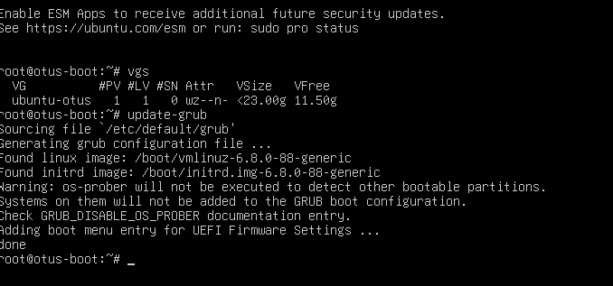

# Домашнее задание 07
## Работа с загрузчиком

## Цель:
+ научиться попадать в систему без пароля;
+ устанавливать систему с LVM и переименовывать в VG;


### Описание/Пошаговая инструкция выполнения домашнего задания:
### 🎯Что нужно сделать?
+ Включить отображение меню Grub.
+ Попасть в систему без пароля несколькими способами.
+ Установить систему с LVM, после чего переименовать VG.
---
#### Включить отображение меню Grub
> Отредактировал конфигурационный файл
```shell
root@otus-boot:~# lsblk
NAME                      MAJ:MIN RM  SIZE RO TYPE MOUNTPOINTS
sda                         8:0    0   25G  0 disk
├─sda1                      8:1    0    1M  0 part
├─sda2                      8:2    0    2G  0 part /boot
└─sda3                      8:3    0   23G  0 part
  └─ubuntu--vg-ubuntu--lv 252:0    0 11.5G  0 lvm  /
sr0                        11:0    1 1024M  0 rom
root@otus-boot:~# nano /etc/default/grub
root@otus-boot:~# cat /etc/default/grub
...
GRUB_DEFAULT=0
#GRUB_TIMEOUT_STYLE=hidden
GRUB_TIMEOUT=10
GRUB_DISTRIBUTOR=`( . /etc/os-release; echo ${NAME:-Ubuntu} ) 2>/dev/null || echo Ubuntu`
GRUB_CMDLINE_LINUX_DEFAULT=""
GRUB_CMDLINE_LINUX=""
...
```
#### Попасть в систему без пароля несколькими способами
> Перезагрузка и проверка как всё работает
```shell
root@otus-boot:~# update-grub
Sourcing file `/etc/default/grub'
Generating grub configuration file ...
Found linux image: /boot/vmlinuz-6.8.0-88-generic
Found initrd image: /boot/initrd.img-6.8.0-88-generic
Warning: os-prober will not be executed to detect other bootable partitions.
Systems on them will not be added to the GRUB boot configuration.
Check GRUB_DISABLE_OS_PROBER documentation entry.
Adding boot menu entry for UEFI Firmware Settings ...
done
root@otus-boot:~# reboot

Broadcast message from root@otus-boot on pts/1 (Sun 2025-12-14 16:27:10 UTC):

The system will reboot now!
```
> Загрузка ОС Linux, зафиксировал сам GRUB


> Далее жмём "е" и попадаем в редактор загрузки 


> В конец строки , которая начинаетьс с "linux" добавил init=/bin/bash, после F10 для минимальной загрузки 
 


> Проверил монтирование корневой системы и перемонтировал её на чтение.


> Дальше попробовал попасть систему другим способом. Это загрузился в GRUB и выбрал пункт "Advanced options". Потом загрузилось меню с указанием "recovery mode". 
> Вот так получил меню режима восстановления.
 


---

#### Установить систему с LVM, после чего переименовать VG.

> Установил ОС Linux Ubuntu 24.04 LTS c LVM
> Текущая структура LVM
```shell
root@otus-boot:~# lsb_release -a
No LSB modules are available.
Distributor ID: Ubuntu
Description:    Ubuntu 24.04 LTS
Release:        24.04
Codename:       noble

root@otus-boot:~# lsblk
NAME                      MAJ:MIN RM  SIZE RO TYPE MOUNTPOINTS
sda                         8:0    0   25G  0 disk
├─sda1                      8:1    0    1M  0 part
├─sda2                      8:2    0    2G  0 part /boot
└─sda3                      8:3    0   23G  0 part
  └─ubuntu--vg-ubuntu--lv 252:0    0 11.5G  0 lvm  /
sr0                        11:0    1 1024M  0 rom

root@otus-boot:~# pvdisplay
  --- Physical volume ---
  PV Name               /dev/sda3
  VG Name               ubuntu-vg
  PV Size               <23.00 GiB / not usable 0
  Allocatable           yes
  PE Size               4.00 MiB
  Total PE              5887
  Free PE               2944
  Allocated PE          2943
  PV UUID               e92s46-MWSd-NxLP-Dbck-14be-d93u-ce4UlH

root@otus-boot:~# vgdisplay
  --- Volume group ---
  VG Name               ubuntu-vg
  System ID
  Format                lvm2
  Metadata Areas        1
  Metadata Sequence No  2
  VG Access             read/write
  VG Status             resizable
  MAX LV                0
  Cur LV                1
  Open LV               1
  Max PV                0
  Cur PV                1
  Act PV                1
  VG Size               <23.00 GiB
  PE Size               4.00 MiB
  Total PE              5887
  Alloc PE / Size       2943 / <11.50 GiB
  Free  PE / Size       2944 / 11.50 GiB
  VG UUID               daLo91-kfpD-hV1U-UXem-SKYN-RzrY-JnO5Te

root@otus-boot:~# lvdisplay
  --- Logical volume ---
  LV Path                /dev/ubuntu-vg/ubuntu-lv
  LV Name                ubuntu-lv
  VG Name                ubuntu-vg
  LV UUID                znzYYC-xIdX-n5W7-uJeA-uf9W-s2y3-Cna1c4
  LV Write Access        read/write
  LV Creation host, time ubuntu-server, 2025-12-11 08:03:28 +0000
  LV Status              available
  # open                 1
  LV Size                <11.50 GiB
  Current LE             2943
  Segments               1
  Allocation             inherit
  Read ahead sectors     auto
  - currently set to     256
  Block device           252:0


```
> Можно посмотреть более кратко, например так: 
```shell
root@otus-boot:~# vgs
  VG        #PV #LV #SN Attr   VSize   VFree
  ubuntu-vg   1   1   0 wz--n- <23.00g 11.50g

```
> Находим в поле VG название группы томов , это "ubuntu-vg"
> Далее переименовал группу томов:
```shell
root@otus-boot:~# vgrename ubuntu-vg ubuntu-otus
  Volume group "ubuntu-vg" successfully renamed to "ubuntu-otus"
```
> Потом поптравил везде в файле /boot/grub/grub.cfg название группы томов, получилось не с первого раза =)
```shell
#
# DO NOT EDIT THIS FILE
#
# It is automatically generated by grub-mkconfig using templates
# from /etc/grub.d and settings from /etc/default/grub
#

### BEGIN /etc/grub.d/00_header ###
if [ -s $prefix/grubenv ]; then
  set have_grubenv=true
  load_env
fi
if [ "${initrdfail}" = 2 ]; then
   set initrdfail=
elif [ "${initrdfail}" = 1 ]; then
   set next_entry="${prev_entry}"
   set prev_entry=
   save_env prev_entry
   if [ "${next_entry}" ]; then
      set initrdfail=2
   fi
fi
if [ "${next_entry}" ] ; then
   set default="${next_entry}"
   set next_entry=
   save_env next_entry
   set boot_once=true
else
   set default="0"
fi

if [ x"${feature_menuentry_id}" = xy ]; then
  menuentry_id_option="--id"
else
  menuentry_id_option=""
fi

export menuentry_id_option

if [ "${prev_saved_entry}" ]; then
  set saved_entry="${prev_saved_entry}"
  save_env saved_entry
  set prev_saved_entry=
  save_env prev_saved_entry
  set boot_once=true
fi

function savedefault {
  if [ -z "${boot_once}" ]; then
    saved_entry="${chosen}"
    save_env saved_entry
  fi
}
function initrdfail {
    if [ -n "${have_grubenv}" ]; then if [ -n "${partuuid}" ]; then
      if [ -z "${initrdfail}" ]; then
        set initrdfail=1
        if [ -n "${boot_once}" ]; then
          set prev_entry="${default}"
          save_env prev_entry
        fi
      fi
      save_env initrdfail
    fi; fi
}
function recordfail {
  set recordfail=1
  if [ -n "${have_grubenv}" ]; then if [ -z "${boot_once}" ]; then save_env recordfail; fi; fi
}
function load_video {
  if [ x$feature_all_video_module = xy ]; then
    insmod all_video
  else
    insmod efi_gop
    insmod efi_uga
    insmod ieee1275_fb
    insmod vbe
    insmod vga
    insmod video_bochs
    insmod video_cirrus
  fi
}

if [ x$feature_default_font_path = xy ] ; then
   font=unicode
else
insmod part_gpt
insmod lvm
insmod ext2
set root='lvmid/daLo91-kfpD-hV1U-UXem-SKYN-RzrY-JnO5Te/znzYYC-xIdX-n5W7-uJeA-uf9W-s2y3-Cna1c4'
if [ x$feature_platform_search_hint = xy ]; then
  search --no-floppy --fs-uuid --set=root --hint='lvmid/daLo91-kfpD-hV1U-UXem-SKYN-RzrY-JnO5Te/znzYYC-xIdX-n5W7-uJeA-uf9W-s2y3-Cna1c4'  bae9d9ac-cfb9-4e94-a5e5-faa77306bffb
else
  search --no-floppy --fs-uuid --set=root bae9d9ac-cfb9-4e94-a5e5-faa77306bffb
fi
    font="/usr/share/grub/unicode.pf2"
fi

if loadfont $font ; then
  set gfxmode=auto
  load_video
  insmod gfxterm
  set locale_dir=$prefix/locale
  set lang=en_US
  insmod gettext
fi
terminal_output gfxterm
if [ "${recordfail}" = 1 ] ; then
  set timeout=30
else
  if [ x$feature_timeout_style = xy ] ; then
    set timeout_style=menu
    set timeout=10
  # Fallback normal timeout code in case the timeout_style feature is
  # unavailable.
  else
    set timeout=10
  fi
fi
### END /etc/grub.d/00_header ###

### BEGIN /etc/grub.d/05_debian_theme ###
set menu_color_normal=white/black
set menu_color_highlight=black/light-gray
### END /etc/grub.d/05_debian_theme ###

### BEGIN /etc/grub.d/10_linux ###
function gfxmode {
        set gfxpayload="${1}"
        if [ "${1}" = "keep" ]; then
                set vt_handoff=vt.handoff=7
        else
                set vt_handoff=
        fi
}
if [ "${recordfail}" != 1 ]; then
  if [ -e ${prefix}/gfxblacklist.txt ]; then
    if [ ${grub_platform} != pc ]; then
      set linux_gfx_mode=keep
    elif hwmatch ${prefix}/gfxblacklist.txt 3; then
      if [ ${match} = 0 ]; then
        set linux_gfx_mode=keep
      else
        set linux_gfx_mode=text
      fi
    else
      set linux_gfx_mode=text
    fi
  else
    set linux_gfx_mode=keep
  fi
else
  set linux_gfx_mode=text
fi
export linux_gfx_mode
menuentry 'Ubuntu' --class ubuntu --class gnu-linux --class gnu --class os $menuentry_id_option 'gnulinux-simple-bae9d9ac-cfb9-4e94-a5e5-faa77306bffb' {
        recordfail
        load_video
        gfxmode $linux_gfx_mode
        insmod gzio
        if [ x$grub_platform = xxen ]; then insmod xzio; insmod lzopio; fi
        insmod part_gpt
        insmod ext2
        set root='hd0,gpt2'
        if [ x$feature_platform_search_hint = xy ]; then
          search --no-floppy --fs-uuid --set=root --hint-bios=hd0,gpt2 --hint-efi=hd0,gpt2 --hint-baremetal=ahci0,gpt2  f1b9767f-fcd7-44a2-9fcc-02bb5f8f7575
        else
          search --no-floppy --fs-uuid --set=root f1b9767f-fcd7-44a2-9fcc-02bb5f8f7575
        fi
        linux   /vmlinuz-6.8.0-88-generic root=/dev/mapper/ubuntu--otus-ubuntu--lv ro
        initrd  /initrd.img-6.8.0-88-generic
}
submenu 'Advanced options for Ubuntu' $menuentry_id_option 'gnulinux-advanced-bae9d9ac-cfb9-4e94-a5e5-faa77306bffb' {
        menuentry 'Ubuntu, with Linux 6.8.0-88-generic' --class ubuntu --class gnu-linux --class gnu --class os $menuentry_id_option 'gnulinux-6.8.0-88-generic-advanced-bae9d9ac-cfb9-4e94-a5e5-faa77306bffb' {
                recordfail
                load_video
                gfxmode $linux_gfx_mode
                insmod gzio
                if [ x$grub_platform = xxen ]; then insmod xzio; insmod lzopio; fi
                insmod part_gpt
                insmod ext2
                set root='hd0,gpt2'
                if [ x$feature_platform_search_hint = xy ]; then
                  search --no-floppy --fs-uuid --set=root --hint-bios=hd0,gpt2 --hint-efi=hd0,gpt2 --hint-baremetal=ahci0,gpt2  f1b9767f-fcd7-44a2-9fcc-02bb5f8f7575
                else
                  search --no-floppy --fs-uuid --set=root f1b9767f-fcd7-44a2-9fcc-02bb5f8f7575
                fi
                echo    'Loading Linux 6.8.0-88-generic ...'
                linux   /vmlinuz-6.8.0-88-generic root=/dev/mapper/ubuntu--otus-ubuntu--lv ro
                echo    'Loading initial ramdisk ...'
                initrd  /initrd.img-6.8.0-88-generic
        }
        menuentry 'Ubuntu, with Linux 6.8.0-88-generic (recovery mode)' --class ubuntu --class gnu-linux --class gnu --class os $menuentry_id_option 'gnulinux-6.8.0-88-generic-recovery-bae9d9ac-cfb9-4e94-a5e5-faa77306bffb' {
                recordfail
                load_video
                insmod gzio
                if [ x$grub_platform = xxen ]; then insmod xzio; insmod lzopio; fi
                insmod part_gpt
                insmod ext2
                set root='hd0,gpt2'
                if [ x$feature_platform_search_hint = xy ]; then
                  search --no-floppy --fs-uuid --set=root --hint-bios=hd0,gpt2 --hint-efi=hd0,gpt2 --hint-baremetal=ahci0,gpt2  f1b9767f-fcd7-44a2-9fcc-02bb5f8f7575
                else
                  search --no-floppy --fs-uuid --set=root f1b9767f-fcd7-44a2-9fcc-02bb5f8f7575
                fi
                echo    'Loading Linux 6.8.0-88-generic ...'
                linux   /vmlinuz-6.8.0-88-generic root=/dev/mapper/ubuntu--otus-ubuntu--lv ro recovery nomodeset dis_ucode_ldr
                echo    'Loading initial ramdisk ...'
                initrd  /initrd.img-6.8.0-88-generic
        }
}

### END /etc/grub.d/10_linux ###

### BEGIN /etc/grub.d/10_linux_zfs ###
### END /etc/grub.d/10_linux_zfs ###

### BEGIN /etc/grub.d/20_linux_xen ###

### END /etc/grub.d/20_linux_xen ###

### BEGIN /etc/grub.d/25_bli ###
if [ "$grub_platform" = "efi" ]; then
  insmod bli
fi
### END /etc/grub.d/25_bli ###

### BEGIN /etc/grub.d/30_os-prober ###
### END /etc/grub.d/30_os-prober ###

### BEGIN /etc/grub.d/30_uefi-firmware ###
if [ "$grub_platform" = "efi" ]; then
        fwsetup --is-supported
        if [ "$?" = 0 ]; then
                menuentry 'UEFI Firmware Settings' $menuentry_id_option 'uefi-firmware' {
                        fwsetup
                }
        fi
fi
### END /etc/grub.d/30_uefi-firmware ###

### BEGIN /etc/grub.d/35_fwupd ###
### END /etc/grub.d/35_fwupd ###

### BEGIN /etc/grub.d/40_custom ###
# This file provides an easy way to add custom menu entries.  Simply type the
# menu entries you want to add after this comment.  Be careful not to change
# the 'exec tail' line above.
### END /etc/grub.d/40_custom ###

### BEGIN /etc/grub.d/41_custom ###
if [ -f  ${config_directory}/custom.cfg ]; then
  source ${config_directory}/custom.cfg
elif [ -z "${config_directory}" -a -f  $prefix/custom.cfg ]; then
  source $prefix/custom.cfg
fi
### END /etc/grub.d/41_custom ###

```
> После перезагрузки проверил



