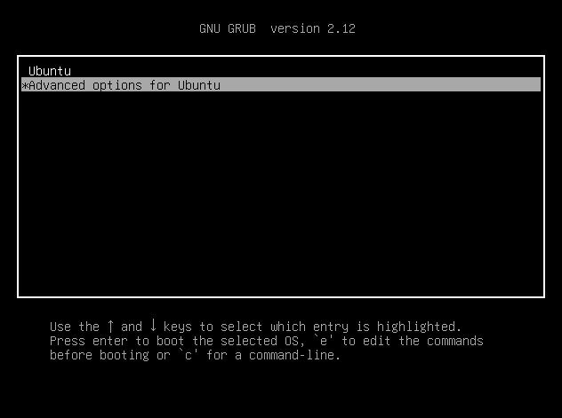
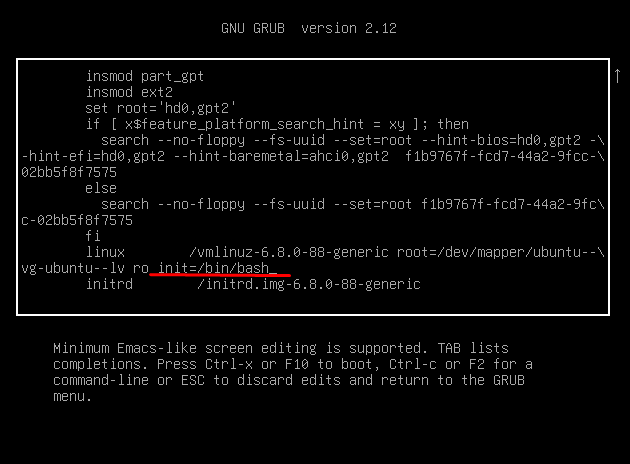
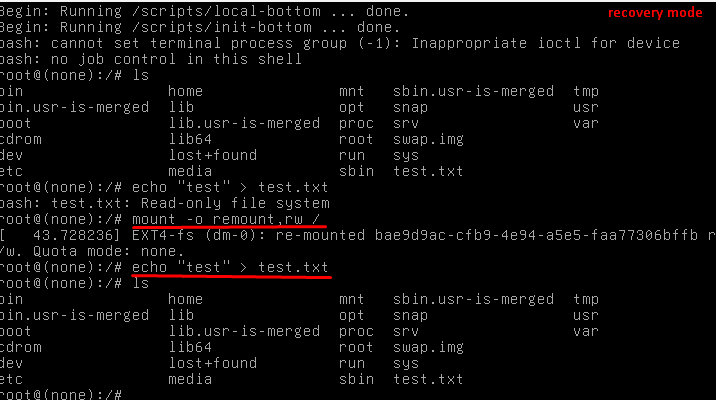
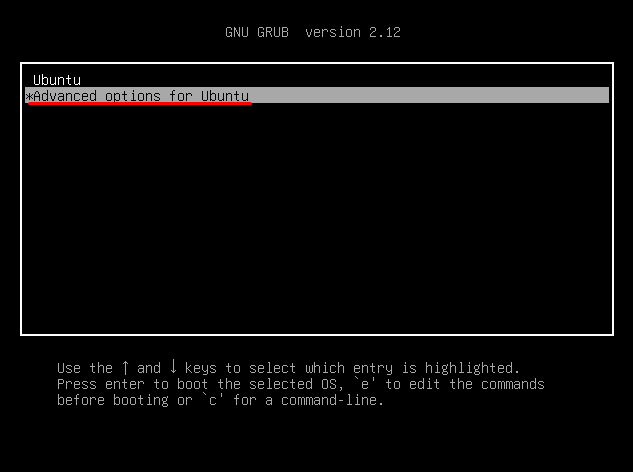
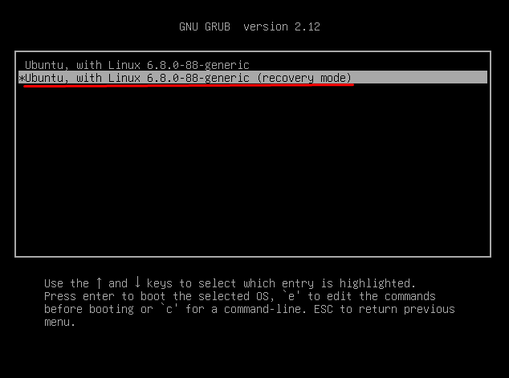
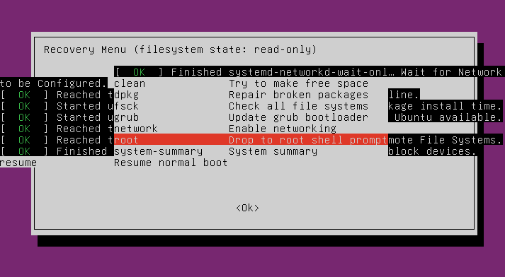
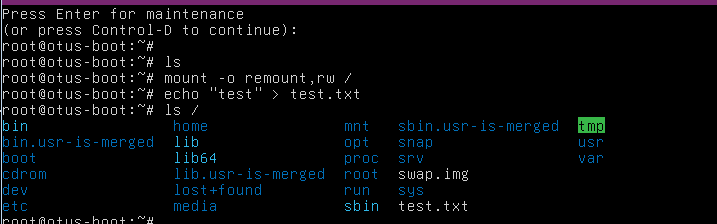

# Домашнее задание 07
## Работа с загрузчиком

## Цель:
+ научиться попадать в систему без пароля;
+ устанавливать систему с LVM и переименовывать в VG;


### Описание/Пошаговая инструкция выполнения домашнего задания:
### 🎯Что нужно сделать?
+ Включить отображение меню Grub.
+ Попасть в систему без пароля несколькими способами.
+ Установить систему с LVM, после чего переименовать VG.
---
#### Включить отображение меню Grub
> Отредактировал конфигурационный файл
```shell
root@otus-boot:~# lsblk
NAME                      MAJ:MIN RM  SIZE RO TYPE MOUNTPOINTS
sda                         8:0    0   25G  0 disk
├─sda1                      8:1    0    1M  0 part
├─sda2                      8:2    0    2G  0 part /boot
└─sda3                      8:3    0   23G  0 part
  └─ubuntu--vg-ubuntu--lv 252:0    0 11.5G  0 lvm  /
sr0                        11:0    1 1024M  0 rom
root@otus-boot:~# nano /etc/default/grub
root@otus-boot:~# cat /etc/default/grub
...
GRUB_DEFAULT=0
#GRUB_TIMEOUT_STYLE=hidden
GRUB_TIMEOUT=10
GRUB_DISTRIBUTOR=`( . /etc/os-release; echo ${NAME:-Ubuntu} ) 2>/dev/null || echo Ubuntu`
GRUB_CMDLINE_LINUX_DEFAULT=""
GRUB_CMDLINE_LINUX=""
...
```
#### Попасть в систему без пароля несколькими способами
> Перезагрузка и проверка как всё работает
```shell
root@otus-boot:~# update-grub
Sourcing file `/etc/default/grub'
Generating grub configuration file ...
Found linux image: /boot/vmlinuz-6.8.0-88-generic
Found initrd image: /boot/initrd.img-6.8.0-88-generic
Warning: os-prober will not be executed to detect other bootable partitions.
Systems on them will not be added to the GRUB boot configuration.
Check GRUB_DISABLE_OS_PROBER documentation entry.
Adding boot menu entry for UEFI Firmware Settings ...
done
root@otus-boot:~# reboot

Broadcast message from root@otus-boot on pts/1 (Sun 2025-12-14 16:27:10 UTC):

The system will reboot now!
```
> Загрузка ОС Linux, зафиксировал сам GRUB


> Далее жмём "е" и попадаем в редактор загрузки 


> В конец строки , которая начинаетьс с "linux" добавил init=/bin/bash, после F10 для минимальной загрузки 
 


> Проверил монтирование корневой системы и перемонтировал её на чтение.



> Дальше попробовал попасть систему другим способом. Это загрузился в GRUB и выбрал пункт "Advanced options". Потом загрузилось меню с указанием "recovery mode". 
> Вот так получил меню режима восстановления.
 







---

#### Установить систему с LVM, после чего переименовать VG.

> Установил ОС Linux Ubuntu 24.04 LTS c LVM
> Текущая структура LVM
```shell
root@otus-boot:~# lsb_release -a
No LSB modules are available.
Distributor ID: Ubuntu
Description:    Ubuntu 24.04 LTS
Release:        24.04
Codename:       noble

root@otus-boot:~# lsblk
NAME                      MAJ:MIN RM  SIZE RO TYPE MOUNTPOINTS
sda                         8:0    0   25G  0 disk
├─sda1                      8:1    0    1M  0 part
├─sda2                      8:2    0    2G  0 part /boot
└─sda3                      8:3    0   23G  0 part
  └─ubuntu--vg-ubuntu--lv 252:0    0 11.5G  0 lvm  /
sr0                        11:0    1 1024M  0 rom

root@otus-boot:~# pvdisplay
  --- Physical volume ---
  PV Name               /dev/sda3
  VG Name               ubuntu-vg
  PV Size               <23.00 GiB / not usable 0
  Allocatable           yes
  PE Size               4.00 MiB
  Total PE              5887
  Free PE               2944
  Allocated PE          2943
  PV UUID               e92s46-MWSd-NxLP-Dbck-14be-d93u-ce4UlH

root@otus-boot:~# vgdisplay
  --- Volume group ---
  VG Name               ubuntu-vg
  System ID
  Format                lvm2
  Metadata Areas        1
  Metadata Sequence No  2
  VG Access             read/write
  VG Status             resizable
  MAX LV                0
  Cur LV                1
  Open LV               1
  Max PV                0
  Cur PV                1
  Act PV                1
  VG Size               <23.00 GiB
  PE Size               4.00 MiB
  Total PE              5887
  Alloc PE / Size       2943 / <11.50 GiB
  Free  PE / Size       2944 / 11.50 GiB
  VG UUID               daLo91-kfpD-hV1U-UXem-SKYN-RzrY-JnO5Te

root@otus-boot:~# lvdisplay
  --- Logical volume ---
  LV Path                /dev/ubuntu-vg/ubuntu-lv
  LV Name                ubuntu-lv
  VG Name                ubuntu-vg
  LV UUID                znzYYC-xIdX-n5W7-uJeA-uf9W-s2y3-Cna1c4
  LV Write Access        read/write
  LV Creation host, time ubuntu-server, 2025-12-11 08:03:28 +0000
  LV Status              available
  # open                 1
  LV Size                <11.50 GiB
  Current LE             2943
  Segments               1
  Allocation             inherit
  Read ahead sectors     auto
  - currently set to     256
  Block device           252:0


```
> Можно посмотреть более кратко, например так: 
```shell
root@otus-boot:~# vgs
  VG        #PV #LV #SN Attr   VSize   VFree
  ubuntu-vg   1   1   0 wz--n- <23.00g 11.50g

```
> Находим в поле VG название группы томов , это "ubuntu-vg"
> Далее переименовал группу томов:
```shell
root@otus-boot:~# vgrename ubuntu-vg ubuntu-otus
  Volume group "ubuntu-vg" successfully renamed to "ubuntu-otus"
```
> Потом поптравил везде в файле /boot/grub/grub.cfg название группы томов, получилось не с первого раза =)
