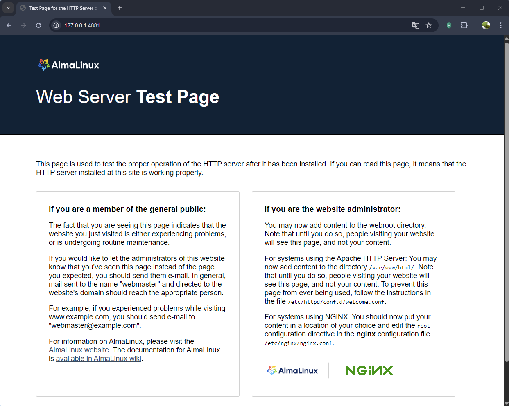

# Домашнее задание 11
## Практика с SELinux

### Цель:
работать с SELinux: диагностировать проблемы и модифицировать политики SELinux для корректной работы приложений, если это требуется;


### Описание/Пошаговая инструкция выполнения домашнего задания:

#### 🎯Задание

Запустить nginx на нестандартном порту 3-мя разными способами:
+ переключатели setsebool;
+ добавление нестандартного порта в имеющийся тип;
+ формирование и установка модуля SELinux.

#### Формат сдачи

**README** _с описанием каждого решения_ (_скриншоты и демонстрация приветствуются_).


#### ⭐ Задание повышенной сложности

Обеспечить работоспособность приложения при включенном selinux:
+ развернуть приложенный стенд https://github.com/mbfx/otus-linux-adm/tree/master/selinux_dns_problems;
+ выяснить причину неработоспособности механизма обновления зоны (см. README);
+ предложить решение (или решения) для данной проблемы;
+ выбрать одно из решений для реализации, предварительно обосновав выбор;
+ реализовать выбранное решение и продемонстрировать его работоспособность.

---
# Подготовка 
## Установка Vagrant
Установка Vagrant & Ansible производилась в WSL2 Windows11. В Windows11 было установлено:

+ VirtualBox 


+ Vagrant
```shell
alexander@otus-selinux:~$ vagrant --version
Vagrant 2.4.9
```

+ WSL2 
```shell
В PowerShell
C:\Windows\System32>wsl --install
...
C:\Windows\System32>wsl --list --online
Ниже указан список допустимых дистрибутивов, которые можно установить.
Установить с помощью "wsl.exe --install <Distro>".

NAME                            FRIENDLY NAME
AlmaLinux-8                     AlmaLinux OS 8
AlmaLinux-9                     AlmaLinux OS 9
AlmaLinux-Kitten-10             AlmaLinux OS Kitten 10
AlmaLinux-10                    AlmaLinux OS 10
Debian                          Debian GNU/Linux
FedoraLinux-43                  Fedora Linux 43
FedoraLinux-42                  Fedora Linux 42
SUSE-Linux-Enterprise-15-SP7    SUSE Linux Enterprise 15 SP7
SUSE-Linux-Enterprise-16.0      SUSE Linux Enterprise 16.0
Ubuntu                          Ubuntu
Ubuntu-24.04                    Ubuntu 24.04 LTS
archlinux                       Arch Linux
eLxr                            eLxr 12.12.0.0 GNU/Linux
kali-linux                      Kali Linux Rolling
openSUSE-Tumbleweed             openSUSE Tumbleweed
openSUSE-Leap-16.0              openSUSE Leap 16.0
Ubuntu-20.04                    Ubuntu 20.04 LTS
Ubuntu-22.04                    Ubuntu 22.04 LTS
OracleLinux_7_9                 Oracle Linux 7.9
OracleLinux_8_10                Oracle Linux 8.10
OracleLinux_9_5                 Oracle Linux 9.5
openSUSE-Leap-15.6              openSUSE Leap 15.6
SUSE-Linux-Enterprise-15-SP6    SUSE Linux Enterprise 15 SP6

C:\Windows\System32>wsl --install -d Ubuntu-24.04
wsl: Использование устаревшей регистрации распространения. Вместо этого рассмотрите возможность использования дистрибутива на основе tar.
Скачивание: Ubuntu 24.04 LTS
Скачано: Ubuntu 24.04 LTS.
Дистрибутив успешно установлен. Его можно запустить с помощью "wsl.exe -d Ubuntu 24.04 LTS"
Запуск Ubuntu 24.04 LTS...
Installing, this may take a few minutes...
Please create a default UNIX user account. The username does not need to match your Windows username.
For more information visit: https://aka.ms/wslusers
Enter new UNIX username: alexander
New password:
Retype new password:
passwd: password updated successfully
Installation successful!
wsl: Failed to start the systemd user session for 'alexander'. See journalctl for more details.
To run a command as administrator (user "root"), use "sudo <command>".
See "man sudo_root" for details.

Welcome to Ubuntu 24.04.1 LTS (GNU/Linux 6.6.87.2-microsoft-standard-WSL2)

 * Documentation:  https://help.ubuntu.com
 * Management:     https://landscape.canonical.com
 * Support:        https://ubuntu.com/pro

 System information as of Tue Jan 20 00:46:33 MSK 2026

  System load:  0.29                Processes:             55
  Usage of /:   0.1% of 1006.85GB   Users logged in:       0
  Memory usage: 19%                 IPv4 address for eth0: 192.168.0.15
  Swap usage:   0%

This message is shown once a day. To disable it please create the
/home/alexander/.hushlogin file.
alexander@otus-selinux:~$
```
Сам конфиг WSL2 ~/.wslconfig:
```shell
[wsl2]
processors=16
memory=8GB
swap=1073741824
networkingMode=Mirrored
[network]
hostname = selinux
generateHosts = false
[experimental]
```
## Основные установки в Linux Ubuntu 24.04 WSL2
### Добавление в apt
```shell
alexander@selinux:~$ sudo apt install curl wget
alexander@selinux:~$ wget -O- https://apt.releases.hashicorp.com/gpg | sudo gpg --dearmor -o /usr/share/keyrings/hashicorp-archive-keyring.gpg
alexander@selinux:~$ echo "deb [signed-by=/usr/share/keyrings/hashicorp-archive-keyring.gpg] https://apt.releases.hashicorp.com $(lsb_release -cs) main" | sudo tee /etc/apt/sources.list.d/hashicorp.list
alexander@selinux:~$ sudo apt update 
```
### Установка Vagrant
```shell
alexander@selinux:~$ sudo apt-get install vagrant
Get:1 http://security.ubuntu.com/ubuntu noble-security InRelease [126 kB]
Hit:2 http://archive.ubuntu.com/ubuntu noble InRelease
Get:3 https://apt.releases.hashicorp.com noble InRelease [12.9 kB]
Get:4 http://archive.ubuntu.com/ubuntu noble-updates InRelease [126 kB]
Get:5 https://apt.releases.hashicorp.com noble/main amd64 Packages [216 kB]
Get:6 http://archive.ubuntu.com/ubuntu noble-backports InRelease [126 kB]
Get:7 http://security.ubuntu.com/ubuntu noble-security/main amd64 Packages [1404 kB]
Get:8 http://archive.ubuntu.com/ubuntu noble-updates/main amd64 Packages [1694 kB]
Get:9 http://archive.ubuntu.com/ubuntu noble-updates/main Translation-en [313 kB]
Get:10 http://archive.ubuntu.com/ubuntu noble-updates/main amd64 Components [175 kB]
....
Fetched 13.9 MB in 2s (5905 kB/s)
Reading package lists... Done
Reading package lists... Done
Building dependency tree... Done
Reading state information... Done
vagrant is already the newest version (2.4.9-1).
0 upgraded, 0 newly installed, 0 to remove and 68 not upgraded.
alexander@otus-selinux:~$ vagrant --version
Vagrant 2.4.9

alexander@selinux:~$ echo "export VAGRANT_WSL_ENABLE_WINDOWS_ACCESS="1"" >> ~/.bash
.bash_history  .bash_logout   .bashrc
alexander@selinux:~$ echo "export PATH="$PATH:/mnt/c/Program Files/Oracle/VirtualBox"" >> ~/.bashrc
```
Для правильной работы Vagrant в среде WSL2 и корректно подключаться к виртуальным машинам, которые будут созданныв  VirtualBox на хост-системе Windows.
Нужно установить plugin virtualbox_WSL2
```shell
alexander@selinux:~$ vagrant plugin install virtualbox_WSL2
Installing the 'virtualbox_WSL2' plugin. This can take a few minutes...
Fetching rake-13.3.1.gem
Fetching virtualbox_WSL2-0.1.3.gem
Installed the plugin 'virtualbox_WSL2 (0.1.3)'!
```
После для работы SSH внутри WSL2 нужно добавить пару строк в файл Vagrant (вот теперь, Vagrant будет находить SSH в WSL2) :
```shell
  config.ssh.host = "127.0.0.1"
  config.ssh.port = 2200
```
и это:
```shell
alexander@selinux:~$ cat ~/.bashrc
...
export VAGRANT_WSL_ENABLE_WINDOWS_ACCESS=1
export PATH="$PATH:/mnt/c/Program Files/Oracle/VirtualBox"
```
Ключевые моменты для успешной работы (чтобы понять, на это ушёл день):
+ Версии должны совпадать: Версия Vagrant, установленная в WSL, должна совпадать с версией, установленной в Windows. 
+ Запускать _vagrant up_ из пути, доступного Windows. Это важно для работы общих папок (synced folders).
### Установка Ansible в WSL2 
```shell
alexander@otus-selinux:~$ sudo apt install software-properties-common
alexander@otus-selinux:~$ sudo add-apt-repository --yes --update ppa:ansible/ansible
alexander@otus-selinux:~$ sudo apt install ansible 
[sudo] password for amyskin:
Reading package lists... Done
Building dependency tree... Done
Reading state information... Done
software-properties-common is already the newest version (0.99.49.3).
software-properties-common set to manually installed.
0 upgraded, 0 newly installed, 0 to remove and 36 not upgraded.
Repository: 'Types: deb
URIs: https://ppa.launchpadcontent.net/ansible/ansible/ubuntu/
Suites: noble
Components: main
'
Description:
Ansible is a radically simple IT automation platform that makes your applications and systems easier to deploy. 
Avoid writing scripts or custom code to deploy and update your applications— automate in a language that approaches plain English, using SSH, with no agents to install on remote systems.

http://ansible.com/

If you face any issues while installing Ansible PPA, file an issue here:
https://github.com/ansible-community/ppa/issues
More info: https://launchpad.net/~ansible/+archive/ubuntu/ansible
Adding repository.
Get:1 http://security.ubuntu.com/ubuntu noble-security InRelease [126 kB]
Hit:2 http://archive.ubuntu.com/ubuntu noble InRelease
Get:3 https://apt.releases.hashicorp.com noble InRelease [12.9 kB]
Get:4 http://archive.ubuntu.com/ubuntu noble-updates InRelease [126 kB]
Get:5 https://ppa.launchpadcontent.net/ansible/ansible/ubuntu noble InRelease [17.8 kB]
Get:6 http://security.ubuntu.com/ubuntu noble-security/main amd64 Packages [1408 kB]
Hit:7 http://archive.ubuntu.com/ubuntu noble-backports InRelease
Get:8 https://ppa.launchpadcontent.net/ansible/ansible/ubuntu noble/main amd64 Packages [772 B]
Get:9 http://archive.ubuntu.com/ubuntu noble-updates/main amd64 Packages [1697 kB]
Get:10 https://ppa.launchpadcontent.net/ansible/ansible/ubuntu noble/main Translation-en [472 B]
Get:11 http://security.ubuntu.com/ubuntu noble-security/main amd64 c-n-f Metadata [9756 B]
Get:12 http://security.ubuntu.com/ubuntu noble-security/universe amd64 Packages [924 kB]
Get:13 http://security.ubuntu.com/ubuntu noble-security/universe amd64 c-n-f Metadata [19.7 kB]
Get:14 http://archive.ubuntu.com/ubuntu noble-updates/main Translation-en [314 kB]
Get:15 http://archive.ubuntu.com/ubuntu noble-updates/universe amd64 Packages [1515 kB]
Get:16 http://archive.ubuntu.com/ubuntu noble-updates/universe Translation-en [308 kB]
Fetched 6480 kB in 2s (4003 kB/s)
Reading package lists... Done
Reading package lists... Done
Building dependency tree... Done
Reading state information... Done
The following packages will be upgraded:
  ansible
1 upgraded, 0 newly installed, 0 to remove and 37 not upgraded.
Need to get 19.4 MB of archives.
After this operation, 71.9 MB disk space will be freed.
Get:1 https://ppa.launchpadcontent.net/ansible/ansible/ubuntu noble/main amd64 ansible all 12.3.0-1ppa~noble [19.4 MB]
Fetched 19.4 MB in 2s (8349 kB/s)
(Reading database ... 79571 files and directories currently installed.)
Preparing to unpack .../ansible_12.3.0-1ppa~noble_all.deb ...
Unpacking ansible (12.3.0-1ppa~noble) over (9.2.0+dfsg-0ubuntu5) ...
Setting up ansible (12.3.0-1ppa~noble) ...
Processing triggers for man-db (2.12.0-4build2) ...

alexander@otus-selinux:~$ ansible --version
ansible [core 2.16.3]
  config file = None
  configured module search path = ['/home/alexander/.ansible/plugins/modules', '/usr/share/ansible/plugins/modules']
  ansible python module location = /usr/lib/python3/dist-packages/ansible
  ansible collection location = /home/alexander/.ansible/collections:/usr/share/ansible/collections
  executable location = /usr/bin/ansible
  python version = 3.12.3 (main, Jan  8 2026, 11:30:50) [GCC 13.3.0] (/usr/bin/python3)
  jinja version = 3.1.2
  libyaml = True
```
## Получение и запуск стенда
Cклонировал репозиториb со стендом и запустил
+ ### 1 Задача: "Запуск NGINX на нестандартном порту 3-мя разными способами"
```shell
alexander@otus-selinux:/mnt/c/Vagrant/vagrant_selinux_dns_problems$ cd ..
alexander@otus-selinux:/mnt/c/Vagrant$ git clone https://github.com/Nickmob/vagrant_selinux
Cloning into 'vagrant_selinux'...
remote: Enumerating objects: 14, done.
remote: Counting objects: 100% (14/14), done.
remote: Compressing objects: 100% (11/11), done.
remote: Total 14 (delta 4), reused 8 (delta 2), pack-reused 0 (from 0)
Receiving objects: 100% (14/14), done.
Resolving deltas: 100% (4/4), done.

```
Отредактировал файл Vagrant с некоторыми правками для WSL2:
```shell
ENV['VAGRANT_SERVER_URL'] = 'http://vagrant.elab.pro'
MACHINES = {
  :"selinux" => {
              :box_name => "almalinux/9",
              #:box_version => "9.4.20240805",
              :cpus => 2,
              :memory => 2048
            }
}
Vagrant.configure("2") do |config|
  MACHINES.each do |boxname, boxconfig|
    config.ssh.host = "127.0.0.1"
    config.vm.synced_folder ".", "/vagrant", disabled: true
    config.vm.define boxname do |box|
      box.vm.box = boxconfig[:box_name]
      box.vm.box_version = boxconfig[:box_version]
      box.vm.host_name = boxname.to_s
      box.vm.network "forwarded_port", guest: 4881, host: 4881
      box.vm.provider "virtualbox" do |v|
        v.memory = boxconfig[:memory]
        v.cpus = boxconfig[:cpus]
      end
      box.vm.provision "shell", inline: <<-SHELL
      yum install -y epel-release
      yum install -y nginx
      yum install -y setroubleshoot-server selinux-policy-mls setools-console policycoreutils-python-utils policycoreutils-newrole
      sed -ie 's/:80/:4881/g' /etc/nginx/nginx.conf
      sed -i 's/listen       80;/listen       4881;/' /etc/nginx/nginx.conf
      systemctl start nginx
      systemctl status nginx
      ss -tlpn | grep 4881
SHELL
    end
  end
end
```
Запустил Vagrant в среде WSL2:
```shell

alexander@selinux:/mnt/c/Vagrant/vagrant_selinux$ vagrant up
Bringing machine 'selinux' up with 'virtualbox' provider...
==> selinux: Importing base box 'almalinux/9'...
==> selinux: Matching MAC address for NAT networking...
==> selinux: Checking if box 'almalinux/9' version '1.0.0' is up to date...
==> selinux: Setting the name of the VM: vagrant_selinux_selinux_1771073641825_64913
==> selinux: Clearing any previously set network interfaces...
==> selinux: Preparing network interfaces based on configuration...
    selinux: Adapter 1: nat
==> selinux: Forwarding ports...
    selinux: 4881 (guest) => 4881 (host) (adapter 1)
    selinux: 22 (guest) => 2222 (host) (adapter 1)
    selinux: 22 (guest) => 2222 (host) (adapter 1)
==> selinux: Running 'pre-boot' VM customizations...
==> selinux: Booting VM...
==> selinux: Waiting for machine to boot. This may take a few minutes...
    selinux: SSH address: 127.0.0.1:2222
    selinux: SSH username: vagrant
    selinux: SSH auth method: private key
....
    selinux: AlmaLinux 9 - AppStream                          12 MB/s |  15 MB     00:01
    selinux: AlmaLinux 9 - BaseOS                             14 MB/s |  13 MB     00:00
    selinux: AlmaLinux 9 - Extras                             43 kB/s |  20 kB     00:00
    selinux: Dependencies resolved.
    selinux: ================================================================================
    selinux:  Package               Architecture    Version            Repository       Size
    selinux: ================================================================================
    selinux: Installing:
    selinux:  epel-release          noarch          9-9.el9            extras           18 k
    selinux:
    selinux: Transaction Summary
    selinux: ================================================================================
    selinux: Install  1 Package
    selinux:
    selinux: Total download size: 18 k
    selinux: Installed size: 26 k
    selinux: Downloading Packages:
    selinux: epel-release-9-9.el9.noarch.rpm                 390 kB/s |  18 kB     00:00
    selinux: --------------------------------------------------------------------------------
    selinux: Total                                            38 kB/s |  18 kB     00:00
    selinux: Running transaction check
    selinux: Transaction check succeeded.
    selinux: Running transaction test
    selinux: Transaction test succeeded.
    selinux: Running transaction
    selinux:   Preparing        :                                                        1/1
    selinux:   Installing       : epel-release-9-9.el9.noarch                            1/1
    selinux:   Running scriptlet: epel-release-9-9.el9.noarch                            1/1
    selinux: Many EPEL packages require the CodeReady Builder (CRB) repository.
    selinux: It is recommended that you run /usr/bin/crb enable to enable the CRB repository.
    selinux:
    selinux:   Verifying        : epel-release-9-9.el9.noarch                            1/1
    selinux:
    selinux: Installed:
    selinux:   epel-release-9-9.el9.noarch
    selinux:
    selinux: Complete!
    selinux: Job for nginx.service failed because the control process exited with error code.
    selinux: See "systemctl status nginx.service" and "journalctl -xeu nginx.service" for details.
    selinux: × nginx.service - The nginx HTTP and reverse proxy server
    selinux:      Loaded: loaded (/usr/lib/systemd/system/nginx.service; disabled; preset: disabled)
    selinux:      Active: failed (Result: exit-code) since Sat 2026-02-14 12:59:33 UTC; 14ms ago
    selinux:     Process: 7535 ExecStartPre=/usr/bin/rm -f /run/nginx.pid (code=exited, status=0/SUCCESS)
    selinux:     Process: 7548 ExecStartPre=/usr/sbin/nginx -t (code=exited, status=1/FAILURE)
    selinux:         CPU: 15ms
    selinux:
    selinux: Feb 14 12:59:33 selinux systemd[1]: Starting The nginx HTTP and reverse proxy server...
    selinux: Feb 14 12:59:33 selinux nginx[7548]: nginx: the configuration file /etc/nginx/nginx.conf syntax is ok
    selinux: Feb 14 12:59:33 selinux nginx[7548]: nginx: [emerg] bind() to 0.0.0.0:4881 failed (13: Permission denied)
    selinux: Feb 14 12:59:33 selinux nginx[7548]: nginx: configuration file /etc/nginx/nginx.conf test failed
    selinux: Feb 14 12:59:33 selinux systemd[1]: nginx.service: Control process exited, code=exited, status=1/FAILURE
    selinux: Feb 14 12:59:33 selinux systemd[1]: nginx.service: Failed with result 'exit-code'.
    selinux: Feb 14 12:59:33 selinux systemd[1]: Failed to start The nginx HTTP and reverse proxy server.
```
Зашел на сервер "selinux" после создания:
```shell
alexander@selinux:/mnt/c/Vagrant/vagrant_selinux$ vagrant status
Current machine states:

selinux                   running (virtualbox)

The VM is running. To stop this VM, you can run `vagrant halt` to
shut it down forcefully, or you can run `vagrant suspend` to simply
suspend the virtual machine. In either case, to restart it again,
simply run `vagrant up`.
alexander@selinux:/mnt/c/Vagrant/vagrant_selinux$ vagrant ssh
[vagrant@selinux ~]$ sudo -i
```
Проверил сервисы и работу Selinux:
```shell
[vagrant@selinux ~]$ sudo -i
[root@selinux ~]# systemctl status firewalld
Unit firewalld.service could not be found.

[root@selinux ~]# nginx -t
nginx: the configuration file /etc/nginx/nginx.conf syntax is ok
nginx: configuration file /etc/nginx/nginx.conf test is successful

[root@selinux ~]# uname -r
5.14.0-503.15.1.el9_5.x86_64

[root@selinux ~]# getenforce
Enforcing

```
Посмотрел блокируется ли порт:
```shell
[root@selinux ~]# cat /etc/nginx/nginx.conf | grep listen
        listen       4881;
        listen       [::]:4881;
#        listen       443 ssl http2;
#        listen       [::]:443 ssl http2;
[root@selinux ~]# grep -rin "4881" /var/log/audit/*
1196:type=AVC msg=audit(1771073973.165:787): avc:  denied  { name_bind } for  pid=7548 comm="nginx" src=4881 scontext=system_u:system_r:httpd_t:s0 tcontext=system_u:object_r:unreserved_port_t:s0 tclass=tcp_socket permissive=0
1963:type=AVC msg=audit(1771074684.050:442): avc:  denied  { name_bind } for  pid=2551 comm="nginx" src=4881 scontext=system_u:system_r:httpd_t:s0 tcontext=system_u:object_r:unreserved_port_t:s0 tclass=tcp_socket permissive=0
```
> В логах есть блокировка порта 4881. 

Далее, скопировал время которое было записано в логе, и с помощью утилиты audit2why посмотрел, почему блокируется трафик:
```shell
[root@selinux ~]# grep 1771073973.165:787 /var/log/audit/audit.log | audit2why
type=AVC msg=audit(1771073973.165:787): avc:  denied  { name_bind } for  pid=7548 comm="nginx" src=4881 scontext=system_u:system_r:httpd_t:s0 tcontext=system_u:object_r:unreserved_port_t:s0 tclass=tcp_socket permissive=0

        Was caused by:
        The boolean nis_enabled was set incorrectly.
        Description:
        Allow nis to enabled

        Allow access by executing:
        # setsebool -P nis_enabled 1
```
Сделал вывод, что нужно поменять параметр nis_enabled. Далее выключил nis_enabled и перезапустил nginx.
```shell
[root@selinux ~]# setsebool -P nis_enabled on
[root@selinux ~]# systemctl restart nginx
[root@selinux ~]# systemctl status nginx
● nginx.service - The nginx HTTP and reverse proxy server
     Loaded: loaded (/usr/lib/systemd/system/nginx.service; disabled; preset: disabled)
     Active: active (running) since Sat 2026-02-14 13:44:01 UTC; 6s ago
    Process: 3229 ExecStartPre=/usr/bin/rm -f /run/nginx.pid (code=exited, status=0/SUCCESS)
    Process: 3230 ExecStartPre=/usr/sbin/nginx -t (code=exited, status=0/SUCCESS)
    Process: 3231 ExecStart=/usr/sbin/nginx (code=exited, status=0/SUCCESS)
   Main PID: 3233 (nginx)
      Tasks: 3 (limit: 12026)
     Memory: 2.9M
        CPU: 28ms
     CGroup: /system.slice/nginx.service
             ├─3233 "nginx: master process /usr/sbin/nginx"
             ├─3234 "nginx: worker process"
             └─3235 "nginx: worker process"

Feb 14 13:44:01 selinux systemd[1]: Starting The nginx HTTP and reverse proxy server...
Feb 14 13:44:01 selinux nginx[3230]: nginx: the configuration file /etc/nginx/nginx.conf syntax is ok
Feb 14 13:44:01 selinux nginx[3230]: nginx: configuration file /etc/nginx/nginx.conf test is successful
Feb 14 13:44:01 selinux systemd[1]: Started The nginx HTTP and reverse proxy server.
```
Потом проверил работу NGINX из браузера: 



Проверил статус параметра с помощью команды getsebool -a | grep nis_enabled:
```shell
[root@selinux ~]# getsebool -a | grep nis_enabled
nis_enabled --> on

```
Запретил работу NGINX на порту 4881 
```shell
[root@selinux ~]# setsebool -P nis_enabled off
[root@selinux ~]# getsebool -a | grep nis_enabled
nis_enabled --> off
```
Служба NGINX не запустилась:
```shell
[root@selinux ~]# systemctl status nginx
● nginx.service - The nginx HTTP and reverse proxy server
     Loaded: loaded (/usr/lib/systemd/system/nginx.service; enabled; preset: disabled)
     Active: active (running) since Sat 2026-02-14 13:44:01 UTC; 9min ago
   Main PID: 3233 (nginx)
      Tasks: 3 (limit: 12026)
     Memory: 3.0M
        CPU: 32ms
     CGroup: /system.slice/nginx.service
             ├─3233 "nginx: master process /usr/sbin/nginx"
             ├─3234 "nginx: worker process"
             └─3235 "nginx: worker process"

Feb 14 13:44:01 selinux systemd[1]: Starting The nginx HTTP and reverse proxy server...
Feb 14 13:44:01 selinux nginx[3230]: nginx: the configuration file /etc/nginx/nginx.conf syntax is ok
Feb 14 13:44:01 selinux nginx[3230]: nginx: configuration file /etc/nginx/nginx.conf test is successful
Feb 14 13:44:01 selinux systemd[1]: Started The nginx HTTP and reverse proxy server.

[root@selinux ~]# systemctl restart nginx
Job for nginx.service failed because the control process exited with error code.
See "systemctl status nginx.service" and "journalctl -xeu nginx.service" for details.

[root@selinux ~]# systemctl status nginx.service
× nginx.service - The nginx HTTP and reverse proxy server
     Loaded: loaded (/usr/lib/systemd/system/nginx.service; enabled; preset: disabled)
     Active: failed (Result: exit-code) since Sat 2026-02-14 13:53:25 UTC; 7s ago
   Duration: 9min 23.237s
    Process: 3293 ExecStartPre=/usr/bin/rm -f /run/nginx.pid (code=exited, status=0/SUCCESS)
    Process: 3295 ExecStartPre=/usr/sbin/nginx -t (code=exited, status=1/FAILURE)
        CPU: 15ms

Feb 14 13:53:25 selinux systemd[1]: Starting The nginx HTTP and reverse proxy server...
Feb 14 13:53:25 selinux nginx[3295]: nginx: the configuration file /etc/nginx/nginx.conf syntax is ok
Feb 14 13:53:25 selinux nginx[3295]: nginx: [emerg] bind() to 0.0.0.0:4881 failed (13: Permission denied)
Feb 14 13:53:25 selinux nginx[3295]: nginx: configuration file /etc/nginx/nginx.conf test failed
Feb 14 13:53:25 selinux systemd[1]: nginx.service: Control process exited, code=exited, status=1/FAILURE
Feb 14 13:53:25 selinux systemd[1]: nginx.service: Failed with result 'exit-code'.
Feb 14 13:53:25 selinux systemd[1]: Failed to start The nginx HTTP and reverse proxy server.
```
> Видно, что после отключения nis_enabled служба NGINX не запустилась.

### Далее разрешил в SELinux работу nginx на порту TCP 4881 c помощью добавления нестандартного порта в имеющийся тип.
```shell
[root@selinux ~]# semanage port -l | grep http
http_cache_port_t              tcp      8080, 8118, 8123, 10001-10010
http_cache_port_t              udp      3130
http_port_t                    tcp      80, 81, 443, 488, 8008, 8009, 8443, 9000
pegasus_http_port_t            tcp      5988
pegasus_https_port_t           tcp      5989
```
Добавил порт в тип http_port_t: semanage port -a -t http_port_t -p tcp 4881 и перезапустил службу NGINX.
```shell
[root@selinux ~]# semanage port -a -t http_port_t -p tcp 4881
[root@selinux ~]# semanage port -l | grep  http_port_t
http_port_t                    tcp      4881, 80, 81, 443, 488, 8008, 8009, 8443, 9000
pegasus_http_port_t            tcp      5988
[root@selinux ~]# systemctl restart nginx
[root@selinux ~]# systemctl status nginx
● nginx.service - The nginx HTTP and reverse proxy server
     Loaded: loaded (/usr/lib/systemd/system/nginx.service; enabled; preset: disabled)
     Active: active (running) since Sat 2026-02-14 13:59:34 UTC; 10s ago
    Process: 3325 ExecStartPre=/usr/bin/rm -f /run/nginx.pid (code=exited, status=0/SUCCESS)
    Process: 3326 ExecStartPre=/usr/sbin/nginx -t (code=exited, status=0/SUCCESS)
    Process: 3328 ExecStart=/usr/sbin/nginx (code=exited, status=0/SUCCESS)
   Main PID: 3329 (nginx)
      Tasks: 3 (limit: 12026)
     Memory: 2.9M
        CPU: 29ms
     CGroup: /system.slice/nginx.service
             ├─3329 "nginx: master process /usr/sbin/nginx"
             ├─3330 "nginx: worker process"
             └─3331 "nginx: worker process"

Feb 14 13:59:34 selinux systemd[1]: Starting The nginx HTTP and reverse proxy server...
Feb 14 13:59:34 selinux nginx[3326]: nginx: the configuration file /etc/nginx/nginx.conf syntax is ok
Feb 14 13:59:34 selinux nginx[3326]: nginx: configuration file /etc/nginx/nginx.conf test is successful
Feb 14 13:59:34 selinux systemd[1]: Started The nginx HTTP and reverse proxy server.
```
Проверил в браузере http://127.0.0.1:4881/: 


Потом удалил , что наделал до:
```shell
[root@selinux ~]# semanage port -d -t http_port_t -p tcp 4881
[root@selinux ~]# semanage port -l | grep  http_port_t
http_port_t                    tcp      80, 81, 443, 488, 8008, 8009, 8443, 9000
pegasus_http_port_t            tcp      5988
[root@selinux ~]# systemctl restart nginx
Job for nginx.service failed because the control process exited with error code.
See "systemctl status nginx.service" and "journalctl -xeu nginx.service" for details.
[root@selinux ~]# systemctl status nginx
× nginx.service - The nginx HTTP and reverse proxy server
     Loaded: loaded (/usr/lib/systemd/system/nginx.service; enabled; preset: disabled)
     Active: failed (Result: exit-code) since Sat 2026-02-14 14:03:24 UTC; 6s ago
   Duration: 3min 50.539s
    Process: 3362 ExecStartPre=/usr/bin/rm -f /run/nginx.pid (code=exited, status=0/SUCCESS)
    Process: 3364 ExecStartPre=/usr/sbin/nginx -t (code=exited, status=1/FAILURE)
        CPU: 16ms

Feb 14 14:03:24 selinux systemd[1]: Starting The nginx HTTP and reverse proxy server...
Feb 14 14:03:24 selinux nginx[3364]: nginx: the configuration file /etc/nginx/nginx.conf syntax is ok
Feb 14 14:03:24 selinux nginx[3364]: nginx: [emerg] bind() to 0.0.0.0:4881 failed (13: Permission denied)
Feb 14 14:03:24 selinux nginx[3364]: nginx: configuration file /etc/nginx/nginx.conf test failed
Feb 14 14:03:24 selinux systemd[1]: nginx.service: Control process exited, code=exited, status=1/FAILURE
Feb 14 14:03:24 selinux systemd[1]: nginx.service: Failed with result 'exit-code'.
Feb 14 14:03:24 selinux systemd[1]: Failed to start The nginx HTTP and reverse proxy server.
[root@selinux ~]# curl http://127.0.0.1:4881
curl: (7) Failed to connect to 127.0.0.1 port 4881: Connection refused
```
### Разрешим формирование и установка модуля SELinux
Пробую снова запустить NGINX:
```shell
[root@selinux ~]# systemctl start nginx
Job for nginx.service failed because the control process exited with error code.
See "systemctl status nginx.service" and "journalctl -xeu nginx.service" for details.
```
> NGINX не запускается , т.к. SELinux его блокирует. 
> Посмотрел логи NGINX.
```shell
[root@selinux ~]# grep nginx /var/log/audit/audit.log
type=ADD_GROUP msg=audit(1771073942.352:682): pid=3604 uid=0 auid=1000 ses=3 subj=unconfined_u:unconfined_r:groupadd_t:s0-s0:c0.c1023 msg='op=add-group id=989 exe="/usr/sbin/groupadd" hostname=? addr=? terminal=? res=success'UID="root" AUID="vagrant" ID="nginx"
type=GRP_MGMT msg=audit(1771073942.358:683): pid=3604 uid=0 auid=1000 ses=3 subj=unconfined_u:unconfined_r:groupadd_t:s0-s0:c0.c1023 msg='op=add-shadow-group id=989 exe="/usr/sbin/groupadd" hostname=? addr=? terminal=? res=success'UID="root" AUID="vagrant" ID="nginx"
type=ADD_USER msg=audit(1771073942.461:684): pid=3612 uid=0 auid=1000 ses=3 subj=unconfined_u:unconfined_r:useradd_t:s0-s0:c0.c1023 msg='op=add-user acct="nginx" exe="/usr/sbin/useradd" hostname=? addr=? terminal=? res=success'UID="root" AUID="vagrant"
type=SOFTWARE_UPDATE msg=audit(1771073943.026:710): pid=3576 uid=0 auid=1000 ses=3 subj=unconfined_u:unconfined_r:unconfined_t:s0-s0:c0.c1023 msg='op=install sw="nginx-filesystem-2:1.20.1-22.el9_6.3.alma.2.noarch" sw_type=rpm key_enforce=0 gpg_res=1 root_dir="/" comm="yum" exe="/usr/bin/python3.9" hostname=? addr=? terminal=? res=success'UID="root" AUID="vagrant"
... и т.д. 
```
Воспользовался утилитой audit2allow для того, чтобы на основе логов SELinux сделать модуль, который разрешит работу nginx на нестандартном порту.
```shell
[root@selinux ~]# grep nginx /var/log/audit/audit.log | audit2allow -M nginx
******************** IMPORTANT ***********************
To make this policy package active, execute:

semodule -i nginx.pp

[root@selinux ~]# semodule -i nginx.pp
```
Запуск NGINX
```shell
[root@selinux ~]# systemctl start nginx

[root@selinux ~]# systemctl status nginx
● nginx.service - The nginx HTTP and reverse proxy server
     Loaded: loaded (/usr/lib/systemd/system/nginx.service; enabled; preset: disabled)
     Active: active (running) since Sat 2026-02-14 14:11:58 UTC; 3s ago
    Process: 3414 ExecStartPre=/usr/bin/rm -f /run/nginx.pid (code=exited, status=0/SUCCESS)
    Process: 3415 ExecStartPre=/usr/sbin/nginx -t (code=exited, status=0/SUCCESS)
    Process: 3416 ExecStart=/usr/sbin/nginx (code=exited, status=0/SUCCESS)
   Main PID: 3417 (nginx)
      Tasks: 3 (limit: 12026)
     Memory: 2.9M
        CPU: 28ms
     CGroup: /system.slice/nginx.service
             ├─3417 "nginx: master process /usr/sbin/nginx"
             ├─3418 "nginx: worker process"
             └─3419 "nginx: worker process"

Feb 14 14:11:58 selinux systemd[1]: Starting The nginx HTTP and reverse proxy server...
Feb 14 14:11:58 selinux nginx[3415]: nginx: the configuration file /etc/nginx/nginx.conf syntax is ok
Feb 14 14:11:58 selinux nginx[3415]: nginx: configuration file /etc/nginx/nginx.conf test is successful
Feb 14 14:11:58 selinux systemd[1]: Started The nginx HTTP and reverse proxy server.

[root@selinux ~]# semodule -l | grep nginx
nginx
```
Удалил модуль 
```shell
[root@selinux ~]# semodule -r nginx
libsemanage.semanage_direct_remove_key: Removing last nginx module (no other nginx module exists at another priority).
[root@selinux ~]# semodule -l | grep nginx
[root@selinux ~]# systemctl restart nginx
Job for nginx.service failed because the control process exited with error code.
See "systemctl status nginx.service" and "journalctl -xeu nginx.service" for details.
```
---
