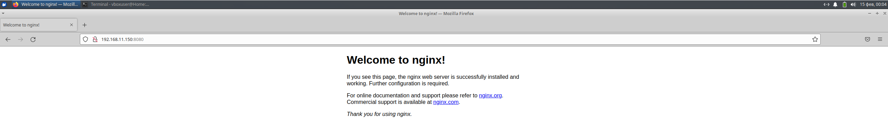

# Домашнее задание 12
## Первые шаги с Ansible

### Цель:
#### написать первые шаги с Ansible;


### Описание/Пошаговая инструкция выполнения домашнего задания:

### 🎯 Что нужно сделать?

#### Подготовить стенд на Vagrant как минимум с одним сервером. На этом сервере, используя Ansible, необходимо развернуть nginx со следующими условиями:

- необходимо использовать модуль yum/apt;
- конфигурационные файлы должны быть взяты из шаблона jinja2 с переменными;
- после установки nginx должен быть в режиме enabled в systemd;
- должен быть использован notify для старта nginx после установки;
- сайт должен слушать на нестандартном порту — 8080, для этого использовать переменные в Ansible.
---
Предварительно скачал vagrant файл https://drive.google.com/file/d/17MEtg20TFSjKil6ih7PvPez7jmCvo6fb/view 
и запустил его:
```shell
amyskin@otus-ansible:/mnt/c/Vagrant/vagrant_nginx$ vagrant up
Bringing machine 'nginx' up with 'virtualbox' provider...
==> nginx: Importing base box 'generic/ubuntu2204'...
==> nginx: Matching MAC address for NAT networking...
==> nginx: Checking if box 'generic/ubuntu2204' version '4.3.12' is up to date...
==> nginx: Setting the name of the VM: vagrant_nginx_nginx_1771095778849_41675
==> nginx: Clearing any previously set network interfaces...
==> nginx: Preparing network interfaces based on configuration...
    nginx: Adapter 1: nat
    nginx: Adapter 2: intnet
==> nginx: Forwarding ports...
    nginx: 22 (guest) => 2222 (host) (adapter 1)
    nginx: 22 (guest) => 2222 (host) (adapter 1)
==> nginx: Running 'pre-boot' VM customizations...
==> nginx: Booting VM...
==> nginx: Waiting for machine to boot. This may take a few minutes...
    nginx: SSH address: 127.0.0.1:2222
    nginx: SSH username: vagrant
    nginx: SSH auth method: private key
    nginx: Warning: Connection reset. Retrying...
    nginx: Warning: Connection reset. Retrying...
    nginx: Warning: Connection reset. Retrying...
    nginx: Warning: Remote connection disconnect. Retrying...
    nginx: Warning: Connection reset. Retrying...
    nginx: Warning: Connection reset. Retrying...
    nginx: Warning: Connection reset. Retrying...
    nginx: Warning: Connection reset. Retrying...
    nginx: Warning: Connection reset. Retrying...
    nginx: Warning: Connection reset. Retrying...
    nginx: Warning: Connection reset. Retrying...
    nginx: Warning: Remote connection disconnect. Retrying...
    nginx: Warning: Connection reset. Retrying...
    nginx: Warning: Connection reset. Retrying...
    nginx: Warning: Remote connection disconnect. Retrying...
    nginx:
    nginx: Vagrant insecure key detected. Vagrant will automatically replace
    nginx: this with a newly generated keypair for better security.
    nginx:
    nginx: Inserting generated public key within guest...
    nginx: Removing insecure key from the guest if it's present...
    nginx: Key inserted! Disconnecting and reconnecting using new SSH key...
==> nginx: Machine booted and ready!
==> nginx: Checking for guest additions in VM...
    nginx: The guest additions on this VM do not match the installed version of
    nginx: VirtualBox! In most cases this is fine, but in rare cases it can
    nginx: prevent things such as shared folders from working properly. If you see
    nginx: shared folder errors, please make sure the guest additions within the
    nginx: virtual machine match the version of VirtualBox you have installed on
    nginx: your host and reload your VM.
    nginx:
    nginx: Guest Additions Version: 6.1.38
    nginx: VirtualBox Version: 7.0
==> nginx: Setting hostname...
==> nginx: Configuring and enabling network interfaces...
==> nginx: Running provisioner: shell...
    nginx: Running: inline script
```
После изменил файл vagrant и добавил ansible:
```text
# -*- mode: ruby -*-
# vim: set ft=ruby :
ENV['VAGRANT_SERVER_URL'] = 'https://vagrant.elab.pro'
MACHINES = {
  :nginx => {
        :box_name => "generic/ubuntu2204",
        :vm_name => "nginx",
        :net => [
           ["192.168.11.150",  2, "255.255.255.0", "mynet"],
        ]
  }
}

Vagrant.configure("2") do |config|

  MACHINES.each do |boxname, boxconfig|

    config.vm.define boxname do |box|
      config.ssh.host = "127.0.0.1"
	  
      box.vm.box = boxconfig[:box_name]
      box.vm.host_name = boxconfig[:vm_name]
      
      box.vm.provider "virtualbox" do |v|
        v.memory = 768
        v.cpus = 1
       end

      boxconfig[:net].each do |ipconf|
        box.vm.network("private_network", ip: ipconf[0], adapter: ipconf[1], netmask: ipconf[2], virtualbox__intnet: ipconf[3])
      end

      if boxconfig.key?(:public)
        box.vm.network "public_network", boxconfig[:public]
      end

      box.vm.provision "shell", inline: <<-SHELL
        mkdir -p ~root/.ssh
        cp ~vagrant/.ssh/auth* ~root/.ssh
        sudo sed -i 's/\#PasswordAuthentication no/PasswordAuthentication yes/g' /etc/ssh/sshd_config
        systemctl restart sshd
      SHELL

      box.vm.provision "ansible" do |ansible|
        ansible.playbook = "ansible/playbook.yml"     
      end
	  
    end
  end
end
```
Сам ansible ~/ansible/playbook.yml:
```yaml
---
- hosts: all
  become: yes
  vars:
    nginx_port: 8080   
  tasks:
    - name: Install nginx
      apt:
        name: nginx
        state: present
        update_cache: yes
      notify: restart nginx

    - name: Create custom nginx config from template
      template:
        src: nginx.conf.j2
        dest: /etc/nginx/sites-available/default
      notify: restart nginx

    - name: Ensure nginx is enabled and running
      systemd:
        name: nginx
        enabled: yes
        state: started

  handlers:
    - name: restart nginx
      systemd:
        name: nginx
        state: restarted
```
~/templates/nginx.conf.j2
```yaml
server {
    listen {{ nginx_port }} default_server;
    listen [::]:{{ nginx_port }} default_server;

    root /var/www/html;
    index index.html index.htm index.nginx-debian.html;

    server_name _;

    location / {
        try_files $uri $uri/ =404;
    }
}
```
Запустил:
```shell
amyskin@otus-ansible:/mnt/c/Vagrant/vagrant_nginx$ vagrant status
Current machine states:

nginx                     running (virtualbox)

The VM is running. To stop this VM, you can run `vagrant halt` to
shut it down forcefully, or you can run `vagrant suspend` to simply
suspend the virtual machine. In either case, to restart it again,
simply run `vagrant up`.
amyskin@otus-ansible:/mnt/c/Vagrant/vagrant_nginx$ ls -la
total 4
drwxrwxrwx 1 amyskin amyskin 4096 Feb 14 22:27 .
drwxrwxrwx 1 amyskin amyskin 4096 Feb 14 21:22 ..
drwxr-xr-x 1 amyskin amyskin 4096 Feb 14 22:02 .vagrant
-rwxrwxrwx 1 amyskin amyskin 1363 Feb 14 22:33 Vagrantfile
drwxrwxrwx 1 amyskin amyskin 4096 Feb 14 22:28 ansible
amyskin@otus-ansible:/mnt/c/Vagrant/vagrant_nginx$ vagrant provision
==> nginx: Running provisioner: shell...
    nginx: Running: inline script
==> nginx: Running provisioner: ansible...
    nginx: Running ansible-playbook...

PLAY [all] *********************************************************************

TASK [Gathering Facts] *********************************************************
ok: [nginx]

TASK [Install nginx] ***********************************************************
changed: [nginx]

TASK [Create custom nginx config from template] ********************************
changed: [nginx]

TASK [Ensure nginx is enabled and running] *************************************
ok: [nginx]

RUNNING HANDLER [restart nginx] ************************************************
changed: [nginx]

PLAY RECAP *********************************************************************
nginx                      : ok=5    changed=3    unreachable=0    failed=0    skipped=0    rescued=0    ignored=0
```
Проверка:
```shell
amyskin@otus-ansible:/mnt/c/Vagrant/vagrant_nginx$ vagrant ssh
vagrant@nginx:~$ ip a
1: lo: <LOOPBACK,UP,LOWER_UP> mtu 65536 qdisc noqueue state UNKNOWN group default qlen 1000
    link/loopback 00:00:00:00:00:00 brd 00:00:00:00:00:00
    inet 127.0.0.1/8 scope host lo
       valid_lft forever preferred_lft forever
2: eth0: <BROADCAST,MULTICAST,UP,LOWER_UP> mtu 1500 qdisc fq_codel state UP group default qlen 1000
    link/ether 08:00:27:8c:69:41 brd ff:ff:ff:ff:ff:ff
    altname enp0s3
    inet 10.0.2.15/24 metric 100 brd 10.0.2.255 scope global dynamic eth0
       valid_lft 86266sec preferred_lft 86266sec
    inet6 fe80::a00:27ff:fe8c:6941/64 scope link
       valid_lft forever preferred_lft forever
3: eth1: <BROADCAST,MULTICAST,UP,LOWER_UP> mtu 1500 qdisc fq_codel state UP group default qlen 1000
    link/ether 08:00:27:f6:dd:c6 brd ff:ff:ff:ff:ff:ff
    altname enp0s8
    inet 192.168.11.150/24 brd 192.168.11.255 scope global eth1
       valid_lft forever preferred_lft forever
    inet6 fe80::a00:27ff:fef6:ddc6/64 scope link
       valid_lft forever preferred_lft forever
vagrant@nginx:~$ sudo -i
root@nginx:~# systemctl status nginx
● nginx.service - A high performance web server and a reverse proxy server
     Loaded: loaded (/lib/systemd/system/nginx.service; enabled; vendor preset: enabled)
     Active: active (running) since Sat 2026-02-14 19:44:57 UTC; 2min 49s ago
       Docs: man:nginx(8)
   Main PID: 666 (nginx)
      Tasks: 2 (limit: 710)
     Memory: 13.8M
        CPU: 163ms
     CGroup: /system.slice/nginx.service
             ├─666 "nginx: master process /usr/sbin/nginx -g daemon on; master_process on;"
             └─667 "nginx: worker process" "" "" "" "" "" "" "" "" "" "" "" "" "" "" "" "" "" "" "" "" "" "" "" "" "" ">

Feb 14 19:44:55 nginx systemd[1]: Starting A high performance web server and a reverse proxy server
Feb 14 19:44:57 nginx systemd[1]: Started A high performance web server and a reverse proxy server
````
````shell
root@nginx:~# curl http://192.168.11.150:8080
<!DOCTYPE html>
<html>
<head>
<title>Welcome to nginx!</title>
<style>
    body {
        width: 35em;
        margin: 0 auto;
        font-family: Tahoma, Verdana, Arial, sans-serif;
    }
</style>
</head>
<body>
<h1>Welcome to nginx!</h1>
<p>If you see this page, the nginx web server is successfully installed and
working. Further configuration is required.</p>

<p>For online documentation and support please refer to
<a href="http://nginx.org/">nginx.org</a>.<br/>
Commercial support is available at
<a href="http://nginx.com/">nginx.com</a>.</p>

<p><em>Thank you for using nginx.</em></p>
</body>
</html>

````

---
