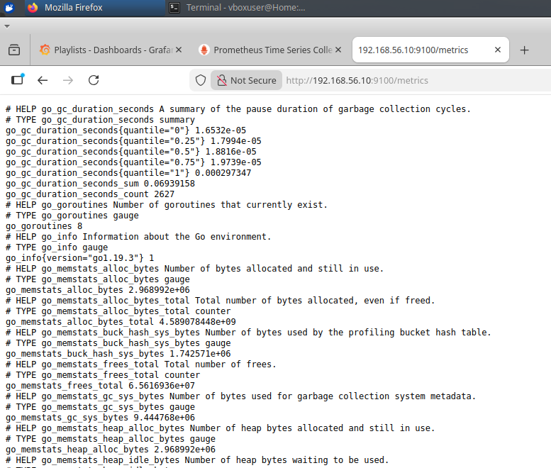
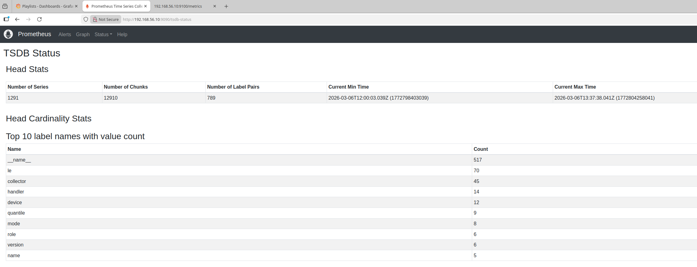
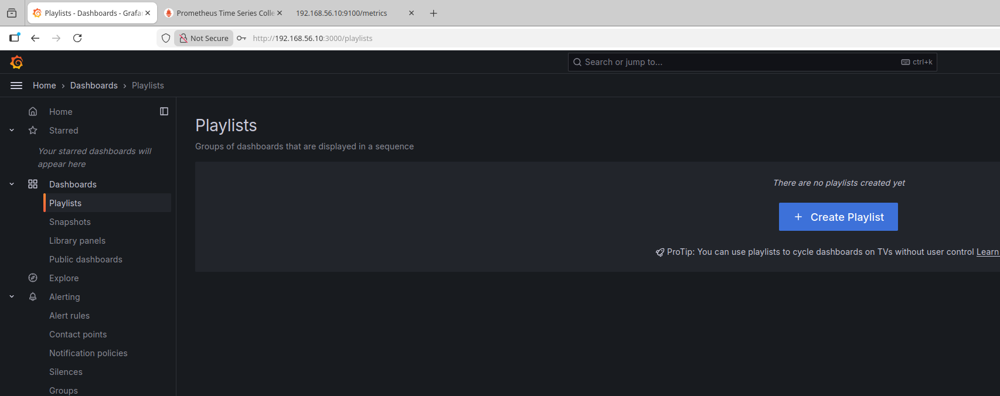
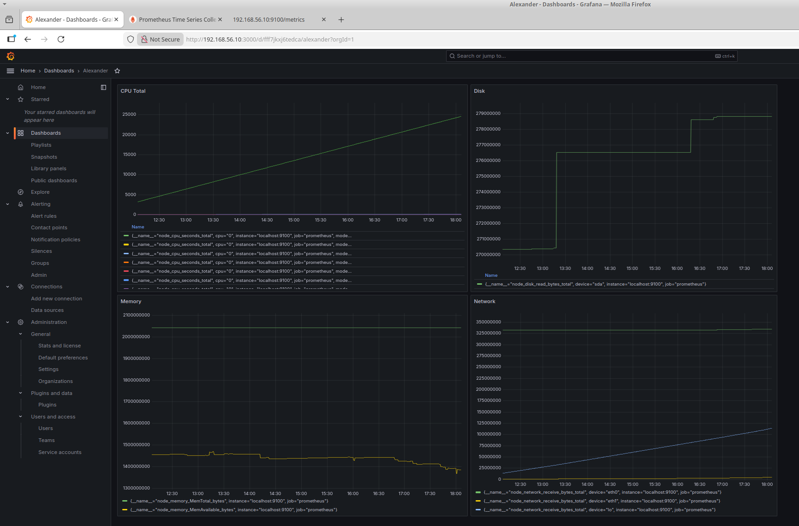

# Домашнее задание 15
## Настройка мониторинга
### Цель:
- научиться настраивать дашборд;
### Описание/Пошаговая инструкция выполнения домашнего задания:
**🎯 Что нужно сделать?**
#### Настроить дашборд с 4-мя графиками
- память;
- процессор;
- диск;
- сеть.
#### Настроить на одной из систем:
- zabbix (использовать screen (комплексный экран);
- prometheus - grafana.

_P.S. Скриншот дашборда (в название дашборда - ваше имя)_

---
### Описание установки
**[Структура установки Prometheus & Grafna](Installation_directory_structure.jpg)** 

- vagrant_prometheus
  - [Vagrantfile](vagrant_prometheus/Vagrantfile)
  - ansible
    - roles
      - [common](vagrant_prometheus/ansible/roles/common/tasks/main.yml)
      - [grafana](vagrant_prometheus/ansible/roles/grafana/tasks/main.yml)
        - [files](vagrant_prometheus/ansible/roles/grafana/files/dashboard.json)
      - [node_exporter](vagrant_prometheus/ansible/roles/node_exporter/tasks/main.yml)
      - [prometheus](vagrant_prometheus/ansible/roles/prometheus/tasks/main.yml)
    - [vars](vagrant_prometheus/ansible/vars/main.yml)
    - [inventory](vagrant_prometheus/ansible/inventory)
    - [playbook](vagrant_prometheus/ansible/playbook.yml)
    
> Установка
```shell
amyskin@otus-vagrant:/mnt/c/Vagrant/vagrant_prometheus$ vagrant up
Bringing machine 'default' up with 'virtualbox' provider...
==> default: Importing base box 'almalinux/9'...
==> default: Matching MAC address for NAT networking...
==> default: Checking if box 'almalinux/9' version '1.0.0' is up to date...
==> default: Setting the name of the VM: vagrant_prometheus_default_1772784606737_23788
==> default: Clearing any previously set network interfaces...
==> default: Preparing network interfaces based on configuration...
    default: Adapter 1: nat
    default: Adapter 2: hostonly
==> default: Forwarding ports...
    default: 9090 (guest) => 9090 (host) (adapter 1)
    default: 3000 (guest) => 3000 (host) (adapter 1)
    default: 22 (guest) => 2222 (host) (adapter 1)
    default: 22 (guest) => 2222 (host) (adapter 1)
==> default: Running 'pre-boot' VM customizations...
==> default: Booting VM...
==> default: Waiting for machine to boot. This may take a few minutes...
    default: SSH address: 127.0.0.1:2222
    default: SSH username: vagrant
    default: SSH auth method: private key
    default:
    default: Vagrant insecure key detected. Vagrant will automatically replace
    default: this with a newly generated keypair for better security.
    default:
    default: Inserting generated public key within guest...
    default: Removing insecure key from the guest if it's present...
    default: Key inserted! Disconnecting and reconnecting using new SSH key...
==> default: Machine booted and ready!
==> default: Checking for guest additions in VM...
    default: The guest additions on this VM do not match the installed version of
    default: VirtualBox! In most cases this is fine, but in rare cases it can
    default: prevent things such as shared folders from working properly. If you see
    default: shared folder errors, please make sure the guest additions within the
    default: virtual machine match the version of VirtualBox you have installed on
    default: your host and reload your VM.
    default:
    default: Guest Additions Version: 7.1.4
    default: VirtualBox Version: 7.2
==> default: Setting hostname...
==> default: Configuring and enabling network interfaces...
==> default: Mounting shared folders...
    default: /mnt/c/Vagrant/vagrant_prometheus => /vagrant
==> default: Running provisioner: shell...
    default: Running: inline script
    default: AlmaLinux 9 - AppStream                          16 MB/s |  16 MB     00:01
    default: AlmaLinux 9 - BaseOS                             17 MB/s |  17 MB     00:00
    default: AlmaLinux 9 - Extras                             43 kB/s |  20 kB     00:00
    default: Package python3-3.9.19-8.el9_5.1.x86_64 is already installed.
    default: Dependencies resolved.
    default: ================================================================================
    default:  Package                   Arch       Version               Repository     Size
    default: ================================================================================
    default: Installing:
    default:  python3-pip               noarch     21.3.1-1.el9          appstream     1.7 M
    default: Upgrading:
    default:  openssl                   x86_64     1:3.5.1-7.el9_7       baseos        1.4 M
    default:  openssl-devel             x86_64     1:3.5.1-7.el9_7       appstream     3.4 M
    default:  openssl-libs              x86_64     1:3.5.1-7.el9_7       baseos        2.3 M
    default:  python3                   x86_64     3.9.25-3.el9_7        baseos         26 k
    default:  python3-libs              x86_64     3.9.25-3.el9_7        baseos        7.5 M
    default: Installing dependencies:
    default:  openssl-fips-provider     x86_64     1:3.5.1-7.el9_7       baseos        812 k
    default: Installing weak dependencies:
    default:  libxcrypt-compat          x86_64     4.4.18-3.el9          appstream      88 k
    default:  python3-setuptools        noarch     53.0.0-15.el9         baseos        831 k
    default:
    default: Transaction Summary
    default: ================================================================================
    default: Install  4 Packages
    default: Upgrade  5 Packages
    default:
    default: Total download size: 18 M
    default: Downloading Packages:
    default: (1/9): libxcrypt-compat-4.4.18-3.el9.x86_64.rpm 1.1 MB/s |  88 kB     00:00
    default: (2/9): openssl-fips-provider-3.5.1-7.el9_7.x86_ 6.0 MB/s | 812 kB     00:00
    default: (3/9): python3-pip-21.3.1-1.el9.noarch.rpm       12 MB/s | 1.7 MB     00:00
    default: (4/9): openssl-3.5.1-7.el9_7.x86_64.rpm          19 MB/s | 1.4 MB     00:00
    default: (5/9): openssl-devel-3.5.1-7.el9_7.x86_64.rpm    17 MB/s | 3.4 MB     00:00
    default: (6/9): openssl-libs-3.5.1-7.el9_7.x86_64.rpm     15 MB/s | 2.3 MB     00:00
    default: (7/9): python3-3.9.25-3.el9_7.x86_64.rpm        606 kB/s |  26 kB     00:00
    default: (8/9): python3-libs-3.9.25-3.el9_7.x86_64.rpm    30 MB/s | 7.5 MB     00:00
    default: (9/9): python3-setuptools-53.0.0-15.el9.noarch. 789 kB/s | 831 kB     00:01
    default: --------------------------------------------------------------------------------
    default: Total                                           9.0 MB/s |  18 MB     00:02
    default: Running transaction check
    default: Transaction check succeeded.
    default: Running transaction test
    default: Transaction test succeeded.
    default: Running transaction
    default:   Preparing        :                                                        1/1
    default:   Upgrading        : openssl-libs-1:3.5.1-7.el9_7.x86_64                   1/14
    default:   Installing       : openssl-fips-provider-1:3.5.1-7.el9_7.x86_64          2/14
    default:   Upgrading        : python3-3.9.25-3.el9_7.x86_64                         3/14
    default:   Upgrading        : python3-libs-3.9.25-3.el9_7.x86_64                    4/14
    default:   Installing       : python3-setuptools-53.0.0-15.el9.noarch               5/14
    default:   Installing       : libxcrypt-compat-4.4.18-3.el9.x86_64                  6/14
    default:   Installing       : python3-pip-21.3.1-1.el9.noarch                       7/14
    default:   Upgrading        : openssl-devel-1:3.5.1-7.el9_7.x86_64                  8/14
    default:   Upgrading        : openssl-1:3.5.1-7.el9_7.x86_64                        9/14
    default:   Cleanup          : openssl-devel-1:3.2.2-6.el9_5.x86_64                 10/14
    default:   Cleanup          : openssl-1:3.2.2-6.el9_5.x86_64                       11/14
    default:   Cleanup          : python3-3.9.19-8.el9_5.1.x86_64                      12/14
    default:   Cleanup          : python3-libs-3.9.19-8.el9_5.1.x86_64                 13/14
    default:   Cleanup          : openssl-libs-1:3.2.2-6.el9_5.x86_64                  14/14
    default:   Running scriptlet: openssl-libs-1:3.2.2-6.el9_5.x86_64                  14/14
    default:   Verifying        : libxcrypt-compat-4.4.18-3.el9.x86_64                  1/14
    default:   Verifying        : python3-pip-21.3.1-1.el9.noarch                       2/14
    default:   Verifying        : openssl-fips-provider-1:3.5.1-7.el9_7.x86_64          3/14
    default:   Verifying        : python3-setuptools-53.0.0-15.el9.noarch               4/14
    default:   Verifying        : openssl-devel-1:3.5.1-7.el9_7.x86_64                  5/14
    default:   Verifying        : openssl-devel-1:3.2.2-6.el9_5.x86_64                  6/14
    default:   Verifying        : openssl-1:3.5.1-7.el9_7.x86_64                        7/14
    default:   Verifying        : openssl-1:3.2.2-6.el9_5.x86_64                        8/14
    default:   Verifying        : openssl-libs-1:3.5.1-7.el9_7.x86_64                   9/14
    default:   Verifying        : openssl-libs-1:3.2.2-6.el9_5.x86_64                  10/14
    default:   Verifying        : python3-3.9.25-3.el9_7.x86_64                        11/14
    default:   Verifying        : python3-3.9.19-8.el9_5.1.x86_64                      12/14
    default:   Verifying        : python3-libs-3.9.25-3.el9_7.x86_64                   13/14
    default:   Verifying        : python3-libs-3.9.19-8.el9_5.1.x86_64                 14/14
    default:
    default: Upgraded:
    default:   openssl-1:3.5.1-7.el9_7.x86_64         openssl-devel-1:3.5.1-7.el9_7.x86_64
    default:   openssl-libs-1:3.5.1-7.el9_7.x86_64    python3-3.9.25-3.el9_7.x86_64
    default:   python3-libs-3.9.25-3.el9_7.x86_64
    default: Installed:
    default:   libxcrypt-compat-4.4.18-3.el9.x86_64
    default:   openssl-fips-provider-1:3.5.1-7.el9_7.x86_64
    default:   python3-pip-21.3.1-1.el9.noarch
    default:   python3-setuptools-53.0.0-15.el9.noarch
    default:
    default: Complete!
==> default: Running provisioner: ansible...
    default: Running ansible-playbook...
PYTHONUNBUFFERED=1 ANSIBLE_FORCE_COLOR=true ANSIBLE_HOST_KEY_CHECKING=false ANSIBLE_SSH_ARGS='-o UserKnownHostsFile=/dev/null -o IdentitiesOnly=yes -o IdentityFile=/mnt/c/Vagrant/vagrant_prometheus/.vagrant/machines/default/virtualbox/private_key -o ControlMaster=auto -o ControlPersist=60s' ansible-playbook --connection=ssh --timeout=30 --extra-vars=ansible_user\=\'vagrant\' --limit="prometheus" --inventory-file=ansible/inventory --extra-vars=\{\"ansible_user\":\"vagrant\",\"ansible_python_interpreter\":\"/usr/bin/python3\"\} -vv ansible/playbook.yml
[WARNING]: Deprecation warnings can be disabled by setting `deprecation_warnings=False` in ansible.cfg.
[DEPRECATION WARNING]: The '--inventory-file' argument is deprecated. This feature will be removed from ansible-core version 2.23. Use -i or --inventory instead.
ansible-playbook [core 2.20.3]
  config file = /etc/ansible/ansible.cfg
  configured module search path = ['/home/amyskin/.ansible/plugins/modules', '/usr/share/ansible/plugins/modules']
  ansible python module location = /usr/lib/python3/dist-packages/ansible
  ansible collection location = /home/amyskin/.ansible/collections:/usr/share/ansible/collections
  executable location = /usr/bin/ansible-playbook
  python version = 3.12.3 (main, Jan 22 2026, 20:57:42) [GCC 13.3.0] (/usr/bin/python3)
  jinja version = 3.1.2
  pyyaml version = 6.0.1 (with libyaml v0.2.5)
Using /etc/ansible/ansible.cfg as config file
redirecting (type: modules) ansible.builtin.firewalld to ansible.posix.firewalld
redirecting (type: modules) ansible.builtin.firewalld to ansible.posix.firewalld
redirecting (type: modules) ansible.builtin.seport to community.general.seport
[WARNING]: Found duplicate mapping key 'file'.
Origin: /mnt/c/Vagrant/vagrant_prometheus/ansible/roles/node_exporter/tasks/main.yml:48:3

46     path: /tmp/node_exporter.tar.gz
47     state: absent
48   file:
     ^ column 3

Using last defined value only.

Skipping callback 'minimal', as we already have a stdout callback.
Skipping callback 'oneline', as we already have a stdout callback.

PLAYBOOK: playbook.yml *********************************************************
1 plays in ansible/playbook.yml

PLAY [prometheus] **************************************************************

TASK [Gathering Facts] *********************************************************
task path: /mnt/c/Vagrant/vagrant_prometheus/ansible/playbook.yml:2
ok: [127.0.0.1]

TASK [common : Установка необходимых пакетов] **********************************
task path: /mnt/c/Vagrant/vagrant_prometheus/ansible/roles/common/tasks/main.yml:2
changed: [127.0.0.1] => {"changed": true, "msg": "", "rc": 0, "results": ["Installed: python3-audit-3.1.5-7.el9.x86_64", "Installed: ipset-7.11-11.el9_5.x86_64", "Installed: ipset-libs-7.11-11.el9_5.x86_64", "Installed: iptables-libs-1.8.10-11.el9_5.x86_64", "Installed: iptables-nft-1.8.10-11.el9_5.x86_64", "Installed: fstrm-0.6.1-3.el9.x86_64", "Installed: python3-policycoreutils-3.6-3.el9.noarch", "Installed: libselinux-3.6-3.el9.x86_64", "Installed: libselinux-utils-3.6-3.el9.x86_64", "Installed: checkpolicy-3.6-1.el9.x86_64", "Installed: libsemanage-3.6-5.el9_6.x86_64", "Installed: firewalld-1.3.4-15.el9_6.noarch", "Installed: firewalld-filesystem-1.3.4-15.el9_6.noarch", "Installed: vim-common-2:8.2.2637-23.el9_7.x86_64", "Installed: python3-distro-1.5.0-7.el9.noarch", "Installed: vim-enhanced-2:8.2.2637-23.el9_7.x86_64", "Installed: policycoreutils-3.6-3.el9.x86_64", "Installed: bind-libs-32:9.16.23-34.el9_7.1.x86_64", "Installed: bind-license-32:9.16.23-34.el9_7.1.noarch", "Installed: bind-utils-32:9.16.23-34.el9_7.1.x86_64", "Installed: protobuf-c-1.3.3-13.el9.x86_64", "Installed: libmaxminddb-1.5.2-4.el9.x86_64", "Installed: nftables-1:1.0.9-6.el9_7.x86_64", "Installed: gpm-libs-1.20.7-29.el9.x86_64", "Installed: python3-firewall-1.3.4-15.el9_6.noarch", "Installed: libcap-ng-python3-0.8.2-7.el9.x86_64", "Installed: libnftnl-1.2.6-4.el9_4.x86_64", "Installed: policycoreutils-python-utils-3.6-3.el9.noarch", "Installed: python3-libselinux-3.6-3.el9.x86_64", "Installed: python3-libsemanage-3.6-5.el9_6.x86_64", "Installed: libuv-1:1.42.0-2.el9_4.x86_64", "Installed: wget-1.21.1-8.el9_4.x86_64", "Installed: vim-filesystem-2:8.2.2637-23.el9_7.noarch", "Installed: python3-nftables-1:1.0.9-6.el9_7.x86_64", "Installed: audit-3.1.5-7.el9.x86_64", "Installed: audit-libs-3.1.5-7.el9.x86_64", "Installed: python3-setools-4.4.4-1.el9.x86_64", "Installed: epel-release-9-9.el9.noarch", "Removed: policycoreutils-3.6-2.1.el9.x86_64", "Removed: audit-3.1.5-1.el9.x86_64", "Removed: audit-libs-3.1.5-1.el9.x86_64", "Removed: libselinux-3.6-1.el9.x86_64", "Removed: libselinux-utils-3.6-1.el9.x86_64", "Removed: libsemanage-3.6-1.el9.x86_64", "Removed: iptables-libs-1.8.10-4.el9_4.x86_64", "Removed: python3-libselinux-3.6-1.el9.x86_64"]}

TASK [common : Запуск и включение firewalld] ***********************************
task path: /mnt/c/Vagrant/vagrant_prometheus/ansible/roles/common/tasks/main.yml:17
changed: [127.0.0.1] => {"changed": true, "enabled": true, "name": "firewalld", "state": "started", "status": {"AccessSELinuxContext": "system_u:object_r:firewalld_unit_file_t:s0", "ActiveEnterTimestampMonotonic": "0", "ActiveExitTimestampMonotonic": "0", "ActiveState": "inactive", "After": "dbus-broker.service basic.target polkit.service dbus.socket sysinit.target system.slice", "AllowIsolate": "no", "AssertResult": "no", "AssertTimestampMonotonic": "0", "Before": "network-pre.target shutdown.target multi-user.target", "BlockIOAccounting": "no", "BlockIOWeight": "[not set]", "BusName": "org.fedoraproject.FirewallD1", "CPUAccounting": "yes", "CPUAffinityFromNUMA": "no", "CPUQuotaPerSecUSec": "infinity", "CPUQuotaPeriodUSec": "infinity", "CPUSchedulingPolicy": "0", "CPUSchedulingPriority": "0", "CPUSchedulingResetOnFork": "no", "CPUShares": "[not set]", "CPUUsageNSec": "[not set]", "CPUWeight": "[not set]", "CacheDirectoryMode": "0755", "CanFreeze": "yes", "CanIsolate": "no", "CanReload": "yes", "CanStart": "yes", "CanStop": "yes", "CapabilityBoundingSet": "cap_chown cap_dac_override cap_dac_read_search cap_fowner cap_fsetid cap_kill cap_setgid cap_setuid cap_setpcap cap_linux_immutable cap_net_bind_service cap_net_broadcast cap_net_admin cap_net_raw cap_ipc_lock cap_ipc_owner cap_sys_module cap_sys_rawio cap_sys_chroot cap_sys_ptrace cap_sys_pacct cap_sys_admin cap_sys_boot cap_sys_nice cap_sys_resource cap_sys_time cap_sys_tty_config cap_mknod cap_lease cap_audit_write cap_audit_control cap_setfcap cap_mac_override cap_mac_admin cap_syslog cap_wake_alarm cap_block_suspend cap_audit_read cap_perfmon cap_bpf cap_checkpoint_restore", "CleanResult": "success", "CollectMode": "inactive", "ConditionResult": "no", "ConditionTimestampMonotonic": "0", "ConfigurationDirectoryMode": "0755", "Conflicts": "ip6tables.service ipset.service iptables.service ebtables.service shutdown.target", "ControlGroupId": "0", "ControlPID": "0", "CoredumpFilter": "0x33", "DefaultDependencies": "yes", "DefaultMemoryLow": "0", "DefaultMemoryMin": "0", "Delegate": "no", "Description": "firewalld - dynamic firewall daemon", "DevicePolicy": "auto", "Documentation": "\"man:firewalld(1)\"", "DynamicUser": "no", "EnvironmentFiles": "/etc/sysconfig/firewalld (ignore_errors=yes)", "ExecMainCode": "0", "ExecMainExitTimestampMonotonic": "0", "ExecMainPID": "0", "ExecMainStartTimestampMonotonic": "0", "ExecMainStatus": "0", "ExecReload": "{ path=/bin/kill ; argv[]=/bin/kill -HUP $MAINPID ; ignore_errors=no ; start_time=[n/a] ; stop_time=[n/a] ; pid=0 ; code=(null) ; status=0/0 }", "ExecReloadEx": "{ path=/bin/kill ; argv[]=/bin/kill -HUP $MAINPID ; flags= ; start_time=[n/a] ; stop_time=[n/a] ; pid=0 ; code=(null) ; status=0/0 }", "ExecStart": "{ path=/usr/sbin/firewalld ; argv[]=/usr/sbin/firewalld --nofork --nopid $FIREWALLD_ARGS ; ignore_errors=no ; start_time=[n/a] ; stop_time=[n/a] ; pid=0 ; code=(null) ; status=0/0 }", "ExecStartEx": "{ path=/usr/sbin/firewalld ; argv[]=/usr/sbin/firewalld --nofork --nopid $FIREWALLD_ARGS ; flags= ; start_time=[n/a] ; stop_time=[n/a] ; pid=0 ; code=(null) ; status=0/0 }", "ExecStartPost": "{ path=/usr/bin/firewall-cmd ; argv[]=/usr/bin/firewall-cmd --state ; ignore_errors=no ; start_time=[n/a] ; stop_time=[n/a] ; pid=0 ; code=(null) ; status=0/0 }", "ExecStartPostEx": "{ path=/usr/bin/firewall-cmd ; argv[]=/usr/bin/firewall-cmd --state ; flags= ; start_time=[n/a] ; stop_time=[n/a] ; pid=0 ; code=(null) ; status=0/0 }", "ExitType": "main", "FailureAction": "none", "FileDescriptorStoreMax": "0", "FinalKillSignal": "9", "FragmentPath": "/usr/lib/systemd/system/firewalld.service", "FreezerState": "running", "GID": "[not set]", "GuessMainPID": "yes", "IOAccounting": "no", "IOReadBytes": "18446744073709551615", "IOReadOperations": "18446744073709551615", "IOSchedulingClass": "2", "IOSchedulingPriority": "4", "IOWeight": "[not set]", "IOWriteBytes": "18446744073709551615", "IOWriteOperations": "18446744073709551615", "IPAccounting": "no", "IPEgressBytes": "[no data]", "IPEgressPackets": "[no data]", "IPIngressBytes": "[no data]", "IPIngressPackets": "[no data]", "Id": "firewalld.service", "IgnoreOnIsolate": "no", "IgnoreSIGPIPE": "yes", "InactiveEnterTimestampMonotonic": "0", "InactiveExitTimestampMonotonic": "0", "JobRunningTimeoutUSec": "infinity", "JobTimeoutAction": "none", "JobTimeoutUSec": "infinity", "KeyringMode": "private", "KillMode": "mixed", "KillSignal": "15", "LimitAS": "infinity", "LimitASSoft": "infinity", "LimitCORE": "infinity", "LimitCORESoft": "infinity", "LimitCPU": "infinity", "LimitCPUSoft": "infinity", "LimitDATA": "infinity", "LimitDATASoft": "infinity", "LimitFSIZE": "infinity", "LimitFSIZESoft": "infinity", "LimitLOCKS": "infinity", "LimitLOCKSSoft": "infinity", "LimitMEMLOCK": "8388608", "LimitMEMLOCKSoft": "8388608", "LimitMSGQUEUE": "819200", "LimitMSGQUEUESoft": "819200", "LimitNICE": "0", "LimitNICESoft": "0", "LimitNOFILE": "524288", "LimitNOFILESoft": "1024", "LimitNPROC": "7505", "LimitNPROCSoft": "7505", "LimitRSS": "infinity", "LimitRSSSoft": "infinity", "LimitRTPRIO": "0", "LimitRTPRIOSoft": "0", "LimitRTTIME": "infinity", "LimitRTTIMESoft": "infinity", "LimitSIGPENDING": "7505", "LimitSIGPENDINGSoft": "7505", "LimitSTACK": "infinity", "LimitSTACKSoft": "8388608", "LoadState": "loaded", "LockPersonality": "no", "LogLevelMax": "-1", "LogRateLimitBurst": "0", "LogRateLimitIntervalUSec": "0", "LogsDirectoryMode": "0755", "MainPID": "0", "ManagedOOMMemoryPressure": "auto", "ManagedOOMMemoryPressureLimit": "0", "ManagedOOMPreference": "none", "ManagedOOMSwap": "auto", "MemoryAccounting": "yes", "MemoryAvailable": "infinity", "MemoryCurrent": "[not set]", "MemoryDenyWriteExecute": "no", "MemoryHigh": "infinity", "MemoryLimit": "infinity", "MemoryLow": "0", "MemoryMax": "infinity", "MemoryMin": "0", "MemorySwapMax": "infinity", "MountAPIVFS": "no", "NFileDescriptorStore": "0", "NRestarts": "0", "NUMAPolicy": "n/a", "Names": "firewalld.service dbus-org.fedoraproject.FirewallD1.service", "NeedDaemonReload": "no", "Nice": "0", "NoNewPrivileges": "no", "NonBlocking": "no", "NotifyAccess": "none", "OOMPolicy": "stop", "OOMScoreAdjust": "0", "OnFailureJobMode": "replace", "OnSuccessJobMode": "fail", "Perpetual": "no", "PrivateDevices": "no", "PrivateIPC": "no", "PrivateMounts": "no", "PrivateNetwork": "no", "PrivateTmp": "no", "PrivateUsers": "no", "ProcSubset": "all", "ProtectClock": "no", "ProtectControlGroups": "no", "ProtectHome": "no", "ProtectHostname": "no", "ProtectKernelLogs": "no", "ProtectKernelModules": "no", "ProtectKernelTunables": "no", "ProtectProc": "default", "ProtectSystem": "no", "RefuseManualStart": "no", "RefuseManualStop": "no", "ReloadResult": "success", "ReloadSignal": "1", "RemainAfterExit": "no", "RemoveIPC": "no", "Requires": "system.slice sysinit.target dbus.socket", "Restart": "no", "RestartKillSignal": "15", "RestartUSec": "100ms", "RestrictNamespaces": "no", "RestrictRealtime": "no", "RestrictSUIDSGID": "no", "Result": "success", "RootDirectoryStartOnly": "no", "RuntimeDirectoryMode": "0755", "RuntimeDirectoryPreserve": "no", "RuntimeMaxUSec": "infinity", "RuntimeRandomizedExtraUSec": "0", "SameProcessGroup": "no", "SecureBits": "0", "SendSIGHUP": "no", "SendSIGKILL": "yes", "Slice": "system.slice", "StandardError": "null", "StandardInput": "null", "StandardOutput": "null", "StartLimitAction": "none", "StartLimitBurst": "5", "StartLimitIntervalUSec": "10s", "StartupBlockIOWeight": "[not set]", "StartupCPUShares": "[not set]", "StartupCPUWeight": "[not set]", "StartupIOWeight": "[not set]", "StateChangeTimestampMonotonic": "0", "StateDirectoryMode": "0755", "StatusErrno": "0", "StopWhenUnneeded": "no", "SubState": "dead", "SuccessAction": "none", "SuccessExitStatus": "251", "SyslogFacility": "3", "SyslogLevel": "6", "SyslogLevelPrefix": "yes", "SyslogPriority": "30", "SystemCallErrorNumber": "2147483646", "TTYReset": "no", "TTYVHangup": "no", "TTYVTDisallocate": "no", "TasksAccounting": "yes", "TasksCurrent": "[not set]", "TasksMax": "12008", "TimeoutAbortUSec": "1min 30s", "TimeoutCleanUSec": "infinity", "TimeoutStartFailureMode": "terminate", "TimeoutStartUSec": "1min 30s", "TimeoutStopFailureMode": "terminate", "TimeoutStopUSec": "1min 30s", "TimerSlackNSec": "50000", "Transient": "no", "Type": "dbus", "UID": "[not set]", "UMask": "0022", "UnitFilePreset": "enabled", "UnitFileState": "enabled", "UtmpMode": "init", "WantedBy": "multi-user.target", "Wants": "network-pre.target", "WatchdogSignal": "6", "WatchdogTimestampMonotonic": "0", "WatchdogUSec": "infinity"}}

TASK [common : Разрешить стандартные сервисы (DNS, HTTP, HTTPS)] ***************
task path: /mnt/c/Vagrant/vagrant_prometheus/ansible/roles/common/tasks/main.yml:23
redirecting (type: modules) ansible.builtin.firewalld to ansible.posix.firewalld
redirecting (type: modules) ansible.builtin.firewalld to ansible.posix.firewalld
redirecting (type: modules) ansible.builtin.firewalld to ansible.posix.firewalld
ok: [127.0.0.1] => (item=ssh) => {"ansible_loop_var": "item", "changed": false, "item": "ssh", "msg": "Permanent and Non-Permanent(immediate) operation"}
redirecting (type: modules) ansible.builtin.firewalld to ansible.posix.firewalld
redirecting (type: modules) ansible.builtin.firewalld to ansible.posix.firewalld
redirecting (type: modules) ansible.builtin.firewalld to ansible.posix.firewalld
changed: [127.0.0.1] => (item=dns) => {"ansible_loop_var": "item", "changed": true, "item": "dns", "msg": "Permanent and Non-Permanent(immediate) operation, Changed service dns to enabled"}
redirecting (type: modules) ansible.builtin.firewalld to ansible.posix.firewalld
redirecting (type: modules) ansible.builtin.firewalld to ansible.posix.firewalld
redirecting (type: modules) ansible.builtin.firewalld to ansible.posix.firewalld
changed: [127.0.0.1] => (item=http) => {"ansible_loop_var": "item", "changed": true, "item": "http", "msg": "Permanent and Non-Permanent(immediate) operation, Changed service http to enabled"}
redirecting (type: modules) ansible.builtin.firewalld to ansible.posix.firewalld
redirecting (type: modules) ansible.builtin.firewalld to ansible.posix.firewalld
redirecting (type: modules) ansible.builtin.firewalld to ansible.posix.firewalld
changed: [127.0.0.1] => (item=https) => {"ansible_loop_var": "item", "changed": true, "item": "https", "msg": "Permanent and Non-Permanent(immediate) operation, Changed service https to enabled"}

TASK [common : Открытие портов из переменной "[{'port': '9090/tcp'}, {'port': '3000/tcp'}, {'port': '9100/tcp'}]"] ***
task path: /mnt/c/Vagrant/vagrant_prometheus/ansible/roles/common/tasks/main.yml:35
redirecting (type: modules) ansible.builtin.firewalld to ansible.posix.firewalld
redirecting (type: modules) ansible.builtin.firewalld to ansible.posix.firewalld
redirecting (type: modules) ansible.builtin.firewalld to ansible.posix.firewalld
changed: [127.0.0.1] => (item={'port': '9090/tcp'}) => {"ansible_loop_var": "item", "changed": true, "item": {"port": "9090/tcp"}, "msg": "Permanent and Non-Permanent(immediate) operation, Changed port 9090/tcp to enabled"}
redirecting (type: modules) ansible.builtin.firewalld to ansible.posix.firewalld
redirecting (type: modules) ansible.builtin.firewalld to ansible.posix.firewalld
redirecting (type: modules) ansible.builtin.firewalld to ansible.posix.firewalld
changed: [127.0.0.1] => (item={'port': '3000/tcp'}) => {"ansible_loop_var": "item", "changed": true, "item": {"port": "3000/tcp"}, "msg": "Permanent and Non-Permanent(immediate) operation, Changed port 3000/tcp to enabled"}
redirecting (type: modules) ansible.builtin.firewalld to ansible.posix.firewalld
redirecting (type: modules) ansible.builtin.firewalld to ansible.posix.firewalld
redirecting (type: modules) ansible.builtin.firewalld to ansible.posix.firewalld
changed: [127.0.0.1] => (item={'port': '9100/tcp'}) => {"ansible_loop_var": "item", "changed": true, "item": {"port": "9100/tcp"}, "msg": "Permanent and Non-Permanent(immediate) operation, Changed port 9100/tcp to enabled"}

TASK [common : Разрешение портов в SELinux] ************************************
task path: /mnt/c/Vagrant/vagrant_prometheus/ansible/roles/common/tasks/main.yml:44
redirecting (type: modules) ansible.builtin.seport to community.general.seport
redirecting (type: modules) ansible.builtin.seport to community.general.seport
redirecting (type: modules) ansible.builtin.seport to community.general.seport
[DEPRECATION WARNING]: INJECT_FACTS_AS_VARS default to `True` is deprecated, top-level facts will not be auto injected after the change. This feature will be removed from ansible-core version 2.24.
Origin: /mnt/c/Vagrant/vagrant_prometheus/ansible/roles/common/tasks/main.yml:52:7

50   loop: "{{ firewall_ports | default([]) }}"
51   when:
52     - ansible_selinux.status == "enabled"
         ^ column 7

Use `ansible_facts["fact_name"]` (no `ansible_` prefix) instead.

changed: [127.0.0.1] => (item={'port': '9090/tcp'}) => {"ansible_loop_var": "item", "changed": true, "item": {"port": "9090/tcp"}, "ports": ["9090"], "proto": "tcp", "setype": "http_port_t", "state": "present"}
redirecting (type: modules) ansible.builtin.seport to community.general.seport
redirecting (type: modules) ansible.builtin.seport to community.general.seport
redirecting (type: modules) ansible.builtin.seport to community.general.seport
changed: [127.0.0.1] => (item={'port': '3000/tcp'}) => {"ansible_loop_var": "item", "changed": true, "item": {"port": "3000/tcp"}, "ports": ["3000"], "proto": "tcp", "setype": "http_port_t", "state": "present"}
redirecting (type: modules) ansible.builtin.seport to community.general.seport
redirecting (type: modules) ansible.builtin.seport to community.general.seport
redirecting (type: modules) ansible.builtin.seport to community.general.seport
changed: [127.0.0.1] => (item={'port': '9100/tcp'}) => {"ansible_loop_var": "item", "changed": true, "item": {"port": "9100/tcp"}, "ports": ["9100"], "proto": "tcp", "setype": "http_port_t", "state": "present"}

TASK [prometheus : Создание группу prometheus] *********************************
task path: /mnt/c/Vagrant/vagrant_prometheus/ansible/roles/prometheus/tasks/main.yml:2
changed: [127.0.0.1] => {"changed": true, "gid": 989, "name": "prometheus", "state": "present", "system": true}

TASK [prometheus : Создание пользователя prometheus] ***************************
task path: /mnt/c/Vagrant/vagrant_prometheus/ansible/roles/prometheus/tasks/main.yml:8
changed: [127.0.0.1] => {"changed": true, "comment": "", "create_home": false, "group": 989, "home": "/nonexistent", "name": "prometheus", "shell": "/bin/false", "state": "present", "system": true, "uid": 994}

TASK [prometheus : Создание каталога] ******************************************
task path: /mnt/c/Vagrant/vagrant_prometheus/ansible/roles/prometheus/tasks/main.yml:18
changed: [127.0.0.1] => (item=/etc/prometheus) => {"ansible_loop_var": "item", "changed": true, "gid": 989, "group": "prometheus", "item": "/etc/prometheus", "mode": "0755", "owner": "prometheus", "path": "/etc/prometheus", "secontext": "unconfined_u:object_r:etc_t:s0", "size": 6, "state": "directory", "uid": 994}
changed: [127.0.0.1] => (item=/var/lib/prometheus) => {"ansible_loop_var": "item", "changed": true, "gid": 989, "group": "prometheus", "item": "/var/lib/prometheus", "mode": "0755", "owner": "prometheus", "path": "/var/lib/prometheus", "secontext": "unconfined_u:object_r:var_lib_t:s0", "size": 6, "state": "directory", "uid": 994}

TASK [prometheus : Загрузка архива Prometheus] *********************************
task path: /mnt/c/Vagrant/vagrant_prometheus/ansible/roles/prometheus/tasks/main.yml:29
changed: [127.0.0.1] => {"changed": true, "checksum_dest": null, "checksum_src": "de9e5e02fd524ca092afbd302e55f2f03d0710a1", "dest": "/tmp/prometheus.tar.gz", "elapsed": 8, "gid": 0, "group": "root", "md5sum": "13e083957082b39ab465a10e9624ce2c", "mode": "0644", "msg": "OK (90577277 bytes)", "owner": "root", "secontext": "unconfined_u:object_r:user_home_t:s0", "size": 90577277, "src": "/home/vagrant/.ansible/tmp/ansible-tmp-1772784706.343267-2100-261144483283972/tmph6vsrtkj", "state": "file", "status_code": 200, "uid": 0, "url": "https://github.com/prometheus/prometheus/releases/download/v2.44.0/prometheus-2.44.0.linux-amd64.tar.gz"}

TASK [prometheus : Распаковка архива] ******************************************
task path: /mnt/c/Vagrant/vagrant_prometheus/ansible/roles/prometheus/tasks/main.yml:35
changed: [127.0.0.1] => {"changed": true, "dest": "/tmp", "extract_results": {"cmd": ["/bin/gtar", "--extract", "-C", "/tmp", "-z", "-f", "/tmp/prometheus.tar.gz"], "err": "", "out": "", "rc": 0}, "gid": 0, "group": "root", "handler": "TgzArchive", "mode": "01777", "owner": "root", "secontext": "system_u:object_r:tmp_t:s0", "size": 4096, "src": "/tmp/prometheus.tar.gz", "state": "directory", "uid": 0}

TASK [prometheus : Копирование бинарного файла] ********************************
task path: /mnt/c/Vagrant/vagrant_prometheus/ansible/roles/prometheus/tasks/main.yml:42
changed: [127.0.0.1] => (item=prometheus) => {"ansible_loop_var": "item", "changed": true, "checksum": "085014e89cdf28750ca5759cacefa0ec629fd046", "dest": "/usr/local/bin/prometheus", "gid": 989, "group": "prometheus", "item": "prometheus", "md5sum": "aeb797eca213a9c098d06281a1d4c136", "mode": "0755", "owner": "prometheus", "secontext": "system_u:object_r:bin_t:s0", "size": 118615136, "src": "/tmp/prometheus-2.44.0.linux-amd64/prometheus", "state": "file", "uid": 994}
changed: [127.0.0.1] => (item=promtool) => {"ansible_loop_var": "item", "changed": true, "checksum": "33fb838fd14cc9eba84bd287881dbf796f97fdee", "dest": "/usr/local/bin/promtool", "gid": 989, "group": "prometheus", "item": "promtool", "md5sum": "66b7c902a5da4fff59582a4f2a7a84e3", "mode": "0755", "owner": "prometheus", "secontext": "system_u:object_r:bin_t:s0", "size": 112619261, "src": "/tmp/prometheus-2.44.0.linux-amd64/promtool", "state": "file", "uid": 994}

TASK [prometheus : Копирование консольной библиотеки] **************************
task path: /mnt/c/Vagrant/vagrant_prometheus/ansible/roles/prometheus/tasks/main.yml:54
changed: [127.0.0.1] => (item=consoles) => {"ansible_loop_var": "item", "changed": true, "checksum": null, "dest": "/etc/prometheus/consoles", "gid": 989, "group": "prometheus", "item": "consoles", "md5sum": null, "mode": "0755", "owner": "prometheus", "secontext": "unconfined_u:object_r:etc_t:s0", "size": 22, "src": "/tmp/prometheus-2.44.0.linux-amd64/consoles", "state": "directory", "uid": 994}
changed: [127.0.0.1] => (item=console_libraries) => {"ansible_loop_var": "item", "changed": true, "checksum": null, "dest": "/etc/prometheus/console_libraries", "gid": 989, "group": "prometheus", "item": "console_libraries", "md5sum": null, "mode": "0755", "owner": "prometheus", "secontext": "unconfined_u:object_r:etc_t:s0", "size": 31, "src": "/tmp/prometheus-2.44.0.linux-amd64/console_libraries", "state": "directory", "uid": 994}

TASK [prometheus : Создание конфигурационного файла prometheus.yml] ************
task path: /mnt/c/Vagrant/vagrant_prometheus/ansible/roles/prometheus/tasks/main.yml:66
Notification for handler restart prometheus has been saved.
changed: [127.0.0.1] => {"changed": true, "checksum": "09245d38d99c58bc3727a5bbf89d44f7a3b4f78a", "dest": "/etc/prometheus/prometheus.yml", "gid": 989, "group": "prometheus", "md5sum": "76d46a177c80998595baecbab91d2d7d", "mode": "0644", "owner": "prometheus", "secontext": "system_u:object_r:etc_t:s0", "size": 191, "src": "/home/vagrant/.ansible/tmp/ansible-tmp-1772784727.7256684-2161-79360625941056/.source.yml", "state": "file", "uid": 994}

TASK [prometheus : Создание systemd unit файла для prometheus] *****************
task path: /mnt/c/Vagrant/vagrant_prometheus/ansible/roles/prometheus/tasks/main.yml:75
Notification for handler reload systemd and restart prometheus has been saved.
changed: [127.0.0.1] => {"changed": true, "checksum": "4ad1cfdd6153ffb0f95604d1f919041c41a2da24", "dest": "/etc/systemd/system/prometheus.service", "gid": 0, "group": "root", "md5sum": "e43c38240479c42f4ba2856e4dcb45f8", "mode": "0644", "owner": "root", "secontext": "system_u:object_r:systemd_unit_file_t:s0", "size": 426, "src": "/home/vagrant/.ansible/tmp/ansible-tmp-1772784728.8397405-2179-255531145486163/.source.service", "state": "file", "uid": 0}

TASK [prometheus : Запуск и включение Prometheus] ******************************
task path: /mnt/c/Vagrant/vagrant_prometheus/ansible/roles/prometheus/tasks/main.yml:82
changed: [127.0.0.1] => {"changed": true, "enabled": true, "name": "prometheus", "state": "started", "status": {"AccessSELinuxContext": "system_u:object_r:systemd_unit_file_t:s0", "ActiveEnterTimestampMonotonic": "0", "ActiveExitTimestampMonotonic": "0", "ActiveState": "inactive", "After": "basic.target system.slice systemd-journald.socket network-online.target sysinit.target", "AllowIsolate": "no", "AssertResult": "no", "AssertTimestampMonotonic": "0", "Before": "shutdown.target", "BlockIOAccounting": "no", "BlockIOWeight": "[not set]", "CPUAccounting": "yes", "CPUAffinityFromNUMA": "no", "CPUQuotaPerSecUSec": "infinity", "CPUQuotaPeriodUSec": "infinity", "CPUSchedulingPolicy": "0", "CPUSchedulingPriority": "0", "CPUSchedulingResetOnFork": "no", "CPUShares": "[not set]", "CPUUsageNSec": "[not set]", "CPUWeight": "[not set]", "CacheDirectoryMode": "0755", "CanFreeze": "yes", "CanIsolate": "no", "CanReload": "no", "CanStart": "yes", "CanStop": "yes", "CapabilityBoundingSet": "cap_chown cap_dac_override cap_dac_read_search cap_fowner cap_fsetid cap_kill cap_setgid cap_setuid cap_setpcap cap_linux_immutable cap_net_bind_service cap_net_broadcast cap_net_admin cap_net_raw cap_ipc_lock cap_ipc_owner cap_sys_module cap_sys_rawio cap_sys_chroot cap_sys_ptrace cap_sys_pacct cap_sys_admin cap_sys_boot cap_sys_nice cap_sys_resource cap_sys_time cap_sys_tty_config cap_mknod cap_lease cap_audit_write cap_audit_control cap_setfcap cap_mac_override cap_mac_admin cap_syslog cap_wake_alarm cap_block_suspend cap_audit_read cap_perfmon cap_bpf cap_checkpoint_restore", "CleanResult": "success", "CollectMode": "inactive", "ConditionResult": "no", "ConditionTimestampMonotonic": "0", "ConfigurationDirectoryMode": "0755", "Conflicts": "shutdown.target", "ControlGroupId": "0", "ControlPID": "0", "CoredumpFilter": "0x33", "DefaultDependencies": "yes", "DefaultMemoryLow": "0", "DefaultMemoryMin": "0", "Delegate": "no", "Description": "Prometheus", "DevicePolicy": "auto", "DynamicUser": "no", "ExecMainCode": "0", "ExecMainExitTimestampMonotonic": "0", "ExecMainPID": "0", "ExecMainStartTimestampMonotonic": "0", "ExecMainStatus": "0", "ExecStart": "{ path=/usr/local/bin/prometheus ; argv[]=/usr/local/bin/prometheus --config.file /etc/prometheus/prometheus.yml --storage.tsdb.path /var/lib/prometheus/ --web.console.templates=/etc/prometheus/consoles --web.console.libraries=/etc/prometheus/console_libraries ; ignore_errors=no ; start_time=[n/a] ; stop_time=[n/a] ; pid=0 ; code=(null) ; status=0/0 }", "ExecStartEx": "{ path=/usr/local/bin/prometheus ; argv[]=/usr/local/bin/prometheus --config.file /etc/prometheus/prometheus.yml --storage.tsdb.path /var/lib/prometheus/ --web.console.templates=/etc/prometheus/consoles --web.console.libraries=/etc/prometheus/console_libraries ; flags= ; start_time=[n/a] ; stop_time=[n/a] ; pid=0 ; code=(null) ; status=0/0 }", "ExitType": "main", "FailureAction": "none", "FileDescriptorStoreMax": "0", "FinalKillSignal": "9", "FragmentPath": "/etc/systemd/system/prometheus.service", "FreezerState": "running", "GID": "[not set]", "Group": "prometheus", "GuessMainPID": "yes", "IOAccounting": "no", "IOReadBytes": "18446744073709551615", "IOReadOperations": "18446744073709551615", "IOSchedulingClass": "2", "IOSchedulingPriority": "4", "IOWeight": "[not set]", "IOWriteBytes": "18446744073709551615", "IOWriteOperations": "18446744073709551615", "IPAccounting": "no", "IPEgressBytes": "[no data]", "IPEgressPackets": "[no data]", "IPIngressBytes": "[no data]", "IPIngressPackets": "[no data]", "Id": "prometheus.service", "IgnoreOnIsolate": "no", "IgnoreSIGPIPE": "yes", "InactiveEnterTimestampMonotonic": "0", "InactiveExitTimestampMonotonic": "0", "JobRunningTimeoutUSec": "infinity", "JobTimeoutAction": "none", "JobTimeoutUSec": "infinity", "KeyringMode": "private", "KillMode": "control-group", "KillSignal": "15", "LimitAS": "infinity", "LimitASSoft": "infinity", "LimitCORE": "infinity", "LimitCORESoft": "infinity", "LimitCPU": "infinity", "LimitCPUSoft": "infinity", "LimitDATA": "infinity", "LimitDATASoft": "infinity", "LimitFSIZE": "infinity", "LimitFSIZESoft": "infinity", "LimitLOCKS": "infinity", "LimitLOCKSSoft": "infinity", "LimitMEMLOCK": "8388608", "LimitMEMLOCKSoft": "8388608", "LimitMSGQUEUE": "819200", "LimitMSGQUEUESoft": "819200", "LimitNICE": "0", "LimitNICESoft": "0", "LimitNOFILE": "524288", "LimitNOFILESoft": "1024", "LimitNPROC": "7505", "LimitNPROCSoft": "7505", "LimitRSS": "infinity", "LimitRSSSoft": "infinity", "LimitRTPRIO": "0", "LimitRTPRIOSoft": "0", "LimitRTTIME": "infinity", "LimitRTTIMESoft": "infinity", "LimitSIGPENDING": "7505", "LimitSIGPENDINGSoft": "7505", "LimitSTACK": "infinity", "LimitSTACKSoft": "8388608", "LoadState": "loaded", "LockPersonality": "no", "LogLevelMax": "-1", "LogRateLimitBurst": "0", "LogRateLimitIntervalUSec": "0", "LogsDirectoryMode": "0755", "MainPID": "0", "ManagedOOMMemoryPressure": "auto", "ManagedOOMMemoryPressureLimit": "0", "ManagedOOMPreference": "none", "ManagedOOMSwap": "auto", "MemoryAccounting": "yes", "MemoryAvailable": "infinity", "MemoryCurrent": "[not set]", "MemoryDenyWriteExecute": "no", "MemoryHigh": "infinity", "MemoryLimit": "infinity", "MemoryLow": "0", "MemoryMax": "infinity", "MemoryMin": "0", "MemorySwapMax": "infinity", "MountAPIVFS": "no", "NFileDescriptorStore": "0", "NRestarts": "0", "NUMAPolicy": "n/a", "Names": "prometheus.service", "NeedDaemonReload": "no", "Nice": "0", "NoNewPrivileges": "no", "NonBlocking": "no", "NotifyAccess": "none", "OOMPolicy": "stop", "OOMScoreAdjust": "0", "OnFailureJobMode": "replace", "OnSuccessJobMode": "fail", "Perpetual": "no", "PrivateDevices": "no", "PrivateIPC": "no", "PrivateMounts": "no", "PrivateNetwork": "no", "PrivateTmp": "no", "PrivateUsers": "no", "ProcSubset": "all", "ProtectClock": "no", "ProtectControlGroups": "no", "ProtectHome": "no", "ProtectHostname": "no", "ProtectKernelLogs": "no", "ProtectKernelModules": "no", "ProtectKernelTunables": "no", "ProtectProc": "default", "ProtectSystem": "no", "RefuseManualStart": "no", "RefuseManualStop": "no", "ReloadResult": "success", "ReloadSignal": "1", "RemainAfterExit": "no", "RemoveIPC": "no", "Requires": "system.slice sysinit.target", "Restart": "no", "RestartKillSignal": "15", "RestartUSec": "100ms", "RestrictNamespaces": "no", "RestrictRealtime": "no", "RestrictSUIDSGID": "no", "Result": "success", "RootDirectoryStartOnly": "no", "RuntimeDirectoryMode": "0755", "RuntimeDirectoryPreserve": "no", "RuntimeMaxUSec": "infinity", "RuntimeRandomizedExtraUSec": "0", "SameProcessGroup": "no", "SecureBits": "0", "SendSIGHUP": "no", "SendSIGKILL": "yes", "Slice": "system.slice", "StandardError": "inherit", "StandardInput": "null", "StandardOutput": "journal", "StartLimitAction": "none", "StartLimitBurst": "5", "StartLimitIntervalUSec": "10s", "StartupBlockIOWeight": "[not set]", "StartupCPUShares": "[not set]", "StartupCPUWeight": "[not set]", "StartupIOWeight": "[not set]", "StateChangeTimestampMonotonic": "0", "StateDirectoryMode": "0755", "StatusErrno": "0", "StopWhenUnneeded": "no", "SubState": "dead", "SuccessAction": "none", "SyslogFacility": "3", "SyslogLevel": "6", "SyslogLevelPrefix": "yes", "SyslogPriority": "30", "SystemCallErrorNumber": "2147483646", "TTYReset": "no", "TTYVHangup": "no", "TTYVTDisallocate": "no", "TasksAccounting": "yes", "TasksCurrent": "[not set]", "TasksMax": "12008", "TimeoutAbortUSec": "1min 30s", "TimeoutCleanUSec": "infinity", "TimeoutStartFailureMode": "terminate", "TimeoutStartUSec": "1min 30s", "TimeoutStopFailureMode": "terminate", "TimeoutStopUSec": "1min 30s", "TimerSlackNSec": "50000", "Transient": "no", "Type": "simple", "UID": "[not set]", "UMask": "0022", "UnitFilePreset": "disabled", "UnitFileState": "disabled", "User": "prometheus", "UtmpMode": "init", "Wants": "network-online.target", "WatchdogSignal": "6", "WatchdogTimestampMonotonic": "0", "WatchdogUSec": "infinity"}}

TASK [prometheus : Удаление времянки из /tmp] **********************************
task path: /mnt/c/Vagrant/vagrant_prometheus/ansible/roles/prometheus/tasks/main.yml:89
changed: [127.0.0.1] => (item=/tmp/prometheus.tar.gz) => {"ansible_loop_var": "item", "changed": true, "item": "/tmp/prometheus.tar.gz", "path": "/tmp/prometheus.tar.gz", "state": "absent"}
changed: [127.0.0.1] => (item=/tmp/prometheus-2.44.0.linux-amd64) => {"ansible_loop_var": "item", "changed": true, "item": "/tmp/prometheus-2.44.0.linux-amd64", "path": "/tmp/prometheus-2.44.0.linux-amd64", "state": "absent"}

TASK [node_exporter : Создание пользователя node_exporter] *********************
task path: /mnt/c/Vagrant/vagrant_prometheus/ansible/roles/node_exporter/tasks/main.yml:2
changed: [127.0.0.1] => {"changed": true, "comment": "", "create_home": false, "group": 988, "home": "/home/node_exporter", "name": "node_exporter", "shell": "/bin/false", "state": "present", "system": true, "uid": 993}

TASK [node_exporter : Загрузка node_exporter] **********************************
task path: /mnt/c/Vagrant/vagrant_prometheus/ansible/roles/node_exporter/tasks/main.yml:9
changed: [127.0.0.1] => {"changed": true, "checksum_dest": null, "checksum_src": "fb794123ae5c901db4a77e911f300d1db1b3c5ed", "dest": "/tmp/node_exporter.tar.gz", "elapsed": 1, "gid": 0, "group": "root", "md5sum": "5820154ff27ecd91025ffaadd3c68924", "mode": "0644", "msg": "OK (10181045 bytes)", "owner": "root", "secontext": "unconfined_u:object_r:user_home_t:s0", "size": 10181045, "src": "/home/vagrant/.ansible/tmp/ansible-tmp-1772784734.4969287-2235-212575084418015/tmpyonvzum8", "state": "file", "status_code": 200, "uid": 0, "url": "https://github.com/prometheus/node_exporter/releases/download/v1.5.0/node_exporter-1.5.0.linux-amd64.tar.gz"}

TASK [node_exporter : Распаковка] **********************************************
task path: /mnt/c/Vagrant/vagrant_prometheus/ansible/roles/node_exporter/tasks/main.yml:15
changed: [127.0.0.1] => {"changed": true, "dest": "/tmp", "extract_results": {"cmd": ["/bin/gtar", "--extract", "-C", "/tmp", "-z", "-f", "/tmp/node_exporter.tar.gz"], "err": "", "out": "", "rc": 0}, "gid": 0, "group": "root", "handler": "TgzArchive", "mode": "01777", "owner": "root", "secontext": "system_u:object_r:tmp_t:s0", "size": 4096, "src": "/tmp/node_exporter.tar.gz", "state": "directory", "uid": 0}

TASK [node_exporter : Копирование бинарного файла] *****************************
task path: /mnt/c/Vagrant/vagrant_prometheus/ansible/roles/node_exporter/tasks/main.yml:22
changed: [127.0.0.1] => {"changed": true, "checksum": "f8617d010a1d1d59c4b1a74ce3f17e2ee31e24f7", "dest": "/usr/local/bin/node_exporter", "gid": 988, "group": "node_exporter", "md5sum": "808e6e335c406852443377238d1bc5dc", "mode": "0755", "owner": "node_exporter", "secontext": "system_u:object_r:bin_t:s0", "size": 19779640, "src": "/tmp/node_exporter-1.5.0.linux-amd64/node_exporter", "state": "file", "uid": 993}

TASK [node_exporter : Создание systemd unit] ***********************************
task path: /mnt/c/Vagrant/vagrant_prometheus/ansible/roles/node_exporter/tasks/main.yml:31
changed: [127.0.0.1] => {"changed": true, "checksum": "f60c8a375ece765ef6ff53d012d2ca7305f09236", "dest": "/etc/systemd/system/node_exporter.service", "gid": 0, "group": "root", "md5sum": "4602d57358767b252eb817cfa50e4363", "mode": "0644", "owner": "root", "secontext": "system_u:object_r:systemd_unit_file_t:s0", "size": 194, "src": "/home/vagrant/.ansible/tmp/ansible-tmp-1772784738.48214-2270-278514794490440/.source.service", "state": "file", "uid": 0}

TASK [node_exporter : Запуск и включение node_exporter] ************************
task path: /mnt/c/Vagrant/vagrant_prometheus/ansible/roles/node_exporter/tasks/main.yml:37
changed: [127.0.0.1] => {"changed": true, "enabled": true, "name": "node_exporter", "state": "started", "status": {"AccessSELinuxContext": "system_u:object_r:systemd_unit_file_t:s0", "ActiveEnterTimestampMonotonic": "0", "ActiveExitTimestampMonotonic": "0", "ActiveState": "inactive", "After": "system.slice systemd-journald.socket network.target sysinit.target basic.target", "AllowIsolate": "no", "AssertResult": "no", "AssertTimestampMonotonic": "0", "Before": "shutdown.target", "BlockIOAccounting": "no", "BlockIOWeight": "[not set]", "CPUAccounting": "yes", "CPUAffinityFromNUMA": "no", "CPUQuotaPerSecUSec": "infinity", "CPUQuotaPeriodUSec": "infinity", "CPUSchedulingPolicy": "0", "CPUSchedulingPriority": "0", "CPUSchedulingResetOnFork": "no", "CPUShares": "[not set]", "CPUUsageNSec": "[not set]", "CPUWeight": "[not set]", "CacheDirectoryMode": "0755", "CanFreeze": "yes", "CanIsolate": "no", "CanReload": "no", "CanStart": "yes", "CanStop": "yes", "CapabilityBoundingSet": "cap_chown cap_dac_override cap_dac_read_search cap_fowner cap_fsetid cap_kill cap_setgid cap_setuid cap_setpcap cap_linux_immutable cap_net_bind_service cap_net_broadcast cap_net_admin cap_net_raw cap_ipc_lock cap_ipc_owner cap_sys_module cap_sys_rawio cap_sys_chroot cap_sys_ptrace cap_sys_pacct cap_sys_admin cap_sys_boot cap_sys_nice cap_sys_resource cap_sys_time cap_sys_tty_config cap_mknod cap_lease cap_audit_write cap_audit_control cap_setfcap cap_mac_override cap_mac_admin cap_syslog cap_wake_alarm cap_block_suspend cap_audit_read cap_perfmon cap_bpf cap_checkpoint_restore", "CleanResult": "success", "CollectMode": "inactive", "ConditionResult": "no", "ConditionTimestampMonotonic": "0", "ConfigurationDirectoryMode": "0755", "Conflicts": "shutdown.target", "ControlGroupId": "0", "ControlPID": "0", "CoredumpFilter": "0x33", "DefaultDependencies": "yes", "DefaultMemoryLow": "0", "DefaultMemoryMin": "0", "Delegate": "no", "Description": "Node Exporter", "DevicePolicy": "auto", "DynamicUser": "no", "ExecMainCode": "0", "ExecMainExitTimestampMonotonic": "0", "ExecMainPID": "0", "ExecMainStartTimestampMonotonic": "0", "ExecMainStatus": "0", "ExecStart": "{ path=/usr/local/bin/node_exporter ; argv[]=/usr/local/bin/node_exporter ; ignore_errors=no ; start_time=[n/a] ; stop_time=[n/a] ; pid=0 ; code=(null) ; status=0/0 }", "ExecStartEx": "{ path=/usr/local/bin/node_exporter ; argv[]=/usr/local/bin/node_exporter ; flags= ; start_time=[n/a] ; stop_time=[n/a] ; pid=0 ; code=(null) ; status=0/0 }", "ExitType": "main", "FailureAction": "none", "FileDescriptorStoreMax": "0", "FinalKillSignal": "9", "FragmentPath": "/etc/systemd/system/node_exporter.service", "FreezerState": "running", "GID": "[not set]", "Group": "node_exporter", "GuessMainPID": "yes", "IOAccounting": "no", "IOReadBytes": "18446744073709551615", "IOReadOperations": "18446744073709551615", "IOSchedulingClass": "2", "IOSchedulingPriority": "4", "IOWeight": "[not set]", "IOWriteBytes": "18446744073709551615", "IOWriteOperations": "18446744073709551615", "IPAccounting": "no", "IPEgressBytes": "[no data]", "IPEgressPackets": "[no data]", "IPIngressBytes": "[no data]", "IPIngressPackets": "[no data]", "Id": "node_exporter.service", "IgnoreOnIsolate": "no", "IgnoreSIGPIPE": "yes", "InactiveEnterTimestampMonotonic": "0", "InactiveExitTimestampMonotonic": "0", "JobRunningTimeoutUSec": "infinity", "JobTimeoutAction": "none", "JobTimeoutUSec": "infinity", "KeyringMode": "private", "KillMode": "control-group", "KillSignal": "15", "LimitAS": "infinity", "LimitASSoft": "infinity", "LimitCORE": "infinity", "LimitCORESoft": "infinity", "LimitCPU": "infinity", "LimitCPUSoft": "infinity", "LimitDATA": "infinity", "LimitDATASoft": "infinity", "LimitFSIZE": "infinity", "LimitFSIZESoft": "infinity", "LimitLOCKS": "infinity", "LimitLOCKSSoft": "infinity", "LimitMEMLOCK": "8388608", "LimitMEMLOCKSoft": "8388608", "LimitMSGQUEUE": "819200", "LimitMSGQUEUESoft": "819200", "LimitNICE": "0", "LimitNICESoft": "0", "LimitNOFILE": "524288", "LimitNOFILESoft": "1024", "LimitNPROC": "7505", "LimitNPROCSoft": "7505", "LimitRSS": "infinity", "LimitRSSSoft": "infinity", "LimitRTPRIO": "0", "LimitRTPRIOSoft": "0", "LimitRTTIME": "infinity", "LimitRTTIMESoft": "infinity", "LimitSIGPENDING": "7505", "LimitSIGPENDINGSoft": "7505", "LimitSTACK": "infinity", "LimitSTACKSoft": "8388608", "LoadState": "loaded", "LockPersonality": "no", "LogLevelMax": "-1", "LogRateLimitBurst": "0", "LogRateLimitIntervalUSec": "0", "LogsDirectoryMode": "0755", "MainPID": "0", "ManagedOOMMemoryPressure": "auto", "ManagedOOMMemoryPressureLimit": "0", "ManagedOOMPreference": "none", "ManagedOOMSwap": "auto", "MemoryAccounting": "yes", "MemoryAvailable": "infinity", "MemoryCurrent": "[not set]", "MemoryDenyWriteExecute": "no", "MemoryHigh": "infinity", "MemoryLimit": "infinity", "MemoryLow": "0", "MemoryMax": "infinity", "MemoryMin": "0", "MemorySwapMax": "infinity", "MountAPIVFS": "no", "NFileDescriptorStore": "0", "NRestarts": "0", "NUMAPolicy": "n/a", "Names": "node_exporter.service", "NeedDaemonReload": "no", "Nice": "0", "NoNewPrivileges": "no", "NonBlocking": "no", "NotifyAccess": "none", "OOMPolicy": "stop", "OOMScoreAdjust": "0", "OnFailureJobMode": "replace", "OnSuccessJobMode": "fail", "Perpetual": "no", "PrivateDevices": "no", "PrivateIPC": "no", "PrivateMounts": "no", "PrivateNetwork": "no", "PrivateTmp": "no", "PrivateUsers": "no", "ProcSubset": "all", "ProtectClock": "no", "ProtectControlGroups": "no", "ProtectHome": "no", "ProtectHostname": "no", "ProtectKernelLogs": "no", "ProtectKernelModules": "no", "ProtectKernelTunables": "no", "ProtectProc": "default", "ProtectSystem": "no", "RefuseManualStart": "no", "RefuseManualStop": "no", "ReloadResult": "success", "ReloadSignal": "1", "RemainAfterExit": "no", "RemoveIPC": "no", "Requires": "sysinit.target system.slice", "Restart": "no", "RestartKillSignal": "15", "RestartUSec": "100ms", "RestrictNamespaces": "no", "RestrictRealtime": "no", "RestrictSUIDSGID": "no", "Result": "success", "RootDirectoryStartOnly": "no", "RuntimeDirectoryMode": "0755", "RuntimeDirectoryPreserve": "no", "RuntimeMaxUSec": "infinity", "RuntimeRandomizedExtraUSec": "0", "SameProcessGroup": "no", "SecureBits": "0", "SendSIGHUP": "no", "SendSIGKILL": "yes", "Slice": "system.slice", "StandardError": "inherit", "StandardInput": "null", "StandardOutput": "journal", "StartLimitAction": "none", "StartLimitBurst": "5", "StartLimitIntervalUSec": "10s", "StartupBlockIOWeight": "[not set]", "StartupCPUShares": "[not set]", "StartupCPUWeight": "[not set]", "StartupIOWeight": "[not set]", "StateChangeTimestampMonotonic": "0", "StateDirectoryMode": "0755", "StatusErrno": "0", "StopWhenUnneeded": "no", "SubState": "dead", "SuccessAction": "none", "SyslogFacility": "3", "SyslogLevel": "6", "SyslogLevelPrefix": "yes", "SyslogPriority": "30", "SystemCallErrorNumber": "2147483646", "TTYReset": "no", "TTYVHangup": "no", "TTYVTDisallocate": "no", "TasksAccounting": "yes", "TasksCurrent": "[not set]", "TasksMax": "12008", "TimeoutAbortUSec": "1min 30s", "TimeoutCleanUSec": "infinity", "TimeoutStartFailureMode": "terminate", "TimeoutStartUSec": "1min 30s", "TimeoutStopFailureMode": "terminate", "TimeoutStopUSec": "1min 30s", "TimerSlackNSec": "50000", "Transient": "no", "Type": "simple", "UID": "[not set]", "UMask": "0022", "UnitFilePreset": "disabled", "UnitFileState": "disabled", "User": "node_exporter", "UtmpMode": "init", "WatchdogSignal": "6", "WatchdogTimestampMonotonic": "0", "WatchdogUSec": "infinity"}}

TASK [node_exporter : Удаление времянки из /tmp] *******************************
task path: /mnt/c/Vagrant/vagrant_prometheus/ansible/roles/node_exporter/tasks/main.yml:44
changed: [127.0.0.1] => {"changed": true, "path": "/tmp/node_exporter-1.5.0.linux-amd64", "state": "absent"}

TASK [grafana : Копирование RPM пакета на целевой сервер] **********************
task path: /mnt/c/Vagrant/vagrant_prometheus/ansible/roles/grafana/tasks/main.yml:2
changed: [127.0.0.1] => {"changed": true, "checksum": "9ebde7899f43c0b0be097ef01aa7d2cb1db70584", "dest": "/tmp/grafana.rpm", "gid": 0, "group": "root", "md5sum": "183f54bd3fc66c24f172bcc10c5c836e", "mode": "0644", "owner": "root", "secontext": "unconfined_u:object_r:user_home_t:s0", "size": 113701222, "src": "/home/vagrant/.ansible/tmp/ansible-tmp-1772784741.2612216-2307-269784979712409/.source.rpm", "state": "file", "uid": 0}

TASK [grafana : Установка пакета Grafana] **************************************
task path: /mnt/c/Vagrant/vagrant_prometheus/ansible/roles/grafana/tasks/main.yml:8
changed: [127.0.0.1] => {"changed": true, "msg": "", "rc": 0, "results": ["Installed /tmp/grafana.rpm", "Installed: xml-common-0.6.3-58.el9.noarch", "Installed: harfbuzz-2.7.4-10.el9.x86_64", "Installed: graphite2-1.3.14-9.el9.x86_64", "Installed: libpng-2:1.6.37-12.el9_7.2.x86_64", "Installed: grafana-10.4.2-1.x86_64", "Installed: fontconfig-2.14.0-2.el9_1.x86_64", "Installed: initscripts-service-10.11.8-4.el9.noarch", "Installed: freetype-2.10.4-10.el9_5.x86_64"]}

TASK [grafana : Запуск и включение служб grafana-server] ***********************
task path: /mnt/c/Vagrant/vagrant_prometheus/ansible/roles/grafana/tasks/main.yml:14
changed: [127.0.0.1] => {"changed": true, "enabled": true, "name": "grafana-server", "state": "started", "status": {"AccessSELinuxContext": "system_u:object_r:systemd_unit_file_t:s0", "ActiveEnterTimestampMonotonic": "0", "ActiveExitTimestampMonotonic": "0", "ActiveState": "inactive", "After": "mysqld.service basic.target -.mount systemd-journald.socket system.slice network-online.target systemd-tmpfiles-setup.service sysinit.target postgresql.service influxdb.service mariadb.service tmp.mount", "AllowIsolate": "no", "AssertResult": "no", "AssertTimestampMonotonic": "0", "Before": "shutdown.target", "BlockIOAccounting": "no", "BlockIOWeight": "[not set]", "CPUAccounting": "yes", "CPUAffinityFromNUMA": "no", "CPUQuotaPerSecUSec": "infinity", "CPUQuotaPeriodUSec": "infinity", "CPUSchedulingPolicy": "0", "CPUSchedulingPriority": "0", "CPUSchedulingResetOnFork": "no", "CPUShares": "[not set]", "CPUUsageNSec": "[not set]", "CPUWeight": "[not set]", "CacheDirectoryMode": "0755", "CanClean": "runtime", "CanFreeze": "yes", "CanIsolate": "no", "CanReload": "no", "CanStart": "yes", "CanStop": "yes", "CleanResult": "success", "CollectMode": "inactive", "ConditionResult": "no", "ConditionTimestampMonotonic": "0", "ConfigurationDirectoryMode": "0755", "Conflicts": "shutdown.target", "ControlGroupId": "0", "ControlPID": "0", "CoredumpFilter": "0x33", "DefaultDependencies": "yes", "DefaultMemoryLow": "0", "DefaultMemoryMin": "0", "Delegate": "no", "Description": "Grafana instance", "DeviceAllow": "char-rtc r", "DevicePolicy": "closed", "Documentation": "http://docs.grafana.org", "DynamicUser": "no", "EnvironmentFiles": "/etc/sysconfig/grafana-server (ignore_errors=no)", "ExecMainCode": "0", "ExecMainExitTimestampMonotonic": "0", "ExecMainPID": "0", "ExecMainStartTimestampMonotonic": "0", "ExecMainStatus": "0", "ExecStart": "{ path=/usr/share/grafana/bin/grafana ; argv[]=/usr/share/grafana/bin/grafana server --config=${CONF_FILE} --pidfile=${PID_FILE_DIR}/grafana-server.pid --packaging=rpm cfg:default.paths.logs=${LOG_DIR} cfg:default.paths.data=${DATA_DIR} cfg:default.paths.plugins=${PLUGINS_DIR} cfg:default.paths.provisioning=${PROVISIONING_CFG_DIR} ; ignore_errors=no ; start_time=[n/a] ; stop_time=[n/a] ; pid=0 ; code=(null) ; status=0/0 }", "ExecStartEx": "{ path=/usr/share/grafana/bin/grafana ; argv[]=/usr/share/grafana/bin/grafana server --config=${CONF_FILE} --pidfile=${PID_FILE_DIR}/grafana-server.pid --packaging=rpm cfg:default.paths.logs=${LOG_DIR} cfg:default.paths.data=${DATA_DIR} cfg:default.paths.plugins=${PLUGINS_DIR} cfg:default.paths.provisioning=${PROVISIONING_CFG_DIR} ; flags= ; start_time=[n/a] ; stop_time=[n/a] ; pid=0 ; code=(null) ; status=0/0 }", "ExitType": "main", "FailureAction": "none", "FileDescriptorStoreMax": "0", "FinalKillSignal": "9", "FragmentPath": "/usr/lib/systemd/system/grafana-server.service", "FreezerState": "running", "GID": "[not set]", "Group": "grafana", "GuessMainPID": "yes", "IOAccounting": "no", "IOReadBytes": "18446744073709551615", "IOReadOperations": "18446744073709551615", "IOSchedulingClass": "2", "IOSchedulingPriority": "4", "IOWeight": "[not set]", "IOWriteBytes": "18446744073709551615", "IOWriteOperations": "18446744073709551615", "IPAccounting": "no", "IPEgressBytes": "[no data]", "IPEgressPackets": "[no data]", "IPIngressBytes": "[no data]", "IPIngressPackets": "[no data]", "Id": "grafana-server.service", "IgnoreOnIsolate": "no", "IgnoreSIGPIPE": "yes", "InactiveEnterTimestampMonotonic": "0", "InactiveExitTimestampMonotonic": "0", "JobRunningTimeoutUSec": "infinity", "JobTimeoutAction": "none", "JobTimeoutUSec": "infinity", "KeyringMode": "private", "KillMode": "control-group", "KillSignal": "15", "LimitAS": "infinity", "LimitASSoft": "infinity", "LimitCORE": "infinity", "LimitCORESoft": "infinity", "LimitCPU": "infinity", "LimitCPUSoft": "infinity", "LimitDATA": "infinity", "LimitDATASoft": "infinity", "LimitFSIZE": "infinity", "LimitFSIZESoft": "infinity", "LimitLOCKS": "infinity", "LimitLOCKSSoft": "infinity", "LimitMEMLOCK": "8388608", "LimitMEMLOCKSoft": "8388608", "LimitMSGQUEUE": "819200", "LimitMSGQUEUESoft": "819200", "LimitNICE": "0", "LimitNICESoft": "0", "LimitNOFILE": "10000", "LimitNOFILESoft": "10000", "LimitNPROC": "7505", "LimitNPROCSoft": "7505", "LimitRSS": "infinity", "LimitRSSSoft": "infinity", "LimitRTPRIO": "0", "LimitRTPRIOSoft": "0", "LimitRTTIME": "infinity", "LimitRTTIMESoft": "infinity", "LimitSIGPENDING": "7505", "LimitSIGPENDINGSoft": "7505", "LimitSTACK": "infinity", "LimitSTACKSoft": "8388608", "LoadState": "loaded", "LockPersonality": "yes", "LogLevelMax": "-1", "LogRateLimitBurst": "0", "LogRateLimitIntervalUSec": "0", "LogsDirectoryMode": "0755", "MainPID": "0", "ManagedOOMMemoryPressure": "auto", "ManagedOOMMemoryPressureLimit": "0", "ManagedOOMPreference": "none", "ManagedOOMSwap": "auto", "MemoryAccounting": "yes", "MemoryAvailable": "infinity", "MemoryCurrent": "[not set]", "MemoryDenyWriteExecute": "no", "MemoryHigh": "infinity", "MemoryLimit": "infinity", "MemoryLow": "0", "MemoryMax": "infinity", "MemoryMin": "0", "MemorySwapMax": "infinity", "MountAPIVFS": "no", "NFileDescriptorStore": "0", "NRestarts": "0", "NUMAPolicy": "n/a", "Names": "grafana-server.service", "NeedDaemonReload": "no", "Nice": "0", "NoNewPrivileges": "yes", "NonBlocking": "no", "NotifyAccess": "main", "OOMPolicy": "stop", "OOMScoreAdjust": "0", "OnFailureJobMode": "replace", "OnSuccessJobMode": "fail", "Perpetual": "no", "PrivateDevices": "yes", "PrivateIPC": "no", "PrivateMounts": "no", "PrivateNetwork": "no", "PrivateTmp": "yes", "PrivateUsers": "no", "ProcSubset": "all", "ProtectClock": "yes", "ProtectControlGroups": "yes", "ProtectHome": "yes", "ProtectHostname": "yes", "ProtectKernelLogs": "yes", "ProtectKernelModules": "yes", "ProtectKernelTunables": "yes", "ProtectProc": "invisible", "ProtectSystem": "full", "RefuseManualStart": "no", "RefuseManualStop": "no", "ReloadResult": "success", "ReloadSignal": "1", "RemainAfterExit": "no", "RemoveIPC": "yes", "Requires": "-.mount system.slice sysinit.target", "RequiresMountsFor": "/run/grafana /var/tmp /usr/share/grafana", "Restart": "on-failure", "RestartKillSignal": "15", "RestartUSec": "100ms", "RestrictAddressFamilies": "AF_INET AF_INET6 AF_UNIX", "RestrictNamespaces": "yes", "RestrictRealtime": "yes", "RestrictSUIDSGID": "yes", "Result": "success", "RootDirectoryStartOnly": "no", "RuntimeDirectory": "grafana", "RuntimeDirectoryMode": "0750", "RuntimeDirectoryPreserve": "no", "RuntimeMaxUSec": "infinity", "RuntimeRandomizedExtraUSec": "0", "SameProcessGroup": "no", "SecureBits": "0", "SendSIGHUP": "no", "SendSIGKILL": "yes", "Slice": "system.slice", "StandardError": "inherit", "StandardInput": "null", "StandardOutput": "journal", "StartLimitAction": "none", "StartLimitBurst": "5", "StartLimitIntervalUSec": "10s", "StartupBlockIOWeight": "[not set]", "StartupCPUShares": "[not set]", "StartupCPUWeight": "[not set]", "StartupIOWeight": "[not set]", "StateChangeTimestampMonotonic": "0", "StateDirectoryMode": "0755", "StatusErrno": "0", "StopWhenUnneeded": "no", "SubState": "dead", "SuccessAction": "none", "SyslogFacility": "3", "SyslogLevel": "6", "SyslogLevelPrefix": "yes", "SyslogPriority": "30", "SystemCallArchitectures": "native", "SystemCallErrorNumber": "2147483646", "TTYReset": "no", "TTYVHangup": "no", "TTYVTDisallocate": "no", "TasksAccounting": "yes", "TasksCurrent": "[not set]", "TasksMax": "12008", "TimeoutAbortUSec": "20s", "TimeoutCleanUSec": "infinity", "TimeoutStartFailureMode": "terminate", "TimeoutStartUSec": "1min 30s", "TimeoutStopFailureMode": "terminate", "TimeoutStopUSec": "20s", "TimerSlackNSec": "50000", "Transient": "no", "Type": "notify", "UID": "[not set]", "UMask": "0027", "UnitFilePreset": "disabled", "UnitFileState": "disabled", "User": "grafana", "UtmpMode": "init", "Wants": "network-online.target", "WatchdogSignal": "6", "WatchdogTimestampMonotonic": "0", "WatchdogUSec": "infinity", "WorkingDirectory": "/usr/share/grafana"}}

TASK [grafana : Удаление времянки из /tmp] *************************************
task path: /mnt/c/Vagrant/vagrant_prometheus/ansible/roles/grafana/tasks/main.yml:20
changed: [127.0.0.1] => {"changed": true, "path": "/tmp/grafana.rpm", "state": "absent"}
NOTIFIED HANDLER prometheus : restart prometheus for 127.0.0.1
NOTIFIED HANDLER prometheus : reload systemd and restart prometheus for 127.0.0.1

RUNNING HANDLER [prometheus : restart prometheus] ******************************
task path: /mnt/c/Vagrant/vagrant_prometheus/ansible/roles/prometheus/handlers/main.yml:2
changed: [127.0.0.1] => {"changed": true, "name": "prometheus", "state": "started", "status": {"AccessSELinuxContext": "system_u:object_r:systemd_unit_file_t:s0", "ActiveEnterTimestamp": "Fri 2026-03-06 08:12:11 UTC", "ActiveEnterTimestampMonotonic": "108600555", "ActiveExitTimestampMonotonic": "0", "ActiveState": "active", "After": "sysinit.target system.slice systemd-journald.socket network-online.target basic.target", "AllowIsolate": "no", "AssertResult": "yes", "AssertTimestamp": "Fri 2026-03-06 08:12:11 UTC", "AssertTimestampMonotonic": "108587007", "Before": "shutdown.target multi-user.target", "BlockIOAccounting": "no", "BlockIOWeight": "[not set]", "CPUAccounting": "yes", "CPUAffinityFromNUMA": "no", "CPUQuotaPerSecUSec": "infinity", "CPUQuotaPeriodUSec": "infinity", "CPUSchedulingPolicy": "0", "CPUSchedulingPriority": "0", "CPUSchedulingResetOnFork": "no", "CPUShares": "[not set]", "CPUUsageNSec": "238091000", "CPUWeight": "[not set]", "CacheDirectoryMode": "0755", "CanFreeze": "yes", "CanIsolate": "no", "CanReload": "no", "CanStart": "yes", "CanStop": "yes", "CapabilityBoundingSet": "cap_chown cap_dac_override cap_dac_read_search cap_fowner cap_fsetid cap_kill cap_setgid cap_setuid cap_setpcap cap_linux_immutable cap_net_bind_service cap_net_broadcast cap_net_admin cap_net_raw cap_ipc_lock cap_ipc_owner cap_sys_module cap_sys_rawio cap_sys_chroot cap_sys_ptrace cap_sys_pacct cap_sys_admin cap_sys_boot cap_sys_nice cap_sys_resource cap_sys_time cap_sys_tty_config cap_mknod cap_lease cap_audit_write cap_audit_control cap_setfcap cap_mac_override cap_mac_admin cap_syslog cap_wake_alarm cap_block_suspend cap_audit_read cap_perfmon cap_bpf cap_checkpoint_restore", "CleanResult": "success", "CollectMode": "inactive", "ConditionResult": "yes", "ConditionTimestamp": "Fri 2026-03-06 08:12:11 UTC", "ConditionTimestampMonotonic": "108587006", "ConfigurationDirectoryMode": "0755", "Conflicts": "shutdown.target", "ControlGroup": "/system.slice/prometheus.service", "ControlGroupId": "4490", "ControlPID": "0", "CoredumpFilter": "0x33", "DefaultDependencies": "yes", "DefaultMemoryLow": "0", "DefaultMemoryMin": "0", "Delegate": "no", "Description": "Prometheus", "DevicePolicy": "auto", "DynamicUser": "no", "ExecMainCode": "0", "ExecMainExitTimestampMonotonic": "0", "ExecMainPID": "13987", "ExecMainStartTimestamp": "Fri 2026-03-06 08:12:11 UTC", "ExecMainStartTimestampMonotonic": "108600322", "ExecMainStatus": "0", "ExecStart": "{ path=/usr/local/bin/prometheus ; argv[]=/usr/local/bin/prometheus --config.file /etc/prometheus/prometheus.yml --storage.tsdb.path /var/lib/prometheus/ --web.console.templates=/etc/prometheus/consoles --web.console.libraries=/etc/prometheus/console_libraries ; ignore_errors=no ; start_time=[n/a] ; stop_time=[n/a] ; pid=0 ; code=(null) ; status=0/0 }", "ExecStartEx": "{ path=/usr/local/bin/prometheus ; argv[]=/usr/local/bin/prometheus --config.file /etc/prometheus/prometheus.yml --storage.tsdb.path /var/lib/prometheus/ --web.console.templates=/etc/prometheus/consoles --web.console.libraries=/etc/prometheus/console_libraries ; flags= ; start_time=[n/a] ; stop_time=[n/a] ; pid=0 ; code=(null) ; status=0/0 }", "ExitType": "main", "FailureAction": "none", "FileDescriptorStoreMax": "0", "FinalKillSignal": "9", "FragmentPath": "/etc/systemd/system/prometheus.service", "FreezerState": "running", "GID": "989", "Group": "prometheus", "GuessMainPID": "yes", "IOAccounting": "no", "IOReadBytes": "18446744073709551615", "IOReadOperations": "18446744073709551615", "IOSchedulingClass": "2", "IOSchedulingPriority": "4", "IOWeight": "[not set]", "IOWriteBytes": "18446744073709551615", "IOWriteOperations": "18446744073709551615", "IPAccounting": "no", "IPEgressBytes": "[no data]", "IPEgressPackets": "[no data]", "IPIngressBytes": "[no data]", "IPIngressPackets": "[no data]", "Id": "prometheus.service", "IgnoreOnIsolate": "no", "IgnoreSIGPIPE": "yes", "InactiveEnterTimestampMonotonic": "0", "InactiveExitTimestamp": "Fri 2026-03-06 08:12:11 UTC", "InactiveExitTimestampMonotonic": "108600555", "InvocationID": "6586c4d477874665b26a1395c0d53c65", "JobRunningTimeoutUSec": "infinity", "JobTimeoutAction": "none", "JobTimeoutUSec": "infinity", "KeyringMode": "private", "KillMode": "control-group", "KillSignal": "15", "LimitAS": "infinity", "LimitASSoft": "infinity", "LimitCORE": "infinity", "LimitCORESoft": "infinity", "LimitCPU": "infinity", "LimitCPUSoft": "infinity", "LimitDATA": "infinity", "LimitDATASoft": "infinity", "LimitFSIZE": "infinity", "LimitFSIZESoft": "infinity", "LimitLOCKS": "infinity", "LimitLOCKSSoft": "infinity", "LimitMEMLOCK": "8388608", "LimitMEMLOCKSoft": "8388608", "LimitMSGQUEUE": "819200", "LimitMSGQUEUESoft": "819200", "LimitNICE": "0", "LimitNICESoft": "0", "LimitNOFILE": "524288", "LimitNOFILESoft": "1024", "LimitNPROC": "7505", "LimitNPROCSoft": "7505", "LimitRSS": "infinity", "LimitRSSSoft": "infinity", "LimitRTPRIO": "0", "LimitRTPRIOSoft": "0", "LimitRTTIME": "infinity", "LimitRTTIMESoft": "infinity", "LimitSIGPENDING": "7505", "LimitSIGPENDINGSoft": "7505", "LimitSTACK": "infinity", "LimitSTACKSoft": "8388608", "LoadState": "loaded", "LockPersonality": "no", "LogLevelMax": "-1", "LogRateLimitBurst": "0", "LogRateLimitIntervalUSec": "0", "LogsDirectoryMode": "0755", "MainPID": "13987", "ManagedOOMMemoryPressure": "auto", "ManagedOOMMemoryPressureLimit": "0", "ManagedOOMPreference": "none", "ManagedOOMSwap": "auto", "MemoryAccounting": "yes", "MemoryAvailable": "infinity", "MemoryCurrent": "28659712", "MemoryDenyWriteExecute": "no", "MemoryHigh": "infinity", "MemoryLimit": "infinity", "MemoryLow": "0", "MemoryMax": "infinity", "MemoryMin": "0", "MemorySwapMax": "infinity", "MountAPIVFS": "no", "NFileDescriptorStore": "0", "NRestarts": "0", "NUMAPolicy": "n/a", "Names": "prometheus.service", "NeedDaemonReload": "no", "Nice": "0", "NoNewPrivileges": "no", "NonBlocking": "no", "NotifyAccess": "none", "OOMPolicy": "stop", "OOMScoreAdjust": "0", "OnFailureJobMode": "replace", "OnSuccessJobMode": "fail", "Perpetual": "no", "PrivateDevices": "no", "PrivateIPC": "no", "PrivateMounts": "no", "PrivateNetwork": "no", "PrivateTmp": "no", "PrivateUsers": "no", "ProcSubset": "all", "ProtectClock": "no", "ProtectControlGroups": "no", "ProtectHome": "no", "ProtectHostname": "no", "ProtectKernelLogs": "no", "ProtectKernelModules": "no", "ProtectKernelTunables": "no", "ProtectProc": "default", "ProtectSystem": "no", "RefuseManualStart": "no", "RefuseManualStop": "no", "ReloadResult": "success", "ReloadSignal": "1", "RemainAfterExit": "no", "RemoveIPC": "no", "Requires": "system.slice sysinit.target", "Restart": "no", "RestartKillSignal": "15", "RestartUSec": "100ms", "RestrictNamespaces": "no", "RestrictRealtime": "no", "RestrictSUIDSGID": "no", "Result": "success", "RootDirectoryStartOnly": "no", "RuntimeDirectoryMode": "0755", "RuntimeDirectoryPreserve": "no", "RuntimeMaxUSec": "infinity", "RuntimeRandomizedExtraUSec": "0", "SameProcessGroup": "no", "SecureBits": "0", "SendSIGHUP": "no", "SendSIGKILL": "yes", "Slice": "system.slice", "StandardError": "inherit", "StandardInput": "null", "StandardOutput": "journal", "StartLimitAction": "none", "StartLimitBurst": "5", "StartLimitIntervalUSec": "10s", "StartupBlockIOWeight": "[not set]", "StartupCPUShares": "[not set]", "StartupCPUWeight": "[not set]", "StartupIOWeight": "[not set]", "StateChangeTimestamp": "Fri 2026-03-06 08:12:11 UTC", "StateChangeTimestampMonotonic": "108600555", "StateDirectoryMode": "0755", "StatusErrno": "0", "StopWhenUnneeded": "no", "SubState": "running", "SuccessAction": "none", "SyslogFacility": "3", "SyslogLevel": "6", "SyslogLevelPrefix": "yes", "SyslogPriority": "30", "SystemCallErrorNumber": "2147483646", "TTYReset": "no", "TTYVHangup": "no", "TTYVTDisallocate": "no", "TasksAccounting": "yes", "TasksCurrent": "7", "TasksMax": "12008", "TimeoutAbortUSec": "1min 30s", "TimeoutCleanUSec": "infinity", "TimeoutStartFailureMode": "terminate", "TimeoutStartUSec": "1min 30s", "TimeoutStopFailureMode": "terminate", "TimeoutStopUSec": "1min 30s", "TimerSlackNSec": "50000", "Transient": "no", "Type": "simple", "UID": "994", "UMask": "0022", "UnitFilePreset": "disabled", "UnitFileState": "enabled", "User": "prometheus", "UtmpMode": "init", "WantedBy": "multi-user.target", "Wants": "network-online.target", "WatchdogSignal": "6", "WatchdogTimestampMonotonic": "0", "WatchdogUSec": "0"}}

RUNNING HANDLER [prometheus : reload systemd and restart prometheus] ***********
task path: /mnt/c/Vagrant/vagrant_prometheus/ansible/roles/prometheus/handlers/main.yml:7
changed: [127.0.0.1] => {"changed": true, "name": "prometheus", "state": "started", "status": {"AccessSELinuxContext": "system_u:object_r:systemd_unit_file_t:s0", "ActiveEnterTimestamp": "Fri 2026-03-06 08:12:59 UTC", "ActiveEnterTimestampMonotonic": "156843210", "ActiveExitTimestamp": "Fri 2026-03-06 08:12:59 UTC", "ActiveExitTimestampMonotonic": "156822804", "ActiveState": "active", "After": "basic.target systemd-journald.socket sysinit.target system.slice network-online.target", "AllowIsolate": "no", "AssertResult": "yes", "AssertTimestamp": "Fri 2026-03-06 08:12:59 UTC", "AssertTimestampMonotonic": "156834633", "Before": "shutdown.target multi-user.target", "BlockIOAccounting": "no", "BlockIOWeight": "[not set]", "CPUAccounting": "yes", "CPUAffinityFromNUMA": "no", "CPUQuotaPerSecUSec": "infinity", "CPUQuotaPeriodUSec": "infinity", "CPUSchedulingPolicy": "0", "CPUSchedulingPriority": "0", "CPUSchedulingResetOnFork": "no", "CPUShares": "[not set]", "CPUUsageNSec": "61581000", "CPUWeight": "[not set]", "CacheDirectoryMode": "0755", "CanFreeze": "yes", "CanIsolate": "no", "CanReload": "no", "CanStart": "yes", "CanStop": "yes", "CapabilityBoundingSet": "cap_chown cap_dac_override cap_dac_read_search cap_fowner cap_fsetid cap_kill cap_setgid cap_setuid cap_setpcap cap_linux_immutable cap_net_bind_service cap_net_broadcast cap_net_admin cap_net_raw cap_ipc_lock cap_ipc_owner cap_sys_module cap_sys_rawio cap_sys_chroot cap_sys_ptrace cap_sys_pacct cap_sys_admin cap_sys_boot cap_sys_nice cap_sys_resource cap_sys_time cap_sys_tty_config cap_mknod cap_lease cap_audit_write cap_audit_control cap_setfcap cap_mac_override cap_mac_admin cap_syslog cap_wake_alarm cap_block_suspend cap_audit_read cap_perfmon cap_bpf cap_checkpoint_restore", "CleanResult": "success", "CollectMode": "inactive", "ConditionResult": "yes", "ConditionTimestamp": "Fri 2026-03-06 08:12:59 UTC", "ConditionTimestampMonotonic": "156834632", "ConfigurationDirectoryMode": "0755", "Conflicts": "shutdown.target", "ControlGroup": "/system.slice/prometheus.service", "ControlGroupId": "4865", "ControlPID": "0", "CoredumpFilter": "0x33", "DefaultDependencies": "yes", "DefaultMemoryLow": "0", "DefaultMemoryMin": "0", "Delegate": "no", "Description": "Prometheus", "DevicePolicy": "auto", "DynamicUser": "no", "ExecMainCode": "0", "ExecMainExitTimestampMonotonic": "0", "ExecMainPID": "16266", "ExecMainStartTimestamp": "Fri 2026-03-06 08:12:59 UTC", "ExecMainStartTimestampMonotonic": "156842784", "ExecMainStatus": "0", "ExecStart": "{ path=/usr/local/bin/prometheus ; argv[]=/usr/local/bin/prometheus --config.file /etc/prometheus/prometheus.yml --storage.tsdb.path /var/lib/prometheus/ --web.console.templates=/etc/prometheus/consoles --web.console.libraries=/etc/prometheus/console_libraries ; ignore_errors=no ; start_time=[n/a] ; stop_time=[n/a] ; pid=0 ; code=(null) ; status=0/0 }", "ExecStartEx": "{ path=/usr/local/bin/prometheus ; argv[]=/usr/local/bin/prometheus --config.file /etc/prometheus/prometheus.yml --storage.tsdb.path /var/lib/prometheus/ --web.console.templates=/etc/prometheus/consoles --web.console.libraries=/etc/prometheus/console_libraries ; flags= ; start_time=[n/a] ; stop_time=[n/a] ; pid=0 ; code=(null) ; status=0/0 }", "ExitType": "main", "FailureAction": "none", "FileDescriptorStoreMax": "0", "FinalKillSignal": "9", "FragmentPath": "/etc/systemd/system/prometheus.service", "FreezerState": "running", "GID": "989", "Group": "prometheus", "GuessMainPID": "yes", "IOAccounting": "no", "IOReadBytes": "18446744073709551615", "IOReadOperations": "18446744073709551615", "IOSchedulingClass": "2", "IOSchedulingPriority": "4", "IOWeight": "[not set]", "IOWriteBytes": "18446744073709551615", "IOWriteOperations": "18446744073709551615", "IPAccounting": "no", "IPEgressBytes": "[no data]", "IPEgressPackets": "[no data]", "IPIngressBytes": "[no data]", "IPIngressPackets": "[no data]", "Id": "prometheus.service", "IgnoreOnIsolate": "no", "IgnoreSIGPIPE": "yes", "InactiveEnterTimestamp": "Fri 2026-03-06 08:12:59 UTC", "InactiveEnterTimestampMonotonic": "156834026", "InactiveExitTimestamp": "Fri 2026-03-06 08:12:59 UTC", "InactiveExitTimestampMonotonic": "156843210", "InvocationID": "60763edba70c4a10a26063780ed3005b", "JobRunningTimeoutUSec": "infinity", "JobTimeoutAction": "none", "JobTimeoutUSec": "infinity", "KeyringMode": "private", "KillMode": "control-group", "KillSignal": "15", "LimitAS": "infinity", "LimitASSoft": "infinity", "LimitCORE": "infinity", "LimitCORESoft": "infinity", "LimitCPU": "infinity", "LimitCPUSoft": "infinity", "LimitDATA": "infinity", "LimitDATASoft": "infinity", "LimitFSIZE": "infinity", "LimitFSIZESoft": "infinity", "LimitLOCKS": "infinity", "LimitLOCKSSoft": "infinity", "LimitMEMLOCK": "8388608", "LimitMEMLOCKSoft": "8388608", "LimitMSGQUEUE": "819200", "LimitMSGQUEUESoft": "819200", "LimitNICE": "0", "LimitNICESoft": "0", "LimitNOFILE": "524288", "LimitNOFILESoft": "1024", "LimitNPROC": "7505", "LimitNPROCSoft": "7505", "LimitRSS": "infinity", "LimitRSSSoft": "infinity", "LimitRTPRIO": "0", "LimitRTPRIOSoft": "0", "LimitRTTIME": "infinity", "LimitRTTIMESoft": "infinity", "LimitSIGPENDING": "7505", "LimitSIGPENDINGSoft": "7505", "LimitSTACK": "infinity", "LimitSTACKSoft": "8388608", "LoadState": "loaded", "LockPersonality": "no", "LogLevelMax": "-1", "LogRateLimitBurst": "0", "LogRateLimitIntervalUSec": "0", "LogsDirectoryMode": "0755", "MainPID": "16266", "ManagedOOMMemoryPressure": "auto", "ManagedOOMMemoryPressureLimit": "0", "ManagedOOMPreference": "none", "ManagedOOMSwap": "auto", "MemoryAccounting": "yes", "MemoryAvailable": "infinity", "MemoryCurrent": "20566016", "MemoryDenyWriteExecute": "no", "MemoryHigh": "infinity", "MemoryLimit": "infinity", "MemoryLow": "0", "MemoryMax": "infinity", "MemoryMin": "0", "MemorySwapMax": "infinity", "MountAPIVFS": "no", "NFileDescriptorStore": "0", "NRestarts": "0", "NUMAPolicy": "n/a", "Names": "prometheus.service", "NeedDaemonReload": "no", "Nice": "0", "NoNewPrivileges": "no", "NonBlocking": "no", "NotifyAccess": "none", "OOMPolicy": "stop", "OOMScoreAdjust": "0", "OnFailureJobMode": "replace", "OnSuccessJobMode": "fail", "Perpetual": "no", "PrivateDevices": "no", "PrivateIPC": "no", "PrivateMounts": "no", "PrivateNetwork": "no", "PrivateTmp": "no", "PrivateUsers": "no", "ProcSubset": "all", "ProtectClock": "no", "ProtectControlGroups": "no", "ProtectHome": "no", "ProtectHostname": "no", "ProtectKernelLogs": "no", "ProtectKernelModules": "no", "ProtectKernelTunables": "no", "ProtectProc": "default", "ProtectSystem": "no", "RefuseManualStart": "no", "RefuseManualStop": "no", "ReloadResult": "success", "ReloadSignal": "1", "RemainAfterExit": "no", "RemoveIPC": "no", "Requires": "system.slice sysinit.target", "Restart": "no", "RestartKillSignal": "15", "RestartUSec": "100ms", "RestrictNamespaces": "no", "RestrictRealtime": "no", "RestrictSUIDSGID": "no", "Result": "success", "RootDirectoryStartOnly": "no", "RuntimeDirectoryMode": "0755", "RuntimeDirectoryPreserve": "no", "RuntimeMaxUSec": "infinity", "RuntimeRandomizedExtraUSec": "0", "SameProcessGroup": "no", "SecureBits": "0", "SendSIGHUP": "no", "SendSIGKILL": "yes", "Slice": "system.slice", "StandardError": "inherit", "StandardInput": "null", "StandardOutput": "journal", "StartLimitAction": "none", "StartLimitBurst": "5", "StartLimitIntervalUSec": "10s", "StartupBlockIOWeight": "[not set]", "StartupCPUShares": "[not set]", "StartupCPUWeight": "[not set]", "StartupIOWeight": "[not set]", "StateChangeTimestamp": "Fri 2026-03-06 08:12:59 UTC", "StateChangeTimestampMonotonic": "156843210", "StateDirectoryMode": "0755", "StatusErrno": "0", "StopWhenUnneeded": "no", "SubState": "running", "SuccessAction": "none", "SyslogFacility": "3", "SyslogLevel": "6", "SyslogLevelPrefix": "yes", "SyslogPriority": "30", "SystemCallErrorNumber": "2147483646", "TTYReset": "no", "TTYVHangup": "no", "TTYVTDisallocate": "no", "TasksAccounting": "yes", "TasksCurrent": "8", "TasksMax": "12008", "TimeoutAbortUSec": "1min 30s", "TimeoutCleanUSec": "infinity", "TimeoutStartFailureMode": "terminate", "TimeoutStartUSec": "1min 30s", "TimeoutStopFailureMode": "terminate", "TimeoutStopUSec": "1min 30s", "TimerSlackNSec": "50000", "Transient": "no", "Type": "simple", "UID": "994", "UMask": "0022", "UnitFilePreset": "disabled", "UnitFileState": "enabled", "User": "prometheus", "UtmpMode": "init", "WantedBy": "multi-user.target", "Wants": "network-online.target", "WatchdogSignal": "6", "WatchdogTimestampMonotonic": "0", "WatchdogUSec": "0"}}

PLAY RECAP *********************************************************************
127.0.0.1                  : ok=30   changed=29   unreachable=0    failed=0    skipped=0    rescued=0    ignored=0


```
> Проверил Exporter



> Проверил Prometheus
 


> Проверил Grafana



###  Дашборды с 4-мя графиками
- память;
- процессор;
- диск;
- сеть.



