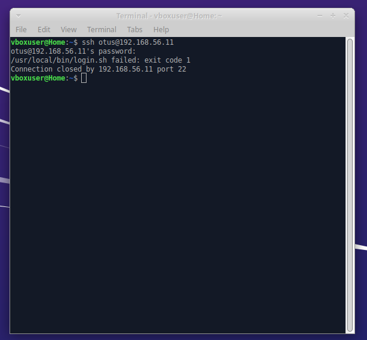
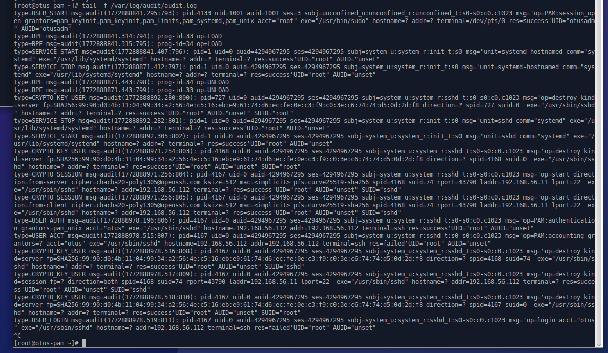

# Домашнее задание 16

## Цель:
- научиться создавать пользователей и добавлять им ограничения;

### Описание/Пошаговая инструкция выполнения домашнего задания:
- Ограничить доступ к системе для всех пользователей, кроме группы администраторов, в выходные дни (суббота и воскресенье), за исключением праздничных дней.

### Задание повышенной сложности
- Предоставить определённому пользователю доступ к Docker и право перезапускать Docker-сервис.


---
### Пошаговая инструкция выполнения
> Vagrantfile
```shell
amyskin@otus-vagrant:/mnt/c/Vagrant/vagrant_pam$ cat ./Vagrantfile
# -*- mode: ruby -*-
# vim: set ft=ruby :
ENV['VAGRANT_SERVER_URL'] = 'https://vagrant.elab.pro'

Vagrant.configure("2") do |config|

  config.ssh.host = "127.0.0.1"
  config.vm.box = "almalinux/9"
  config.vm.hostname = "otus-pam"
  config.vm.network "private_network", ip: "192.168.56.11"
  config.vm.provider "virtualbox" do |vb|
    vb.memory = "2048"
    vb.cpus = 2
  end

  config.vm.provision "shell", inline: "dnf install -y python3 python3-pip nano"

  config.vm.provision "ansible" do |ansible|
    ansible.playbook = "ansible/playbook.yml"
    ansible.inventory_path = "ansible/inventory"
    ansible.limit = "otus-pam"
    ansible.host_key_checking = false
    ansible.verbose = "vv"

    ansible.extra_vars = {
      ansible_user: 'vagrant',
      ansible_python_interpreter: '/usr/bin/python3'
    }
  end
end

```
> Ansible
```shell
amyskin@otus-vagrant:/mnt/c/Vagrant/vagrant_pam/ansible$ cat ./inventory
[otus-pam]
127.0.0.1 ansible_port=2200 ansible_python_interpreter=/usr/local/bin/python3 ansible_user=vagrant ansible_ssh_private_key_file=.vagrant/machines/default/virtualbox/private_key ansible_become=yes

```
```shell
amyskin@otus-vagrant:/mnt/c/Vagrant/vagrant_pam/ansible$ cat ./playbook.yml
---
- name: Настройка ограничений и Docker
  hosts: otus-pam
  become: yes
  vars:
    admin_group: admin
    holiday_file: /etc/holidays
    login_script: /usr/local/bin/login.sh
    docker_user: dockeruser
    holidays:
      - "2026-01-01"
      - "2026-01-07"
      - "2026-05-01"
      - "2026-05-09"
      - "2026-06-12"
      - "2026-11-04"

  tasks:
    - name: Создание пользователей otusadm и otus
      user:
        name: "{{ item }}"
        password: "{{ 'Otus2022!' | password_hash('sha512') }}"
        state: present
      loop:
        - otusadm
        - otus

    - name: Создание группы admin
      group:
        name: "{{ admin_group }}"
        state: present

    - name: Добавление пользователей в группу admin
      user:
        name: "{{ item }}"
        groups: "{{ admin_group }}"
        append: yes
      loop:
        - root
        - vagrant
        - otusadm

    - name: Создание файла с праздниками
      copy:
        content: |
          
          {{ h }}
          
        dest: "{{ holiday_file }}"
        mode: 0644

    - name: Установка скрипта ограничения доступа
      copy:
        dest: "{{ login_script }}"
        mode: 0755
        content: |
          #!/bin/bash
          HOLIDAYS_FILE="{{ holiday_file }}"
          TODAY=$(date +%Y-%m-%d)

          is_holiday() {
              if [ -f "$HOLIDAYS_FILE" ]; then
                  grep -Fxq "$TODAY" "$HOLIDAYS_FILE" && return 0
              fi
              return 1
          }

          if is_holiday; then
              exit 0
          fi

          if [ $(date +%a) = "Sat" ] || [ $(date +%a) = "Sun" ]; then
              if getent group {{ admin_group }} | grep -qw "$PAM_USER"; then
                  exit 0
              else
                  exit 1
              fi
          else
              exit 0
          fi

    - name: Добавление вызова скрипта в PAM (sshd, секция account)
      lineinfile:
        path: /etc/pam.d/sshd
        insertbefore: '^account\s+required\s+pam_nologin\.so'
        line: 'account    required     pam_exec.so {{ login_script }}'
        state: present
      notify: restart sshd

    - name: Разрешить аутентификацию по паролю в SSH
      lineinfile:
        path: /etc/ssh/sshd_config
        regexp: '^PasswordAuthentication'
        line: 'PasswordAuthentication yes'
      notify: restart sshd


    - name: Установка необходимых пакетов для Docker
      dnf:
        name:
          - yum-utils
          - device-mapper-persistent-data
          - lvm2
        state: present

    - name: Добавление репозитория Docker
      command:
        cmd: yum-config-manager --add-repo https://download.docker.com/linux/rhel/docker-ce.repo
        creates: /etc/yum.repos.d/docker-ce.repo

    - name: Установка Docker
      dnf:
        name:
          - docker-ce
          - docker-ce-cli
          - containerd.io
          - docker-buildx-plugin
          - docker-compose-plugin
        state: present

    - name: Запуск и включение Docker
      systemd:
        name: docker
        state: started
        enabled: yes

    - name: Создание пользователя для Docker
      user:
        name: "{{ docker_user }}"
        state: present

    - name: Добавление пользователя в группу docker
      user:
        name: "{{ docker_user }}"
        groups: docker
        append: yes

    - name: Право на перезапуск Docker через sudo
      copy:
        dest: "/etc/sudoers.d/{{ docker_user }}-docker"
        content: "{{ docker_user }} ALL=(ALL) NOPASSWD: /usr/bin/systemctl restart docker\n"
        mode: 0440
        validate: 'visudo -cf %s'

  handlers:
    - name: restart sshd
      systemd:
        name: sshd
        state: restarted

```
> Установка 
```shell
amyskin@otus-vagrant:/mnt/c/Vagrant/vagrant_pam$ vagrant up
Bringing machine 'default' up with 'virtualbox' provider...
==> default: Importing base box 'almalinux/9'...
==> default: Matching MAC address for NAT networking...
==> default: Checking if box 'almalinux/9' version '1.0.0' is up to date...
==> default: Setting the name of the VM: vagrant_pam_default_1772825827575_7581
==> default: Fixed port collision for 22 => 2222. Now on port 2200.
==> default: Clearing any previously set network interfaces...
==> default: Preparing network interfaces based on configuration...
    default: Adapter 1: nat
    default: Adapter 2: hostonly
==> default: Forwarding ports...
    default: 22 (guest) => 2200 (host) (adapter 1)
    default: 22 (guest) => 2200 (host) (adapter 1)
==> default: Running 'pre-boot' VM customizations...
==> default: Booting VM...
==> default: Waiting for machine to boot. This may take a few minutes...
    default: SSH address: 127.0.0.1:2200
    default: SSH username: vagrant
    default: SSH auth method: private key
    default:
    default: Vagrant insecure key detected. Vagrant will automatically replace
    default: this with a newly generated keypair for better security.
    default:
    default: Inserting generated public key within guest...
    default: Removing insecure key from the guest if it's present...
    default: Key inserted! Disconnecting and reconnecting using new SSH key...
==> default: Machine booted and ready!
==> default: Checking for guest additions in VM...
    default: The guest additions on this VM do not match the installed version of
    default: VirtualBox! In most cases this is fine, but in rare cases it can
    default: prevent things such as shared folders from working properly. If you see
    default: shared folder errors, please make sure the guest additions within the
    default: virtual machine match the version of VirtualBox you have installed on
    default: your host and reload your VM.
    default:
    default: Guest Additions Version: 7.1.4
    default: VirtualBox Version: 7.2
==> default: Setting hostname...
==> default: Configuring and enabling network interfaces...
==> default: Mounting shared folders...
    default: /mnt/c/Vagrant/vagrant_pam => /vagrant
==> default: Running provisioner: shell...
    default: Running: inline script
    default: AlmaLinux 9 - AppStream                          13 MB/s |  16 MB     00:01
    default: AlmaLinux 9 - BaseOS                             15 MB/s |  17 MB     00:01
    default: AlmaLinux 9 - Extras                             32 kB/s |  20 kB     00:00
    default: Package python3-3.9.19-8.el9_5.1.x86_64 is already installed.
    default: Dependencies resolved.
    default: ================================================================================
    default:  Package                   Arch       Version               Repository     Size
    default: ================================================================================
    default: Installing:
    default:  nano                      x86_64     5.6.1-7.el9           baseos        692 k
    default:  python3-pip               noarch     21.3.1-1.el9          appstream     1.7 M
    default: Upgrading:
    default:  openssl                   x86_64     1:3.5.1-7.el9_7       baseos        1.4 M
    default:  openssl-devel             x86_64     1:3.5.1-7.el9_7       appstream     3.4 M
    default:  openssl-libs              x86_64     1:3.5.1-7.el9_7       baseos        2.3 M
    default:  python3                   x86_64     3.9.25-3.el9_7        baseos         26 k
    default:  python3-libs              x86_64     3.9.25-3.el9_7        baseos        7.5 M
    default: Installing dependencies:
    default:  openssl-fips-provider     x86_64     1:3.5.1-7.el9_7       baseos        812 k
    default: Installing weak dependencies:
    default:  libxcrypt-compat          x86_64     4.4.18-3.el9          appstream      88 k
    default:  python3-setuptools        noarch     53.0.0-15.el9         baseos        831 k
    default:
    default: Transaction Summary
    default: ================================================================================
    default: Install  5 Packages
    default: Upgrade  5 Packages
    default:
    default: Total download size: 19 M
    default: Downloading Packages:
    default: (1/10): libxcrypt-compat-4.4.18-3.el9.x86_64.rp 790 kB/s |  88 kB     00:00
    default: (2/10): python3-pip-21.3.1-1.el9.noarch.rpm      15 MB/s | 1.7 MB     00:00
    default: (3/10): openssl-fips-provider-3.5.1-7.el9_7.x86 8.5 MB/s | 812 kB     00:00
    default: (4/10): openssl-devel-3.5.1-7.el9_7.x86_64.rpm   29 MB/s | 3.4 MB     00:00
    default: (5/10): openssl-3.5.1-7.el9_7.x86_64.rpm         27 MB/s | 1.4 MB     00:00
    default: (6/10): nano-5.6.1-7.el9.x86_64.rpm             1.5 MB/s | 692 kB     00:00
    default: (7/10): openssl-libs-3.5.1-7.el9_7.x86_64.rpm    21 MB/s | 2.3 MB     00:00
    default: (8/10): python3-3.9.25-3.el9_7.x86_64.rpm       470 kB/s |  26 kB     00:00
    default: (9/10): python3-libs-3.9.25-3.el9_7.x86_64.rpm   30 MB/s | 7.5 MB     00:00
    default: (10/10): python3-setuptools-53.0.0-15.el9.noarc 871 kB/s | 831 kB     00:00
    default: --------------------------------------------------------------------------------
    default: Total                                           9.7 MB/s |  19 MB     00:01
    default: Running transaction check
    default: Transaction check succeeded.
    default: Running transaction test
    default: Transaction test succeeded.
    default: Running transaction
    default:   Preparing        :                                                        1/1
    default:   Upgrading        : openssl-libs-1:3.5.1-7.el9_7.x86_64                   1/15
    default:   Installing       : openssl-fips-provider-1:3.5.1-7.el9_7.x86_64          2/15
    default:   Upgrading        : python3-3.9.25-3.el9_7.x86_64                         3/15
    default:   Upgrading        : python3-libs-3.9.25-3.el9_7.x86_64                    4/15
    default:   Installing       : python3-setuptools-53.0.0-15.el9.noarch               5/15
    default:   Installing       : libxcrypt-compat-4.4.18-3.el9.x86_64                  6/15
    default:   Installing       : python3-pip-21.3.1-1.el9.noarch                       7/15
    default:   Upgrading        : openssl-devel-1:3.5.1-7.el9_7.x86_64                  8/15
    default:   Upgrading        : openssl-1:3.5.1-7.el9_7.x86_64                        9/15
    default:   Installing       : nano-5.6.1-7.el9.x86_64                              10/15
    default:   Cleanup          : openssl-devel-1:3.2.2-6.el9_5.x86_64                 11/15
    default:   Cleanup          : openssl-1:3.2.2-6.el9_5.x86_64                       12/15
    default:   Cleanup          : python3-3.9.19-8.el9_5.1.x86_64                      13/15
    default:   Cleanup          : python3-libs-3.9.19-8.el9_5.1.x86_64                 14/15
    default:   Cleanup          : openssl-libs-1:3.2.2-6.el9_5.x86_64                  15/15
    default:   Running scriptlet: openssl-libs-1:3.2.2-6.el9_5.x86_64                  15/15
    default:   Verifying        : libxcrypt-compat-4.4.18-3.el9.x86_64                  1/15
    default:   Verifying        : python3-pip-21.3.1-1.el9.noarch                       2/15
    default:   Verifying        : nano-5.6.1-7.el9.x86_64                               3/15
    default:   Verifying        : openssl-fips-provider-1:3.5.1-7.el9_7.x86_64          4/15
    default:   Verifying        : python3-setuptools-53.0.0-15.el9.noarch               5/15
    default:   Verifying        : openssl-devel-1:3.5.1-7.el9_7.x86_64                  6/15
    default:   Verifying        : openssl-devel-1:3.2.2-6.el9_5.x86_64                  7/15
    default:   Verifying        : openssl-1:3.5.1-7.el9_7.x86_64                        8/15
    default:   Verifying        : openssl-1:3.2.2-6.el9_5.x86_64                        9/15
    default:   Verifying        : openssl-libs-1:3.5.1-7.el9_7.x86_64                  10/15
    default:   Verifying        : openssl-libs-1:3.2.2-6.el9_5.x86_64                  11/15
    default:   Verifying        : python3-3.9.25-3.el9_7.x86_64                        12/15
    default:   Verifying        : python3-3.9.19-8.el9_5.1.x86_64                      13/15
    default:   Verifying        : python3-libs-3.9.25-3.el9_7.x86_64                   14/15
    default:   Verifying        : python3-libs-3.9.19-8.el9_5.1.x86_64                 15/15
    default:
    default: Upgraded:
    default:   openssl-1:3.5.1-7.el9_7.x86_64         openssl-devel-1:3.5.1-7.el9_7.x86_64
    default:   openssl-libs-1:3.5.1-7.el9_7.x86_64    python3-3.9.25-3.el9_7.x86_64
    default:   python3-libs-3.9.25-3.el9_7.x86_64
    default: Installed:
    default:   libxcrypt-compat-4.4.18-3.el9.x86_64          nano-5.6.1-7.el9.x86_64
    default:   openssl-fips-provider-1:3.5.1-7.el9_7.x86_64  python3-pip-21.3.1-1.el9.noarch
    default:   python3-setuptools-53.0.0-15.el9.noarch
    default:
    default: Complete!
==> default: Running provisioner: ansible...
    default: Running ansible-playbook...
PYTHONUNBUFFERED=1 ANSIBLE_FORCE_COLOR=true ANSIBLE_HOST_KEY_CHECKING=false ANSIBLE_SSH_ARGS='-o UserKnownHostsFile=/dev/null -o IdentitiesOnly=yes -o IdentityFile=/mnt/c/Vagrant/vagrant_pam/.vagrant/machines/default/virtualbox/private_key -o ControlMaster=auto -o ControlPersist=60s' ansible-playbook --connection=ssh --timeout=30 --extra-vars=ansible_user\=\'vagrant\' --limit="otus-pam" --inventory-file=ansible/inventory --extra-vars=\{\"ansible_user\":\"vagrant\",\"ansible_python_interpreter\":\"/usr/bin/python3\"\} -vv ansible/playbook.yml
[WARNING]: Deprecation warnings can be disabled by setting `deprecation_warnings=False` in ansible.cfg.
[DEPRECATION WARNING]: The '--inventory-file' argument is deprecated. This feature will be removed from ansible-core version 2.23. Use -i or --inventory instead.
ansible-playbook [core 2.20.3]
  config file = /etc/ansible/ansible.cfg
  configured module search path = ['/home/amyskin/.ansible/plugins/modules', '/usr/share/ansible/plugins/modules']
  ansible python module location = /usr/lib/python3/dist-packages/ansible
  ansible collection location = /home/amyskin/.ansible/collections:/usr/share/ansible/collections
  executable location = /usr/bin/ansible-playbook
  python version = 3.12.3 (main, Jan 22 2026, 20:57:42) [GCC 13.3.0] (/usr/bin/python3)
  jinja version = 3.1.2
  pyyaml version = 6.0.1 (with libyaml v0.2.5)
Using /etc/ansible/ansible.cfg as config file
[WARNING]: Invalid characters were found in group names but not replaced, use -vvvv to see details
Skipping callback 'minimal', as we already have a stdout callback.
Skipping callback 'oneline', as we already have a stdout callback.

PLAYBOOK: playbook.yml *********************************************************
1 plays in ansible/playbook.yml

PLAY [Настройка ограничений и Docker] ******************************************

TASK [Gathering Facts] *********************************************************
task path: /mnt/c/Vagrant/vagrant_pam/ansible/playbook.yml:2
ok: [127.0.0.1]

TASK [Создание пользователей otusadm и otus] ***********************************
task path: /mnt/c/Vagrant/vagrant_pam/ansible/playbook.yml:19
Using passlib to hash input with 'sha512_crypt'
changed: [127.0.0.1] => (item=otusadm) => {"ansible_loop_var": "item", "changed": true, "comment": "", "create_home": true, "group": 1001, "home": "/home/otusadm", "item": "otusadm", "name": "otusadm", "password": "NOT_LOGGING_PASSWORD", "shell": "/bin/bash", "state": "present", "system": false, "uid": 1001}
Using passlib to hash input with 'sha512_crypt'
changed: [127.0.0.1] => (item=otus) => {"ansible_loop_var": "item", "changed": true, "comment": "", "create_home": true, "group": 1002, "home": "/home/otus", "item": "otus", "name": "otus", "password": "NOT_LOGGING_PASSWORD", "shell": "/bin/bash", "state": "present", "system": false, "uid": 1002}

TASK [Создание группы admin] ***************************************************
task path: /mnt/c/Vagrant/vagrant_pam/ansible/playbook.yml:28
changed: [127.0.0.1] => {"changed": true, "gid": 1003, "name": "admin", "state": "present", "system": false}

TASK [Добавление пользователей в группу admin] *********************************
task path: /mnt/c/Vagrant/vagrant_pam/ansible/playbook.yml:33
changed: [127.0.0.1] => (item=root) => {"ansible_loop_var": "item", "append": true, "changed": true, "comment": "root", "group": 0, "groups": "admin", "home": "/root", "item": "root", "move_home": false, "name": "root", "shell": "/bin/bash", "state": "present", "uid": 0}
changed: [127.0.0.1] => (item=vagrant) => {"ansible_loop_var": "item", "append": true, "changed": true, "comment": "", "group": 1000, "groups": "admin", "home": "/home/vagrant", "item": "vagrant", "move_home": false, "name": "vagrant", "shell": "/bin/bash", "state": "present", "uid": 1000}
changed: [127.0.0.1] => (item=otusadm) => {"ansible_loop_var": "item", "append": true, "changed": true, "comment": "", "group": 1001, "groups": "admin", "home": "/home/otusadm", "item": "otusadm", "move_home": false, "name": "otusadm", "shell": "/bin/bash", "state": "present", "uid": 1001}

TASK [Создание файла с праздниками] ********************************************
task path: /mnt/c/Vagrant/vagrant_pam/ansible/playbook.yml:43
changed: [127.0.0.1] => {"changed": true, "checksum": "f5cd44df2f4634d0eb3d5b38169fbe2b47db79ec", "dest": "/etc/holidays", "gid": 0, "group": "root", "md5sum": "2f10c074fd0fad953f2b0e1176ac26f0", "mode": "0644", "owner": "root", "secontext": "system_u:object_r:etc_t:s0", "size": 66, "src": "/home/vagrant/.ansible/tmp/ansible-tmp-1772825895.381378-6071-201927624266279/.source", "state": "file", "uid": 0}

TASK [Установка скрипта ограничения доступа] ***********************************
task path: /mnt/c/Vagrant/vagrant_pam/ansible/playbook.yml:52
changed: [127.0.0.1] => {"changed": true, "checksum": "76c47036e505ab5118fa1f8c53156240e22bc594", "dest": "/usr/local/bin/login.sh", "gid": 0, "group": "root", "md5sum": "4a1f7ec7279e4d38460070cabc2530a4", "mode": "0755", "owner": "root", "secontext": "system_u:object_r:bin_t:s0", "size": 413, "src": "/home/vagrant/.ansible/tmp/ansible-tmp-1772825896.4544406-6088-50656189848213/.source.sh", "state": "file", "uid": 0}

TASK [Добавление вызова скрипта в PAM (sshd, секция account)] ******************
task path: /mnt/c/Vagrant/vagrant_pam/ansible/playbook.yml:82
Notification for handler restart sshd has been saved.
changed: [127.0.0.1] => {"backup": "", "changed": true, "msg": "line added"}

TASK [Разрешить аутентификацию по паролю в SSH] ********************************
task path: /mnt/c/Vagrant/vagrant_pam/ansible/playbook.yml:90
Notification for handler restart sshd has been saved.
changed: [127.0.0.1] => {"backup": "", "changed": true, "msg": "line added"}

TASK [Установка необходимых пакетов для Docker] ********************************
task path: /mnt/c/Vagrant/vagrant_pam/ansible/playbook.yml:98
changed: [127.0.0.1] => {"changed": true, "msg": "", "rc": 0, "results": ["Installed: device-mapper-libs-9:1.02.206-2.el9_7.1.x86_64", "Installed: libnvme-1.13-1.el9.x86_64", "Installed: libaio-0.3.111-13.el9.x86_64", "Installed: device-mapper-persistent-data-1.1.0-1.el9.x86_64", "Installed: python3-dnf-plugins-core-4.3.0-24.el9_7.noarch", "Installed: lvm2-libs-9:2.03.32-2.el9_7.1.x86_64", "Installed: dnf-plugins-core-4.3.0-24.el9_7.noarch", "Installed: lvm2-9:2.03.32-2.el9_7.1.x86_64", "Installed: device-mapper-9:1.02.206-2.el9_7.1.x86_64", "Installed: device-mapper-event-9:1.02.206-2.el9_7.1.x86_64", "Installed: device-mapper-event-libs-9:1.02.206-2.el9_7.1.x86_64", "Installed: yum-utils-4.3.0-24.el9_7.noarch", "Removed: dnf-plugins-core-4.3.0-16.el9.noarch", "Removed: python3-dnf-plugins-core-4.3.0-16.el9.noarch", "Removed: device-mapper-9:1.02.198-2.el9.x86_64", "Removed: device-mapper-libs-9:1.02.198-2.el9.x86_64"]}

TASK [Добавление репозитория Docker] *******************************************
task path: /mnt/c/Vagrant/vagrant_pam/ansible/playbook.yml:106
changed: [127.0.0.1] => {"changed": true, "cmd": ["yum-config-manager", "--add-repo", "https://download.docker.com/linux/rhel/docker-ce.repo"], "delta": "0:00:00.320034", "end": "2026-03-06 19:38:25.913473", "msg": "", "rc": 0, "start": "2026-03-06 19:38:25.593439", "stderr": "", "stderr_lines": [], "stdout": "Adding repo from: https://download.docker.com/linux/rhel/docker-ce.repo", "stdout_lines": ["Adding repo from: https://download.docker.com/linux/rhel/docker-ce.repo"]}

TASK [Установка Docker] ********************************************************
task path: /mnt/c/Vagrant/vagrant_pam/ansible/playbook.yml:111
changed: [127.0.0.1] => {"changed": true, "msg": "", "rc": 0, "results": ["Installed: docker-compose-plugin-5.1.0-1.el9.x86_64", "Installed: passt-0^20250512.g8ec1341-4.el9_7.x86_64", "Installed: passt-selinux-0^20250512.g8ec1341-4.el9_7.noarch", "Installed: iptables-libs-1.8.10-11.el9_5.x86_64", "Installed: iptables-nft-1.8.10-11.el9_5.x86_64", "Installed: fuse-overlayfs-1.16-1.el9_7.x86_64", "Installed: fuse3-3.10.2-9.el9.x86_64", "Installed: fuse3-libs-3.10.2-9.el9.x86_64", "Installed: containerd.io-2.2.1-1.el9.x86_64", "Installed: docker-ce-cli-1:29.3.0-1.el9.x86_64", "Installed: fuse-common-3.10.2-9.el9.x86_64", "Installed: docker-buildx-plugin-0.31.1-1.el9.x86_64", "Installed: nftables-1:1.0.9-6.el9_7.x86_64", "Installed: docker-ce-rootless-extras-29.3.0-1.el9.x86_64", "Installed: libnftnl-1.2.6-4.el9_4.x86_64", "Installed: selinux-policy-38.1.65-1.el9_7.1.noarch", "Installed: selinux-policy-targeted-38.1.65-1.el9_7.1.noarch", "Installed: docker-ce-3:29.3.0-1.el9.x86_64", "Installed: container-selinux-4:2.240.0-3.el9_7.noarch", "Removed: selinux-policy-targeted-38.1.45-3.el9_5.noarch", "Removed: selinux-policy-38.1.45-3.el9_5.noarch", "Removed: iptables-libs-1.8.10-4.el9_4.x86_64"]}

TASK [Запуск и включение Docker] ***********************************************
task path: /mnt/c/Vagrant/vagrant_pam/ansible/playbook.yml:121
changed: [127.0.0.1] => {"changed": true, "enabled": true, "name": "docker", "state": "started", "status": {"AccessSELinuxContext": "system_u:object_r:container_unit_file_t:s0", "ActiveEnterTimestampMonotonic": "0", "ActiveExitTimestampMonotonic": "0", "ActiveState": "inactive", "After": "system.slice basic.target containerd.service time-set.target systemd-journald.socket nss-lookup.target firewalld.service network-online.target docker.socket sysinit.target", "AllowIsolate": "no", "AssertResult": "no", "AssertTimestampMonotonic": "0", "Before": "shutdown.target", "BlockIOAccounting": "no", "BlockIOWeight": "[not set]", "CPUAccounting": "yes", "CPUAffinityFromNUMA": "no", "CPUQuotaPerSecUSec": "infinity", "CPUQuotaPeriodUSec": "infinity", "CPUSchedulingPolicy": "0", "CPUSchedulingPriority": "0", "CPUSchedulingResetOnFork": "no", "CPUShares": "[not set]", "CPUUsageNSec": "[not set]", "CPUWeight": "[not set]", "CacheDirectoryMode": "0755", "CanFreeze": "yes", "CanIsolate": "no", "CanReload": "yes", "CanStart": "yes", "CanStop": "yes", "CapabilityBoundingSet": "cap_chown cap_dac_override cap_dac_read_search cap_fowner cap_fsetid cap_kill cap_setgid cap_setuid cap_setpcap cap_linux_immutable cap_net_bind_service cap_net_broadcast cap_net_admin cap_net_raw cap_ipc_lock cap_ipc_owner cap_sys_module cap_sys_rawio cap_sys_chroot cap_sys_ptrace cap_sys_pacct cap_sys_admin cap_sys_boot cap_sys_nice cap_sys_resource cap_sys_time cap_sys_tty_config cap_mknod cap_lease cap_audit_write cap_audit_control cap_setfcap cap_mac_override cap_mac_admin cap_syslog cap_wake_alarm cap_block_suspend cap_audit_read cap_perfmon cap_bpf cap_checkpoint_restore", "CleanResult": "success", "CollectMode": "inactive", "ConditionResult": "no", "ConditionTimestampMonotonic": "0", "ConfigurationDirectoryMode": "0755", "Conflicts": "shutdown.target", "ControlGroupId": "0", "ControlPID": "0", "CoredumpFilter": "0x33", "DefaultDependencies": "yes", "DefaultMemoryLow": "0", "DefaultMemoryMin": "0", "Delegate": "yes", "DelegateControllers": "cpu cpuacct cpuset io blkio memory devices pids bpf-firewall bpf-devices bpf-foreign bpf-socket-bind bpf-restrict-network-interfaces", "Description": "Docker Application Container Engine", "DevicePolicy": "auto", "Documentation": "https://docs.docker.com", "DynamicUser": "no", "ExecMainCode": "0", "ExecMainExitTimestampMonotonic": "0", "ExecMainPID": "0", "ExecMainStartTimestampMonotonic": "0", "ExecMainStatus": "0", "ExecReload": "{ path=/bin/kill ; argv[]=/bin/kill -s HUP $MAINPID ; ignore_errors=no ; start_time=[n/a] ; stop_time=[n/a] ; pid=0 ; code=(null) ; status=0/0 }", "ExecReloadEx": "{ path=/bin/kill ; argv[]=/bin/kill -s HUP $MAINPID ; flags= ; start_time=[n/a] ; stop_time=[n/a] ; pid=0 ; code=(null) ; status=0/0 }", "ExecStart": "{ path=/usr/bin/dockerd ; argv[]=/usr/bin/dockerd -H fd:// --containerd=/run/containerd/containerd.sock ; ignore_errors=no ; start_time=[n/a] ; stop_time=[n/a] ; pid=0 ; code=(null) ; status=0/0 }", "ExecStartEx": "{ path=/usr/bin/dockerd ; argv[]=/usr/bin/dockerd -H fd:// --containerd=/run/containerd/containerd.sock ; flags= ; start_time=[n/a] ; stop_time=[n/a] ; pid=0 ; code=(null) ; status=0/0 }", "ExitType": "main", "FailureAction": "none", "FileDescriptorStoreMax": "0", "FinalKillSignal": "9", "FragmentPath": "/usr/lib/systemd/system/docker.service", "FreezerState": "running", "GID": "[not set]", "GuessMainPID": "yes", "IOAccounting": "no", "IOReadBytes": "18446744073709551615", "IOReadOperations": "18446744073709551615", "IOSchedulingClass": "2", "IOSchedulingPriority": "4", "IOWeight": "[not set]", "IOWriteBytes": "18446744073709551615", "IOWriteOperations": "18446744073709551615", "IPAccounting": "no", "IPEgressBytes": "[no data]", "IPEgressPackets": "[no data]", "IPIngressBytes": "[no data]", "IPIngressPackets": "[no data]", "Id": "docker.service", "IgnoreOnIsolate": "no", "IgnoreSIGPIPE": "yes", "InactiveEnterTimestampMonotonic": "0", "InactiveExitTimestampMonotonic": "0", "JobRunningTimeoutUSec": "infinity", "JobTimeoutAction": "none", "JobTimeoutUSec": "infinity", "KeyringMode": "private", "KillMode": "process", "KillSignal": "15", "LimitAS": "infinity", "LimitASSoft": "infinity", "LimitCORE": "infinity", "LimitCORESoft": "infinity", "LimitCPU": "infinity", "LimitCPUSoft": "infinity", "LimitDATA": "infinity", "LimitDATASoft": "infinity", "LimitFSIZE": "infinity", "LimitFSIZESoft": "infinity", "LimitLOCKS": "infinity", "LimitLOCKSSoft": "infinity", "LimitMEMLOCK": "8388608", "LimitMEMLOCKSoft": "8388608", "LimitMSGQUEUE": "819200", "LimitMSGQUEUESoft": "819200", "LimitNICE": "0", "LimitNICESoft": "0", "LimitNOFILE": "524288", "LimitNOFILESoft": "1024", "LimitNPROC": "infinity", "LimitNPROCSoft": "infinity", "LimitRSS": "infinity", "LimitRSSSoft": "infinity", "LimitRTPRIO": "0", "LimitRTPRIOSoft": "0", "LimitRTTIME": "infinity", "LimitRTTIMESoft": "infinity", "LimitSIGPENDING": "7505", "LimitSIGPENDINGSoft": "7505", "LimitSTACK": "infinity", "LimitSTACKSoft": "8388608", "LoadState": "loaded", "LockPersonality": "no", "LogLevelMax": "-1", "LogRateLimitBurst": "0", "LogRateLimitIntervalUSec": "0", "LogsDirectoryMode": "0755", "MainPID": "0", "ManagedOOMMemoryPressure": "auto", "ManagedOOMMemoryPressureLimit": "0", "ManagedOOMPreference": "none", "ManagedOOMSwap": "auto", "MemoryAccounting": "yes", "MemoryAvailable": "infinity", "MemoryCurrent": "[not set]", "MemoryDenyWriteExecute": "no", "MemoryHigh": "infinity", "MemoryLimit": "infinity", "MemoryLow": "0", "MemoryMax": "infinity", "MemoryMin": "0", "MemorySwapMax": "infinity", "MountAPIVFS": "no", "NFileDescriptorStore": "0", "NRestarts": "0", "NUMAPolicy": "n/a", "Names": "docker.service", "NeedDaemonReload": "no", "Nice": "0", "NoNewPrivileges": "no", "NonBlocking": "no", "NotifyAccess": "main", "OOMPolicy": "continue", "OOMScoreAdjust": "-500", "OnFailureJobMode": "replace", "OnSuccessJobMode": "fail", "Perpetual": "no", "PrivateDevices": "no", "PrivateIPC": "no", "PrivateMounts": "no", "PrivateNetwork": "no", "PrivateTmp": "no", "PrivateUsers": "no", "ProcSubset": "all", "ProtectClock": "no", "ProtectControlGroups": "no", "ProtectHome": "no", "ProtectHostname": "no", "ProtectKernelLogs": "no", "ProtectKernelModules": "no", "ProtectKernelTunables": "no", "ProtectProc": "default", "ProtectSystem": "no", "RefuseManualStart": "no", "RefuseManualStop": "no", "ReloadResult": "success", "ReloadSignal": "1", "RemainAfterExit": "no", "RemoveIPC": "no", "Requires": "docker.socket sysinit.target system.slice", "Restart": "always", "RestartKillSignal": "15", "RestartUSec": "2s", "RestrictNamespaces": "no", "RestrictRealtime": "no", "RestrictSUIDSGID": "no", "Result": "success", "RootDirectoryStartOnly": "no", "RuntimeDirectoryMode": "0755", "RuntimeDirectoryPreserve": "no", "RuntimeMaxUSec": "infinity", "RuntimeRandomizedExtraUSec": "0", "SameProcessGroup": "no", "SecureBits": "0", "SendSIGHUP": "no", "SendSIGKILL": "yes", "Slice": "system.slice", "StandardError": "inherit", "StandardInput": "null", "StandardOutput": "journal", "StartLimitAction": "none", "StartLimitBurst": "3", "StartLimitIntervalUSec": "1min", "StartupBlockIOWeight": "[not set]", "StartupCPUShares": "[not set]", "StartupCPUWeight": "[not set]", "StartupIOWeight": "[not set]", "StateChangeTimestampMonotonic": "0", "StateDirectoryMode": "0755", "StatusErrno": "0", "StopWhenUnneeded": "no", "SubState": "dead", "SuccessAction": "none", "SyslogFacility": "3", "SyslogLevel": "6", "SyslogLevelPrefix": "yes", "SyslogPriority": "30", "SystemCallErrorNumber": "2147483646", "TTYReset": "no", "TTYVHangup": "no", "TTYVTDisallocate": "no", "TasksAccounting": "yes", "TasksCurrent": "[not set]", "TasksMax": "infinity", "TimeoutAbortUSec": "1min 30s", "TimeoutCleanUSec": "infinity", "TimeoutStartFailureMode": "terminate", "TimeoutStartUSec": "infinity", "TimeoutStopFailureMode": "terminate", "TimeoutStopUSec": "1min 30s", "TimerSlackNSec": "50000", "Transient": "no", "TriggeredBy": "docker.socket", "Type": "notify", "UID": "[not set]", "UMask": "0022", "UnitFilePreset": "disabled", "UnitFileState": "disabled", "UtmpMode": "init", "Wants": "containerd.service network-online.target", "WatchdogSignal": "6", "WatchdogTimestampMonotonic": "0", "WatchdogUSec": "infinity"}}

TASK [Создание пользователя для Docker] ****************************************
task path: /mnt/c/Vagrant/vagrant_pam/ansible/playbook.yml:127
changed: [127.0.0.1] => {"changed": true, "comment": "", "create_home": true, "group": 1004, "home": "/home/dockeruser", "name": "dockeruser", "shell": "/bin/bash", "state": "present", "system": false, "uid": 1003}

TASK [Добавление пользователя в группу docker] *********************************
task path: /mnt/c/Vagrant/vagrant_pam/ansible/playbook.yml:132
changed: [127.0.0.1] => {"append": true, "changed": true, "comment": "", "group": 1004, "groups": "docker", "home": "/home/dockeruser", "move_home": false, "name": "dockeruser", "shell": "/bin/bash", "state": "present", "uid": 1003}

TASK [Право на перезапуск Docker через sudo] ***********************************
task path: /mnt/c/Vagrant/vagrant_pam/ansible/playbook.yml:138
changed: [127.0.0.1] => {"changed": true, "checksum": "07beeeba215b15b624c61d267a53f78d5586b6ad", "dest": "/etc/sudoers.d/dockeruser-docker", "gid": 0, "group": "root", "md5sum": "20874935d661d4c6e9d5ea662b1fc757", "mode": "0440", "owner": "root", "secontext": "system_u:object_r:etc_t:s0", "size": 65, "src": "/home/vagrant/.ansible/tmp/ansible-tmp-1772825973.1417036-6187-59551944281025/.source", "state": "file", "uid": 0}
NOTIFIED HANDLER restart sshd for 127.0.0.1

RUNNING HANDLER [restart sshd] *************************************************
task path: /mnt/c/Vagrant/vagrant_pam/ansible/playbook.yml:146
changed: [127.0.0.1] => {"changed": true, "name": "sshd", "state": "started", "status": {"AccessSELinuxContext": "system_u:object_r:sshd_unit_file_t:s0", "ActiveEnterTimestamp": "Fri 2026-03-06 19:37:35 UTC", "ActiveEnterTimestampMonotonic": "13682550", "ActiveExitTimestampMonotonic": "0", "ActiveState": "active", "After": "network.target system.slice basic.target sysinit.target sshd-keygen.target systemd-journald.socket", "AllowIsolate": "no", "AssertResult": "yes", "AssertTimestamp": "Fri 2026-03-06 19:37:35 UTC", "AssertTimestampMonotonic": "13593440", "Before": "shutdown.target multi-user.target", "BlockIOAccounting": "no", "BlockIOWeight": "[not set]", "CPUAccounting": "yes", "CPUAffinityFromNUMA": "no", "CPUQuotaPerSecUSec": "infinity", "CPUQuotaPeriodUSec": "infinity", "CPUSchedulingPolicy": "0", "CPUSchedulingPriority": "0", "CPUSchedulingResetOnFork": "no", "CPUShares": "[not set]", "CPUUsageNSec": "158999000", "CPUWeight": "[not set]", "CacheDirectoryMode": "0755", "CanFreeze": "yes", "CanIsolate": "no", "CanReload": "yes", "CanStart": "yes", "CanStop": "yes", "CapabilityBoundingSet": "cap_chown cap_dac_override cap_dac_read_search cap_fowner cap_fsetid cap_kill cap_setgid cap_setuid cap_setpcap cap_linux_immutable cap_net_bind_service cap_net_broadcast cap_net_admin cap_net_raw cap_ipc_lock cap_ipc_owner cap_sys_module cap_sys_rawio cap_sys_chroot cap_sys_ptrace cap_sys_pacct cap_sys_admin cap_sys_boot cap_sys_nice cap_sys_resource cap_sys_time cap_sys_tty_config cap_mknod cap_lease cap_audit_write cap_audit_control cap_setfcap cap_mac_override cap_mac_admin cap_syslog cap_wake_alarm cap_block_suspend cap_audit_read cap_perfmon cap_bpf cap_checkpoint_restore", "CleanResult": "success", "CollectMode": "inactive", "ConditionResult": "yes", "ConditionTimestamp": "Fri 2026-03-06 19:37:35 UTC", "ConditionTimestampMonotonic": "13593439", "ConfigurationDirectoryMode": "0755", "Conflicts": "shutdown.target", "ConsistsOf": "sshd-keygen.target", "ControlGroup": "/system.slice/sshd.service", "ControlGroupId": "3010", "ControlPID": "0", "CoredumpFilter": "0x33", "DefaultDependencies": "yes", "DefaultMemoryLow": "0", "DefaultMemoryMin": "0", "Delegate": "no", "Description": "OpenSSH server daemon", "DevicePolicy": "auto", "Documentation": "\"man:sshd(8)\" \"man:sshd_config(5)\"", "DynamicUser": "no", "EffectiveCPUs": "0-1", "EffectiveMemoryNodes": "0", "EnvironmentFiles": "/etc/sysconfig/sshd (ignore_errors=yes)", "ExecMainCode": "0", "ExecMainExitTimestampMonotonic": "0", "ExecMainPID": "768", "ExecMainStartTimestamp": "Fri 2026-03-06 19:37:35 UTC", "ExecMainStartTimestampMonotonic": "13599226", "ExecMainStatus": "0", "ExecReload": "{ path=/bin/kill ; argv[]=/bin/kill -HUP $MAINPID ; ignore_errors=no ; start_time=[n/a] ; stop_time=[n/a] ; pid=0 ; code=(null) ; status=0/0 }", "ExecReloadEx": "{ path=/bin/kill ; argv[]=/bin/kill -HUP $MAINPID ; flags= ; start_time=[n/a] ; stop_time=[n/a] ; pid=0 ; code=(null) ; status=0/0 }", "ExecStart": "{ path=/usr/sbin/sshd ; argv[]=/usr/sbin/sshd -D $OPTIONS ; ignore_errors=no ; start_time=[n/a] ; stop_time=[n/a] ; pid=0 ; code=(null) ; status=0/0 }", "ExecStartEx": "{ path=/usr/sbin/sshd ; argv[]=/usr/sbin/sshd -D $OPTIONS ; flags= ; start_time=[n/a] ; stop_time=[n/a] ; pid=0 ; code=(null) ; status=0/0 }", "ExitType": "main", "FailureAction": "none", "FileDescriptorStoreMax": "0", "FinalKillSignal": "9", "FragmentPath": "/usr/lib/systemd/system/sshd.service", "FreezerState": "running", "GID": "[not set]", "GuessMainPID": "yes", "IOAccounting": "no", "IOReadBytes": "18446744073709551615", "IOReadOperations": "18446744073709551615", "IOSchedulingClass": "2", "IOSchedulingPriority": "4", "IOWeight": "[not set]", "IOWriteBytes": "18446744073709551615", "IOWriteOperations": "18446744073709551615", "IPAccounting": "no", "IPEgressBytes": "[no data]", "IPEgressPackets": "[no data]", "IPIngressBytes": "[no data]", "IPIngressPackets": "[no data]", "Id": "sshd.service", "IgnoreOnIsolate": "no", "IgnoreSIGPIPE": "yes", "InactiveEnterTimestampMonotonic": "0", "InactiveExitTimestamp": "Fri 2026-03-06 19:37:35 UTC", "InactiveExitTimestampMonotonic": "13599368", "InvocationID": "7809c8b5f0614eac9cc311f4b2fd332c", "JobRunningTimeoutUSec": "infinity", "JobTimeoutAction": "none", "JobTimeoutUSec": "infinity", "KeyringMode": "private", "KillMode": "process", "KillSignal": "15", "LimitAS": "infinity", "LimitASSoft": "infinity", "LimitCORE": "infinity", "LimitCORESoft": "infinity", "LimitCPU": "infinity", "LimitCPUSoft": "infinity", "LimitDATA": "infinity", "LimitDATASoft": "infinity", "LimitFSIZE": "infinity", "LimitFSIZESoft": "infinity", "LimitLOCKS": "infinity", "LimitLOCKSSoft": "infinity", "LimitMEMLOCK": "8388608", "LimitMEMLOCKSoft": "8388608", "LimitMSGQUEUE": "819200", "LimitMSGQUEUESoft": "819200", "LimitNICE": "0", "LimitNICESoft": "0", "LimitNOFILE": "524288", "LimitNOFILESoft": "1024", "LimitNPROC": "7505", "LimitNPROCSoft": "7505", "LimitRSS": "infinity", "LimitRSSSoft": "infinity", "LimitRTPRIO": "0", "LimitRTPRIOSoft": "0", "LimitRTTIME": "infinity", "LimitRTTIMESoft": "infinity", "LimitSIGPENDING": "7505", "LimitSIGPENDINGSoft": "7505", "LimitSTACK": "infinity", "LimitSTACKSoft": "8388608", "LoadState": "loaded", "LockPersonality": "no", "LogLevelMax": "-1", "LogRateLimitBurst": "0", "LogRateLimitIntervalUSec": "0", "LogsDirectoryMode": "0755", "MainPID": "768", "ManagedOOMMemoryPressure": "auto", "ManagedOOMMemoryPressureLimit": "0", "ManagedOOMPreference": "none", "ManagedOOMSwap": "auto", "MemoryAccounting": "yes", "MemoryAvailable": "infinity", "MemoryCurrent": "8577024", "MemoryDenyWriteExecute": "no", "MemoryHigh": "infinity", "MemoryLimit": "infinity", "MemoryLow": "0", "MemoryMax": "infinity", "MemoryMin": "0", "MemorySwapMax": "infinity", "MountAPIVFS": "no", "NFileDescriptorStore": "0", "NRestarts": "0", "NUMAPolicy": "n/a", "Names": "sshd.service", "NeedDaemonReload": "no", "Nice": "0", "NoNewPrivileges": "no", "NonBlocking": "no", "NotifyAccess": "main", "OOMPolicy": "stop", "OOMScoreAdjust": "0", "OnFailureJobMode": "replace", "OnSuccessJobMode": "fail", "Perpetual": "no", "PrivateDevices": "no", "PrivateIPC": "no", "PrivateMounts": "no", "PrivateNetwork": "no", "PrivateTmp": "no", "PrivateUsers": "no", "ProcSubset": "all", "ProtectClock": "no", "ProtectControlGroups": "no", "ProtectHome": "no", "ProtectHostname": "no", "ProtectKernelLogs": "no", "ProtectKernelModules": "no", "ProtectKernelTunables": "no", "ProtectProc": "default", "ProtectSystem": "no", "RefuseManualStart": "no", "RefuseManualStop": "no", "ReloadResult": "success", "ReloadSignal": "1", "RemainAfterExit": "no", "RemoveIPC": "no", "Requires": "sysinit.target system.slice", "Restart": "on-failure", "RestartKillSignal": "15", "RestartUSec": "42s", "RestrictNamespaces": "no", "RestrictRealtime": "no", "RestrictSUIDSGID": "no", "Result": "success", "RootDirectoryStartOnly": "no", "RuntimeDirectoryMode": "0755", "RuntimeDirectoryPreserve": "no", "RuntimeMaxUSec": "infinity", "RuntimeRandomizedExtraUSec": "0", "SameProcessGroup": "no", "SecureBits": "0", "SendSIGHUP": "no", "SendSIGKILL": "yes", "Slice": "system.slice", "StandardError": "inherit", "StandardInput": "null", "StandardOutput": "journal", "StartLimitAction": "none", "StartLimitBurst": "5", "StartLimitIntervalUSec": "10s", "StartupBlockIOWeight": "[not set]", "StartupCPUShares": "[not set]", "StartupCPUWeight": "[not set]", "StartupIOWeight": "[not set]", "StateChangeTimestamp": "Fri 2026-03-06 19:37:35 UTC", "StateChangeTimestampMonotonic": "13682550", "StateDirectoryMode": "0755", "StatusErrno": "0", "StopWhenUnneeded": "no", "SubState": "running", "SuccessAction": "none", "SyslogFacility": "3", "SyslogLevel": "6", "SyslogLevelPrefix": "yes", "SyslogPriority": "30", "SystemCallErrorNumber": "2147483646", "TTYReset": "no", "TTYVHangup": "no", "TTYVTDisallocate": "no", "TasksAccounting": "yes", "TasksCurrent": "1", "TasksMax": "12008", "TimeoutAbortUSec": "1min 30s", "TimeoutCleanUSec": "infinity", "TimeoutStartFailureMode": "terminate", "TimeoutStartUSec": "1min 30s", "TimeoutStopFailureMode": "terminate", "TimeoutStopUSec": "1min 30s", "TimerSlackNSec": "50000", "Transient": "no", "Type": "notify", "UID": "[not set]", "UMask": "0022", "UnitFilePreset": "enabled", "UnitFileState": "enabled", "UtmpMode": "init", "WantedBy": "multi-user.target", "Wants": "sshd-keygen.target", "WatchdogSignal": "6", "WatchdogTimestampMonotonic": "0", "WatchdogUSec": "0"}}

PLAY RECAP *********************************************************************
127.0.0.1                  : ok=16   changed=15   unreachable=0    failed=0    skipped=0    rescued=0    ignored=0
amyskin@otus-vagrant:/mnt/c/Vagrant/vagrant_pam$
```
## Проверка
```shell
amyskin@otus-vagrant:/mnt/c/Vagrant/vagrant_pam$ vagrant ssh
Last login: Fri Mar  6 19:39:36 2026 from 10.0.2.2
[vagrant@otus-pam ~]$ date
Fri Mar  6 07:49:03 PM UTC 2026

```
> Поменял дату
```shell
[vagrant@otus-pam ~]$ sudo date 082712302022.00
Sat Aug 27 12:30:00 PM UTC 2022

```
> Попробую зайти по ssh в выходной день

 

> Во что в логах
 

