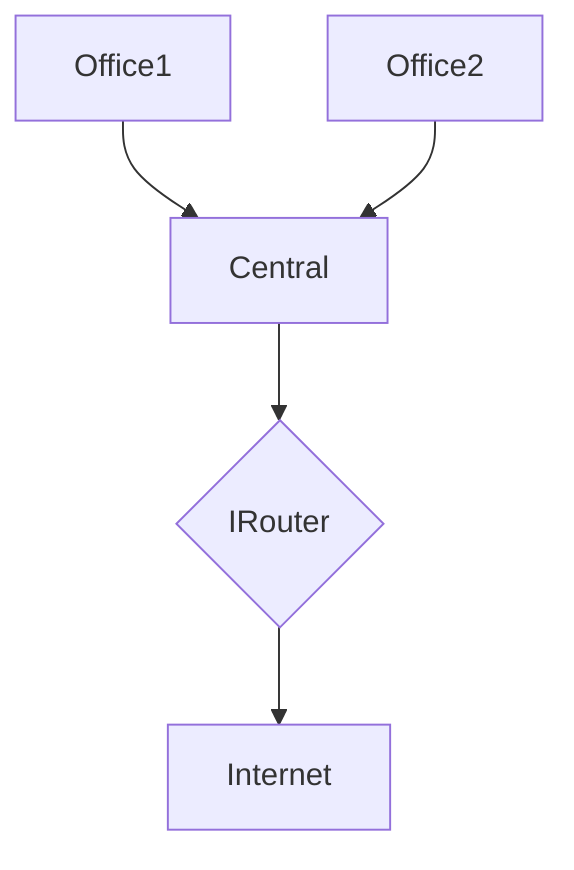
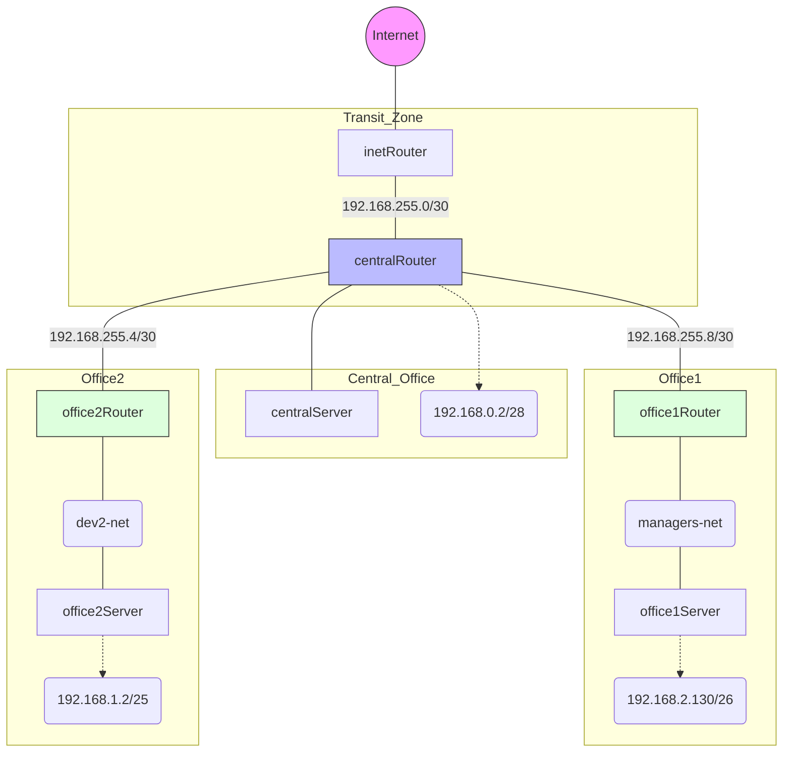

# Домашнее задание 19
## Разворачиваем сетевую лабораторию

### Цель:
- Научиться менять базовые сетевые настройки в Linux-based системах;

### Описание/Пошаговая инструкция выполнения домашнего задания:
- Для выполнения домашнего задания используйте методичку

  - Что нужно сделать?

**Дано** см. [GitHUB](https://github.com/erlong15/otus-linux/tree/network)
(ветка network)

[Vagrantfile](https://github.com/erlong15/otus-linux/blob/network/Vagrantfile) с начальным построением сети, где:
- inetRouter
  - centralRouter
  - centralServer
> Всё тестировалось на Virtualbox

### Планируемая архитектура
>**Нужно построить следующую архитектуру**

**Сеть office1:**
- 192.168.2.0/26 - dev
  - 192.168.2.64/26 - test servers
  - 192.168.2.128/26 - managers
  - 192.168.2.192/26 - office hardware

**Сеть office2:**
- 192.168.1.0/25 - dev
  - 192.168.1.128/26 - test servers
  - 192.168.1.192/26 - office hardware

**Сеть central:**
- 192.168.0.0/28 - directors
  - 192.168.0.32/28 - office hardware
  - 192.168.0.64/26 - wifi

**Это типа схема сети =):**



**Итого должны получится следующие сервера:**
- inetRouter
  - centralRouter
  - office1Router
  - office2Router
  - centralServer
  - office1Server
  - office2Server

**Теоретическая часть:**
- Найти свободные подсети
  - Посчитать сколько узлов в каждой подсети, включая свободные
  - Указать broadcast адрес для каждой подсети
  - Проверить нет ли ошибок при разбиении

**Практическая часть:**
- Соединить офисы в сеть согласно схеме и настроить роутинг
  - Все сервера и роутеры должны ходить в инет черз inetRouter
  - Все сервера должны видеть друг друга
  - У всех новых серверов отключить дефолт на нат (eth0), который вагрант поднимает для связи 
  при нехватке сетевых интервейсов добавить по несколько адресов на интерфейс

_P.S: Формат сдачи ДЗ - vagrant + ansible_

----
### Пошаговое выполнение задачи
**Вводные данные:**
- Все дальнейшие действия были проверены при использовании Vagrant 2.4.9
- VirtualBox: 7.0.20 r163906 
- В качестве ОС на хостах установлена Ubuntu 22.04
- Vagrant + Ansible запускается из WSL2 в Windows 11
### Расчет подсетей

| Сеть | Подсеть | Маска | Кол-во узлов | Первый адрес | Последний адрес | Broadcast |
| :--- | :--- | :--- | :---: | :--- | :--- | :--- |
| **Central** | directors | 192.168.0.0/28 | 14 | 192.168.0.1 | 192.168.0.14 | 192.168.0.15 |
| | office hardware | 192.168.0.32/28 | 14 | 192.168.0.33 | 192.168.0.46 | 192.168.0.47 |
| | wifi (mgt) | 192.168.0.64/26 | 62 | 192.168.0.65 | 192.168.0.126 | 192.168.0.127 |
| **Office1** | dev | 192.168.2.0/26 | 62 | 192.168.2.1 | 192.168.2.62 | 192.168.2.63 |
| | test servers | 192.168.2.64/26 | 62 | 192.168.2.65 | 192.168.2.126 | 192.168.2.127 |
| | managers | 192.168.2.128/26 | 62 | 192.168.2.129 | 192.168.2.190 | 192.168.2.191 |
| | office hardware | 192.168.2.192/26 | 62 | 192.168.2.193 | 192.168.2.254 | 192.168.2.255 |
| **Office2** | dev | 192.168.1.0/25 | 126 | 192.168.1.1 | 192.168.1.126 | 192.168.1.127 |
| | test servers | 192.168.1.128/26 | 62 | 192.168.1.129 | 192.168.1.190 | 192.168.1.191 |
| | office hardware | 192.168.1.192/26 | 62 | 192.168.1.193 | 192.168.1.254 | 192.168.1.255 |
| **Transit** | inet–central | 192.168.255.0/30 | 2 | 192.168.255.1 | 192.168.255.2 | 192.168.255.3 |
| | central–office1 | 192.168.255.8/30 | 2 | 192.168.255.9 | 192.168.255.10 | 192.168.255.11 |
| | central–office2 | 192.168.255.4/30 | 2 | 192.168.255.5 | 192.168.255.6 | 192.168.255.7 |

### Схема сети:

### Таблица интерфейсов и IP-адресов устройств


| Хост | Интерфейс | IP/маска | Назначение |
| :--- | :--- | :--- | :--- |
| **inetRouter** | enp0s3 | DHCP (NAT) | Выход в интернет (Vagrant NAT) |
| | enp0s8 | 192.168.255.1/30 | Транзит до centralRouter |
| | enp0s9 | 192.168.56.10/24 | Управление (Ansible MNGT) |
| **centralRouter** | enp0s3 | DHCP (NAT) | Служебный (Vagrant NAT) |
| | enp0s8 | 192.168.255.2/30 | Транзит до inetRouter |
| | enp0s9 | 192.168.0.1/28 | Сеть directors |
| | enp0s10 | 192.168.255.9/30 | Транзит к office1Router |
| | enp0s16 | 192.168.255.5/30 | Транзит к office2Router |
| | enp0s17 | 192.168.56.11/24 | Управление (Ansible MNGT) |
| **centralServer** | enp0s3 | DHCP (NAT) | Служебный (Vagrant NAT) |
| | enp0s8 | 192.168.0.2/28 | Сеть directors |
| | enp0s9 | 192.168.56.12/24 | Управление (Ansible MNGT) |
| **office1Router** | enp0s3 | DHCP (NAT) | Служебный (Vagrant NAT) |
| | enp0s8 | 192.168.255.10/30 | Транзит к centralRouter |
| | enp0s9 | 192.168.2.129/26 | Сеть managers (LAN) |
| | enp0s10 | 192.168.56.20/24 | Управление (Ansible MNGT) |
| **office1Server** | enp0s3 | DHCP (NAT) | Служебный (Vagrant NAT) |
| | enp0s8 | 192.168.2.130/26 | Сеть managers |
| | enp0s9 | 192.168.56.21/24 | Управление (Ansible MNGT) |
| **office2Router** | enp0s3 | DHCP (NAT) | Служебный (Vagrant NAT) |
| | enp0s8 | 192.168.255.6/30 | Транзит к centralRouter |
| | enp0s9 | 192.168.1.1/25 | Сеть dev (LAN) |
| | enp0s10 | 192.168.56.30/24 | Управление (Ansible MNGT) |
| **office2Server** | enp0s3 | DHCP (NAT) | Служебный (Vagrant NAT) |
| | enp0s8 | 192.168.1.2/25 | Сеть dev |
| | enp0s9 | 192.168.56.31/24 | Управление (Ansible MNGT) |

### Конфигурационные файлы
- [Vagrantfile](vagrant_network/Vagrantfile)
- [Ansible playbook](vagrant_network/ansible/playbook.yml)
- [Скрипт проверки](vagrant_network/check_net.sh)
### Установка
```shell
amyskin@otus-vagrant:/mnt/c/Vagrant/vagrant_network$ vagrant up
Bringing machine 'inetRouter' up with 'virtualbox' provider...
Bringing machine 'centralRouter' up with 'virtualbox' provider...
Bringing machine 'centralServer' up with 'virtualbox' provider...
Bringing machine 'office1Router' up with 'virtualbox' provider...
Bringing machine 'office1Server' up with 'virtualbox' provider...
Bringing machine 'office2Router' up with 'virtualbox' provider...
Bringing machine 'office2Server' up with 'virtualbox' provider...
==> inetRouter: You assigned a static IP ending in ".1" or ":1" to this machine.
==> inetRouter: This is very often used by the router and can cause the
==> inetRouter: network to not work properly. If the network doesn't work
==> inetRouter: properly, try changing this IP.
==> inetRouter: Importing base box 'ubuntu/22.04'...
==> inetRouter: Matching MAC address for NAT networking...
==> inetRouter: You assigned a static IP ending in ".1" or ":1" to this machine.
==> inetRouter: This is very often used by the router and can cause the
==> inetRouter: network to not work properly. If the network doesn't work
==> inetRouter: properly, try changing this IP.
==> inetRouter: Checking if box 'ubuntu/22.04' version '1.0.0' is up to date...
==> inetRouter: Setting the name of the VM: vagrant_network_inetRouter_1773166948456_76223
==> inetRouter: Clearing any previously set network interfaces...
==> inetRouter: Preparing network interfaces based on configuration...
    inetRouter: Adapter 1: nat
    inetRouter: Adapter 2: intnet
==> inetRouter: Forwarding ports...
    inetRouter: 22 (guest) => 2222 (host) (adapter 1)
    inetRouter: 22 (guest) => 2222 (host) (adapter 1)
==> inetRouter: Running 'pre-boot' VM customizations...
==> inetRouter: Booting VM...
==> inetRouter: Waiting for machine to boot. This may take a few minutes...
    inetRouter: SSH address: 127.0.0.1:2222
    inetRouter: SSH username: vagrant
    inetRouter: SSH auth method: private key
    inetRouter: Warning: Connection reset. Retrying...
    inetRouter:
    inetRouter: Vagrant insecure key detected. Vagrant will automatically replace
    inetRouter: this with a newly generated keypair for better security.
    inetRouter:
    inetRouter: Inserting generated public key within guest...
    inetRouter: Removing insecure key from the guest if it's present...
    inetRouter: Key inserted! Disconnecting and reconnecting using new SSH key...
==> inetRouter: Machine booted and ready!
==> inetRouter: Checking for guest additions in VM...
    inetRouter: The guest additions on this VM do not match the installed version of
    inetRouter: VirtualBox! In most cases this is fine, but in rare cases it can
    inetRouter: prevent things such as shared folders from working properly. If you see
    inetRouter: shared folder errors, please make sure the guest additions within the
    inetRouter: virtual machine match the version of VirtualBox you have installed on
    inetRouter: your host and reload your VM.
    inetRouter:
    inetRouter: Guest Additions Version: 6.0.0 r127566
    inetRouter: VirtualBox Version: 7.0
==> inetRouter: Setting hostname...
==> inetRouter: Configuring and enabling network interfaces...
==> inetRouter: Mounting shared folders...
    inetRouter: /mnt/c/Vagrant/vagrant_network => /vagrant
==> inetRouter: Running provisioner: shell...
    inetRouter: Running: inline script
    inetRouter: net.ipv4.ip_forward = 1

..... и т.д.
```
### Проверка работоспособности
> Проверка [скриптом](vagrant_network/check_net.sh)
```shell
amyskin@otus-vagrant:/mnt/c/Vagrant/vagrant_network$ vagrant status
Current machine states:

inetRouter                running (virtualbox)
centralRouter             running (virtualbox)
centralServer             running (virtualbox)
office1Router             running (virtualbox)
office1Server             running (virtualbox)
office2Router             running (virtualbox)
office2Server             running (virtualbox)

This environment represents multiple VMs. The VMs are all listed
above with their current state. For more information about a specific
VM, run `vagrant status NAME`.

amyskin@otus-vagrant:/mnt/c/Vagrant/vagrant_network$ vagrant ssh inetRouter -c "bash -s" < check_net.sh
=== Проверка сети: inetRouter ===
[FAIL] Шлюз не отвечает
[OK] CentralRouter доступен
[OK] Office 2 Server доступен
[OK] Интернет (8.8.8.8) есть
------------The END!!!------------------------
default via 10.0.2.2 dev enp0s3 proto dhcp src 10.0.2.15 metric 100

amyskin@otus-vagrant:/mnt/c/Vagrant/vagrant_network$ vagrant ssh centralRouter -c "bash -s" < check_net.sh
=== Проверка сети: centralRouter ===
[OK] Шлюз 192.168.255.1 отвечает
[OK] CentralRouter доступен
[OK] Office 2 Server доступен
[OK] Интернет (8.8.8.8) есть
------------The END!!!------------------------
default via 192.168.255.1 dev enp0s8
default via 10.0.2.2 dev enp0s3 proto dhcp src 10.0.2.15 metric 100

amyskin@otus-vagrant:/mnt/c/Vagrant/vagrant_network$ vagrant ssh centralServer -c "bash -s" < check_net.sh
=== Проверка сети: centralServer ===
[OK] Шлюз 192.168.0.1 отвечает
[OK] CentralRouter доступен
[OK] Office 2 Server доступен
[OK] Интернет (8.8.8.8) есть
------------The END!!!------------------------
default via 192.168.0.1 dev enp0s8
default via 10.0.2.2 dev enp0s3 proto dhcp src 10.0.2.15 metric 100

amyskin@otus-vagrant:/mnt/c/Vagrant/vagrant_network$ vagrant ssh office1Router -c "bash -s" < check_net.sh
=== Проверка сети: office1Router ===
[OK] Шлюз 192.168.255.9 отвечает
[OK] CentralRouter доступен
[OK] Office 2 Server доступен
[OK] Интернет (8.8.8.8) есть
------------The END!!!------------------------
default via 192.168.255.9 dev enp0s8
default via 10.0.2.2 dev enp0s3 proto dhcp src 10.0.2.15 metric 100

amyskin@otus-vagrant:/mnt/c/Vagrant/vagrant_network$ vagrant ssh office1Server -c "bash -s" < check_net.sh
=== Проверка сети: office1Server ===
[OK] Шлюз 192.168.2.129 отвечает
[OK] CentralRouter доступен
[OK] Office 2 Server доступен
[OK] Интернет (8.8.8.8) есть
------------The END!!!------------------------
default via 192.168.2.129 dev enp0s8
default via 10.0.2.2 dev enp0s3 proto dhcp src 10.0.2.15 metric 100

amyskin@otus-vagrant:/mnt/c/Vagrant/vagrant_network$ vagrant ssh office2Router -c "bash -s" < check_net.sh
=== Проверка сети: office2Router ===
[OK] Шлюз 192.168.255.5 отвечает
[OK] CentralRouter доступен
[OK] Office 2 Server доступен
[OK] Интернет (8.8.8.8) есть
------------The END!!!------------------------
default via 192.168.255.5 dev enp0s8
default via 10.0.2.2 dev enp0s3 proto dhcp src 10.0.2.15 metric 100

amyskin@otus-vagrant:/mnt/c/Vagrant/vagrant_network$ vagrant ssh office2Server -c "bash -s" < check_net.sh
=== Проверка сети: office2Server ===
[OK] Шлюз 192.168.1.1 отвечает
[OK] CentralRouter доступен
[OK] Office 2 Server доступен
[OK] Интернет (8.8.8.8) есть
------------The END!!!------------------------
default via 192.168.1.1 dev enp0s8
default via 10.0.2.2 dev enp0s3 proto dhcp src 10.0.2.15 metric 100
```
