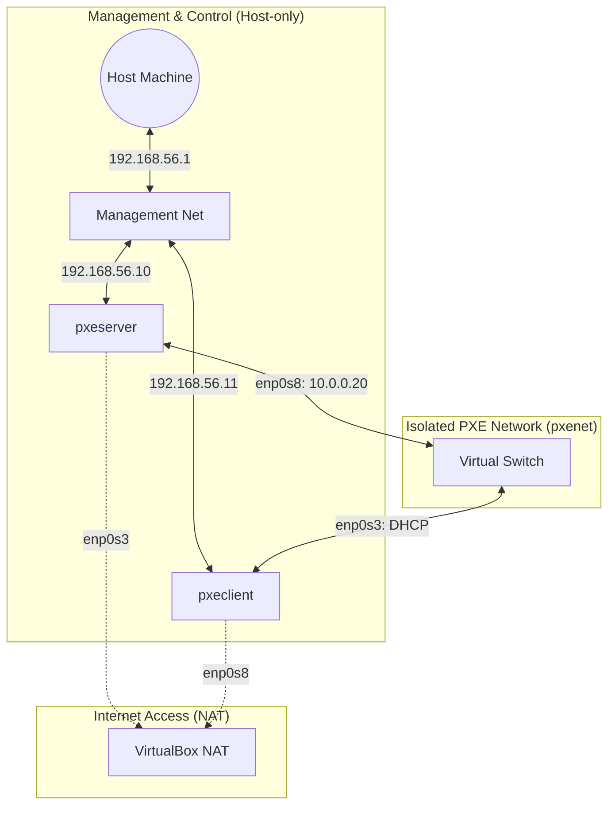
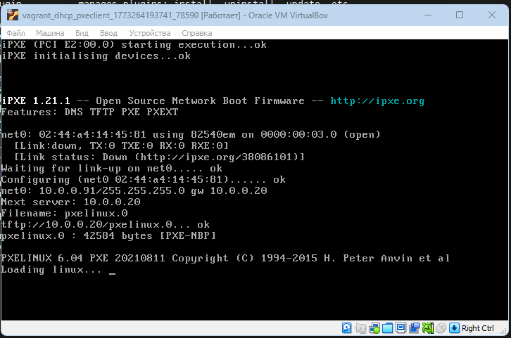
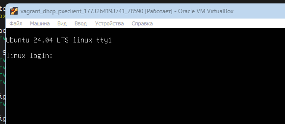

# Домашнее задание 20
## Настройка PXE сервера для автоматической установки

### Цель:
- Отработать навыки установки и настройки DHCP, TFTP, PXE загрузчика и автоматической загрузки


###  Описание/Пошаговая инструкция выполнения домашнего задания:
Для выполнения домашнего задания используйте [методичку](https://docs.google.com/document/d/1f5I8vbWAk8ah9IFpAQWN3dcWDHMqXzGb/edit?usp=share_link&ouid=104106368295333385634&rtpof=true&sd=true)


### Что нужно сделать?
- Настроить загрузку по сети дистрибутива Ubuntu 24
- Установка должна проходить из HTTP-репозитория.
- Настроить автоматическую установку c помощью файла user-data
**Задания со звёздочкой***
- Настроить автоматическую загрузку по сети дистрибутива Ubuntu 24 c использованием UEFI

_P.S. Задания со звёздочкой выполняются по желанию_

---
### Пошаговое выполнение задачи
**Вводные данные:**
- Все дальнейшие действия были проверены при использовании Vagrant 2.4.9
- VirtualBox: 7.0.20 r163906 
- В качестве ОС на хостах установлена Ubuntu 22.04
- Vagrant + Ansible запускается из WSL2 в Windows 11

** Таблица сетевых интерфейсов**

| Узел (VM)   | Интерфейс (ОС) | Тип (VirtualBox) | IP-адрес       | Назначение                           |
|:------------|:---------------|:-----------------|:---------------|:-------------------------------------|
| **pxeserver**| `enp0s3`       | NAT (Adapter 1)  | DHCP           | Выход в интернет / SSH (Port Forward)|
| -            | `enp0s8`       | Intnet (Adapter 2)| `10.0.0.20`    | PXE-сервер (внутренняя сеть `pxenet`)|
| -            | `enp0s9`       | Host-only (Adp 3)| `192.168.56.10`| Управление / Ansible                 |
| **pxeclient**| `enp0s3`       | Intnet (Adapter 1)| DHCP (10.0.0.x)| **PXE-загрузка** (через `pxenet`)    |
| -            | `enp0s8`       | NAT (Adapter 2)  | DHCP           | Резервный выход в интернет           |
| -            | `enp0s9`       | Host-only (Adp 3)| `192.168.56.11`| Управление / SSH напрямую            |


### Визуализация связей



### Конфигурационные файлы
- [Vagrantfile](Vagrantfile)
- [Ansible playbook](ansible/playbook.yml)

### Установка
````shell
amyskin@otus-vagrant:/mnt/c/Vagrant/vagrant_dhcp$ vagrant up
Bringing machine 'pxeserver' up with 'virtualbox' provider...
Bringing machine 'pxeclient' up with 'virtualbox' provider...
==> pxeserver: Checking if box 'ubuntu/22.04' version '1.0.0' is up to date...
==> pxeserver: Machine already provisioned. Run `vagrant provision` or use the `--provision`
==> pxeserver: flag to force provisioning. Provisioners marked to run always will still run.
==> pxeclient: Checking if box 'ubuntu/22.04' version '1.0.0' is up to date...
amyskin@otus-vagrant:/mnt/c/Vagrant/vagrant_dhcp$ vagrant up
Bringing machine 'pxeserver' up with 'virtualbox' provider...
Bringing machine 'pxeclient' up with 'virtualbox' provider...
==> pxeserver: Checking if box 'ubuntu/22.04' version '1.0.0' is up to date...
==> pxeserver: Machine already provisioned. Run `vagrant provision` or use the `--provision`
==> pxeserver: flag to force provisioning. Provisioners marked to run always will still run.
==> pxeclient: Checking if box 'ubuntu/22.04' version '1.0.0' is up to date...
==> pxeclient: Machine already provisioned. Run `vagrant provision` or use the `--provision`
==> pxeclient: flag to force provisioning. Provisioners marked to run always will still run.
amyskin@otus-vagrant:/mnt/c/Vagrant/vagrant_dhcp$ vagrant destroy -f
==> pxeclient: Forcing shutdown of VM...
==> pxeclient: Destroying VM and associated drives...
==> pxeserver: Forcing shutdown of VM...
==> pxeserver: Destroying VM and associated drives...
amyskin@otus-vagrant:/mnt/c/Vagrant/vagrant_dhcp$ vagrant up
Bringing machine 'pxeserver' up with 'virtualbox' provider...
Bringing machine 'pxeclient' up with 'virtualbox' provider...
==> pxeserver: Importing base box 'ubuntu/22.04'...
==> pxeserver: Matching MAC address for NAT networking...
==> pxeserver: Checking if box 'ubuntu/22.04' version '1.0.0' is up to date...
==> pxeserver: Setting the name of the VM: vagrant_dhcp_pxeserver_1773252368232_65324
==> pxeserver: Clearing any previously set network interfaces...
==> pxeserver: Preparing network interfaces based on configuration...
    pxeserver: Adapter 1: nat
    pxeserver: Adapter 2: intnet
    pxeserver: Adapter 3: hostonly
==> pxeserver: Forwarding ports...
    pxeserver: 80 (guest) => 8080 (host) (adapter 1)
    pxeserver: 22 (guest) => 2222 (host) (adapter 1)
    pxeserver: 22 (guest) => 2222 (host) (adapter 1)
==> pxeserver: Running 'pre-boot' VM customizations...
==> pxeserver: Booting VM...
==> pxeserver: Waiting for machine to boot. This may take a few minutes...
    pxeserver: SSH address: 127.0.0.1:2222
    pxeserver: SSH username: vagrant
    pxeserver: SSH auth method: private key
    pxeserver:
    pxeserver: Vagrant insecure key detected. Vagrant will automatically replace
    pxeserver: this with a newly generated keypair for better security.
    pxeserver:
    pxeserver: Inserting generated public key within guest...
    pxeserver: Removing insecure key from the guest if it's present...
    pxeserver: Key inserted! Disconnecting and reconnecting using new SSH key...
==> pxeserver: Machine booted and ready!
==> pxeserver: Checking for guest additions in VM...
    pxeserver: The guest additions on this VM do not match the installed version of
    pxeserver: VirtualBox! In most cases this is fine, but in rare cases it can
    pxeserver: prevent things such as shared folders from working properly. If you see
    pxeserver: shared folder errors, please make sure the guest additions within the
    pxeserver: virtual machine match the version of VirtualBox you have installed on
    pxeserver: your host and reload your VM.
    pxeserver:
    pxeserver: Guest Additions Version: 6.0.0 r127566
    pxeserver: VirtualBox Version: 7.0
==> pxeserver: Setting hostname...
==> pxeserver: Configuring and enabling network interfaces...
==> pxeserver: Mounting shared folders...
    pxeserver: /mnt/c/Vagrant/vagrant_dhcp => /vagrant
==> pxeserver: Running provisioner: ansible...
.... и т.д.

````
### Проверка
> Какие конфигурационные файлы на сервере "pxeserver"
```shell
amyskin@otus-vagrant:/mnt/c/Vagrant/vagrant_dhcp$ vagrant ssh pxeserver
Welcome to Ubuntu 22.04.2 LTS (GNU/Linux 5.15.0-71-generic x86_64)

 * Documentation:  https://help.ubuntu.com
 * Management:     https://landscape.canonical.com
 * Support:        https://ubuntu.com/advantage

  System information as of Wed Mar 11 21:28:50 UTC 2026

  System load:  0.08837890625      Users logged in:         0
  Usage of /:   11.5% of 38.70GB   IPv4 address for enp0s3: 10.0.2.15
  Memory usage: 25%                IPv4 address for enp0s8: 10.0.0.20
  Swap usage:   0%                 IPv4 address for enp0s9: 192.168.56.10
  Processes:    106


Expanded Security Maintenance for Applications is not enabled.

280 updates can be applied immediately.
193 of these updates are standard security updates.
To see these additional updates run: apt list --upgradable

Enable ESM Apps to receive additional future security updates.
See https://ubuntu.com/esm or run: sudo pro status

New release '24.04.4 LTS' available.
Run 'do-release-upgrade' to upgrade to it.


Last login: Wed Mar 11 21:21:17 2026 from 10.0.2.2

```
> Конфиг apache
```shell
vagrant@pxeserver:~$ cat /etc/apache2/sites-available/ks-server.conf
<VirtualHost 10.0.0.20:80>
    DocumentRoot /
    <Directory /srv/ks>
        Options Indexes MultiViews
        AllowOverride All
        Require all granted
    </Directory>
    <Directory /srv/images>
        Options Indexes MultiViews
        AllowOverride All
        Require all granted
    </Directory>
</VirtualHost>

```
>Конфиг tftp
```shell
vagrant@pxeserver:~$ cat /etc/dnsmasq.conf
port=0
interface=enp0s8
bind-dynamic
dhcp-range=10.0.0.50,10.0.0.100,255.255.255.0,24h
dhcp-option=3,10.0.0.20
dhcp-option=6,8.8.8.8
dhcp-boot=pxelinux.0
enable-tftp
tftp-root=/var/lib/tftpboot

vagrant@pxeserver:~$ cat /var/lib/misc/dnsmasq.leases
1773350752 02:44:a4:14:45:81 10.0.0.93 ubuntu-server ff:e2:34:3f:3e:00:02:00:00:ab:11:69:d6:9e:a2:c4:5c:cf:4c
1773350678 02:44:a4:14:45:81 10.0.0.92 * ff:a4:14:45:81:00:03:00:01:02:44:a4:14:45:81
1773350732 02:44:a4:14:45:81 10.0.0.91 * 01:02:44:a4:14:45:81
```
```shell
vagrant@pxeserver:~$ cat /var/lib/tftpboot/pxelinux.cfg/default
DEFAULT install
LABEL install
  KERNEL linux
  INITRD initrd
  APPEND root=/dev/ram0 ramdisk_size=3000000 ip=dhcp iso-url=http://10.0.0.20/srv/images/noble-live-server-amd64.iso autoinstall ds=nocloud-net;s=http://10.0.0.20/srv/ks/
```
> Проверка файла автоустановки
```shell
vagrant@pxeserver:~$ cat /srv/ks/user-data
#cloud-config
autoinstall:
  version: 1
  apt:
    disable_components: []
    geoip: true
    preserve_sources_list: false
    primary:
      - arches: [amd64, i386]
        uri: http://us.archive.ubuntu.com/ubuntu
      - arches: [default]
        uri: http://ports.ubuntu.com/ubuntu-ports
  drivers:
    install: false
  identity:
    hostname: linux
    password: "$6$sJgo6Hg5zXBwkkI8$btrEoWAb5FxKhajagWR49XM4EAOfO/Dr5bMrLOkGe3KkMYdsh7T3MU5mYwY2TIMJpVKckAwnZFs2ltUJ1abOZ."
    realname: otus
    username: otus
  kernel:
    package: linux-generic
  keyboard:
    layout: us
    toggle: null
    variant: ''
  locale: en_US.UTF-8
  network:
    ethernets:
      enp0s3:
        dhcp4: true
      enp0s8:
        dhcp4: true
    version: 2
  ssh:
    allow-pw: true
    authorized-keys: []
    install-server: true
  updates: security
  version: 1
```
> Конфиг Apache2

```shell
vagrant@pxeserver:~$ cat /etc/apache2/sites-available/ks-server.conf
<VirtualHost 10.0.0.20:80>
    DocumentRoot /
    <Directory /srv/ks>
        Options Indexes MultiViews
        AllowOverride All
        Require all granted
    </Directory>
    <Directory /srv/images>
        Options Indexes MultiViews
        AllowOverride All
        Require all granted
    </Directory>
</VirtualHost>

vagrant@pxeserver:~$ cat /var/lib/tftpboot/pxelinux.cfg/default
DEFAULT install
LABEL install
  KERNEL linux
  INITRD initrd
  APPEND root=/dev/ram0 ramdisk_size=3000000 ip=dhcp iso-url=http://10.0.0.20/srv/images/noble-live-server-amd64.iso autoinstall ds=nocloud-net;s=http://10.0.0.20/srv/ks/
```
> Запуск pxeclient

 



