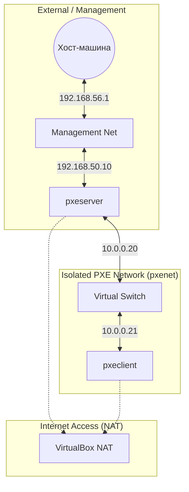

# Домашнее задание 20
## Настройка PXE сервера для автоматической установки

### Цель:
- Отработать навыки установки и настройки DHCP, TFTP, PXE загрузчика и автоматической загрузки


###  Описание/Пошаговая инструкция выполнения домашнего задания:
Для выполнения домашнего задания используйте [методичку](https://docs.google.com/document/d/1f5I8vbWAk8ah9IFpAQWN3dcWDHMqXzGb/edit?usp=share_link&ouid=104106368295333385634&rtpof=true&sd=true)


### Что нужно сделать?
- Настроить загрузку по сети дистрибутива Ubuntu 24
- Установка должна проходить из HTTP-репозитория.
- Настроить автоматическую установку c помощью файла user-data
**Задания со звёздочкой***
- Настроить автоматическую загрузку по сети дистрибутива Ubuntu 24 c использованием UEFI

_P.S. Задания со звёздочкой выполняются по желанию_

---
### Пошаговое выполнение задачи
**Вводные данные:**
- Все дальнейшие действия были проверены при использовании Vagrant 2.4.9
- VirtualBox: 7.0.20 r163906 
- В качестве ОС на хостах установлена Ubuntu 22.04
- Vagrant + Ansible запускается из WSL2 в Windows 11

### Визуализация связей


| Узел (VM) | Интерфейс      | IP-адрес      | Назначение                          |
|-----------|----------------|---------------|-------------------------------------|
| pxeserver | eth0 (NAT)     | DHCP          | Выход в интернет / SSH              |
| -         | eth1 (Intnet)  | 10.0.0.20     | PXE-сервер (внутренняя pxenet)      |
| -         | eth2 (Host-only)| 192.168.56.10 | Управление / Ansible                 |
| pxeclient | eth0 (Intnet)  | 10.0.0.21     | Загрузка по сети (pxenet)           |
| -         | eth1 (NAT)     | DHCP          | Резервный выход в интернет           |


### Конфигурационные файлы
- [Vagrantfile](Vagrantfile)
- [Ansible playbook](ansible/playbook.yml)

### Установка
````shell


````
### Проверка
> Какие конфигурационные файлы на сервере "pxeserver"
```shell
amyskin@otus-vagrant:/mnt/c/Vagrant/vagrant_dhcp$ vagrant ssh pxeserver
Welcome to Ubuntu 22.04.2 LTS (GNU/Linux 5.15.0-71-generic x86_64)

 * Documentation:  https://help.ubuntu.com
 * Management:     https://landscape.canonical.com
 * Support:        https://ubuntu.com/advantage

  System information as of Wed Mar 11 10:10:33 UTC 2026

  System load:  0.0                Users logged in:         0
  Usage of /:   11.5% of 38.70GB   IPv4 address for enp0s3: 10.0.2.15
  Memory usage: 21%                IPv4 address for enp0s8: 10.0.0.20
  Swap usage:   0%                 IPv4 address for enp0s9: 192.168.56.10
  Processes:    106


Expanded Security Maintenance for Applications is not enabled.
```
> Конфиг apache
```shell
vagrant@pxeserver:~$ cat /etc/apache2/sites-available/ks-server.conf
<VirtualHost 10.0.0.20:80>
    DocumentRoot /
    <Directory /srv/ks>
        Options Indexes MultiViews
        AllowOverride All
        Require all granted
    </Directory>
    <Directory /srv/images>
        Options Indexes MultiViews
        AllowOverride All
        Require all granted
    </Directory>
</VirtualHost>

```
>Конфиг tftp
```shell
vagrant@pxeserver:~$ cat /etc/dnsmasq.conf
port=0
interface=eth1
bind-dynamic
dhcp-range=10.0.0.50,10.0.0.100,255.255.255.0,1h
dhcp-boot=pxelinux.0
enable-tftp
tftp-root=/var/lib/tftpboot

vagrant@pxeserver:~$ ls -la /var/lib/tftpboot/
total 82084
drwxr-xr-x  3 root root     4096 Mar 11 09:37 .
drwxr-xr-x 38 root root     4096 Mar 11 09:34 ..
-rw-r--r--  1 root root 68889068 Apr 23  2024 initrd
-rw-r--r--  1 root root   119284 Aug 11  2021 ldlinux.c32
-rw-r--r--  1 root root    23768 Aug 11  2021 libutil.c32
-rw-r--r--  1 root root 14928264 Apr 23  2024 linux
-rw-r--r--  1 root root    26148 Aug 11  2021 menu.c32
-rw-r--r--  1 root root    42584 Aug 11  2021 pxelinux.0
drwxr-xr-x  2 root root     4096 Mar 11 09:37 pxelinux.cfg
```
```shell
vagrant@pxeserver:~$ cat /var/lib/tftpboot/pxelinux.cfg/default
DEFAULT install
LABEL install
  KERNEL linux
  INITRD initrd
  APPEND root=/dev/ram0 ramdisk_size=3000000 ip=dhcp iso-url=http://10.0.0.20/srv/images/noble-live-server-amd64.iso autoinstall ds=nocloud-net;s=http://10.0.0.20/srv/ks/
```
```shell
vagrant@pxeserver:~$ ls -l /srv/ks/
total 4
-rw-r--r-- 1 root root   0 Mar 11 09:53 meta-data
-rw-r--r-- 1 root root 628 Mar 11 09:37 user-data

```
> Проверка файла автоустановки
```shell
vagrant@pxeserver:~$ cat /srv/ks/user-data
#cloud-config
autoinstall:
  version: 1
  apt:
    disable_components: []
    geoip: true
    preserve_sources_list: false
    primary:
      - arches: [amd64, i386]
        uri: http://us.archive.ubuntu.com/ubuntu
      - arches: [default]
        uri: http://ports.ubuntu.com/ubuntu-ports
  drivers:
    install: false
  identity:
    hostname: linux
    password: "$6$sJgo6Hg5zXBwkkI8$btrEoWAb5FxKhajagWR49XM4EAOfO/Dr5bMrLOkGe3KkMYdsh7T3MU5mYwY2TIMJpVKckAwnZFs2ltUJ1abOZ."
    realname: otus
    username: otus
  kernel:
    package: linux-generic
  keyboard:
    layout: us
    toggle: null
    variant: ''
  locale: en_US.UTF-8
  network:
    ethernets:
      enp0s3:
        dhcp4: true
      enp0s8:
        dhcp4: true
    version: 2
  ssh:
    allow-pw: true
    authorized-keys: []
    install-server: true
  updates: security
  version: 1

vagrant@pxeserver:~$ cat /etc/apache2/sites-available/ks-server.conf
<VirtualHost 10.0.0.20:80>
    DocumentRoot /
    <Directory /srv/ks>
        Options Indexes MultiViews
        AllowOverride All
        Require all granted
    </Directory>
    <Directory /srv/images>
        Options Indexes MultiViews
        AllowOverride All
        Require all granted
    </Directory>
</VirtualHost>

vagrant@pxeserver:~$ cat /var/lib/tftpboot/pxelinux.cfg/default
DEFAULT install
LABEL install
  KERNEL linux
  INITRD initrd
  APPEND root=/dev/ram0 ramdisk_size=3000000 ip=dhcp iso-url=http://10.0.0.20/srv/images/noble-live-server-amd64.iso autoinstall ds=nocloud-net;s=http://10.0.0.20/srv/ks/
```
