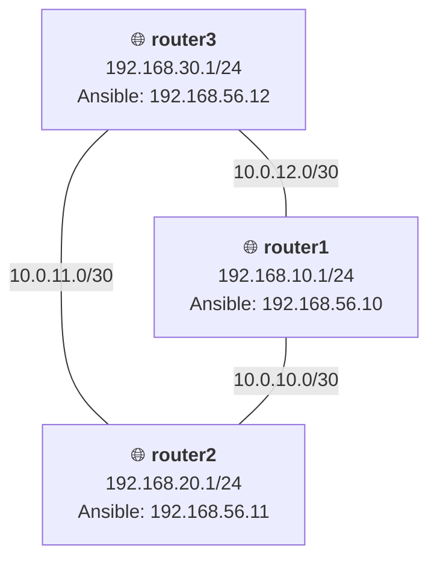

# Домашнее задание 22
## OSPF

### Цель:
 - Создать домашнюю сетевую лабораторию;
 - Научится настраивать протокол OSPF в Linux-based системах.

### Описание/Пошаговая инструкция выполнения домашнего задания:
Для выполнения домашнего задания используйте [методичку](https://docs.google.com/document/d/1c3p-2PQl-73G8uKJaqmyCaw_CtRQipAt/edit)
#### Что нужно сделать?
- Поднять три виртуалки
- Объединить их разными vlan
- Поднять OSPF между машинами на базе Quagga;
- Изобразить ассиметричный роутинг;
- Сделать один из линков "дорогим", но что бы при этом роутинг был симметричным.

_P.S. Формат сдачи: Vagrantfile + ansible_

---
### Пошаговое выполнение задачи
**Вводные данные:**
- Все дальнейшие действия были проверены при использовании Vagrant 2.4.9
- VirtualBox: 7.0.20 r163906 
- В качестве ОС на хостах установлена Ubuntu 22.04
- Vagrant + Ansible запускается из WSL2 в Windows 11

### Схема сети

### Таблица всех сетевых интерфейсов

> Таблица со всеми интерфейсами, включая L3-линки между роутерами и Management-сеть для Ansible

| Устройство | Интерфейс | IP-адрес         | Назначение |
|---|---|------------------|---|
| router1 | eth0 (mgmt) | 192.168.56.10/24 | Ansible Management |
| | eth1 (lan) | 192.168.10.1/24  | Локальная сеть (net1) |
| | eth2 (wan) | 10.0.10.1/30     | Линк к router2 |
| | eth3 (wan) | 10.0.12.2/30     | Линк к router3 |
| router2 | eth0 (mgmt) | 192.168.56.11/24 | Ansible Management |
| | eth1 (lan) | 192.168.20.1/24  | Локальная сеть (net2) |
| | eth2 (wan) | 10.0.10.2/30     | Линк к router1 |
| | eth3 (wan) | 10.0.11.2/30     | Линк к router3 |
| router3 | eth0 (mgmt) | 192.168.56.12/24 | Ansible Management |
| | eth1 (lan) | 192.168.30.1/24  | Локальная сеть (net3) |
| | eth2 (wan) | 10.0.11.1/30     | Линк к router2 |
| | eth3 (wan) | 10.0.12.1/30     | Линк к router1 |

### Конфигурационные файлы
- [Vagrantfile]()
- [Ansible playbook]()

