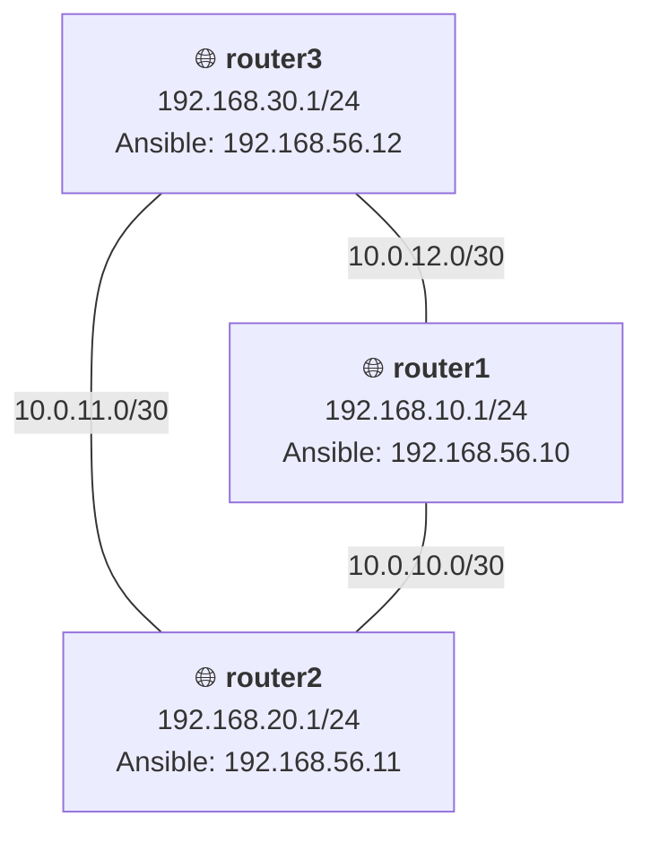
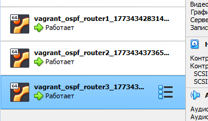

# Домашнее задание 22
## OSPF

### Цель:
 - Создать домашнюю сетевую лабораторию;
 - Научится настраивать протокол OSPF в Linux-based системах.

### Описание/Пошаговая инструкция выполнения домашнего задания:
Для выполнения домашнего задания используйте [методичку](https://docs.google.com/document/d/1c3p-2PQl-73G8uKJaqmyCaw_CtRQipAt/edit)
#### Что нужно сделать?
- Поднять три виртуалки
- Объединить их разными vlan
- Поднять OSPF между машинами на базе Quagga;
- Изобразить ассиметричный роутинг;
- Сделать один из линков "дорогим", но что бы при этом роутинг был симметричным.

_P.S. Формат сдачи: Vagrantfile + ansible_

---
### Пошаговое выполнение задачи
**Вводные данные:**
- Все дальнейшие действия были проверены при использовании Vagrant 2.4.9
- VirtualBox: 7.0.20 r163906 
- В качестве ОС на хостах установлена Ubuntu 22.04
- Vagrant + Ansible запускается из WSL2 в Windows 11

### Схема сети


### Таблица всех сетевых интерфейсов

> Таблица со всеми интерфейсами, включая L3-линки между роутерами и Management-сеть для Ansible

| Устройство | Интерфейс | IP-адрес         | Назначение |
|---|---|------------------|---|
| router1 | eth0 (mgmt) | 192.168.56.10/24 | Ansible Management |
| | eth1 (lan) | 192.168.10.1/24  | Локальная сеть (net1) |
| | eth2 (wan) | 10.0.10.1/30     | Линк к router2 |
| | eth3 (wan) | 10.0.12.2/30     | Линк к router3 |
| router2 | eth0 (mgmt) | 192.168.56.11/24 | Ansible Management |
| | eth1 (lan) | 192.168.20.1/24  | Локальная сеть (net2) |
| | eth2 (wan) | 10.0.10.2/30     | Линк к router1 |
| | eth3 (wan) | 10.0.11.2/30     | Линк к router3 |
| router3 | eth0 (mgmt) | 192.168.56.12/24 | Ansible Management |
| | eth1 (lan) | 192.168.30.1/24  | Локальная сеть (net3) |
| | eth2 (wan) | 10.0.11.1/30     | Линк к router2 |
| | eth3 (wan) | 10.0.12.1/30     | Линк к router1 |


### Конфигурационные файлы
> Vagrantfile изменить из-за другой версии vagrant.
- [Vagrantfile](vagrant_ospf/Vagrantfile)

> С помощью ansible реализовал полную установку по [методички](https://docs.google.com/document/d/1c3p-2PQl-73G8uKJaqmyCaw_CtRQipAt/edit). 
Управление типами роутинга, управляется через [переменную](vagrant_ospf/ansible/defaults/main.yml) "symmetric_routing".
- [Ansible playbook](vagrant_ospf/ansible/provision.yml)

### Установка
```shell
amyskin@otus-vagrant:/mnt/c/Vagrant/vagrant_ospf$ vagrant up
Bringing machine 'router1' up with 'virtualbox' provider...
Bringing machine 'router2' up with 'virtualbox' provider...
Bringing machine 'router3' up with 'virtualbox' provider...
==> router1: You assigned a static IP ending in ".1" or ":1" to this machine.
==> router1: This is very often used by the router and can cause the
==> router1: network to not work properly. If the network doesn't work
==> router1: properly, try changing this IP.
==> router1: You assigned a static IP ending in ".1" or ":1" to this machine.
==> router1: This is very often used by the router and can cause the
==> router1: network to not work properly. If the network doesn't work
==> router1: properly, try changing this IP.
==> router1: Importing base box 'ubuntu/22.04'...
==> router1: Matching MAC address for NAT networking...
==> router1: You assigned a static IP ending in ".1" or ":1" to this machine.
==> router1: This is very often used by the router and can cause the
==> router1: network to not work properly. If the network doesn't work
==> router1: properly, try changing this IP.
==> router1: You assigned a static IP ending in ".1" or ":1" to this machine.
==> router1: This is very often used by the router and can cause the
==> router1: network to not work properly. If the network doesn't work
==> router1: properly, try changing this IP.
==> router1: Checking if box 'ubuntu/22.04' version '1.0.0' is up to date...
==> router1: Setting the name of the VM: vagrant_ospf_router1_1773434283146_83243
==> router1: Clearing any previously set network interfaces...
==> router1: Preparing network interfaces based on configuration...
    router1: Adapter 1: nat
    router1: Adapter 2: hostonly
    router1: Adapter 3: intnet
    router1: Adapter 4: intnet
    router1: Adapter 5: intnet
==> router1: Forwarding ports...
    router1: 22 (guest) => 2222 (host) (adapter 1)
    router1: 22 (guest) => 2222 (host) (adapter 1)
==> router1: Running 'pre-boot' VM customizations...
==> router1: Booting VM...
==> router1: Waiting for machine to boot. This may take a few minutes...
    router1: SSH address: 127.0.0.1:2222
    router1: SSH username: vagrant
    router1: SSH auth method: private key
    router1: Warning: Connection reset. Retrying...
    router1:
    router1: Vagrant insecure key detected. Vagrant will automatically replace
    router1: this with a newly generated keypair for better security.
    router1:
    router1: Inserting generated public key within guest...
    router1: Removing insecure key from the guest if it's present...
    router1: Key inserted! Disconnecting and reconnecting using new SSH key...
==> router1: Machine booted and ready!
==> router1: Checking for guest additions in VM...
    router1: The guest additions on this VM do not match the installed version of
    router1: VirtualBox! In most cases this is fine, but in rare cases it can
    router1: prevent things such as shared folders from working properly. If you see
    router1: shared folder errors, please make sure the guest additions within the
    router1: virtual machine match the version of VirtualBox you have installed on
    router1: your host and reload your VM.
    router1:
    router1: Guest Additions Version: 6.0.0 r127566
    router1: VirtualBox Version: 7.0
==> router1: Setting hostname...
==> router1: Configuring and enabling network interfaces...
==> router1: Mounting shared folders...
    router1: /mnt/c/Vagrant/vagrant_ospf => /vagrant
==> router1: Running provisioner: shell...
    router1: Running: inline script
    router1: net.ipv4.ip_forward = 1
    router1: Hit:1 http://archive.ubuntu.com/ubuntu jammy InRelease
    router1: Get:2 http://archive.ubuntu.com/ubuntu jammy-updates InRelease [128 kB]
    router1: Get:3 http://security.ubuntu.com/ubuntu jammy-security InRelease [129 kB]
    router1: Get:4 http://archive.ubuntu.com/ubuntu jammy-backports InRelease [127 kB]
    router1: Get:5 http://archive.ubuntu.com/ubuntu jammy/universe amd64 Packages [14.1 MB]
    router1: Get:6 http://security.ubuntu.com/ubuntu jammy-security/main amd64 Packages [3023 kB]
    router1: Get:7 http://security.ubuntu.com/ubuntu jammy-security/main Translation-en [431 kB]
    router1: Get:8 http://security.ubuntu.com/ubuntu jammy-security/main amd64 c-n-f Metadata [14.1 kB]
    router1: Get:9 http://security.ubuntu.com/ubuntu jammy-security/restricted amd64 Packages [5251 kB]
    router1: Get:10 http://security.ubuntu.com/ubuntu jammy-security/restricted Translation-en [1000 kB]
    router1: Get:11 http://security.ubuntu.com/ubuntu jammy-security/restricted amd64 c-n-f Metadata [680 B]
    router1: Get:12 http://security.ubuntu.com/ubuntu jammy-security/universe amd64 Packages [1019 kB]
    router1: Get:13 http://archive.ubuntu.com/ubuntu jammy/universe Translation-en [5652 kB]
    router1: Get:14 http://security.ubuntu.com/ubuntu jammy-security/universe Translation-en [225 kB]
    router1: Get:15 http://security.ubuntu.com/ubuntu jammy-security/universe amd64 c-n-f Metadata [22.7 kB]
    router1: Get:16 http://security.ubuntu.com/ubuntu jammy-security/multiverse amd64 Packages [51.9 kB]
    router1: Get:17 http://security.ubuntu.com/ubuntu jammy-security/multiverse Translation-en [10.6 kB]
    router1: Get:18 http://security.ubuntu.com/ubuntu jammy-security/multiverse amd64 c-n-f Metadata [388 B]
    router1: Get:19 http://archive.ubuntu.com/ubuntu jammy/universe amd64 c-n-f Metadata [286 kB]
    router1: Get:20 http://archive.ubuntu.com/ubuntu jammy/multiverse amd64 Packages [217 kB]
    router1: Get:21 http://archive.ubuntu.com/ubuntu jammy/multiverse Translation-en [112 kB]
    router1: Get:22 http://archive.ubuntu.com/ubuntu jammy/multiverse amd64 c-n-f Metadata [8372 B]
    router1: Get:23 http://archive.ubuntu.com/ubuntu jammy-updates/main amd64 Packages [3291 kB]
    router1: Get:24 http://archive.ubuntu.com/ubuntu jammy-updates/main Translation-en [500 kB]
    router1: Get:25 http://archive.ubuntu.com/ubuntu jammy-updates/main amd64 c-n-f Metadata [19.2 kB]
    router1: Get:26 http://archive.ubuntu.com/ubuntu jammy-updates/restricted amd64 Packages [5428 kB]
    router1: Get:27 http://archive.ubuntu.com/ubuntu jammy-updates/restricted Translation-en [1035 kB]
    router1: Get:28 http://archive.ubuntu.com/ubuntu jammy-updates/restricted amd64 c-n-f Metadata [676 B]
    router1: Get:29 http://archive.ubuntu.com/ubuntu jammy-updates/universe amd64 Packages [1257 kB]
    router1: Get:30 http://archive.ubuntu.com/ubuntu jammy-updates/universe Translation-en [315 kB]
    router1: Get:31 http://archive.ubuntu.com/ubuntu jammy-updates/universe amd64 c-n-f Metadata [30.4 kB]
    router1: Get:32 http://archive.ubuntu.com/ubuntu jammy-updates/multiverse amd64 Packages [59.0 kB]
    router1: Get:33 http://archive.ubuntu.com/ubuntu jammy-updates/multiverse Translation-en [13.5 kB]
    router1: Get:34 http://archive.ubuntu.com/ubuntu jammy-updates/multiverse amd64 c-n-f Metadata [612 B]
    router1: Get:35 http://archive.ubuntu.com/ubuntu jammy-backports/main amd64 Packages [94.6 kB]
    router1: Get:36 http://archive.ubuntu.com/ubuntu jammy-backports/main Translation-en [11.5 kB]
    router1: Get:37 http://archive.ubuntu.com/ubuntu jammy-backports/main amd64 c-n-f Metadata [412 B]
    router1: Get:38 http://archive.ubuntu.com/ubuntu jammy-backports/restricted amd64 c-n-f Metadata [116 B]
    router1: Get:39 http://archive.ubuntu.com/ubuntu jammy-backports/universe amd64 Packages [33.1 kB]
    router1: Get:40 http://archive.ubuntu.com/ubuntu jammy-backports/universe Translation-en [16.9 kB]
    router1: Get:41 http://archive.ubuntu.com/ubuntu jammy-backports/universe amd64 c-n-f Metadata [672 B]
    router1: Get:42 http://archive.ubuntu.com/ubuntu jammy-backports/multiverse amd64 c-n-f Metadata [116 B]
    router1: Fetched 43.9 MB in 10s (4344 kB/s)
    router1: Reading package lists...
    router1: Reading package lists...
    router1: Building dependency tree...
    router1: Reading state information...
    router1: The following NEW packages will be installed:
    router1:   traceroute
    router1: 0 upgraded, 1 newly installed, 0 to remove and 275 not upgraded.
    router1: Need to get 45.4 kB of archives.
    router1: After this operation, 152 kB of additional disk space will be used.
    router1: Get:1 http://archive.ubuntu.com/ubuntu jammy/universe amd64 traceroute amd64 1:2.1.0-2 [45.4 kB]
... и т.д.
```


### Проверка
> Посмотрим что на Router1
```shell
vagrant@router1:~$ ip a
1: lo: <LOOPBACK,UP,LOWER_UP> mtu 65536 qdisc noqueue state UNKNOWN group default qlen 1000
    link/loopback 00:00:00:00:00:00 brd 00:00:00:00:00:00
    inet 127.0.0.1/8 scope host lo
       valid_lft forever preferred_lft forever
    inet6 ::1/128 scope host
       valid_lft forever preferred_lft forever
2: enp0s3: <BROADCAST,MULTICAST,UP,LOWER_UP> mtu 1500 qdisc fq_codel state UP group default qlen 1000
    link/ether 02:44:a4:14:45:81 brd ff:ff:ff:ff:ff:ff
    inet 10.0.2.15/24 metric 100 brd 10.0.2.255 scope global dynamic enp0s3
       valid_lft 83326sec preferred_lft 83326sec
    inet6 fe80::44:a4ff:fe14:4581/64 scope link
       valid_lft forever preferred_lft forever
3: enp0s8: <BROADCAST,MULTICAST,UP,LOWER_UP> mtu 1500 qdisc fq_codel state UP group default qlen 1000
    link/ether 08:00:27:c1:51:ba brd ff:ff:ff:ff:ff:ff
    inet 192.168.56.10/24 brd 192.168.56.255 scope global enp0s8
       valid_lft forever preferred_lft forever
    inet6 fe80::a00:27ff:fec1:51ba/64 scope link
       valid_lft forever preferred_lft forever
4: enp0s9: <BROADCAST,MULTICAST,UP,LOWER_UP> mtu 1500 qdisc fq_codel state UP group default qlen 1000
    link/ether 08:00:27:bc:c1:f9 brd ff:ff:ff:ff:ff:ff
    inet 192.168.10.1/24 brd 192.168.10.255 scope global enp0s9
       valid_lft forever preferred_lft forever
    inet6 fe80::a00:27ff:febc:c1f9/64 scope link
       valid_lft forever preferred_lft forever
5: enp0s10: <BROADCAST,MULTICAST,UP,LOWER_UP> mtu 1500 qdisc fq_codel state UP group default qlen 1000
    link/ether 08:00:27:2f:65:3b brd ff:ff:ff:ff:ff:ff
    inet 10.0.10.1/30 brd 10.0.10.3 scope global enp0s10
       valid_lft forever preferred_lft forever
    inet6 fe80::a00:27ff:fe2f:653b/64 scope link
       valid_lft forever preferred_lft forever
6: enp0s16: <BROADCAST,MULTICAST,UP,LOWER_UP> mtu 1500 qdisc fq_codel state UP group default qlen 1000
    link/ether 08:00:27:c4:2e:8d brd ff:ff:ff:ff:ff:ff
    inet 10.0.12.2/30 brd 10.0.12.3 scope global enp0s16
       valid_lft forever preferred_lft forever
    inet6 fe80::a00:27ff:fec4:2e8d/64 scope link
       valid_lft forever preferred_lft forever
7: pimreg@NONE: <NOARP,UP,LOWER_UP> mtu 1472 qdisc noqueue state UNKNOWN group default qlen 1000
    link/pimreg


vagrant@router1:~$ sudo cd /etc/frr/
sudo: cd: command not found
sudo: "cd" is a shell built-in command, it cannot be run directly.
sudo: the -s option may be used to run a privileged shell.
sudo: the -D option may be used to run a command in a specific directory.
vagrant@router1:~$ sudo -i
root@router1:~# cd /etc/frr/
root@router1:/etc/frr# ls
daemons  frr.conf  support_bundle_commands.conf  vtysh.conf


root@router1:/etc/frr# cat ./daemons
zebra=yes
ospfd=yes
bgpd=no
ospf6d=no
ripd=no
ripngd=no
isisd=no
pimd=no
ldpd=no
nhrpd=no
eigrpd=no
babeld=no
sharpd=no
pbrd=no
bfdd=no
fabricd=no
vrrpd=no
pathd=no

```
> Посмотрим конфигурционный файл frr.conf
```shell
``root@router1:/etc/frr# cat ./frr.conf
!frr version 8.1
!frr defaults traditional
!
hostname router1
log syslog informational
no ipv6 forwarding
service integrated-vtvsh-config
!
interface enp0s9
 description net_router1
 ip address 192.168.10.1/24
 ip ospf mtu-ignore
 ip ospf hello-interval 10
 ip ospf dead-interval 30
!
interface enp0s10
 description r1-r2
 ip address 10.0.10.1/30
 ip ospf mtu-ignore
 ip ospf hello-interval 10
 ip ospf dead-interval 30
 ip ospf cost 1000   !
interface enp0s16
 description r1-r3
 ip address 10.0.12.2/30
 ip ospf mtu-ignore
 ip ospf hello-interval 10
 ip ospf dead-interval 30
!
!
router ospf
 router-id 1.1.1.1
 network 10.0.10.0/30 area 0
 network 10.0.11.0/30 area 0
 network 10.0.12.0/30 area 0
 network 192.168.10.0/24 area 0
 network 192.168.20.0/24 area 0
 network 192.168.30.0/24 area 0
 log file /var/log/frr/frr.log
 default-information originate always
!
line vty
!
````
> Маршруты на Router 1
```shell
root@router1:/etc/frr# ip route
default via 10.0.2.2 dev enp0s3 proto dhcp src 10.0.2.15 metric 100
10.0.2.0/24 dev enp0s3 proto kernel scope link src 10.0.2.15 metric 100
10.0.2.2 dev enp0s3 proto dhcp scope link src 10.0.2.15 metric 100
10.0.2.3 dev enp0s3 proto dhcp scope link src 10.0.2.15 metric 100
10.0.10.0/30 dev enp0s10 proto kernel scope link src 10.0.10.1
10.0.11.0/30 nhid 33 proto ospf metric 20
        nexthop via 10.0.10.2 dev enp0s10 weight 1
        nexthop via 10.0.12.1 dev enp0s16 weight 1
10.0.12.0/30 dev enp0s16 proto kernel scope link src 10.0.12.2
192.168.10.0/24 dev enp0s9 proto kernel scope link src 192.168.10.1
192.168.20.0/24 nhid 34 via 10.0.10.2 dev enp0s10 proto ospf metric 20
192.168.30.0/24 nhid 35 via 10.0.12.1 dev enp0s16 proto ospf metric 20
192.168.56.0/24 dev enp0s8 proto kernel scope link src 192.168.56.10
```
> Маршруты на Router 2
```shell
vagrant@router2:~$ sudo ip route
default via 10.0.2.2 dev enp0s3 proto dhcp src 10.0.2.15 metric 100
10.0.2.0/24 dev enp0s3 proto kernel scope link src 10.0.2.15 metric 100
10.0.2.2 dev enp0s3 proto dhcp scope link src 10.0.2.15 metric 100
10.0.2.3 dev enp0s3 proto dhcp scope link src 10.0.2.15 metric 100
10.0.10.0/30 dev enp0s10 proto kernel scope link src 10.0.10.2
10.0.11.0/30 dev enp0s16 proto kernel scope link src 10.0.11.2
10.0.12.0/30 nhid 36 proto ospf metric 20
        nexthop via 10.0.10.1 dev enp0s10 weight 1
        nexthop via 10.0.11.1 dev enp0s16 weight 1
192.168.10.0/24 nhid 31 via 10.0.10.1 dev enp0s10 proto ospf metric 20
192.168.20.0/24 dev enp0s9 proto kernel scope link src 192.168.20.1
192.168.30.0/24 nhid 37 via 10.0.11.1 dev enp0s16 proto ospf metric 20
192.168.56.0/24 dev enp0s8 proto kernel scope link src 192.168.56.11

```
> Маршруты на Router 3
```shell
vagrant@router3:~$ sudo ip route
default via 10.0.2.2 dev enp0s3 proto dhcp src 10.0.2.15 metric 100
10.0.2.0/24 dev enp0s3 proto kernel scope link src 10.0.2.15 metric 100
10.0.2.2 dev enp0s3 proto dhcp scope link src 10.0.2.15 metric 100
10.0.2.3 dev enp0s3 proto dhcp scope link src 10.0.2.15 metric 100
10.0.10.0/30 nhid 35 proto ospf metric 20
        nexthop via 10.0.12.2 dev enp0s16 weight 1
        nexthop via 10.0.11.2 dev enp0s10 weight 1
10.0.11.0/30 dev enp0s10 proto kernel scope link src 10.0.11.1
10.0.12.0/30 dev enp0s16 proto kernel scope link src 10.0.12.1
192.168.10.0/24 nhid 31 via 10.0.12.2 dev enp0s16 proto ospf metric 20
192.168.20.0/24 nhid 36 via 10.0.11.2 dev enp0s10 proto ospf metric 20
192.168.30.0/24 dev enp0s9 proto kernel scope link src 192.168.30.1
192.168.56.0/24 dev enp0s8 proto kernel scope link src 192.168.56.12

```

### Настройка ассиметричного роутинга
> Router1
>> Отключил rp_filter на нужных роутерах
```shell
root@router1:~# echo "net.ipv4.conf.all.rp_filter = 0" >> /etc/sysctl.conf && echo "net.ipv4.conf.default.rp_filter = 0" >> /etc/sysctl.conf
root@router2:~# echo "net.ipv4.conf.all.rp_filter = 0" >> /etc/sysctl.conf && echo "net.ipv4.conf.default.rp_filter = 0" >> /etc/sysctl.conf
```
>> Установил стоимость интерфейса enp0s10 на Router1 
```shell
root@router1:~# vtysh

Hello, this is FRRouting (version 10.5.2).
Copyright 1996-2005 Kunihiro Ishiguro, et al.

router1# conf t
router1(config)# int enp0s10
router1(config-if)# ip ospf cost 1000
router1(config-if)# end
router1# write memory
Note: this version of vtysh never writes vtysh.conf
Building Configuration...
Integrated configuration saved to /etc/frr/frr.conf
[OK]
router1# exit

root@router1:~# ip route get 192.168.20.1
192.168.20.1 via 10.0.12.1 dev enp0s16 src 10.0.12.2 uid 0
    cache
```

> Проверил как идёт трафик
>> Запуск ping на Router1
```shell
root@router1:~# ping -I 192.168.10.1 192.168.20.1
PING 192.168.20.1 (192.168.20.1) from 192.168.10.1 : 56(84) bytes of data.
64 bytes from 192.168.20.1: icmp_seq=1 ttl=64 time=0.962 ms
64 bytes from 192.168.20.1: icmp_seq=2 ttl=64 time=0.892 ms
64 bytes from 192.168.20.1: icmp_seq=3 ttl=64 time=0.867 ms
64 bytes from 192.168.20.1: icmp_seq=4 ttl=64 time=0.865 ms
64 bytes from 192.168.20.1: icmp_seq=5 ttl=64 time=0.999 ms
64 bytes from 192.168.20.1: icmp_seq=6 ttl=64 time=0.881 ms
64 bytes from 192.168.20.1: icmp_seq=7 ttl=64 time=1.63 ms
64 bytes from 192.168.20.1: icmp_seq=8 ttl=64 time=1.29 ms
64 bytes from 192.168.20.1: icmp_seq=9 ttl=64 time=0.891 ms
64 bytes from 192.168.20.1: icmp_seq=10 ttl=64 time=0.890 ms
... идёт 
```
>> Смотрю трафик на Router2
```shell
tcpdump: verbose output suppressed, use -v[v]... for full protocol decode
listening on enp0s10, link-type EN10MB (Ethernet), snapshot length 262144 bytes
10:23:50.360082 IP 192.168.20.1 > 192.168.10.1: ICMP echo reply, id 3, seq 75, length 64
10:23:51.362109 IP 192.168.20.1 > 192.168.10.1: ICMP echo reply, id 3, seq 76, length 64
10:23:52.362625 IP 192.168.20.1 > 192.168.10.1: ICMP echo reply, id 3, seq 77, length 64
10:23:53.364022 IP 192.168.20.1 > 192.168.10.1: ICMP echo reply, id 3, seq 78, length 64
10:23:54.365153 IP 192.168.20.1 > 192.168.10.1: ICMP echo reply, id 3, seq 79, length 64
10:23:55.366215 IP 192.168.20.1 > 192.168.10.1: ICMP echo reply, id 3, seq 80, length 64
10:23:56.366538 IP 192.168.20.1 > 192.168.10.1: ICMP echo reply, id 3, seq 81, length 64
10:23:57.367077 IP 192.168.20.1 > 192.168.10.1: ICMP echo reply, id 3, seq 82, length 64
10:23:58.383233 IP 192.168.20.1 > 192.168.10.1: ICMP echo reply, id 3, seq 83, length 64
... 

```
```shell
root@router2:~# tcpdump -i enp0s16 -n icmp
tcpdump: verbose output suppressed, use -v[v]... for full protocol decode
listening on enp0s16, link-type EN10MB (Ethernet), snapshot length 262144 bytes
10:24:30.713034 IP 192.168.10.1 > 192.168.20.1: ICMP echo request, id 3, seq 115, length 64
10:24:31.714672 IP 192.168.10.1 > 192.168.20.1: ICMP echo request, id 3, seq 116, length 64
10:24:32.718337 IP 192.168.10.1 > 192.168.20.1: ICMP echo request, id 3, seq 117, length 64
10:24:33.743275 IP 192.168.10.1 > 192.168.20.1: ICMP echo request, id 3, seq 118, length 64
10:24:34.745149 IP 192.168.10.1 > 192.168.20.1: ICMP echo request, id 3, seq 119, length 64
10:24:35.746390 IP 192.168.10.1 > 192.168.20.1: ICMP echo request, id 3, seq 120, length 64
10:24:36.747933 IP 192.168.10.1 > 192.168.20.1: ICMP echo request, id 3, seq 121, length 64
10:24:37.775432 IP 192.168.10.1 > 192.168.20.1: ICMP echo request, id 3, seq 122, length 64
10:24:38.798173 IP 192.168.10.1 > 192.168.20.1: ICMP echo request, id 3, seq 123, length 64
10:24:39.822897 IP 192.168.10.1 > 192.168.20.1: ICMP echo request, id 3, seq 124, length 64

```
```shell
root@router2:~# ip route get 192.168.10.1
192.168.10.1 via 10.0.10.1 dev enp0s10 src 10.0.10.2 uid 0
    cache
root@router2:~# tcpdump -i enp0s10 -n icmp
tcpdump: verbose output suppressed, use -v[v]... for full protocol decode
listening on enp0s10, link-type EN10MB (Ethernet), snapshot length 262144 bytes
10:27:03.951346 IP 192.168.20.1 > 192.168.10.1: ICMP echo reply, id 3, seq 267, length 64
10:27:04.952207 IP 192.168.20.1 > 192.168.10.1: ICMP echo reply, id 3, seq 268, length 64
10:27:05.966833 IP 192.168.20.1 > 192.168.10.1: ICMP echo reply, id 3, seq 269, length 64
10:27:06.991170 IP 192.168.20.1 > 192.168.10.1: ICMP echo reply, id 3, seq 270, length 64
10:27:07.992170 IP 192.168.20.1 > 192.168.10.1: ICMP echo reply, id 3, seq 271, length 64
10:27:08.993288 IP 192.168.20.1 > 192.168.10.1: ICMP echo reply, id 3, seq 272, length 64
10:27:09.994652 IP 192.168.20.1 > 192.168.10.1: ICMP echo reply, id 3, seq 273, length 64
10:27:11.022564 IP 192.168.20.1 > 192.168.10.1: ICMP echo reply, id 3, seq 274, length 64
10:27:12.046769 IP 192.168.20.1 > 192.168.10.1: ICMP echo reply, id 3, seq 275, length 64
10:27:13.048010 IP 192.168.20.1 > 192.168.10.1: ICMP echo reply, id 3, seq 276, length 64
10:27:14.063410 IP 192.168.20.1 > 192.168.10.1: ICMP echo reply, id 3, seq 277, length 64
10:27:15.065037 IP 192.168.20.1 > 192.168.10.1: ICMP echo reply, id 3, seq 278, length 64
10:27:16.066498 IP 192.168.20.1 > 192.168.10.1: ICMP echo reply, id 3, seq 279, length 64
10:27:17.070873 IP 192.168.20.1 > 192.168.10.1: ICMP echo reply, id 3, seq 280, length 64
10:27:18.071948 IP 192.168.20.1 > 192.168.10.1: ICMP echo reply, id 3, seq 281, length 64
10:27:19.073594 IP 192.168.20.1 > 192.168.10.1: ICMP echo reply, id 3, seq 282, length 64
10:27:20.074550 IP 192.168.20.1 > 192.168.10.1: ICMP echo reply, id 3, seq 283, length 64
10:27:21.075255 IP 192.168.20.1 > 192.168.10.1: ICMP echo reply, id 3, seq 284, length 64
10:27:22.076717 IP 192.168.20.1 > 192.168.10.1: ICMP echo reply, id 3, seq 285, length 64
10:27:23.078146 IP 192.168.20.1 > 192.168.10.1: ICMP echo reply, id 3, seq 286, length 64
10:27:24.111639 IP 192.168.20.1 > 192.168.10.1: ICMP echo reply, id 3, seq 287, length 64
10:27:25.134670 IP 192.168.20.1 > 192.168.10.1: ICMP echo reply, id 3, seq 288, length 64
10:27:26.158800 IP 192.168.20.1 > 192.168.10.1: ICMP echo reply, id 3, seq 289, length 64
10:27:27.182622 IP 192.168.20.1 > 192.168.10.1: ICMP echo reply, id 3, seq 290, length 64
10:27:28.183081 IP 192.168.20.1 > 192.168.10.1: ICMP echo reply, id 3, seq 291, length 64
10:27:29.183527 IP 192.168.20.1 > 192.168.10.1: ICMP echo reply, id 3, seq 292, length 64
10:27:30.191387 IP 192.168.20.1 > 192.168.10.1: ICMP echo reply, id 3, seq 293, length 64

```
> Асимметричный роутинг настроен корректно. Трафик от router1 к router2 идёт через router3 (запросы видны на интерфейсе enp0s16 router2), а обратный трафик возвращается напрямую (ответы видны на enp0s10). Маршрут на router2 до сети router1 остаётся прямым, что и обеспечивает асимметрию.

### Настройка симметичного роутинга
> Конфигурация Router2
```shell
root@router2:~# vtysh

Hello, this is FRRouting (version 10.5.2).
Copyright 1996-2005 Kunihiro Ishiguro, et al.

router2# conf t
router2(config)# interface enp0s10
router2(config-if)# ip ospf cost 1000
router2(config-if)# exit
router2(config)# exit
router2# wr
Note: this version of vtysh never writes vtysh.conf
Building Configuration...
Integrated configuration saved to /etc/frr/frr.conf
[OK]
router2# show ip ospf interface enp0s10
enp0s10 is up
  ifindex 5, MTU 1500 bytes, BW 1000 Mbit <UP,LOWER_UP,BROADCAST,RUNNING,MULTICAST>
  Internet Address 10.0.10.2/30, Broadcast 10.0.10.3, Area 0.0.0.0
  MTU mismatch detection: disabled
  Router ID 2.2.2.2, Network Type BROADCAST, Cost: 1000
  Transmit Delay is 1 sec, State DR, Priority 1
  Designated Router (ID) 2.2.2.2 Interface Address 10.0.10.2/30
  Backup Designated Router (ID) 1.1.1.1, Interface Address 10.0.10.1
  Saved Network-LSA sequence number 0x8000001d
  Multicast group memberships: OSPFAllRouters OSPFDesignatedRouters
  Timer intervals configured, Hello 10s, Dead 30s, Wait 30s, Retransmit 5
    Hello due in 3.931s
  Neighbor Count is 1, Adjacent neighbor count is 1
  Graceful Restart hello delay: 10s
  LSA retransmissions: 3

```
> Проверил как идёт трафик
```shell
root@router2:~# tcpdump -i enp0s16 -n icmp
tcpdump: verbose output suppressed, use -v[v]... for full protocol decode
listening on enp0s16, link-type EN10MB (Ethernet), snapshot length 262144 bytes
10:38:59.927470 IP 192.168.10.1 > 192.168.20.1: ICMP echo request, id 4, seq 18, length 64
10:38:59.927491 IP 192.168.20.1 > 192.168.10.1: ICMP echo reply, id 4, seq 18, length 64
10:39:00.929459 IP 192.168.10.1 > 192.168.20.1: ICMP echo request, id 4, seq 19, length 64
10:39:00.929481 IP 192.168.20.1 > 192.168.10.1: ICMP echo reply, id 4, seq 19, length 64
10:39:01.931363 IP 192.168.10.1 > 192.168.20.1: ICMP echo request, id 4, seq 20, length 64
10:39:01.931385 IP 192.168.20.1 > 192.168.10.1: ICMP echo reply, id 4, seq 20, length 64
10:39:02.933259 IP 192.168.10.1 > 192.168.20.1: ICMP echo request, id 4, seq 21, length 64
10:39:02.933281 IP 192.168.20.1 > 192.168.10.1: ICMP echo reply, id 4, seq 21, length 64
10:39:03.935343 IP 192.168.10.1 > 192.168.20.1: ICMP echo request, id 4, seq 22, length 64
10:39:03.935364 IP 192.168.20.1 > 192.168.10.1: ICMP echo reply, id 4, seq 22, length 64
10:39:04.935432 IP 192.168.10.1 > 192.168.20.1: ICMP echo request, id 4, seq 23, length 64
10:39:04.935454 IP 192.168.20.1 > 192.168.10.1: ICMP echo reply, id 4, seq 23, length 64
10:39:05.937563 IP 192.168.10.1 > 192.168.20.1: ICMP echo request, id 4, seq 24, length 64
10:39:05.937585 IP 192.168.20.1 > 192.168.10.1: ICMP echo reply, id 4, seq 24, length 64
10:39:06.939400 IP 192.168.10.1 > 192.168.20.1: ICMP echo request, id 4, seq 25, length 64
10:39:06.939421 IP 192.168.20.1 > 192.168.10.1: ICMP echo reply, id 4, seq 25, length 64
10:39:07.939797 IP 192.168.10.1 > 192.168.20.1: ICMP echo request, id 4, seq 26, length 64
10:39:07.939819 IP 192.168.20.1 > 192.168.10.1: ICMP echo reply, id 4, seq 26, length 64
10:39:08.941596 IP 192.168.10.1 > 192.168.20.1: ICMP echo request, id 4, seq 27, length 64
10:39:08.941617 IP 192.168.20.1 > 192.168.10.1: ICMP echo reply, id 4, seq 27, length 64
10:39:09.943763 IP 192.168.10.1 > 192.168.20.1: ICMP echo request, id 4, seq 28, length 64
10:39:09.943785 IP 192.168.20.1 > 192.168.10.1: ICMP echo reply, id 4, seq 28, length 64
10:39:10.945209 IP 192.168.10.1 > 192.168.20.1: ICMP echo request, id 4, seq 29, length 64
10:39:10.945231 IP 192.168.20.1 > 192.168.10.1: ICMP echo reply, id 4, seq 29, length 64
10:39:11.947371 IP 192.168.10.1 > 192.168.20.1: ICMP echo request, id 4, seq 30, length 64
10:39:11.947393 IP 192.168.20.1 > 192.168.10.1: ICMP echo reply, id 4, seq 30, length 64
...

26 packets captured
26 packets received by filter
0 packets dropped by kernel
root@router2:~# ip route get 192.168.10.1
192.168.10.1 via 10.0.11.1 dev enp0s16 src 10.0.11.2 uid 0
    cache

```
и 
```shell
vagrant@router1:~$ ip route get 192.168.20.1
192.168.20.1 via 10.0.12.1 dev enp0s16 src 10.0.12.2 uid 1000
    cache
root@router1:~# tcpdump -i enp0s10
tcpdump: verbose output suppressed, use -v[v]... for full protocol decode
listening on enp0s10, link-type EN10MB (Ethernet), snapshot length 262144 bytes
10:43:40.571557 IP 10.0.10.2 > ospf-all.mcast.net: OSPFv2, Hello, length 48
10:43:40.571702 IP router1 > ospf-all.mcast.net: OSPFv2, Hello, length 48
10:43:50.571936 IP router1 > ospf-all.mcast.net: OSPFv2, Hello, length 48
10:43:50.572432 IP 10.0.10.2 > ospf-all.mcast.net: OSPFv2, Hello, length 48
...
```
> Видно что трафик между router1 и router2 теперь идёт только через router3 в обоих направлениях.
---
