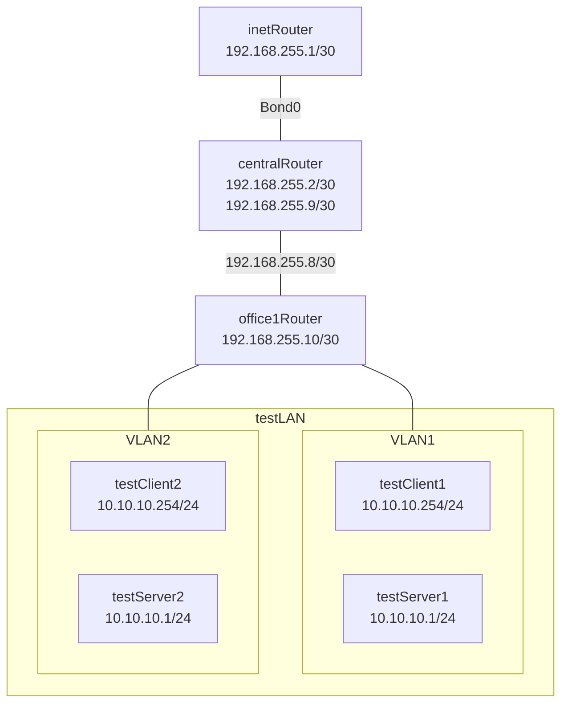

# Домашнее задание 24
## Строим бонды и вланы

### Цель:
- Научиться настраивать VLAN и LACP;


### Описание/Пошаговая инструкция выполнения домашнего задания:
Для выполнения домашнего задания используйте [методичку]()

**Что нужно сделать?**

в Office1 в тестовой подсети появляется сервера с доп интерфейсами и адресами
в internal сети testLAN:

- testClient1 - 10.10.10.254
- testClient2 - 10.10.10.254
- testServer1- 10.10.10.1
- testServer2- 10.10.10.1

Развести VLAN`s:
- testClient1 <-> testServer1
- testClient2 <-> testServer2

Между centralRouter и inetRouter "пробросить" 2 линка (общая inernal сеть) и объединить их в бонд, проверить работу c отключением интерфейсов

---
### Пошаговое выполнение задачи
**Вводные данные:**
- Все дальнейшие действия были проверены при использовании Vagrant 2.4.9
- VirtualBox: 7.0.20 r163906 
- В качестве ОС на хостах установлена Ubuntu 22.04 & Centos 8
- Vagrant + Ansible запускается из WSL2 в Windows 11

### Схема

### Конфигурационные файлы
- [Vagrantfile](Vagrantfile)
- [Ansible playbook](ansible/playbook.yml)

### Установка
```shell
amyskin@otus-vagrant:/mnt/c/Vagrant/vagrant_vln_lacp$ vagrant up
Bringing machine 'inetRouter' up with 'virtualbox' provider...
Bringing machine 'centralRouter' up with 'virtualbox' provider...
Bringing machine 'office1Router' up with 'virtualbox' provider...
Bringing machine 'testClient1' up with 'virtualbox' provider...
Bringing machine 'testServer1' up with 'virtualbox' provider...
Bringing machine 'testClient2' up with 'virtualbox' provider...
Bringing machine 'testServer2' up with 'virtualbox' provider...
==> inetRouter: Importing base box 'almalinux/9'...
==> inetRouter: Matching MAC address for NAT networking...
==> inetRouter: Checking if box 'almalinux/9' version '1.0.0' is up to date...
==> inetRouter: Setting the name of the VM: vagrant_vln_lacp_inetRouter_1773752836277_27954
==> inetRouter: Clearing any previously set network interfaces...
==> inetRouter: Preparing network interfaces based on configuration...
    inetRouter: Adapter 1: nat
    inetRouter: Adapter 2: intnet
    inetRouter: Adapter 3: intnet
    inetRouter: Adapter 4: hostonly
==> inetRouter: Forwarding ports...
    inetRouter: 22 (guest) => 2222 (host) (adapter 1)
    inetRouter: 22 (guest) => 2222 (host) (adapter 1)
==> inetRouter: Running 'pre-boot' VM customizations...
==> inetRouter: Booting VM...
==> inetRouter: Waiting for machine to boot. This may take a few minutes...
    inetRouter: SSH address: 127.0.0.1:2222
    inetRouter: SSH username: vagrant
    inetRouter: SSH auth method: private key
    inetRouter:
    inetRouter: Vagrant insecure key detected. Vagrant will automatically replace
    inetRouter: this with a newly generated keypair for better security.
    inetRouter:
    inetRouter: Inserting generated public key within guest...
    inetRouter: Removing insecure key from the guest if it's present...
    inetRouter: Key inserted! Disconnecting and reconnecting using new SSH key...
==> inetRouter: Machine booted and ready!
==> inetRouter: Checking for guest additions in VM...
    inetRouter: The guest additions on this VM do not match the installed version of
    inetRouter: VirtualBox! In most cases this is fine, but in rare cases it can
    inetRouter: prevent things such as shared folders from working properly. If you see
    inetRouter: shared folder errors, please make sure the guest additions within the
    inetRouter: virtual machine match the version of VirtualBox you have installed on
    inetRouter: your host and reload your VM.
    inetRouter:
    inetRouter: Guest Additions Version: 7.1.4
    inetRouter: VirtualBox Version: 7.0
==> inetRouter: Setting hostname...
==> inetRouter: Configuring and enabling network interfaces...
==> inetRouter: Mounting shared folders...
    inetRouter: /mnt/c/Vagrant/vagrant_vln_lacp => /vagrant
==> inetRouter: Running provisioner: shell...
    inetRouter: Running: inline script
    inetRouter: AlmaLinux 9 - AppStream                          12 MB/s |  17 MB     00:01
    inetRouter: AlmaLinux 9 - BaseOS                            7.1 MB/s |  18 MB     00:02
    inetRouter: AlmaLinux 9 - Extras                             32 kB/s |  21 kB     00:00
    inetRouter: Package python3-3.9.19-8.el9_5.1.x86_64 is already installed.
    inetRouter: Dependencies resolved.
.... и т.д.
PLAY RECAP *********************************************************************
centralRouter              : ok=6    changed=4    unreachable=0    failed=0    skipped=0    rescued=0    ignored=0
inetRouter                 : ok=6    changed=4    unreachable=0    failed=0    skipped=0    rescued=0    ignored=0
office1Router              : ok=2    changed=1    unreachable=0    failed=0    skipped=0    rescued=0    ignored=0
testClient1                : ok=5    changed=2    unreachable=0    failed=0    skipped=0    rescued=0    ignored=0
testClient2                : ok=5    changed=3    unreachable=0    failed=0    skipped=0    rescued=0    ignored=0
testServer1                : ok=5    changed=2    unreachable=0    failed=0    skipped=0    rescued=0    ignored=0
testServer2                : ok=5    changed=3    unreachable=0    failed=0    skipped=0    rescued=0    ignored=0

```
### Проверка
> Настройки VLAN на  testClient1
```shell
amyskin@otus-vagrant:/mnt/c/Vagrant/vagrant_vln_lacp$ vagrant ssh testClient1
Last login: Tue Mar 17 13:17:18 2026 from 10.0.2.2
[vagrant@testClient1 ~]$ ip link show vlan1
5: vlan1@eth1: <BROADCAST,MULTICAST,UP,LOWER_UP> mtu 1500 qdisc noqueue state UP mode DEFAULT group default qlen 1000
    link/ether 08:00:27:77:f5:e8 brd ff:ff:ff:ff:ff:ff
[vagrant@testClient1 ~]$ ip addr show vlan1
5: vlan1@eth1: <BROADCAST,MULTICAST,UP,LOWER_UP> mtu 1500 qdisc noqueue state UP group default qlen 1000
    link/ether 08:00:27:77:f5:e8 brd ff:ff:ff:ff:ff:ff
    inet 10.10.10.254/24 brd 10.10.10.255 scope global noprefixroute vlan1
       valid_lft forever preferred_lft forever
    inet6 fe80::8e2a:2f40:be1c:42e3/64 scope link noprefixroute
       valid_lft forever preferred_lft forever
[vagrant@testClient1 ~]$ exit
logout
```
> Настройки VLAN на testClient2
```shell
amyskin@otus-vagrant:/mnt/c/Vagrant/vagrant_vln_lacp$ vagrant ssh testClient2
Last login: Tue Mar 17 13:29:28 2026 from 10.0.2.2
vagrant@testClient2:~$ ip link show vlan2
5: vlan2@enp0s8: <BROADCAST,MULTICAST,UP,LOWER_UP> mtu 1500 qdisc noqueue state UP mode DEFAULT group default qlen 1000
    link/ether 08:00:27:4e:f4:ee brd ff:ff:ff:ff:ff:ff
vagrant@testClient2:~$ ip addr show vlan2
5: vlan2@enp0s8: <BROADCAST,MULTICAST,UP,LOWER_UP> mtu 1500 qdisc noqueue state UP group default qlen 1000
    link/ether 08:00:27:4e:f4:ee brd ff:ff:ff:ff:ff:ff
    inet 10.10.10.254/24 brd 10.10.10.255 scope global vlan2
       valid_lft forever preferred_lft forever
    inet6 fe80::a00:27ff:fe4e:f4ee/64 scope link
       valid_lft forever preferred_lft forever

```
> Связность внутри VLAN
```shell
amyskin@otus-vagrant:/mnt/c/Vagrant/vagrant_vln_lacp$ vagrant ssh testClient1 -- ping -c 4 10.10.10.1
PING 10.10.10.1 (10.10.10.1) 56(84) bytes of data.
64 bytes from 10.10.10.1: icmp_seq=1 ttl=64 time=1.06 ms
64 bytes from 10.10.10.1: icmp_seq=2 ttl=64 time=0.632 ms
64 bytes from 10.10.10.1: icmp_seq=3 ttl=64 time=0.644 ms
64 bytes from 10.10.10.1: icmp_seq=4 ttl=64 time=0.552 ms

--- 10.10.10.1 ping statistics ---
4 packets transmitted, 4 received, 0% packet loss, time 3009ms
rtt min/avg/max/mdev = 0.552/0.721/1.058/0.197 ms
amyskin@otus-vagrant:/mnt/c/Vagrant/vagrant_vln_lacp$ vagrant ssh testClient2 -- ping -c 4 10.10.10.1
PING 10.10.10.1 (10.10.10.1) 56(84) bytes of data.
64 bytes from 10.10.10.1: icmp_seq=1 ttl=64 time=0.951 ms
64 bytes from 10.10.10.1: icmp_seq=2 ttl=64 time=0.524 ms
64 bytes from 10.10.10.1: icmp_seq=3 ttl=64 time=0.542 ms
64 bytes from 10.10.10.1: icmp_seq=4 ttl=64 time=0.541 ms

```
> Изоляция между VLAN
```shell
amyskin@otus-vagrant:/mnt/c/Vagrant/vagrant_vln_lacp$ vagrant ssh testClient1 -- sudo arp
Address                  HWtype  HWaddress           Flags Mask            Iface
10.0.2.3                 ether   52:54:00:12:35:03   C                     eth0
_gateway                 ether   52:54:00:12:35:02   C                     eth0
10.10.10.1               ether   08:00:27:5a:1c:60   C                     vlan1

amyskin@otus-vagrant:/mnt/c/Vagrant/vagrant_vln_lacp$ vagrant ssh testClient2 -- sudo arp
Address                  HWtype  HWaddress           Flags Mask            Iface
10.10.10.1               ether   08:00:27:e6:c7:55   C                     vlan2
10.0.2.3                 ether   52:54:00:12:35:03   C                     enp0s3
_gateway                 ether   52:54:00:12:35:02   C                     enp0s3

amyskin@otus-vagrant:/mnt/c/Vagrant/vagrant_vln_lacp$ vagrant ssh testServer1 -- sudo arp
Address                  HWtype  HWaddress           Flags Mask            Iface
10.0.2.3                 ether   52:54:00:12:35:03   C                     eth0
10.10.10.254             ether   08:00:27:77:f5:e8   C                     vlan1
_gateway                 ether   52:54:00:12:35:02   C                     eth0

amyskin@otus-vagrant:/mnt/c/Vagrant/vagrant_vln_lacp$ vagrant ssh testServer2 -- sudo arp
Address                  HWtype  HWaddress           Flags Mask            Iface
10.10.10.254             ether   08:00:27:4e:f4:ee   C                     vlan2
_gateway                 ether   52:54:00:12:35:02   C                     enp0s3
_gateway                 ether   52:54:00:12:35:02   C                     enp0s3

```
> Проверка bonding
```shell
amyskin@otus-vagrant:/mnt/c/Vagrant/vagrant_vln_lacp$ vagrant ssh inetRouter -- cat /proc/net/bonding/bond0
Ethernet Channel Bonding Driver: v5.14.0-503.15.1.el9_5.x86_64

Bonding Mode: fault-tolerance (active-backup)
Primary Slave: None
Currently Active Slave: eth1
MII Status: up
MII Polling Interval (ms): 100
Up Delay (ms): 0
Down Delay (ms): 0
Peer Notification Delay (ms): 0

Slave Interface: eth1
MII Status: up
Speed: 1000 Mbps
Duplex: full
Link Failure Count: 0
Permanent HW addr: 08:00:27:c3:23:3f
Slave queue ID: 0

Slave Interface: eth2
MII Status: up
Speed: 1000 Mbps
Duplex: full
Link Failure Count: 0
Permanent HW addr: 08:00:27:ab:a8:45
Slave queue ID: 0
amyskin@otus-vagrant:/mnt/c/Vagrant/vagrant_vln_lacp$ vagrant ssh inetRouter -- ping -c 4 192.168.255.2
PING 192.168.255.2 (192.168.255.2) 56(84) bytes of data.
64 bytes from 192.168.255.2: icmp_seq=1 ttl=64 time=0.948 ms
64 bytes from 192.168.255.2: icmp_seq=2 ttl=64 time=0.618 ms
64 bytes from 192.168.255.2: icmp_seq=3 ttl=64 time=0.735 ms
64 bytes from 192.168.255.2: icmp_seq=4 ttl=64 time=0.678 ms

--- 192.168.255.2 ping statistics ---
4 packets transmitted, 4 received, 0% packet loss, time 3006ms
rtt min/avg/max/mdev = 0.618/0.744/0.948/0.124 ms

```
```shell
amyskin@otus-vagrant:/mnt/c/Vagrant/vagrant_vln_lacp$ vagrant ssh centralRouter
Last login: Tue Mar 17 14:26:49 2026 from 10.0.2.2
[vagrant@centralRouter ~]$ sudo -i
[root@centralRouter ~]# cat /proc/net/bonding/bond0
Ethernet Channel Bonding Driver: v5.14.0-503.15.1.el9_5.x86_64

Bonding Mode: load balancing (round-robin)
MII Status: up
MII Polling Interval (ms): 100
Up Delay (ms): 0
Down Delay (ms): 0
Peer Notification Delay (ms): 0

Slave Interface: eth1
MII Status: up
Speed: 1000 Mbps
Duplex: full
Link Failure Count: 0
Permanent HW addr: 08:00:27:ab:c8:09
Slave queue ID: 0

Slave Interface: eth2
MII Status: up
Speed: 1000 Mbps
Duplex: full
Link Failure Count: 0
Permanent HW addr: 08:00:27:75:3f:c3
Slave queue ID: 0

[root@centralRouter ~]# ip a
1: lo: <LOOPBACK,UP,LOWER_UP> mtu 65536 qdisc noqueue state UNKNOWN group default qlen 1000
    link/loopback 00:00:00:00:00:00 brd 00:00:00:00:00:00
    inet 127.0.0.1/8 scope host lo
       valid_lft forever preferred_lft forever
    inet6 ::1/128 scope host
       valid_lft forever preferred_lft forever
2: eth0: <BROADCAST,MULTICAST,UP,LOWER_UP> mtu 1500 qdisc fq_codel state UP group default qlen 1000
    link/ether 08:00:27:0d:f5:f0 brd ff:ff:ff:ff:ff:ff
    altname enp0s3
    inet 10.0.2.15/24 brd 10.0.2.255 scope global dynamic noprefixroute eth0
       valid_lft 86181sec preferred_lft 86181sec
    inet6 fe80::a00:27ff:fe0d:f5f0/64 scope link noprefixroute
       valid_lft forever preferred_lft forever
3: eth1: <BROADCAST,MULTICAST,SLAVE,UP,LOWER_UP> mtu 1500 qdisc fq_codel master bond0 state UP group default qlen 1000
    link/ether 08:00:27:ab:c8:09 brd ff:ff:ff:ff:ff:ff
    altname enp0s8
4: eth2: <BROADCAST,MULTICAST,SLAVE,UP,LOWER_UP> mtu 1500 qdisc fq_codel master bond0 state UP group default qlen 1000
    link/ether 08:00:27:ab:c8:09 brd ff:ff:ff:ff:ff:ff permaddr 08:00:27:75:3f:c3
    altname enp0s9
5: eth3: <BROADCAST,MULTICAST,UP,LOWER_UP> mtu 1500 qdisc fq_codel state UP group default qlen 1000
    link/ether 08:00:27:dc:2a:d5 brd ff:ff:ff:ff:ff:ff
    altname enp0s10
    inet 192.168.255.9/24 brd 192.168.255.255 scope global noprefixroute eth3
       valid_lft forever preferred_lft forever
    inet6 fe80::a00:27ff:fedc:2ad5/64 scope link
       valid_lft forever preferred_lft forever
6: eth4: <BROADCAST,MULTICAST,UP,LOWER_UP> mtu 1500 qdisc fq_codel state UP group default qlen 1000
    link/ether 08:00:27:4d:52:1c brd ff:ff:ff:ff:ff:ff
    altname enp0s16
    inet 192.168.56.11/24 brd 192.168.56.255 scope global noprefixroute eth4
       valid_lft forever preferred_lft forever
    inet6 fe80::a00:27ff:fe4d:521c/64 scope link
       valid_lft forever preferred_lft forever
7: bond0: <BROADCAST,MULTICAST,MASTER,UP,LOWER_UP> mtu 1500 qdisc noqueue state UP group default qlen 1000
    link/ether 08:00:27:ab:c8:09 brd ff:ff:ff:ff:ff:ff
    inet 192.168.255.2/30 brd 192.168.255.3 scope global noprefixroute bond0
       valid_lft forever preferred_lft forever
    inet6 fe80::1b96:d276:204f:3bff/64 scope link noprefixroute
       valid_lft forever preferred_lft forever

[root@centralRouter ~]# ping -c 3 192.168.255.1
PING 192.168.255.1 (192.168.255.1) 56(84) bytes of data.
64 bytes from 192.168.255.1: icmp_seq=1 ttl=64 time=2.39 ms
64 bytes from 192.168.255.1: icmp_seq=2 ttl=64 time=0.757 ms
64 bytes from 192.168.255.1: icmp_seq=3 ttl=64 time=0.739 ms

--- 192.168.255.1 ping statistics ---
3 packets transmitted, 3 received, 0% packet loss, time 2003ms
rtt min/avg/max/mdev = 0.739/1.295/2.390/0.774 ms

```
>> Проверка отказоустойчивости, на centralRouter отключил eth1
```shell
amyskin@otus-vagrant:/mnt/c/Vagrant/vagrant_vln_lacp$ vagrant ssh inetRouter
Last login: Tue Mar 17 14:49:55 2026 from 10.0.2.2
[vagrant@inetRouter ~]$ sudo -i
[root@inetRouter ~]# cat /etc/NetworkManager/system-connections/bond0.nmconnection
[connection]
id=bond0
uuid=84d0e3ca-e456-4f8c-a241-82aa2612a678
type=bond
interface-name=bond0
timestamp=1773753436

[bond]
fail_over_mac=active
miimon=100
mode=active-backup

[ipv4]
address1=192.168.255.1/30
method=manual

[ipv6]
addr-gen-mode=default
method=auto

[proxy]
```
```shell
[vagrant@inetRouter ~]$ ping 192.168.255.1
PING 192.168.255.1 (192.168.255.1) 56(84) bytes of data.
64 bytes from 192.168.255.1: icmp_seq=1 ttl=64 time=0.020 ms
64 bytes from 192.168.255.1: icmp_seq=2 ttl=64 time=0.040 ms
64 bytes from 192.168.255.1: icmp_seq=3 ttl=64 time=0.038 ms
64 bytes from 192.168.255.1: icmp_seq=4 ttl=64 time=0.040 ms
64 bytes from 192.168.255.1: icmp_seq=5 ttl=64 time=0.038 ms
64 bytes from 192.168.255.1: icmp_seq=6 ttl=64 time=0.040 ms
...
--- 192.168.255.1 ping statistics ---
21 packets transmitted, 21 received, 0% packet loss, time 20471ms
rtt min/avg/max/mdev = 0.020/0.038/0.041/0.004 ms
[vagrant@inetRouter ~]$ sudo ip link set up  eth1
[vagrant@inetRouter ~]$ ping 192.168.255.1
PING 192.168.255.1 (192.168.255.1) 56(84) bytes of data.
64 bytes from 192.168.255.1: icmp_seq=1 ttl=64 time=0.019 ms
64 bytes from 192.168.255.1: icmp_seq=2 ttl=64 time=0.039 ms
64 bytes from 192.168.255.1: icmp_seq=3 ttl=64 time=0.039 ms
64 bytes from 192.168.255.1: icmp_seq=4 ttl=64 time=0.037 ms
...
--- 192.168.255.1 ping statistics ---
4 packets transmitted, 4 received, 0% packet loss, time 3011ms
rtt min/avg/max/mdev = 0.019/0.033/0.039/0.008 ms

```
