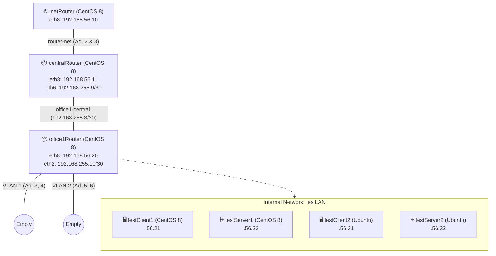

# Домашнее задание 24
## Строим бонды и вланы

### Цель:
- Научиться настраивать VLAN и LACP;

### Описание/Пошаговая инструкция выполнения домашнего задания:
Для выполнения домашнего задания используйте [методичку]()

**Что нужно сделать?**

в Office1 в тестовой подсети появляется сервера с доп интерфейсами и адресами
в internal сети testLAN:

- testClient1 - 10.10.10.254
- testClient2 - 10.10.10.254
- testServer1- 10.10.10.1
- testServer2- 10.10.10.1

Развести VLAN`s:
- testClient1 <-> testServer1
- testClient2 <-> testServer2

Между centralRouter и inetRouter "пробросить" 2 линка (общая inernal сеть) и объединить их в бонд, проверить работу c отключением интерфейсов

---
### Пошаговое выполнение задачи
**Вводные данные:**
- Все дальнейшие действия были проверены при использовании Vagrant 2.4.9
- VirtualBox: 7.0.20 r163906 
- В качестве ОС на хостах установлена Ubuntu 22.04 & Centos 8
- Vagrant + Ansible запускается из WSL2 в Windows 11

### Схема

## Таблица IP-адресов и подключений

| Виртуальная машина | Интерфейс (adapter) | IP-адрес / маска           | Внутренняя сеть (intnet)  | Примечание                         |
|--------------------|----------------------|----------------------------|----------------------------|------------------------------------|
| **inetRouter**     | 2                    | (не настроен)              | router-net                 | Два линка для отказоустойчивости   |
|                    | 3                    | (не настроен)              | router-net                 |                                    |
|                    | 8                    | 192.168.56.10/24           | —                          | Хост-сеть (управление)             |
| **centralRouter**  | 2                    | (не настроен)              | router-net                 | Два линка для отказоустойчивости   |
|                    | 3                    | (не настроен)              | router-net                 |                                    |
|                    | 6                    | 192.168.255.9/30           | office1-central            | Точка-точка между centralRouter и office1Router |
|                    | 8                    | 192.168.56.11/24           | —                          | Хост-сеть                          |
| **office1Router**  | 2                    | 192.168.255.10/30          | office1-central            | Точка-точка (вторая сторона)       |
|                    | 3                    | (не настроен)              | vlan1                      | Два порта во VLAN1 (пока без клиентов) |
|                    | 4                    | (не настроен)              | vlan1                      |                                    |
|                    | 5                    | (не настроен)              | vlan2                      | Два порта во VLAN2                 |
|                    | 6                    | (не настроен)              | vlan2                      |                                    |
|                    | 8                    | 192.168.56.20/24           | —                          | Хост-сеть                          |
| **testClient1**    | 2                    | (не настроен)              | testLAN                    | Общая сеть для тестовых машин      |
|                    | 8                    | 192.168.56.21/24           | —                          | Хост-сеть                          |
| **testServer1**    | 2                    | (не настроен)              | testLAN                    |                                    |
|                    | 8                    | 192.168.56.22/24           | —                          | Хост-сеть                          |
| **testClient2**    | 2                    | (не настроен)              | testLAN                    |                                    |
|                    | 8                    | 192.168.56.31/24           | —                          | Хост-сеть                          |
| **testServer2**    | 2                    | (не настроен)              | testLAN                    |                                    |
|                    | 8                    | 192.168.56.32/24           | —                          | Хост-сеть                          |

---

### Конфигурационные файлы
- [Vagrantfile]()
- [Ansible playbook]()

