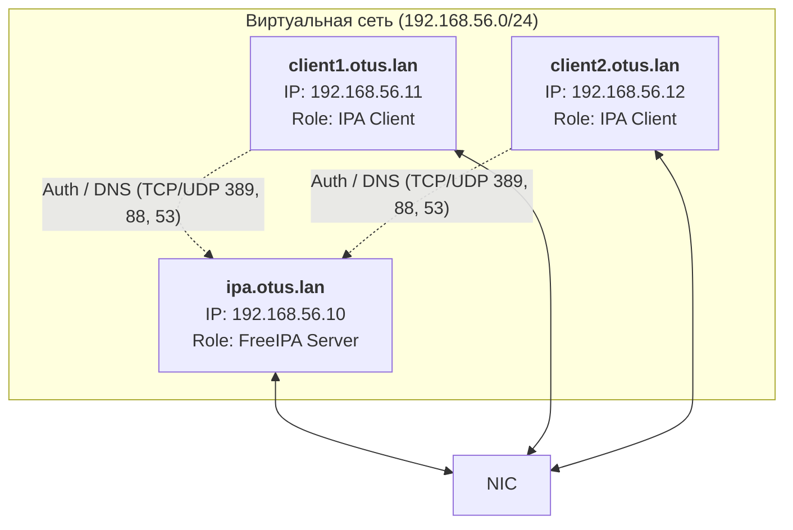

# Домашнее задание 25
# LDAP
## Цель:
- Научиться настраивать LDAP-сервер и подключать к нему LDAP-клиентов;
### Описание/Пошаговая инструкция выполнения домашнего задания:
Для выполнения домашнего задания используйте [методичку](https://docs.google.com/document/d/1HoZBcvitZ4A9t-y6sbLEbzKmf4CWvb39/edit)

**Что нужно сделать?**
- Установить FreeIPA
- Написать Ansible-playbook для конфигурации клиента 

Дополнительное задание:
- Настроить аутентификацию по SSH-ключам
- Firewall должен быть включен на сервере и на клиенте

---
### Пошаговое выполнение задачи
**Вводные данные:**
- Все дальнейшие действия были проверены при использовании Vagrant 2.4.9
- VirtualBox: 7.2.6 
- В качестве ОС на хостах установлена Almalinux9
- Vagrant + Ansible запускается из WSL2 в Windows 11

### Схема сети

### Таблица узлов

| Hostname         | IP-адрес      | ОС          | Роль                             |
|------------------|---------------|-------------|----------------------------------|
| ipa.otus.lan     | 192.168.56.10 | AlmaLinux 9 | Контроллер домена (LDAP/Krb/DNS) |
| client1.otus.lan | 192.168.56.11 | AlmaLinux 9 | Клиент FreeIPA                   |
| client2.otus.lan | 192.168.56.12 | AlmaLinux 9 | Клиент FreeIPA                   |
---

### Конфигурационные файлы
- [Vagrantfile]()
- [Ansible playbook]()

