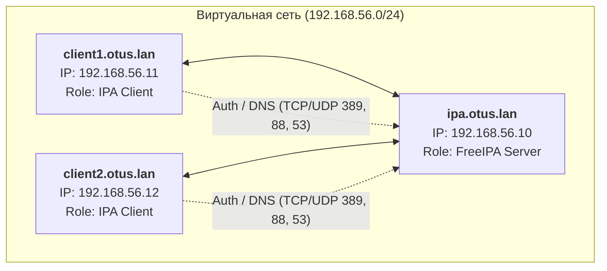
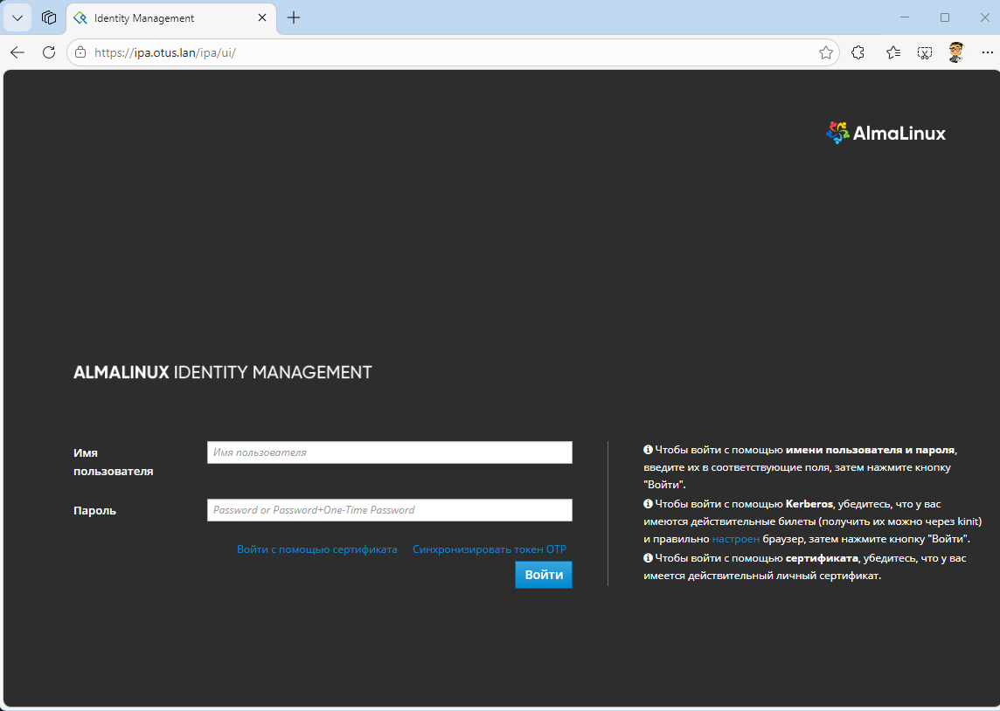
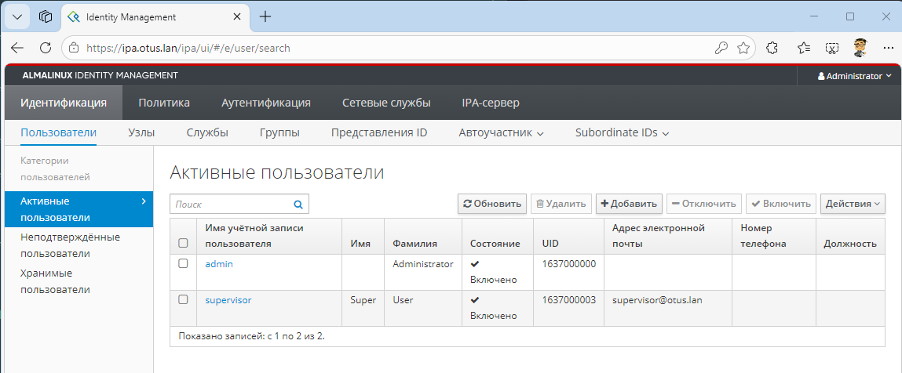
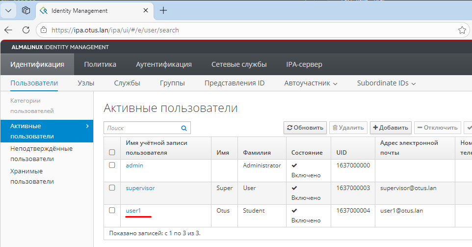

# Домашнее задание 25
# LDAP
## Цель:
- Научиться настраивать LDAP-сервер и подключать к нему LDAP-клиентов;
### Описание/Пошаговая инструкция выполнения домашнего задания:
Для выполнения домашнего задания используйте [методичку](https://docs.google.com/document/d/1HoZBcvitZ4A9t-y6sbLEbzKmf4CWvb39/edit)

**Что нужно сделать?**
- Установить FreeIPA
- Написать Ansible-playbook для конфигурации клиента 

Дополнительное задание:
- Настроить аутентификацию по SSH-ключам
- Firewall должен быть включен на сервере и на клиенте

---
### Пошаговое выполнение задачи
**Вводные данные:**
- Все дальнейшие действия были проверены при использовании Vagrant 2.4.9
- VirtualBox: 7.2.6 
- В качестве ОС на хостах установлена Almalinux9
- Vagrant + Ansible запускается из WSL2 в Windows 11

### Схема сети


### Таблица узлов

| Hostname         | IP-адрес      | ОС          | Роль                             |
|------------------|---------------|-------------|----------------------------------|
| ipa.otus.lan     | 192.168.56.10 | AlmaLinux 9 | Контроллер домена (LDAP/Krb/DNS) |
| client1.otus.lan | 192.168.56.11 | AlmaLinux 9 | Клиент FreeIPA                   |
| client2.otus.lan | 192.168.56.12 | AlmaLinux 9 | Клиент FreeIPA                   |
---

### Конфигурационные файлы
- [Vagrantfile](Vagrantfile)
- [Ansible playbook](ansible/playbook.yml)

### Установка
> Установка полностью автоматизированна с помощью Vagrant + Ansible, в соответсвии с методичкой. 
```shell
amyskin@otus-vagrant:/mnt/c/Vagrant/vagrant_ldap$ vagrant up
Bringing machine 'ipa.otus.lan' up with 'virtualbox' provider...
Bringing machine 'client1.otus.lan' up with 'virtualbox' provider...
Bringing machine 'client2.otus.lan' up with 'virtualbox' provider...
==> ipa.otus.lan: Importing base box 'almalinux/9'...
==> ipa.otus.lan: Matching MAC address for NAT networking...
==> ipa.otus.lan: Checking if box 'almalinux/9' version '1.0.0' is up to date...
==> ipa.otus.lan: Setting the name of the VM: vagrant_ldap_ipaotuslan_1773916656850_82821
==> ipa.otus.lan: Clearing any previously set network interfaces...
==> ipa.otus.lan: Preparing network interfaces based on configuration...
    ipa.otus.lan: Adapter 1: nat
    ipa.otus.lan: Adapter 2: bridged
==> ipa.otus.lan: Forwarding ports...
    ipa.otus.lan: 22 (guest) => 2222 (host) (adapter 1)
    ipa.otus.lan: 22 (guest) => 2222 (host) (adapter 1)
==> ipa.otus.lan: Running 'pre-boot' VM customizations...
==> ipa.otus.lan: Booting VM...
==> ipa.otus.lan: Waiting for machine to boot. This may take a few minutes...
    ipa.otus.lan: SSH address: 127.0.0.1:2222
    ipa.otus.lan: SSH username: vagrant
    ipa.otus.lan: SSH auth method: private key
    ipa.otus.lan:
    ipa.otus.lan: Vagrant insecure key detected. Vagrant will automatically replace
    ipa.otus.lan: this with a newly generated keypair for better security.
    ipa.otus.lan:
    ipa.otus.lan: Inserting generated public key within guest...
    ipa.otus.lan: Removing insecure key from the guest if it's present...
    ipa.otus.lan: Key inserted! Disconnecting and reconnecting using new SSH key...
==> ipa.otus.lan: Machine booted and ready!
==> ipa.otus.lan: Checking for guest additions in VM...
    ipa.otus.lan: The guest additions on this VM do not match the installed version of
    ipa.otus.lan: VirtualBox! In most cases this is fine, but in rare cases it can
    ipa.otus.lan: prevent things such as shared folders from working properly. If you see
    ipa.otus.lan: shared folder errors, please make sure the guest additions within the
    ipa.otus.lan: virtual machine match the version of VirtualBox you have installed on
    ipa.otus.lan: your host and reload your VM.
    ipa.otus.lan:
    ipa.otus.lan: Guest Additions Version: 7.1.4
    ipa.otus.lan: VirtualBox Version: 7.2
==> ipa.otus.lan: Setting hostname...
==> ipa.otus.lan: Configuring and enabling network interfaces...
==> ipa.otus.lan: Mounting shared folders...
    ipa.otus.lan: /mnt/c/Vagrant/vagrant_ldap => /vagrant
==> ipa.otus.lan: Running provisioner: shell...
    ipa.otus.lan: Running: inline script
    ipa.otus.lan: AlmaLinux 9 - AppStream                         1.1 MB/s |  17 MB     00:16
    ipa.otus.lan: AlmaLinux 9 - BaseOS                            1.1 MB/s |  18 MB     00:16
    ipa.otus.lan: AlmaLinux 9 - Extras                            1.3 kB/s |  21 kB     00:15
    ipa.otus.lan: Package python3-3.9.19-8.el9_5.1.x86_64 is already inst
    .... и т.д.
    
    
    ==> ipa.otus.lan: Running provisioner: ansible...
    ipa.otus.lan: Running ansible-playbook...
[WARNING]: Deprecation warnings can be disabled by setting `deprecation_warnings=False` in ansible.cfg.
[DEPRECATION WARNING]: The '--inventory-file' argument is deprecated. This feature will be removed from ansible-c                                       ore version 2.23. Use -i or --inventory instead.

PLAY [Базовые настройки] *******************************************************

TASK [Gathering Facts] *********************************************************
ok: [ipa.otus.lan]

TASK [Остановка Firewalld] *****************************************************
ok: [ipa.otus.lan]

TASK [Настройка SELinux] *******************************************************
[WARNING]: SELinux state temporarily changed from 'enforcing' to 'permissive'. State change will take effect next                                        reboot.
changed: [ipa.otus.lan]

TASK [Установка пакетов] *******************************************************
changed: [ipa.otus.lan]

TASK [Настройка /etc/hosts] ****************************************************
[DEPRECATION WARNING]: INJECT_FACTS_AS_VARS default to `True` is deprecated, top-level facts will not be auto inj                                       ected after the change. This feature will be removed from ansible-core version 2.24.
Origin: /mnt/c/Vagrant/vagrant_ldap/ansible/playbook.yml:24:18

22       copy:
23         dest: /etc/hosts
24         content: |
                    ^ column 18

Use `ansible_facts["fact_name"]` (no `ansible_` prefix) instead.

changed: [ipa.otus.lan]

PLAY [Настройка FreeIPA Server] ************************************************

TASK [Gathering Facts] *********************************************************
ok: [ipa.otus.lan]

TASK [Установка пакетов IPA] ***************************************************
changed: [ipa.otus.lan]

TASK [Установка FreeIPA (Unattended)] ******************************************
changed: [ipa.otus.lan]

TASK [Проверка статуса IPA] ****************************************************
ok: [ipa.otus.lan]

PLAY [Настройка клиентов] ******************************************************
skipping: no hosts matched

PLAY RECAP *********************************************************************
ipa.otus.lan               : ok=9    changed=5    unreachable=0    failed=0    skipped=0    rescued=0    ignored=                                       0
.... и т.д.

    client1.otus.lan: Complete!
==> client1.otus.lan: Running provisioner: ansible...
    client1.otus.lan: Running ansible-playbook...
[WARNING]: Deprecation warnings can be disabled by setting `deprecation_warnings=False` in ansible.cfg.
[DEPRECATION WARNING]: The '--inventory-file' argument is deprecated. This feature will be removed from ansible-c                                       ore version 2.23. Use -i or --inventory instead.

PLAY [Базовые настройки] *******************************************************

TASK [Gathering Facts] *********************************************************
ok: [ipa.otus.lan]
ok: [client1.otus.lan]

TASK [Остановка Firewalld] *****************************************************
ok: [client1.otus.lan]
ok: [ipa.otus.lan]

TASK [Настройка SELinux] *******************************************************
[WARNING]: SELinux state change will take effect next reboot
ok: [ipa.otus.lan]
[WARNING]: SELinux state temporarily changed from 'enforcing' to 'permissive'. State change will take effect next                                        reboot.
changed: [client1.otus.lan]

TASK [Установка пакетов] *******************************************************
ok: [ipa.otus.lan]
changed: [client1.otus.lan]

TASK [Настройка /etc/hosts] ****************************************************
[DEPRECATION WARNING]: INJECT_FACTS_AS_VARS default to `True` is deprecated, top-level facts will not be auto inj                                       ected after the change. This feature will be removed from ansible-core version 2.24.
Origin: /mnt/c/Vagrant/vagrant_ldap/ansible/playbook.yml:24:18

22       copy:
23         dest: /etc/hosts
24         content: |
                    ^ column 18

Use `ansible_facts["fact_name"]` (no `ansible_` prefix) instead.

changed: [ipa.otus.lan]
changed: [client1.otus.lan]

PLAY [Настройка FreeIPA Server] ************************************************

TASK [Gathering Facts] *********************************************************
ok: [ipa.otus.lan]

TASK [Установка пакетов IPA] ***************************************************
ok: [ipa.otus.lan]

TASK [Установка FreeIPA (Unattended)] ******************************************
ok: [ipa.otus.lan]

TASK [Проверка статуса IPA] ****************************************************
ok: [ipa.otus.lan]

PLAY [Настройка клиентов] ******************************************************

TASK [Gathering Facts] *********************************************************
ok: [client1.otus.lan]

TASK [Установка freeipa-client] ************************************************
changed: [client1.otus.lan]

TASK [Настройка DNS на клиентах (на сервер IPA)] *******************************
changed: [client1.otus.lan]

TASK [Ввод в домен] ************************************************************
changed: [client1.otus.lan]

PLAY RECAP *********************************************************************
client1.otus.lan           : ok=9    changed=6    unreachable=0    failed=0    skipped=0    rescued=0    ignored=                                       0
ipa.otus.lan               : ok=9    changed=1    unreachable=0    failed=0    skipped=0    rescued=0    ignored=                                       0
... и т.д.

    client2.otus.lan: Complete!
==> client2.otus.lan: Running provisioner: ansible...
    client2.otus.lan: Running ansible-playbook...
[WARNING]: Deprecation warnings can be disabled by setting `deprecation_warnings=False` in ansible.cfg.
[DEPRECATION WARNING]: The '--inventory-file' argument is deprecated. This feature will be removed from ansible-c                                       ore version 2.23. Use -i or --inventory instead.

PLAY [Базовые настройки] *******************************************************

TASK [Gathering Facts] *********************************************************
ok: [client1.otus.lan]
ok: [ipa.otus.lan]
ok: [client2.otus.lan]

TASK [Остановка Firewalld] *****************************************************
ok: [ipa.otus.lan]
ok: [client2.otus.lan]
ok: [client1.otus.lan]

TASK [Настройка SELinux] *******************************************************
[WARNING]: SELinux state change will take effect next reboot
ok: [client1.otus.lan]
ok: [ipa.otus.lan]
[WARNING]: SELinux state temporarily changed from 'enforcing' to 'permissive'. State change will take effect next                                        reboot.
changed: [client2.otus.lan]

TASK [Установка пакетов] *******************************************************
ok: [client1.otus.lan]
ok: [ipa.otus.lan]
changed: [client2.otus.lan]

TASK [Настройка /etc/hosts] ****************************************************
[DEPRECATION WARNING]: INJECT_FACTS_AS_VARS default to `True` is deprecated, top-level facts will not be auto inj                                       ected after the change. This feature will be removed from ansible-core version 2.24.
Origin: /mnt/c/Vagrant/vagrant_ldap/ansible/playbook.yml:24:18

22       copy:
23         dest: /etc/hosts
24         content: |
                    ^ column 18

Use `ansible_facts["fact_name"]` (no `ansible_` prefix) instead.

changed: [client2.otus.lan]
changed: [ipa.otus.lan]
changed: [client1.otus.lan]

PLAY [Настройка FreeIPA Server] ************************************************

TASK [Gathering Facts] *********************************************************
ok: [ipa.otus.lan]

TASK [Установка пакетов IPA] ***************************************************
ok: [ipa.otus.lan]

TASK [Установка FreeIPA (Unattended)] ******************************************
ok: [ipa.otus.lan]

TASK [Проверка статуса IPA] ****************************************************
ok: [ipa.otus.lan]

PLAY [Настройка клиентов] ******************************************************

TASK [Gathering Facts] *********************************************************
ok: [client2.otus.lan]
ok: [client1.otus.lan]

TASK [Установка freeipa-client] ************************************************
ok: [client1.otus.lan]
changed: [client2.otus.lan]

TASK [Настройка DNS на клиентах (на сервер IPA)] *******************************
changed: [client1.otus.lan]
changed: [client2.otus.lan]

TASK [Ввод в домен] ************************************************************
ok: [client1.otus.lan]
changed: [client2.otus.lan]

PLAY RECAP *********************************************************************
client1.otus.lan           : ok=9    changed=2    unreachable=0    failed=0    skipped=0    rescued=0    ignored=0
client2.otus.lan           : ok=9    changed=6    unreachable=0    failed=0    skipped=0    rescued=0    ignored=0
ipa.otus.lan               : ok=9    changed=1    unreachable=0    failed=0    skipped=0    rescued=0    ignored=0

```
>> Из вывода видно ошибок в vagrantfile и ansible нет. Сервер IPA установился и введены в домен.

### Провекра

> Проверил открывается ли web для управления FreeIPA-сервером. 


> Создал пользователя для теста, вроде всё ок.
> 

> Далее проверил все ли службы на сервер запущены
```shell
amyskin@otus-vagrant:/mnt/c/Vagrant/vagrant_ldap$ vagrant ssh ipa.otus.lan
Last login: Thu Mar 19 11:06:04 2026 from 10.0.2.2
[vagrant@ipa ~]$
[vagrant@ipa ~]$ sudo ipactl status
Directory Service: RUNNING
krb5kdc Service: RUNNING
kadmin Service: RUNNING
named Service: RUNNING
httpd Service: RUNNING
ipa-custodia Service: RUNNING
pki-tomcatd Service: RUNNING
ipa-otpd Service: RUNNING
ipa-dnskeysyncd Service: RUNNING
ipa: INFO: The ipactl command was successful

```
> Проверка получения билета Kerberos для админа
```shell
[vagrant@ipa ~]$ kinit admin
Password for admin@OTUS.LAN:
[vagrant@ipa ~]$ klist
Ticket cache: KCM:1000
Default principal: admin@OTUS.LAN

Valid starting       Expires              Service principal
03/19/2026 11:34:28  03/20/2026 11:03:59  krbtgt/OTUS.LAN@OTUS.LAN
[vagrant@ipa ~]$

```
>> Теперь для созданного пользователя
```shell
[vagrant@ipa ~]$ kinit supervisor
Password for supervisor@OTUS.LAN:
Password expired.  You must change it now.
Enter new password:
Enter it again:
[vagrant@ipa ~]$ klist
Ticket cache: KCM:1000:30812
Default principal: supervisor@OTUS.LAN

Valid starting       Expires              Service principal
03/19/2026 11:31:41  03/20/2026 10:46:16  krbtgt/OTUS.LAN@OTUS.LAN

```
> Проверил связанность с клиентов 
```shell
[root@client1 ~]# ipa user-find admin
--------------
1 user matched
--------------
  User login: admin
  Last name: Administrator
  Home directory: /home/admin
  Login shell: /bin/bash
  Principal name: admin@OTUS.LAN
  Principal alias: admin@OTUS.LAN, root@OTUS.LAN
  UID: 1637000000
  GID: 1637000000
  Account disabled: False
----------------------------
Number of entries returned 1
----------------------------
[root@client1 ~]# ipa user-find supervisor
--------------
1 user matched
--------------
  User login: supervisor
  First name: Super
  Last name: User
  Home directory: /home/supervisor
  Login shell: /bin/sh
  Principal name: supervisor@OTUS.LAN
  Principal alias: supervisor@OTUS.LAN
  Email address: supervisor@otus.lan
  UID: 1637000003
  GID: 1637000000
  Account disabled: False
----------------------------
Number of entries returned 1
----------------------------
```
> Проверка с клиента, какой IP выдаст DNS сервер
```shell
[root@client1 ~]# getent hosts ipa.otus.lan
192.168.77.19   ipa.otus.lan ipa

```
> Проверка создания пользователя
```shell
amyskin@otus-vagrant:/mnt/c/Vagrant/vagrant_ldap$ vagrant ssh ipa.otus.lan
Last login: Thu Mar 19 11:30:45 2026 from 10.0.2.2
[vagrant@ipa ~]$ ipa user-add user1 --first=Otus --last=Student --password
Password:
Enter Password again to verify:
------------------
Added user "user1"
------------------
  User login: user1
  First name: Otus
  Last name: Student
  Full name: Otus Student
  Display name: Otus Student
  Initials: OS
  Home directory: /home/user1
  GECOS: Otus Student
  Login shell: /bin/sh
  Principal name: user1@OTUS.LAN
  Principal alias: user1@OTUS.LAN
  User password expiration: 20260319115608Z
  Email address: user1@otus.lan
  UID: 1637000004
  GID: 1637000004
  Password: True
  Member of groups: ipausers
  Kerberos keys available: True

```


> Проверил на клиенте
```shell
amyskin@otus-vagrant:/mnt/c/Vagrant/vagrant_ldap$ vagrant ssh client1.otus.lan
Last login: Thu Mar 19 11:38:10 2026 from 10.0.2.2
[vagrant@client1 ~]$ su - suer1
[vagrant@client1 ~]$ su - user1
Password:
Last login: Thu Mar 19 11:58:54 UTC 2026 on pts/0
[user1@client1 ~]$ pwd
/home/user1
[user1@client1 ~]$ ls -la
total 16
drwx------. 2 user1 user1  83 Mar 19 11:59 .
drwxr-xr-x. 4 root  root   34 Mar 19 11:58 ..
-rw-------. 1 user1 user1   5 Mar 19 11:59 .bash_history
-rw-------. 1 user1 user1  18 Mar 19 11:58 .bash_logout
-rw-------. 1 user1 user1 141 Mar 19 11:58 .bash_profile
-rw-------. 1 user1 user1 492 Mar 19 11:58 .bashrc

```
