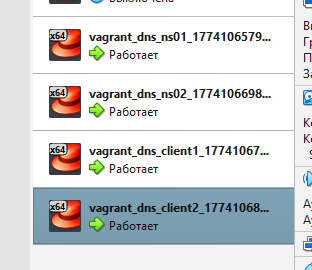

# Домашнее задание 26
## @Настраиваем split-dns

### Цель:
- Создать домашнюю сетевую лабораторию;
- Изучить основы DNS;
- Научиться работать с технологией Split-DNS в Linux-based системах.

### Описание/Пошаговая инструкция выполнения домашнего задания:
**Для выполнения домашнего задания используйте [методичку]()**

**Что нужно сделать?**

1. взять стенд https://github.com/erlong15/vagrant-bind
- добавить еще один сервер client2
- завести в зоне dns.lab
- имена
  - web1 - смотрит на клиент1
  - web2 смотрит на клиент2
- завести еще одну зону newdns.lab
- завести в ней запись
  - www - смотрит на обоих клиентов
2. настроить split-dns
- клиент1 - видит обе зоны, но в зоне dns.lab только web1
- клиент2 видит только dns.lab

_P.S. настроить все без выключения selinux*_

---
### Пошаговое выполнение задачи
**Вводные данные:**
- Все дальнейшие действия были проверены при использовании Vagrant 2.4.9
- VirtualBox: 7.2.6 
- В качестве ОС на хостах установлена Almalinux9
- Vagrant + Ansible запускается из WSL2 в Windows 11

### Схема
```mermaid
graph TD
    subgraph "Внешняя сеть (NAT/Host-only)"
        Internet((Internet)) --- ns01
    end

    subgraph "Внутренняя сеть (intnet: dns) 192.168.56.0/24"
        ns01[<b>ns01</b><br/>192.168.56.10<br/>DNS Master]
        ns02[<b>ns02</b><br/>192.168.56.11<br/>DNS Slave]
        
        c1[<b>client1</b><br/>192.168.56.15]
        c2[<b>client2</b><br/>192.168.56.16]
    end

    %% Логика Split-DNS
    c1 -- Запрос --> ns01
    ns01 -- View: client1 --> c1
    note1[<b>Доступно для client1:</b><br/>- dns.lab (только web1)<br/>- newdns.lab (www)] 
    c1 -.-> note1

    c2 -- Запрос --> ns01
    ns01 -- View: client2 --> c2
    note2[<b>Доступно для client2:</b><br/>- dns.lab (web1 и web2)<br/>- newdns.lab (нет доступа)]
    c2 -.-> note2

    %% Трансфер зон
    ns01 == TSIG Transfer ==> ns02
```

### Таблица виртуальных машин 

| Имя VM  | Hostname | Интерфейс 1 (NAT) | Интерфейс 2 (Internal) | IP-адрес (Internal) | Роль в сети         |
|---------|----------|-------------------|------------------------|---------------------|---------------------|
| ns01    | ns01     | DHCP (Интернет)   | dns (intnet)           | 192.168.56.10       | Master DNS Server   |
| ns02    | ns02     | DHCP (Интернет)   | dns (intnet)           | 192.168.56.11       | Slave DNS Server    |
| client1 | client1  | DHCP (Интернет)   | dns (intnet)           | 192.168.56.15       | DNS Client (View 1) |
| client2 | client2  | DHCP (Интернет)   | dns (intnet)           | 192.168.56.16       | DNS Client (View 2) |


### Конфигурационные файлы
- [Vagrantfile](Vagrantfile)
- [Ansible playbook](ansible/playbook.yml)

### Установка
```shell
amyskin@otus-vagrant:/mnt/c/Vagrant/vagrant_dns$ vagrant up
Bringing machine 'ns01' up with 'virtualbox' provider...
Bringing machine 'ns02' up with 'virtualbox' provider...
Bringing machine 'client1' up with 'virtualbox' provider...
Bringing machine 'client2' up with 'virtualbox' provider...
==> ns01: Importing base box 'almalinux/9'...
==> ns01: Matching MAC address for NAT networking...
==> ns01: Checking if box 'almalinux/9' version '1.0.0' is up to date...
==> ns01: Setting the name of the VM: vagrant_dns_ns01_1774106579223_3619
==> ns01: Clearing any previously set network interfaces...
==> ns01: Preparing network interfaces based on configuration...
    ns01: Adapter 1: nat
    ns01: Adapter 2: intnet
==> ns01: Forwarding ports...
    ns01: 22 (guest) => 2222 (host) (adapter 1)
    ns01: 22 (guest) => 2222 (host) (adapter 1)
==> ns01: Running 'pre-boot' VM customizations...
==> ns01: Booting VM...
==> ns01: Waiting for machine to boot. This may take a few minutes...
    ns01: SSH address: 127.0.0.1:2222
    ns01: SSH username: vagrant
    ns01: SSH auth method: private key
    ns01:
    ns01: Vagrant insecure key detected. Vagrant will automatically replace
    ns01: this with a newly generated keypair for better security.
    ns01:
    ns01: Inserting generated public key within guest...
    ns01: Removing insecure key from the guest if it's present...
    ns01: Key inserted! Disconnecting and reconnecting using new SSH key...
==> ns01: Machine booted and ready!
==> ns01: Checking for guest additions in VM...
    ns01: The guest additions on this VM do not match the installed version of
    ns01: VirtualBox! In most cases this is fine, but in rare cases it can
    ns01: prevent things such as shared folders from working properly. If you see
    ns01: shared folder errors, please make sure the guest additions within the
    ns01: virtual machine match the version of VirtualBox you have installed on
    ns01: your host and reload your VM.
    ns01:
    ns01: Guest Additions Version: 7.1.4
    ns01: VirtualBox Version: 7.2
==> ns01: Setting hostname...
==> ns01: Configuring and enabling network interfaces...
==> ns01: Mounting shared folders...
    ns01: /mnt/c/Vagrant/vagrant_dns => /vagrant
==> ns01: Running provisioner: ansible...
    ns01: Running ansible-playbook...
PYTHONUNBUFFERED=1 ANSIBLE_FORCE_COLOR=true ANSIBLE_HOST_KEY_CHECKING=false ANSIBLE_SSH_ARGS='-o UserKnownHostsFile=/dev/null -o IdentitiesOnly=yes -o C                                                                                                                                          ontrolMaster=auto -o ControlPersist=60s' ansible-playbook --connection=ssh --timeout=30 --limit="ns01" --inventory-file=/mnt/c/Vagrant/vagrant_dns/.vagr                                                                                                                                          ant/provisioners/ansible/inventory --extra-vars=\{\"ansible_python_interpreter\":\"/usr/bin/python3\"\} -vvv ansible/playbook.yml
[WARNING]: Deprecation warnings can be disabled by setting `deprecation_warnings=False` in ansible.cfg.
[DEPRECATION WARNING]: The '--inventory-file' argument is deprecated. This feature will be removed from ansible-core version 2.23. Use -i or --inventory                                                                                                                                           instead.
ansible-playbook [core 2.20.3]
  config file = /etc/ansible/ansible.cfg
  configured module search path = ['/home/amyskin/.ansible/plugins/modules', '/usr/share/ansible/plugins/modules']
  ansible python module location = /usr/lib/python3/dist-packages/ansible
  ansible collection location = /home/amyskin/.ansible/collections:/usr/share/ansible/collections
  executable location = /usr/bin/ansible-playbook
  python version = 3.12.3 (main, Mar  3 2026, 12:15:18) [GCC 13.3.0] (/usr/bin/python3)
  jinja version = 3.1.2
  pyyaml version = 6.0.1 (with libyaml v0.2.5)
... и т.д.
<127.0.0.1> (0, b'', b'')
changed: [client2] => {
    "changed": true,
    "checksum": "33488e03861c8a11fd61aa4b7b0ccb09beffa904",
    "dest": "/etc/rndc.conf",
    "diff": [],
    "gid": 0,
    "group": "root",
    "invocation": {
        "module_args": {
            "_original_basename": ".8nsgqgaa",
            "attributes": null,
            "backup": false,
            "checksum": "33488e03861c8a11fd61aa4b7b0ccb09beffa904",
            "content": null,
            "dest": "/etc/rndc.conf",
            "directory_mode": null,
            "follow": false,
            "force": true,
            "group": "root",
            "local_follow": null,
            "mode": 420,
            "owner": "root",
            "remote_src": false,
            "selevel": null,
            "serole": null,
            "setype": null,
            "seuser": null,
            "src": "/home/vagrant/.ansible/tmp/ansible-tmp-1774106985.9508505-8184-34832282532667/.source.conf",
            "unsafe_writes": false,
            "validate": null
        }
    },
    "md5sum": "5825d4ed363caf2c79f9c36022d1fd2c",
    "mode": "0644",
    "owner": "root",
    "secontext": "system_u:object_r:named_conf_t:s0",
    "size": 100,
    "src": "/home/vagrant/.ansible/tmp/ansible-tmp-1774106985.9508505-8184-34832282532667/.source.conf",
    "state": "file",
    "uid": 0
}

PLAY RECAP *********************************************************************
client2                    : ok=8    changed=5    unreachable=0    failed=0    skipped=0    rescued=0    ignored=0
```


### Проверка
>  Проверка работоспособности сервиса на ns01 и ns02
```shell
amyskin@otus-vagrant:/mnt/c/Vagrant/vagrant_dns$ vagrant ssh ns01 -- sudo systemctl status named
● named.service - Berkeley Internet Name Domain (DNS)
     Loaded: loaded (/usr/lib/systemd/system/named.service; enabled; preset: disabled)
     Active: active (running) since Sat 2026-03-21 15:24:52 UTC; 21min ago
    Process: 22474 ExecStartPre=/bin/bash -c if [ ! "$DISABLE_ZONE_CHECKING" == "yes" ]; then /usr/sbin/named-checkconf -z "$NAMEDCONF"; else echo "Checking of zone files is disabled"; fi (code=exited, status=0/SUCCESS)
    Process: 22476 ExecStart=/usr/sbin/named -u named -c ${NAMEDCONF} $OPTIONS (code=exited, status=0/SUCCESS)
   Main PID: 22477 (named)
      Tasks: 6 (limit: 5568)
     Memory: 28.7M
        CPU: 121ms
     CGroup: /system.slice/named.service
             └─22477 /usr/sbin/named -u named -c /etc/named.conf

Mar 21 15:24:52 ns01 named[22477]: zone dns.lab/IN/default: loaded serial 3822302507
Mar 21 15:24:52 ns01 named[22477]: zone 56.168.192.in-addr.arpa/IN/default: sending notifies (serial 3822302507)
Mar 21 15:24:52 ns01 named[22477]: zone newdns.lab/IN/default: loaded serial 3822302507
Mar 21 15:24:52 ns01 named[22477]: all zones loaded
Mar 21 15:24:52 ns01 systemd[1]: Started Berkeley Internet Name Domain (DNS).
Mar 21 15:24:52 ns01 named[22477]: running
Mar 21 15:24:52 ns01 named[22477]: zone dns.lab/IN/default: sending notifies (serial 3822302507)
Mar 21 15:24:52 ns01 named[22477]: zone newdns.lab/IN/default: sending notifies (serial 3822302507)
Mar 21 15:25:02 ns01 named[22477]: resolver priming query complete
Mar 21 15:25:02 ns01 named[22477]: managed-keys-zone/default: Unable to fetch DNSKEY set '.': timed out
amyskin@otus-vagrant:/mnt/c/Vagrant/vagrant_dns$ vagrant ssh ns01 -- sudo named-checkconf -z /etc/named.conf
zone dns.lab/IN: loaded serial 3822302507
zone newdns.lab/IN: loaded serial 3822302507
zone dns.lab/IN: loaded serial 3822302507
zone 56.168.192.in-addr.arpa/IN: loaded serial 3822302507
zone localhost.localdomain/IN: loaded serial 0
zone localhost/IN: loaded serial 0
zone 1.0.0.0.0.0.0.0.0.0.0.0.0.0.0.0.0.0.0.0.0.0.0.0.0.0.0.0.0.0.0.0.ip6.arpa/IN: loaded serial 0
zone 1.0.0.127.in-addr.arpa/IN: loaded serial 0
zone 0.in-addr.arpa/IN: loaded serial 0
zone dns.lab/IN: loaded serial 3822302507
zone 56.168.192.in-addr.arpa/IN: loaded serial 3822302507
zone newdns.lab/IN: loaded serial 3822302507
amyskin@otus-vagrant:/mnt/c/Vagrant/vagrant_dns$ vagrant ssh ns02 -- sudo systemctl status named
○ named.service - Berkeley Internet Name Domain (DNS)
     Loaded: loaded (/usr/lib/systemd/system/named.service; disabled; preset: disabled)
     Active: inactive (dead)
amyskin@otus-vagrant:/mnt/c/Vagrant/vagrant_dns$ vagrant ssh ns02 -- sudo named-checkconf -z /etc/named.conf
zone localhost.localdomain/IN: loaded serial 0
zone localhost/IN: loaded serial 0
zone 1.0.0.0.0.0.0.0.0.0.0.0.0.0.0.0.0.0.0.0.0.0.0.0.0.0.0.0.0.0.0.0.ip6.arpa/IN: loaded serial 0
zone 1.0.0.127.in-addr.arpa/IN: loaded serial 0
zone 0.in-addr.arpa/IN: loaded serial 0

```
> Проверка client1
```shell
amyskin@otus-vagrant:/mnt/c/Vagrant/vagrant_dns$ vagrant ssh client1 -- dig web1.dns.lab +short
192.168.56.15

amyskin@otus-vagrant:/mnt/c/Vagrant/vagrant_dns$ vagrant ssh client1 -- dig web2.dns.lab +short
--- нет записи ---

amyskin@otus-vagrant:/mnt/c/Vagrant/vagrant_dns$ vagrant ssh client1 -- dig www.newdns.lab +short
192.168.56.16
192.168.56.15

```
> Проверка client2
```shell
amyskin@otus-vagrant:/mnt/c/Vagrant/vagrant_dns$ vagrant ssh client2 -- dig web1.dns.lab +short
192.168.56.15

amyskin@otus-vagrant:/mnt/c/Vagrant/vagrant_dns$ vagrant ssh client2 -- dig web2.dns.lab +short
192.168.56.16

amyskin@otus-vagrant:/mnt/c/Vagrant/vagrant_dns$ vagrant ssh client1 -- dig www.newdns.lab +short
192.168.56.15
192.168.56.16

amyskin@otus-vagrant:/mnt/c/Vagrant/vagrant_dns$ vagrant ssh client2 -- dig www.newdns.lab +short

; <<>> DiG 9.16.23-RH <<>> www.newdns.lab +short
;; global options: +cmd
;; connection timed out; no servers could be reached

```
> Проверка Selinux
```shell
amyskin@otus-vagrant:/mnt/c/Vagrant/vagrant_dns$ vagrant ssh ns01 -- sudo sestatus | grep "Current mode"
Current mode:                   enforcing

amyskin@otus-vagrant:/mnt/c/Vagrant/vagrant_dns$ vagrant ssh ns02 -- sudo sestatus | grep "Current mode"
Current mode:                   enforcing

amyskin@otus-vagrant:/mnt/c/Vagrant/vagrant_dns$ vagrant ssh client1 -- sudo sestatus | grep "Current mode"
Current mode:                   enforcing

amyskin@otus-vagrant:/mnt/c/Vagrant/vagrant_dns$ vagrant ssh client2 -- sudo sestatus | grep "Current mode"
Current mode:                   enforcing
```
> Проверка RNDC 
```shell
amyskin@otus-vagrant:/mnt/c/Vagrant/vagrant_dns$ vagrant ssh client1 -- sudo rndc status
WARNING: key file (/etc/rndc.key) exists, but using default configuration file (/etc/rndc.conf)
version: BIND 9.16.23-RH (Extended Support Version) <id:fde3b1f>
running on ns01: Linux x86_64 5.14.0-503.15.1.el9_5.x86_64 #1 SMP PREEMPT_DYNAMIC Thu Nov 28 07:25:19 EST 2024
boot time: Sat, 21 Mar 2026 16:33:48 GMT
last configured: Sat, 21 Mar 2026 16:33:48 GMT
configuration file: /etc/named.conf
CPUs found: 1
worker threads: 1
UDP listeners per interface: 1
number of zones: 310 (295 automatic)
debug level: 0
xfers running: 0
xfers deferred: 0
soa queries in progress: 0
query logging is OFF
recursive clients: 0/900/1000
tcp clients: 0/150
TCP high-water: 0
server is up and running

amyskin@otus-vagrant:/mnt/c/Vagrant/vagrant_dns$ vagrant ssh client2 -- sudo rndc status
WARNING: key file (/etc/rndc.key) exists, but using default configuration file (/etc/rndc.conf)
version: BIND 9.16.23-RH (Extended Support Version) <id:fde3b1f>
running on ns01: Linux x86_64 5.14.0-503.15.1.el9_5.x86_64 #1 SMP PREEMPT_DYNAMIC Thu Nov 28 07:25:19 EST 2024
boot time: Sat, 21 Mar 2026 16:33:48 GMT
last configured: Sat, 21 Mar 2026 16:33:48 GMT
configuration file: /etc/named.conf
CPUs found: 1
worker threads: 1
UDP listeners per interface: 1
number of zones: 310 (295 automatic)
debug level: 0
xfers running: 0
xfers deferred: 0
soa queries in progress: 0
query logging is OFF
recursive clients: 0/900/1000
tcp clients: 0/150
TCP high-water: 0
server is up and running

amyskin@otus-vagrant:/mnt/c/Vagrant/vagrant_dns$ vagrant ssh client1 -- sudo rndc reload
WARNING: key file (/etc/rndc.key) exists, but using default configuration file (/etc/rndc.conf)
server reload successful

amyskin@otus-vagrant:/mnt/c/Vagrant/vagrant_dns$ vagrant ssh client2 -- sudo rndc reload
WARNING: key file (/etc/rndc.key) exists, but using default configuration file (/etc/rndc.conf)
server reload successful
```
