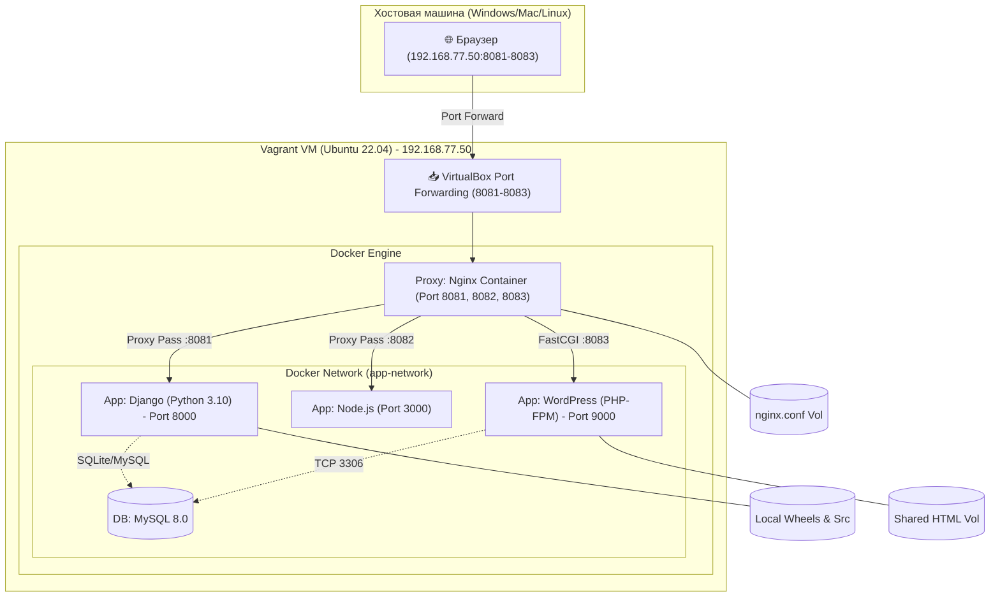
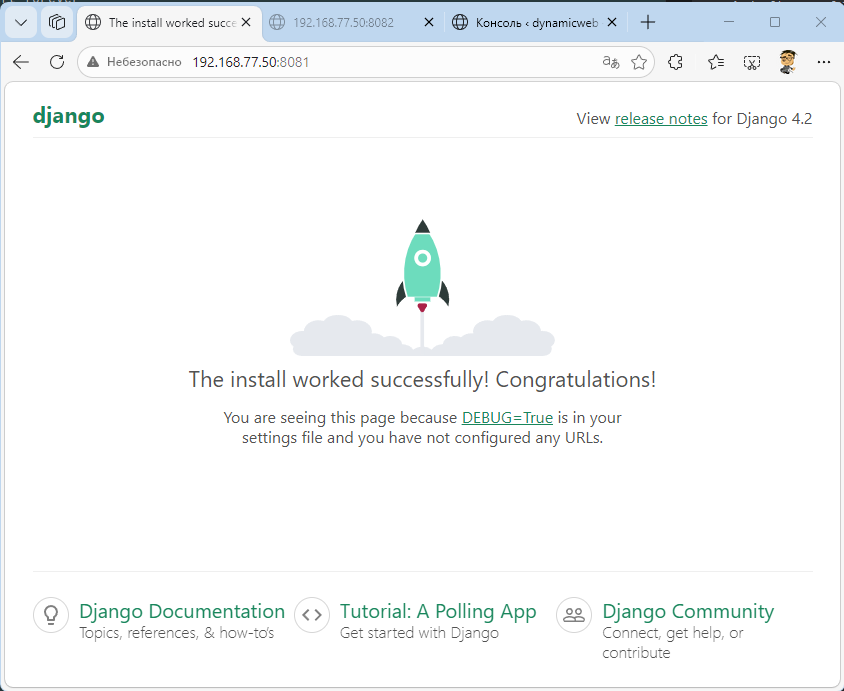
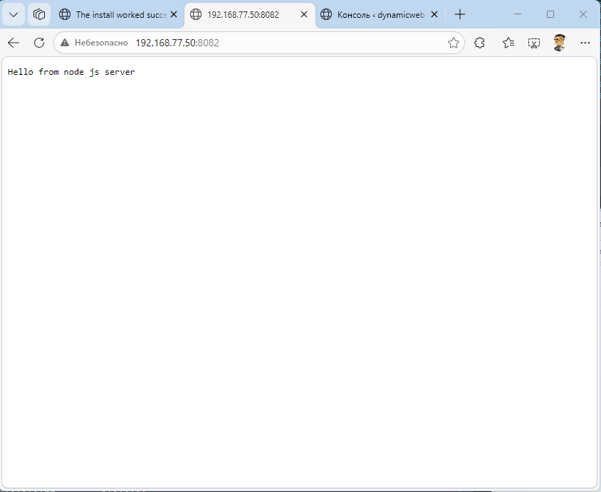
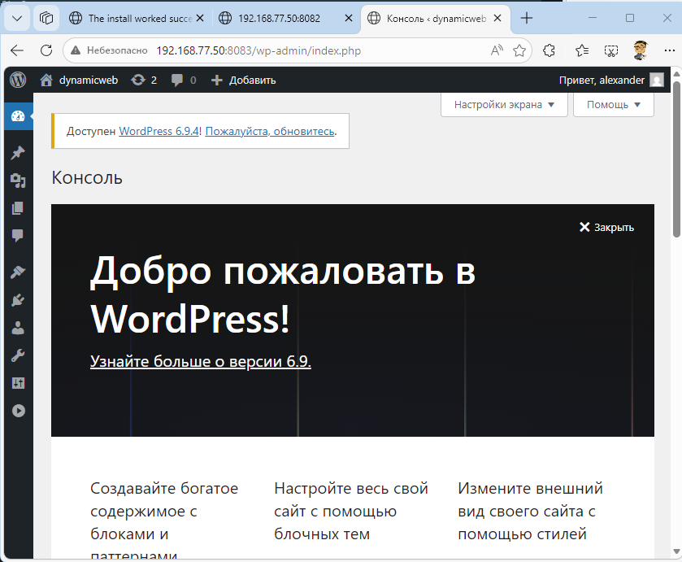
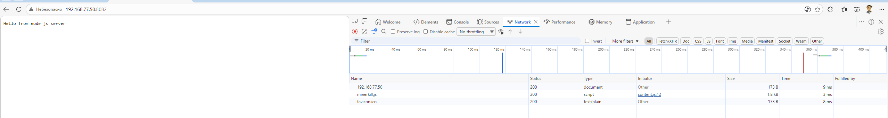

# Домашнее задание 27
## @Развертывание веб приложения

## Цель:
- Получить практические навыки в настройке инфраструктуры с помощью манифестов и конфигураций;
- Отточить навыки использования ansible/vagrant/docker;


## Описание/Пошаговая инструкция выполнения домашнего задания:
**Для выполнения домашнего задания используйте [методичку]()**

**Что нужно сделать?**

### Варианты стенда:
- nginx + php-fpm (laravel/wordpress) + python (flask/django) + js(react/angular);
- nginx + java (tomcat/jetty/netty) + go + ruby;
- можно свои комбинации.

### Реализации на выбор:
- на хостовой системе через конфиги в /etc;
- деплой через docker-compose

---
### Пошаговое выполнение задачи
**Вводные данные:**
- Все дальнейшие действия были проверены при использовании Vagrant 2.4.9
- VirtualBox: 7.2.6 
- В качестве ОС на хостах установлена Almalinux9
- Vagrant + Ansible запускается из WSL2 в Windows 11

### Блок-схема архитектуры задания


--- 
### Таблица соответствия сервисов и портов

| Сервис (в Docker) | Контейнер   | Порт внутри (Guest) | Порт снаружи (Host)    | Назначение                                                              | Технологии                        |
|-------------------|-------------|---------------------|------------------------|-------------------------------------------------------------------------|-----------------------------------|
| nginx             | nginx       | 8081, 8082, 8083    | 8081, 8082, 8083       | Единая точка входа. Принимает запросы и распределяет их по приложениям. | Nginx (Alpine)                    |
| app               | project_app | 8000                | — (только через Nginx) | Основное Python-приложение (сайт на Django).                            | Python 3.10, Gunicorn, Django 4.2 |
| node              | node        | 3000                | — (только через Nginx) | Вспомогательный микросервис или API на Node.js.                         | Node.js 20, Express/HTTP          |
| wordpress         | wordpress   | 9000                | — (только через Nginx) | Блог-платформа или CMS.                                                 | PHP 8.1-FPM, Alpine               |
| database          | database    | 3306                | — (скрыт внутри сети)  | Общая база данных для WordPress (и опционально для Django).             | MySQL 8.0                         |

------------------------------

### Конфигурационные файлы
>Основные файлы Vagran + Ansible: 
> - [Vagrantfile](vagrant_dynamicweb/Vagrantfile)
> - [Ansible playbook](vagrant_dynamicweb/prov.yml)

> Для ускорения процесса некоторые пакеты были скачены в [project\python\wheels](vagrant_dynamicweb/project/python/wheels)

> В итоге всю конфигурацию контейнеров можно посмотреть тут: 
> - [Docker-compose](vagrant_dynamicweb/project/docker-compose.yml)
> - [Dockerfile](vagrant_dynamicweb/project/python/Dockerfile)

> Остальные конфигурационные фалй можно посмотреть [тут](vagrant_dynamicweb/project)
> 

### Установка

```shell
amyskin@otus-vagrant:/mnt/c/Vagrant/vagrant_dynamicweb$ vagrant up
Bringing machine 'DynamicWeb' up with 'virtualbox' provider...
==> DynamicWeb: Importing base box 'ubuntu/22.04'...
==> DynamicWeb: Matching MAC address for NAT networking...
==> DynamicWeb: Checking if box 'ubuntu/22.04' version '1.0.0' is up to date...
==> DynamicWeb: Setting the name of the VM: vagrant_dynamicweb_DynamicWeb_1774290239358_97062
==> DynamicWeb: Fixed port collision for 8081 => 8081. Now on port 2200.
==> DynamicWeb: Clearing any previously set network interfaces...
==> DynamicWeb: Preparing network interfaces based on configuration...
    DynamicWeb: Adapter 1: nat
    DynamicWeb: Adapter 2: bridged
==> DynamicWeb: Forwarding ports...
    DynamicWeb: 8081 (guest) => 2200 (host) (adapter 1)
    DynamicWeb: 8082 (guest) => 8082 (host) (adapter 1)
    DynamicWeb: 8083 (guest) => 8083 (host) (adapter 1)
    DynamicWeb: 22 (guest) => 2222 (host) (adapter 1)
    DynamicWeb: 22 (guest) => 2222 (host) (adapter 1)
==> DynamicWeb: Running 'pre-boot' VM customizations...
==> DynamicWeb: Booting VM...
==> DynamicWeb: Waiting for machine to boot. This may take a few minutes...
    DynamicWeb: SSH address: 127.0.0.1:2222
    DynamicWeb: SSH username: vagrant
    DynamicWeb: SSH auth method: private key
    DynamicWeb:
    DynamicWeb: Vagrant insecure key detected. Vagrant will automatically replace
    DynamicWeb: this with a newly generated keypair for better security.
    DynamicWeb:
    DynamicWeb: Inserting generated public key within guest...
    DynamicWeb: Removing insecure key from the guest if it's present...
    DynamicWeb: Key inserted! Disconnecting and reconnecting using new SSH key...
==> DynamicWeb: Machine booted and ready!
==> DynamicWeb: Checking for guest additions in VM...
    DynamicWeb: The guest additions on this VM do not match the installed version of
    DynamicWeb: VirtualBox! In most cases this is fine, but in rare cases it can
    DynamicWeb: prevent things such as shared folders from working properly. If you see
    DynamicWeb: shared folder errors, please make sure the guest additions within the
    DynamicWeb: virtual machine match the version of VirtualBox you have installed on
    DynamicWeb: your host and reload your VM.
    DynamicWeb:
    DynamicWeb: Guest Additions Version: 6.0.0 r127566
    DynamicWeb: VirtualBox Version: 7.2
==> DynamicWeb: Setting hostname...
==> DynamicWeb: Configuring and enabling network interfaces...
==> DynamicWeb: Mounting shared folders...
    DynamicWeb: /mnt/c/Vagrant/vagrant_dynamicweb => /vagrant
==> DynamicWeb: Running provisioner: shell...
    DynamicWeb: Running: inline script
    DynamicWeb: Hit:1 http://archive.ubuntu.com/ubuntu jammy InRelease
    DynamicWeb: Get:2 http://security.ubuntu.com/ubuntu jammy-security InRelease [129 kB]
    DynamicWeb: Get:3 http://security.ubuntu.com/ubuntu jammy-security/main amd64 Packages [3065 kB]
    DynamicWeb: Get:4 http://archive.ubuntu.com/ubuntu jammy-updates InRelease [128 kB]


 ...т.д.

ASYNC POLL on DynamicWeb: jid=j454608563677.7540 started=True finished=False
ASYNC OK on DynamicWeb: jid=j454608563677.7540
changed: [DynamicWeb] => {"ansible_job_id": "j454608563677.7540", "changed": true, "cmd": "/usr/local/bin/docker-compose up --build --force-recreate -d", "delta": "0:01:05.872470", "end": "2026-03-23 18:30:34.744348", "finished": true, "msg": "", "rc": 0, "results_file": "/root/.ansible_async/j454608563677.7540", "start": "2026-03-23 18:29:28.871878", "started": true, "stderr": "Creating network \"project_app-network\" with driver \"bridge\"\nPulling database (mysql:8.0)...\nPulling wordpress (wordpress:php8.1-fpm-alpine)...\nBuilding app\n#0 building with \"default\" instance using docker driver\n\n#1 [internal] load build definition from Dockerfile\n#1 transferring dockerfile: 478B done\n#1 DONE 0.0s\n\n#2 [internal] load metadata for docker.io/library/python:3.10-slim\n#2 DONE 1.8s\n\n#3 [internal] load .dockerignore\n#3 transferring context: 2B done\n#3 DONE 0.0s\n\n#4 [1/8] FROM docker.io/library/python:3.10-slim@sha256:4ba18b066cee17f2696cf9a2ba564d7d5eb05a91d6a949326780aa7c6912160d\n#4 resolve docker.io/library/python:3.10-slim@sha256:4ba18b066cee17f2696cf9a2ba564d7d5eb05a91d6a949326780aa7c6912160d 0.1s done\n#4 DONE 0.1s\n\n#5 [internal] load build context\n#5 transferring context: 8.77MB 0.1s done\n#5 DONE 0.2s\n\n#4 [1/8] FROM docker.io/library/python:3.10-slim@sha256:4ba18b066cee17f2696cf9a2ba564d7d5eb05a91d6a949326780aa7c6912160d\n#4 sha256:50bb60521db67678c9b06b48d1a602885946c0d5925e1d46ddd465e5299953be 0B / 249B 0.2s\n#4 sha256:c3d226db475fff7ac963a4521fdc0010f21b1ddecd1b1065115abb759bd98494 0B / 13.82MB 0.2s\n#4 sha256:a5848b3a066c9db82bc2192f7029bbcc59e13746228bae45b474229268e41df9 0B / 1.29MB 0.2s\n#4 sha256:ec781dee3f4719c2ca0dd9e73cb1d4ed834ed1a406495eb6e44b6dfaad5d1f8f 0B / 29.78MB 0.2s\n#4 sha256:50bb60521db67678c9b06b48d1a602885946c0d5925e1d46ddd465e5299953be 249B / 249B 0.4s done\n#4 sha256:c3d226db475fff7ac963a4521fdc0010f21b1ddecd1b1065115abb759bd98494 2.10MB / 13.82MB 0.6s\n#4 sha256:c3d226db475fff7ac963a4521fdc0010f21b1ddecd1b1065115abb759bd98494 9.44MB / 13.82MB 0.9s\n#4 sha256:a5848b3a066c9db82bc2192f7029bbcc59e13746228bae45b474229268e41df9 1.29MB / 1.29MB 0.9s done\n#4 sha256:c3d226db475fff7ac963a4521fdc0010f21b1ddecd1b1065115abb759bd98494 13.82MB / 13.82MB 1.1s\n#4 sha256:ec781dee3f4719c2ca0dd9e73cb1d4ed834ed1a406495eb6e44b6dfaad5d1f8f 4.19MB / 29.78MB 0.9s\n#4 sha256:c3d226db475fff7ac963a4521fdc0010f21b1ddecd1b1065115abb759bd98494 13.82MB / 13.82MB 1.1s done\n#4 sha256:ec781dee3f4719c2ca0dd9e73cb1d4ed834ed1a406495eb6e44b6dfaad5d1f8f 12.58MB / 29.78MB 1.2s\n#4 sha256:ec781dee3f4719c2ca0dd9e73cb1d4ed834ed1a406495eb6e44b6dfaad5d1f8f 22.02MB / 29.78MB 1.4s\n#4 sha256:ec781dee3f4719c2ca0dd9e73cb1d4ed834ed1a406495eb6e44b6dfaad5d1f8f 24.12MB / 29.78MB 1.5s\n#4 sha256:ec781dee3f4719c2ca0dd9e73cb1d4ed834ed1a406495eb6e44b6dfaad5d1f8f 29.78MB / 29.78MB 1.7s\n#4 sha256:ec781dee3f4719c2ca0dd9e73cb1d4ed834ed1a406495eb6e44b6dfaad5d1f8f 29.78MB / 29.78MB 1.8s done\n#4 extracting sha256:ec781dee3f4719c2ca0dd9e73cb1d4ed834ed1a406495eb6e44b6dfaad5d1f8f\n#4 extracting sha256:ec781dee3f4719c2ca0dd9e73cb1d4ed834ed1a406495eb6e44b6dfaad5d1f8f 1.0s done\n#4 DONE 3.2s\n\n#4 [1/8] FROM docker.io/library/python:3.10-slim@sha256:4ba18b066cee17f2696cf9a2ba564d7d5eb05a91d6a949326780aa7c6912160d\n#4 extracting sha256:a5848b3a066c9db82bc2192f7029bbcc59e13746228bae45b474229268e41df9 0.1s done\n#4 extracting sha256:c3d226db475fff7ac963a4521fdc0010f21b1ddecd1b1065115abb759bd98494\n#4 extracting sha256:c3d226db475fff7ac963a4521fdc0010f21b1ddecd1b1065115abb759bd98494 0.8s done\n#4 DONE 4.1s\n\n#4 [1/8] FROM docker.io/library/python:3.10-slim@sha256:4ba18b066cee17f2696cf9a2ba564d7d5eb05a91d6a949326780aa7c6912160d\n#4 extracting sha256:50bb60521db67678c9b06b48d1a602885946c0d5925e1d46ddd465e5299953be 0.0s done\n#4 DONE 4.1s\n\n#6 [2/8] RUN mkdir /config\n#6 DONE 1.1s\n\n#7 [3/8] COPY requirements.txt /config/\n#7 DONE 0.1s\n\n#8 [4/8] COPY wheels/ /config/wheels/\n#8 DONE 0.1s\n\n#9 [5/8] RUN pip install --no-cache-dir     --no-index     --find-links=/config/wheels/     -r /config/requirements.txt\n#9 1.188 Looking in links: /config/wheels/\n#9 1.201 Processing /config/wheels/Django-4.2-py3-none-any.whl\n#9 1.235 Processing /config/wheels/gunicorn-21.2.0-py3-none-any.whl\n#9 1.241 Processing /config/wheels/pytz-2023.3-py2.py3-none-any.whl\n#9 1.255 Processing /config/wheels/asgiref-3.11.1-py3-none-any.whl\n#9 1.262 Processing /config/wheels/sqlparse-0.5.5-py3-none-any.whl\n#9 1.273 Processing /config/wheels/packaging-26.0-py3-none-any.whl\n#9 1.285 Processing /config/wheels/typing_extensions-4.15.0-py3-none-any.whl\n#9 1.355 Installing collected packages: pytz, typing_extensions, sqlparse, packaging, gunicorn, asgiref, Django\n#9 2.954 Successfully installed Django-4.2 asgiref-3.11.1 gunicorn-21.2.0 packaging-26.0 pytz-2023.3 sqlparse-0.5.5 typing_extensions-4.15.0\n#9 2.955 WARNING: Running pip as the 'root' user can result in broken permissions and conflicting behaviour with the system package manager. It is recommended to use a virtual environment instead: https://pip.pypa.io/warnings/venv\n#9 DONE 3.3s\n\n#10 [6/8] RUN mkdir /src\n#10 DONE 0.3s\n\n#11 [7/8] WORKDIR /src\n#11 DONE 0.1s\n\n#12 [8/8] ADD . /src\n#12 DONE 0.1s\n\n#13 exporting to image\n#13 exporting layers\n#13 exporting layers 1.8s done\n#13 exporting manifest sha256:214ba3e761f53381078c6876a74eeb8c05ec7adf3e7b3acffa2c936118084e73 0.0s done\n#13 exporting config sha256:27f1bf96c77b9a2760c0af0206d7f38dd600e7871d79de4e08e025effddcf51a 0.0s done\n#13 exporting attestation manifest sha256:9146e1890359cd81e0befe6d7057e8aeb0493d74c14f9ee67635c60197de3a29 0.0s done\n#13 exporting manifest list sha256:b628af7a2bee50c641ea2f71c5e71a4495aaa9554d8091eaab04518cdd4e605f 0.0s done\n#13 naming to docker.io/library/project_app:latest done\n#13 unpacking to docker.io/library/project_app:latest\n#13 unpacking to docker.io/library/project_app:latest 1.7s done\n#13 DONE 3.6s\n\n \u001b[33m2 warnings found (use docker --debug to expand):\n\u001b[0m - LegacyKeyValueFormat: \"ENV key=value\" should be used instead of legacy \"ENV key value\" format (line 4)\n - LegacyKeyValueFormat: \"ENV key=value\" should be used instead of legacy \"ENV key value\" format (line 5)\nPulling node (node:20-alpine)...\nPulling nginx (nginx:stable-alpine)...\nCreating node ... \r\nCreating database ... \r\nCreating app      ... \r\nCreating node     ... done\r\nCreating app      ... done\r\nCreating database ... done\r\nCreating wordpress ... \r\nCreating wordpress ... done\r\nCreating nginx     ... \r\nCreating nginx     ... done", "stderr_lines": ["Creating network \"project_app-network\" with driver \"bridge\"", "Pulling database (mysql:8.0)...", "Pulling wordpress (wordpress:php8.1-fpm-alpine)...", "Building app", "#0 building with \"default\" instance using docker driver", "", "#1 [internal] load build definition from Dockerfile", "#1 transferring dockerfile: 478B done", "#1 DONE 0.0s", "", "#2 [internal] load metadata for docker.io/library/python:3.10-slim", "#2 DONE 1.8s", "", "#3 [internal] load .dockerignore", "#3 transferring context: 2B done", "#3 DONE 0.0s", "", "#4 [1/8] FROM docker.io/library/python:3.10-slim@sha256:4ba18b066cee17f2696cf9a2ba564d7d5eb05a91d6a949326780aa7c6912160d", "#4 resolve docker.io/library/python:3.10-slim@sha256:4ba18b066cee17f2696cf9a2ba564d7d5eb05a91d6a949326780aa7c6912160d 0.1s done", "#4 DONE 0.1s", "", "#5 [internal] load build context", "#5 transferring context: 8.77MB 0.1s done", "#5 DONE 0.2s", "", "#4 [1/8] FROM docker.io/library/python:3.10-slim@sha256:4ba18b066cee17f2696cf9a2ba564d7d5eb05a91d6a949326780aa7c6912160d", "#4 sha256:50bb60521db67678c9b06b48d1a602885946c0d5925e1d46ddd465e5299953be 0B / 249B 0.2s", "#4 sha256:c3d226db475fff7ac963a4521fdc0010f21b1ddecd1b1065115abb759bd98494 0B / 13.82MB 0.2s", "#4 sha256:a5848b3a066c9db82bc2192f7029bbcc59e13746228bae45b474229268e41df9 0B / 1.29MB 0.2s", "#4 sha256:ec781dee3f4719c2ca0dd9e73cb1d4ed834ed1a406495eb6e44b6dfaad5d1f8f 0B / 29.78MB 0.2s", "#4 sha256:50bb60521db67678c9b06b48d1a602885946c0d5925e1d46ddd465e5299953be 249B / 249B 0.4s done", "#4 sha256:c3d226db475fff7ac963a4521fdc0010f21b1ddecd1b1065115abb759bd98494 2.10MB / 13.82MB 0.6s", "#4 sha256:c3d226db475fff7ac963a4521fdc0010f21b1ddecd1b1065115abb759bd98494 9.44MB / 13.82MB 0.9s", "#4 sha256:a5848b3a066c9db82bc2192f7029bbcc59e13746228bae45b474229268e41df9 1.29MB / 1.29MB 0.9s done", "#4 sha256:c3d226db475fff7ac963a4521fdc0010f21b1ddecd1b1065115abb759bd98494 13.82MB / 13.82MB 1.1s", "#4 sha256:ec781dee3f4719c2ca0dd9e73cb1d4ed834ed1a406495eb6e44b6dfaad5d1f8f 4.19MB / 29.78MB 0.9s", "#4 sha256:c3d226db475fff7ac963a4521fdc0010f21b1ddecd1b1065115abb759bd98494 13.82MB / 13.82MB 1.1s done", "#4 sha256:ec781dee3f4719c2ca0dd9e73cb1d4ed834ed1a406495eb6e44b6dfaad5d1f8f 12.58MB / 29.78MB 1.2s", "#4 sha256:ec781dee3f4719c2ca0dd9e73cb1d4ed834ed1a406495eb6e44b6dfaad5d1f8f 22.02MB / 29.78MB 1.4s", "#4 sha256:ec781dee3f4719c2ca0dd9e73cb1d4ed834ed1a406495eb6e44b6dfaad5d1f8f 24.12MB / 29.78MB 1.5s", "#4 sha256:ec781dee3f4719c2ca0dd9e73cb1d4ed834ed1a406495eb6e44b6dfaad5d1f8f 29.78MB / 29.78MB 1.7s", "#4 sha256:ec781dee3f4719c2ca0dd9e73cb1d4ed834ed1a406495eb6e44b6dfaad5d1f8f 29.78MB / 29.78MB 1.8s done", "#4 extracting sha256:ec781dee3f4719c2ca0dd9e73cb1d4ed834ed1a406495eb6e44b6dfaad5d1f8f", "#4 extracting sha256:ec781dee3f4719c2ca0dd9e73cb1d4ed834ed1a406495eb6e44b6dfaad5d1f8f 1.0s done", "#4 DONE 3.2s", "", "#4 [1/8] FROM docker.io/library/python:3.10-slim@sha256:4ba18b066cee17f2696cf9a2ba564d7d5eb05a91d6a949326780aa7c6912160d", "#4 extracting sha256:a5848b3a066c9db82bc2192f7029bbcc59e13746228bae45b474229268e41df9 0.1s done", "#4 extracting sha256:c3d226db475fff7ac963a4521fdc0010f21b1ddecd1b1065115abb759bd98494", "#4 extracting sha256:c3d226db475fff7ac963a4521fdc0010f21b1ddecd1b1065115abb759bd98494 0.8s done", "#4 DONE 4.1s", "", "#4 [1/8] FROM docker.io/library/python:3.10-slim@sha256:4ba18b066cee17f2696cf9a2ba564d7d5eb05a91d6a949326780aa7c6912160d", "#4 extracting sha256:50bb60521db67678c9b06b48d1a602885946c0d5925e1d46ddd465e5299953be 0.0s done", "#4 DONE 4.1s", "", "#6 [2/8] RUN mkdir /config", "#6 DONE 1.1s", "", "#7 [3/8] COPY requirements.txt /config/", "#7 DONE 0.1s", "", "#8 [4/8] COPY wheels/ /config/wheels/", "#8 DONE 0.1s", "", "#9 [5/8] RUN pip install --no-cache-dir     --no-index     --find-links=/config/wheels/     -r /config/requirements.txt", "#9 1.188 Looking in links: /config/wheels/", "#9 1.201 Processing /config/wheels/Django-4.2-py3-none-any.whl", "#9 1.235 Processing /config/wheels/gunicorn-21.2.0-py3-none-any.whl", "#9 1.241 Processing /config/wheels/pytz-2023.3-py2.py3-none-any.whl", "#9 1.255 Processing /config/wheels/asgiref-3.11.1-py3-none-any.whl", "#9 1.262 Processing /config/wheels/sqlparse-0.5.5-py3-none-any.whl", "#9 1.273 Processing /config/wheels/packaging-26.0-py3-none-any.whl", "#9 1.285 Processing /config/wheels/typing_extensions-4.15.0-py3-none-any.whl", "#9 1.355 Installing collected packages: pytz, typing_extensions, sqlparse, packaging, gunicorn, asgiref, Django", "#9 2.954 Successfully installed Django-4.2 asgiref-3.11.1 gunicorn-21.2.0 packaging-26.0 pytz-2023.3 sqlparse-0.5.5 typing_extensions-4.15.0", "#9 2.955 WARNING: Running pip as the 'root' user can result in broken permissions and conflicting behaviour with the system package manager. It is recommended to use a virtual environment instead: https://pip.pypa.io/warnings/venv", "#9 DONE 3.3s", "", "#10 [6/8] RUN mkdir /src", "#10 DONE 0.3s", "", "#11 [7/8] WORKDIR /src", "#11 DONE 0.1s", "", "#12 [8/8] ADD . /src", "#12 DONE 0.1s", "", "#13 exporting to image", "#13 exporting layers", "#13 exporting layers 1.8s done", "#13 exporting manifest sha256:214ba3e761f53381078c6876a74eeb8c05ec7adf3e7b3acffa2c936118084e73 0.0s done", "#13 exporting config sha256:27f1bf96c77b9a2760c0af0206d7f38dd600e7871d79de4e08e025effddcf51a 0.0s done", "#13 exporting attestation manifest sha256:9146e1890359cd81e0befe6d7057e8aeb0493d74c14f9ee67635c60197de3a29 0.0s done", "#13 exporting manifest list sha256:b628af7a2bee50c641ea2f71c5e71a4495aaa9554d8091eaab04518cdd4e605f 0.0s done", "#13 naming to docker.io/library/project_app:latest done", "#13 unpacking to docker.io/library/project_app:latest", "#13 unpacking to docker.io/library/project_app:latest 1.7s done", "#13 DONE 3.6s", "", " \u001b[33m2 warnings found (use docker --debug to expand):", "\u001b[0m - LegacyKeyValueFormat: \"ENV key=value\" should be used instead of legacy \"ENV key value\" format (line 4)", " - LegacyKeyValueFormat: \"ENV key=value\" should be used instead of legacy \"ENV key value\" format (line 5)", "Pulling node (node:20-alpine)...", "Pulling nginx (nginx:stable-alpine)...", "Creating node ... ", "Creating database ... ", "Creating app      ... ", "Creating node     ... done", "Creating app      ... done", "Creating database ... done", "Creating wordpress ... ", "Creating wordpress ... done", "Creating nginx     ... ", "Creating nginx     ... done"], "stdout": "8.0: Pulling from library/mysql\nDigest: sha256:64756cc92f707eb504496d774353990bcb0f6999ddf598b6ad188f2da66bd000\nStatus: Downloaded newer image for mysql:8.0\nphp8.1-fpm-alpine: Pulling from library/wordpress\nDigest: sha256:731e5cf3e728cd853a1cf02a25442394e8d95af64d35ffdd8d1871d834d578da\nStatus: Downloaded newer image for wordpress:php8.1-fpm-alpine\n20-alpine: Pulling from library/node\nDigest: sha256:b88333c42c23fbd91596ebd7fd10de239cedab9617de04142dde7315e3bc0afa\nStatus: Downloaded newer image for node:20-alpine\nstable-alpine: Pulling from library/nginx\nDigest: sha256:5b4900b042ccfa8b0a73df622c3a60f2322faeb2be800cbee5aa7b44d241649e\nStatus: Downloaded newer image for nginx:stable-alpine", "stdout_lines": ["8.0: Pulling from library/mysql", "Digest: sha256:64756cc92f707eb504496d774353990bcb0f6999ddf598b6ad188f2da66bd000", "Status: Downloaded newer image for mysql:8.0", "php8.1-fpm-alpine: Pulling from library/wordpress", "Digest: sha256:731e5cf3e728cd853a1cf02a25442394e8d95af64d35ffdd8d1871d834d578da", "Status: Downloaded newer image for wordpress:php8.1-fpm-alpine", "20-alpine: Pulling from library/node", "Digest: sha256:b88333c42c23fbd91596ebd7fd10de239cedab9617de04142dde7315e3bc0afa", "Status: Downloaded newer image for node:20-alpine", "stable-alpine: Pulling from library/nginx", "Digest: sha256:5b4900b042ccfa8b0a73df622c3a60f2322faeb2be800cbee5aa7b44d241649e", "Status: Downloaded newer image for nginx:stable-alpine"]}

PLAY RECAP *********************************************************************
DynamicWeb                 : ok=12   changed=9    unreachable=0    failed=0    skipped=1    rescued=0    ignored=0


 
```
> В итоге получается вот такая картина: 
```shell
amyskin@otus-vagrant:/mnt/c/Vagrant/vagrant_dynamicweb$ vagrant ssh -- ip a
1: lo: <LOOPBACK,UP,LOWER_UP> mtu 65536 qdisc noqueue state UNKNOWN group default qlen 1000
    link/loopback 00:00:00:00:00:00 brd 00:00:00:00:00:00
    inet 127.0.0.1/8 scope host lo
       valid_lft forever preferred_lft forever
    inet6 ::1/128 scope host
       valid_lft forever preferred_lft forever
2: enp0s3: <BROADCAST,MULTICAST,UP,LOWER_UP> mtu 1500 qdisc fq_codel state UP group default qlen 1000
    link/ether 02:44:a4:14:45:81 brd ff:ff:ff:ff:ff:ff
    inet 10.0.2.15/24 metric 100 brd 10.0.2.255 scope global dynamic enp0s3
       valid_lft 83740sec preferred_lft 83740sec
    inet6 fd17:625c:f037:2:44:a4ff:fe14:4581/64 scope global dynamic mngtmpaddr noprefixroute
       valid_lft 86215sec preferred_lft 14215sec
    inet6 fe80::44:a4ff:fe14:4581/64 scope link
       valid_lft forever preferred_lft forever
3: enp0s8: <BROADCAST,MULTICAST,UP,LOWER_UP> mtu 1500 qdisc fq_codel state UP group default qlen 1000
    link/ether 08:00:27:25:b3:5a brd ff:ff:ff:ff:ff:ff
    inet 192.168.77.50/24 brd 192.168.77.255 scope global enp0s8
       valid_lft forever preferred_lft forever
    inet6 fe80::a00:27ff:fe25:b35a/64 scope link
       valid_lft forever preferred_lft forever
4: docker0: <NO-CARRIER,BROADCAST,MULTICAST,UP> mtu 1500 qdisc noqueue state DOWN group default
    link/ether 8a:9f:a5:2c:cd:9a brd ff:ff:ff:ff:ff:ff
    inet 172.17.0.1/16 brd 172.17.255.255 scope global docker0
       valid_lft forever preferred_lft forever
    inet6 fe80::889f:a5ff:fe2c:cd9a/64 scope link
       valid_lft forever preferred_lft forever
5: br-61bfc5476bef: <BROADCAST,MULTICAST,UP,LOWER_UP> mtu 1500 qdisc noqueue state UP group default
    link/ether f6:63:43:7d:39:71 brd ff:ff:ff:ff:ff:ff
    inet 172.18.0.1/16 brd 172.18.255.255 scope global br-61bfc5476bef
       valid_lft forever preferred_lft forever
    inet6 fe80::f463:43ff:fe7d:3971/64 scope link
       valid_lft forever preferred_lft forever
12: veth9d96695@if2: <BROADCAST,MULTICAST,UP,LOWER_UP> mtu 1500 qdisc noqueue master br-61bfc5476bef state UP group default
    link/ether 9a:cb:8b:56:22:6c brd ff:ff:ff:ff:ff:ff link-netnsid 0
    inet6 fe80::98cb:8bff:fe56:226c/64 scope link
       valid_lft forever preferred_lft forever
13: veth9029dd7@if2: <BROADCAST,MULTICAST,UP,LOWER_UP> mtu 1500 qdisc noqueue master br-61bfc5476bef state UP group default
    link/ether 22:59:3a:d2:94:4a brd ff:ff:ff:ff:ff:ff link-netnsid 1
    inet6 fe80::2059:3aff:fed2:944a/64 scope link
       valid_lft forever preferred_lft forever
14: veth97def11@if2: <BROADCAST,MULTICAST,UP,LOWER_UP> mtu 1500 qdisc noqueue master br-61bfc5476bef state UP group default
    link/ether a6:fa:70:1b:0e:49 brd ff:ff:ff:ff:ff:ff link-netnsid 2
    inet6 fe80::a4fa:70ff:fe1b:e49/64 scope link
       valid_lft forever preferred_lft forever
15: veth1ec21e8@if2: <BROADCAST,MULTICAST,UP,LOWER_UP> mtu 1500 qdisc noqueue master br-61bfc5476bef state UP group default
    link/ether 7a:d7:7e:e0:39:a0 brd ff:ff:ff:ff:ff:ff link-netnsid 3
    inet6 fe80::78d7:7eff:fee0:39a0/64 scope link
       valid_lft forever preferred_lft forever
16: veth135ef68@if2: <BROADCAST,MULTICAST,UP,LOWER_UP> mtu 1500 qdisc noqueue master br-61bfc5476bef state UP group default
    link/ether a6:d2:85:ec:a3:e1 brd ff:ff:ff:ff:ff:ff link-netnsid 4
    inet6 fe80::a4d2:85ff:feec:a3e1/64 scope link
       valid_lft forever preferred_lft forever

amyskin@otus-vagrant:/mnt/c/Vagrant/vagrant_dynamicweb$ vagrant ssh -- ss -tunlp
Netid State  Recv-Q Send-Q    Local Address:Port Peer Address:PortProcess
udp   UNCONN 0      0         127.0.0.53%lo:53        0.0.0.0:*
udp   UNCONN 0      0      10.0.2.15%enp0s3:68        0.0.0.0:*
tcp   LISTEN 0      4096            0.0.0.0:8081      0.0.0.0:*
tcp   LISTEN 0      4096            0.0.0.0:8082      0.0.0.0:*
tcp   LISTEN 0      4096            0.0.0.0:8083      0.0.0.0:*
tcp   LISTEN 0      4096      127.0.0.53%lo:53        0.0.0.0:*
tcp   LISTEN 0      128             0.0.0.0:22        0.0.0.0:*
tcp   LISTEN 0      4096               [::]:8081         [::]:*
tcp   LISTEN 0      4096               [::]:8082         [::]:*
tcp   LISTEN 0      4096               [::]:8083         [::]:*
tcp   LISTEN 0      128                [::]:22           [::]:*

```
```shell
vagrant@web:~$ docker ps
CONTAINER ID   IMAGE                         COMMAND                  CREATED             STATUS             PORTS                                                                     NAMES
732c4d976486   nginx:stable-alpine           "/docker-entrypoint.…"   About an hour ago   Up About an hour   80/tcp, 0.0.0.0:8081-8083->8081-8083/tcp, [::]:8081-8083->8081-8083/tcp   nginx
d2acfa079513   wordpress:php8.1-fpm-alpine   "docker-entrypoint.s…"   About an hour ago   Up About an hour   9000/tcp                                                                  wordpress
0fe19e000106   node:20-alpine                "docker-entrypoint.s…"   About an hour ago   Up About an hour                                                                             node
bf6375d3bbfd   project-app                   "gunicorn --workers=…"   About an hour ago   Up About an hour   8000/tcp                                                                  app
fb7f96049b22   mysql:8.0                     "docker-entrypoint.s…"   About an hour ago   Up About an hour   3306/tcp, 33060/tcp                                                       database
```
### Проверка
> Сайт "Django"



> Сайт "Node js"



> Сайт "WordPress!"



```shell
vagrant@web:~$ curl -I http://localhost:8081
HTTP/1.1 200 OK
Server: nginx/1.28.2
Date: Tue, 24 Mar 2026 09:04:03 GMT
Content-Type: text/html; charset=utf-8
Content-Length: 10731
Connection: keep-alive
X-Frame-Options: DENY
X-Content-Type-Options: nosniff
Referrer-Policy: same-origin
Cross-Origin-Opener-Policy: same-origin

vagrant@web:~$ curl http://localhost:8082
Hello from node js server

vagrant@web:~$ curl -I http://localhost:8083
HTTP/1.1 302 Found
Server: nginx/1.28.2
Date: Tue, 24 Mar 2026 09:04:29 GMT
Content-Type: text/html; charset=UTF-8
Connection: keep-alive
X-Powered-By: PHP/8.1.34
Expires: Wed, 11 Jan 1984 05:00:00 GMT
Cache-Control: no-cache, must-revalidate, max-age=0, no-store, private
X-Redirect-By: WordPress
Location: http://localhost:8083/wp-admin/install.php


```

> Проверка связи с БД (для WordPress и Django)
```shell
amyskin@otus-vagrant:/mnt/c/Vagrant/vagrant_dynamicweb$ vagrant ssh
Welcome to Ubuntu 22.04.2 LTS (GNU/Linux 5.15.0-71-generic x86_64)

 * Documentation:  https://help.ubuntu.com
 * Management:     https://landscape.canonical.com
 * Support:        https://ubuntu.com/advantage

  System information as of Mon Mar 23 21:12:13 UTC 2026

  System load:                      0.0166015625
  Usage of /:                       12.5% of 38.70GB
  Memory usage:                     47%
  Swap usage:                       0%
  Processes:                        125
  Users logged in:                  0
  IPv4 address for br-61bfc5476bef: 172.18.0.1
  IPv4 address for docker0:         172.17.0.1
  IPv4 address for enp0s3:          10.0.2.15
  IPv6 address for enp0s3:          fd17:625c:f037:2:44:a4ff:fe14:4581
  IPv4 address for enp0s8:          192.168.77.50


Expanded Security Maintenance for Applications is not enabled.

267 updates can be applied immediately.
181 of these updates are standard security updates.
To see these additional updates run: apt list --upgradable

Enable ESM Apps to receive additional future security updates.
See https://ubuntu.com/esm or run: sudo pro status

New release '24.04.4 LTS' available.
Run 'do-release-upgrade' to upgrade to it.


*** System restart required ***
Last login: Mon Mar 23 18:30:38 2026 from 10.0.2.2
vagrant@web:~$ docker exec -it app python manage.py migrate
Operations to perform:
  Apply all migrations: admin, auth, contenttypes, sessions
Running migrations:
  Applying contenttypes.0001_initial... OK
  Applying auth.0001_initial... OK
  Applying admin.0001_initial... OK
  Applying admin.0002_logentry_remove_auto_add... OK
  Applying admin.0003_logentry_add_action_flag_choices... OK
  Applying contenttypes.0002_remove_content_type_name... OK
  Applying auth.0002_alter_permission_name_max_length... OK
  Applying auth.0003_alter_user_email_max_length... OK
  Applying auth.0004_alter_user_username_opts... OK
  Applying auth.0005_alter_user_last_login_null... OK
  Applying auth.0006_require_contenttypes_0002... OK
  Applying auth.0007_alter_validators_add_error_messages... OK
  Applying auth.0008_alter_user_username_max_length... OK
  Applying auth.0009_alter_user_last_name_max_length... OK
  Applying auth.0010_alter_group_name_max_length... OK
  Applying auth.0011_update_proxy_permissions... OK
  Applying auth.0012_alter_user_first_name_max_length... OK
  Applying sessions.0001_initial... OK

```
>> Миграции прошла успешно, значит связь с БД есть =)
> Проверка  статики CSS/JS



>> После обновления страницы , нет ошибок 404 для файлов .css или .js, значит в Nginx всё правильно работает.

