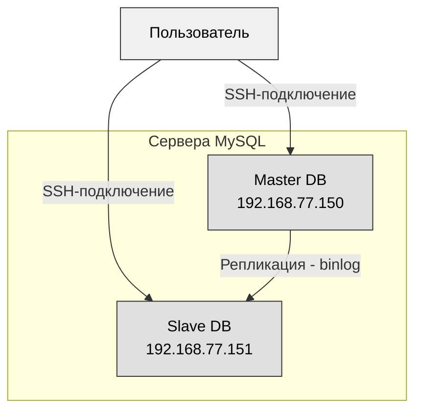
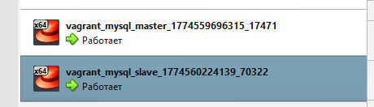

# Домашнее задание 28
## @Репликация MySQL

### Цель:
- Поработать с реаликацией MySQL.


### Описание/Пошаговая инструкция выполнения домашнего задания:
 _Для выполнения домашнего задания используйте [методичку](https://drive.google.com/file/d/139irfqsbAxNMjVcStUN49kN7MXAJr_z9/view)_

**Что нужно сделать?**

- В материалах приложены ссылки на вагрант для репликации и дамп базы bet.dmp
- Базу развернуть на мастере и настроить так, чтобы реплицировались таблицы:
  - bookmaker          
  - competition        
  - market              
  - odds               
  - outcome
- Настроить GTID репликацию

### Варианты которые принимаются к сдаче:
- рабочий вагрантафайл
- скрины или логи SHOW TABLES
- конфиги*
- пример в логе изменения строки и появления строки на реплике*
 
---
### Пошаговое выполнение задачи
**Вводные данные:**
- Все дальнейшие действия были проверены при использовании Vagrant 2.4.9
- VirtualBox: 7.2.6 
- В качестве ОС на хостах установлена Almalinux9
- Vagrant + Ansible запускается из WSL2 в Windows 11


> В задании используются две виртуальные машины (ВМ) под управлением AlmaLinux 9, развёрнутые с помощью Vagrant. 
> ВМ подключены к **публичной сети** (`public_network`) с использованием мостового адаптера (bridge) на хост-машине. 
> Это позволяет ВМ получить IP-адреса из той же подсети, что и хост, и быть доступными для других устройств в локальной сети.

### Схема взаимодействия


### Таблица IP-адресов и портов

| Роль       | Имя хоста  | IP-адрес (публичная сеть)  | Порт MySQL (внутри ВМ)  | Порт SSH (внутри ВМ)  | Проброс SSH на хост (для `localhost`)  | Назначение                                                              |
|------------|------------|----------------------------|-------------------------|-----------------------|----------------------------------------|-------------------------------------------------------------------------|
| **Master** | master     | `192.168.77.150`           | 3306                    | 22                    | `127.0.0.1:2222` → 22                  | Источник репликации. Хранит полную базу `bet`.                          |
| **Slave**  | slave      | `192.168.77.151`           | 3306                    | 22                    | `127.0.0.1:2200` → 22                  | Реплика мастера. Исключает таблицы `events_on_demand` и `v_same_event`. |

### Конфигурационные файлы 
>Основные файлы Vagran + Ansible пришлось изменить под установку на Almalinux 9 
> - [Vagrantfile](vagrant_mysql/Vagrantfile)
> - [Ansible playbook](vagrant_mysql/ansible/provision.yml)
> - Конфигурационные файлы:
>   - [01-base-master.cnf](vagrant_mysql/ansible/templates/01-base-master.cnf.j2)
>   - [01-base-slave.cnf](vagrant_mysql/ansible/templates/01-base-slave.cnf.j2)
>   - [02-max-connections.cnf](vagrant_mysql/ansible/files/02-max-connections.cnf)
>   - [03-performance.cnf](vagrant_mysql/ansible/files/03-performance.cnf)
>   - [04-slow-query.cnf](vagrant_mysql/ansible/files/04-slow-query.cnf)
>   - [05-binlog.cnf](vagrant_mysql/ansible/files/05-binlog.cnf)
 
### Установка

```shell
vagrant up
Bringing machine 'master' up with 'virtualbox' provider...
Bringing machine 'slave' up with 'virtualbox' provider...
==> master: Importing base box 'almalinux/9'...
==> master: Matching MAC address for NAT networking...
==> master: Checking if box 'almalinux/9' version '1.0.0' is up to date...
==> master: Setting the name of the VM: vagrant_mysql_master_1774559696315_17471
==> master: Clearing any previously set network interfaces...
==> master: Preparing network interfaces based on configuration...
    master: Adapter 1: nat
    master: Adapter 2: bridged
==> master: Forwarding ports...
    master: 22 (guest) => 2222 (host) (adapter 1)
    master: 22 (guest) => 2222 (host) (adapter 1)
==> master: Running 'pre-boot' VM customizations...
==> master: Booting VM...
==> master: Waiting for machine to boot. This may take a few minutes...
    master: SSH address: 127.0.0.1:2222
    master: SSH username: vagrant
    master: SSH auth method: private key
    master:
    master: Vagrant insecure key detected. Vagrant will automatically replace
    master: this with a newly generated keypair for better security.
    master:
    master: Inserting generated public key within guest...
    master: Removing insecure key from the guest if it's present...
    master: Key inserted! Disconnecting and reconnecting using new SSH key...
==> master: Machine booted and ready!
==> master: Checking for guest additions in VM...
    master: The guest additions on this VM do not match the installed version of
    master: VirtualBox! In most cases this is fine, but in rare cases it can
    master: prevent things such as shared folders from working properly. If you see
    master: shared folder errors, please make sure the guest additions within the
    master: virtual machine match the version of VirtualBox you have installed on
    master: your host and reload your VM.
    master:
    master: Guest Additions Version: 7.1.4
    master: VirtualBox Version: 7.2
==> master: Setting hostname...
==> master: Configuring and enabling network interfaces...
==> master: Running provisioner: ansible...
    master: Running ansible-playbook...
....
PLAY [Configure Percona Server 8.0 GTID replication] ***************************

TASK [Gathering Facts] *********************************************************
ok: [master]

TASK [Install Percona Repository] **********************************************
ok: [master]

TASK [Enable Percona Server 8.0 repository] ************************************
changed: [master]

TASK [Install Percona Server 8.0 and client] ***********************************
ok: [master]

TASK [Create MySQL configuration directory] ************************************
ok: [master]

TASK [Deploy base configuration (master)] **************************************
ok: [master]

TASK [Deploy base configuration (slave)] ***************************************
skipping: [master]

TASK [Deploy static configuration files] ***************************************
ok: [master] => (item=02-max-connections.cnf)
ok: [master] => (item=03-performance.cnf)
ok: [master] => (item=04-slow-query.cnf)
ok: [master] => (item=05-binlog.cnf)

TASK [Ensure my.cnf includes my.cnf.d] *****************************************
ok: [master]

TASK [Start MySQL service] *****************************************************
ok: [master]

TASK [Wait for MySQL to start] *************************************************
ok: [master]

TASK [Check if root password already set] **************************************
ok: [master]

TASK [Get temporary root password from log (only if password not set)] *********
skipping: [master]

TASK [Set root password using temporary password] ******************************
skipping: [master]

TASK [Create .my.cnf for root access (new password)] ***************************
skipping: [master]

TASK [Verify root password (fallback if temporary password not found)] *********
ok: [master]

TASK [Create .my.cnf for root access (fallback)] *******************************
skipping: [master]

TASK [Create replication user on master] ***************************************
[DEPRECATION WARNING]: Importing 'to_native' from 'ansible.module_utils._text' is deprecated. This feature will be removed from ansible-core version 2.24. Use ansible.module_utils.common.text.converters instead.
changed: [master]

TASK [Copy database dump to master] ********************************************
changed: [master]

TASK [Import database dump on master] ******************************************
changed: [master]

TASK [Copy database dump to slave] *********************************************
skipping: [master]

TASK [Import dump on slave] ****************************************************
skipping: [master]

TASK [Restart MySQL on slave to apply GTID settings] ***************************
skipping: [master]

TASK [Wait for MySQL to restart on slave] **************************************
skipping: [master]

TASK [Verify GTID is enabled on slave] *****************************************
skipping: [master]

TASK [Stop replica before configuration] ***************************************
skipping: [master]

TASK [Configure replication on slave (GTID)] ***********************************
skipping: [master]

TASK [Start slave replication] *************************************************
skipping: [master]

PLAY RECAP *********************************************************************
master                     : ok=15   changed=4    unreachable=0    failed=0    skipped=13   rescued=0    ignored=0

....
Bringing machine 'master' up with 'virtualbox' provider...
Bringing machine 'slave' up with 'virtualbox' provider...
==> master: Checking if box 'almalinux/9' version '1.0.0' is up to date...
==> master: Machine already provisioned. Run `vagrant provision` or use the `--provision`
==> master: flag to force provisioning. Provisioners marked to run always will still run.
==> slave: Importing base box 'almalinux/9'...
==> slave: Matching MAC address for NAT networking...
==> slave: Checking if box 'almalinux/9' version '1.0.0' is up to date...
==> slave: Setting the name of the VM: vagrant_mysql_slave_1774560224139_70322
==> slave: Fixed port collision for 22 => 2222. Now on port 2200.
==> slave: Clearing any previously set network interfaces...
==> slave: Preparing network interfaces based on configuration...
    slave: Adapter 1: nat
    slave: Adapter 2: bridged
==> slave: Forwarding ports...
    slave: 22 (guest) => 2200 (host) (adapter 1)
    slave: 22 (guest) => 2200 (host) (adapter 1)
==> slave: Running 'pre-boot' VM customizations...
==> slave: Booting VM...
==> slave: Waiting for machine to boot. This may take a few minutes...
    slave: SSH address: 127.0.0.1:2200
    slave: SSH username: vagrant
    slave: SSH auth method: private key
    slave:
    slave: Vagrant insecure key detected. Vagrant will automatically replace
    slave: this with a newly generated keypair for better security.
    slave:
    slave: Inserting generated public key within guest...
    slave: Removing insecure key from the guest if it's present...
    slave: Key inserted! Disconnecting and reconnecting using new SSH key...
==> slave: Machine booted and ready!
==> slave: Checking for guest additions in VM...
    slave: The guest additions on this VM do not match the installed version of
    slave: VirtualBox! In most cases this is fine, but in rare cases it can
    slave: prevent things such as shared folders from working properly. If you see
    slave: shared folder errors, please make sure the guest additions within the
    slave: virtual machine match the version of VirtualBox you have installed on
    slave: your host and reload your VM.
    slave:
    slave: Guest Additions Version: 7.1.4
    slave: VirtualBox Version: 7.2
==> slave: Setting hostname...
==> slave: Configuring and enabling network interfaces...
==> slave: Running provisioner: ansible...
    slave: Running ansible-playbook...
PLAY [Configure Percona Server 8.0 GTID replication] ***************************

TASK [Gathering Facts] *********************************************************
ok: [master]
ok: [slave]

TASK [Install Percona Repository] **********************************************
ok: [master]
changed: [slave]

TASK [Enable Percona Server 8.0 repository] ************************************
changed: [slave]
changed: [master]

TASK [Install Percona Server 8.0 and client] ***********************************
ok: [master]
changed: [slave]

TASK [Create MySQL configuration directory] ************************************
ok: [master]
changed: [slave]

TASK [Deploy base configuration (master)] **************************************
skipping: [slave]
ok: [master]

TASK [Deploy base configuration (slave)] ***************************************
skipping: [master]
changed: [slave]

TASK [Deploy static configuration files] ***************************************
ok: [master] => (item=02-max-connections.cnf)
ok: [master] => (item=03-performance.cnf)
changed: [slave] => (item=02-max-connections.cnf)
ok: [master] => (item=04-slow-query.cnf)
changed: [slave] => (item=03-performance.cnf)
ok: [master] => (item=05-binlog.cnf)
changed: [slave] => (item=04-slow-query.cnf)
changed: [slave] => (item=05-binlog.cnf)

TASK [Ensure my.cnf includes my.cnf.d] *****************************************
changed: [slave]
ok: [master]

TASK [Start MySQL service] *****************************************************
ok: [master]
changed: [slave]

TASK [Wait for MySQL to start] *************************************************
ok: [master]
ok: [slave]

TASK [Check if root password already set] **************************************
ok: [slave]
ok: [master]

TASK [Get temporary root password from log (only if password not set)] *********
skipping: [master]
changed: [slave]

TASK [Set root password using temporary password] ******************************
skipping: [master]
changed: [slave]

TASK [Create .my.cnf for root access (new password)] ***************************
skipping: [master]
changed: [slave]

TASK [Verify root password (fallback if temporary password not found)] *********
ok: [master]
ok: [slave]

TASK [Create .my.cnf for root access (fallback)] *******************************
skipping: [master]
skipping: [slave]

TASK [Create replication user on master] ***************************************
skipping: [slave]
[DEPRECATION WARNING]: Importing 'to_native' from 'ansible.module_utils._text' is deprecated. This feature will be removed from ansible-core version 2.24. Use ansible.module_utils.common.text.converters instead.
ok: [master]

TASK [Copy database dump to master] ********************************************
skipping: [slave]
ok: [master]

TASK [Import database dump on master] ******************************************
skipping: [slave]
changed: [master]

TASK [Copy database dump to slave] *********************************************
skipping: [master]
changed: [slave]

TASK [Import dump on slave] ****************************************************
skipping: [master]
changed: [slave]

TASK [Restart MySQL on slave to apply GTID settings] ***************************
skipping: [master]
changed: [slave]

TASK [Wait for MySQL to restart on slave] **************************************
skipping: [master]
ok: [slave]

TASK [Verify GTID is enabled on slave] *****************************************
skipping: [master]
changed: [slave]

TASK [Stop replica before configuration] ***************************************
skipping: [master]
changed: [slave]

TASK [Configure replication on slave (GTID)] ***********************************
skipping: [master]
changed: [slave]

TASK [Start slave replication] *************************************************
skipping: [master]
changed: [slave]

PLAY RECAP *********************************************************************
master                     : ok=15   changed=2    unreachable=0    failed=0    skipped=13   rescued=0    ignored=0
slave                      : ok=23   changed=18   unreachable=0    failed=0    skipped=5    rescued=0    ignored=0
```

### Проверка
> Проверка репликации 
```shell
amyskin@otus-vagrant:/mnt/c/Vagrant/vagrant_mysql$ vagrant ssh slave
Last login: Thu Mar 26 21:26:05 2026 from 10.0.2.2
[vagrant@slave ~]$ sudo mysql -e "SHOW REPLICA STATUS\G"
*************************** 1. row ***************************
             Replica_IO_State: Waiting for source to send event
                  Source_Host: 192.168.77.150
                  Source_User: repl
                  Source_Port: 3306
                Connect_Retry: 60
              Source_Log_File: mysql-bin.000002
          Read_Source_Log_Pos: 187170
               Relay_Log_File: slave-relay-bin.000002
                Relay_Log_Pos: 187386
        Relay_Source_Log_File: mysql-bin.000002
           Replica_IO_Running: Yes
          Replica_SQL_Running: Yes
              Replicate_Do_DB:
          Replicate_Ignore_DB:
           Replicate_Do_Table:
       Replicate_Ignore_Table:
      Replicate_Wild_Do_Table:
  Replicate_Wild_Ignore_Table:
                   Last_Errno: 0
                   Last_Error:
                 Skip_Counter: 0
          Exec_Source_Log_Pos: 187170
              Relay_Log_Space: 187596
              Until_Condition: None
               Until_Log_File:
                Until_Log_Pos: 0
           Source_SSL_Allowed: No
           Source_SSL_CA_File:
           Source_SSL_CA_Path:
              Source_SSL_Cert:
            Source_SSL_Cipher:
               Source_SSL_Key:
        Seconds_Behind_Source: 0
Source_SSL_Verify_Server_Cert: No
                Last_IO_Errno: 0
                Last_IO_Error:
               Last_SQL_Errno: 0
               Last_SQL_Error:
  Replicate_Ignore_Server_Ids:
             Source_Server_Id: 1
                  Source_UUID: 17b86e03-2959-11f1-b2e6-0800270df5f0
             Source_Info_File: mysql.slave_master_info
                    SQL_Delay: 0
          SQL_Remaining_Delay: NULL
    Replica_SQL_Running_State: Replica has read all relay log; waiting for more updates
           Source_Retry_Count: 86400
                  Source_Bind:
      Last_IO_Error_Timestamp:
     Last_SQL_Error_Timestamp:
               Source_SSL_Crl:
           Source_SSL_Crlpath:
           Retrieved_Gtid_Set: 17b86e03-2959-11f1-b2e6-0800270df5f0:1-76
            Executed_Gtid_Set: 17b86e03-2959-11f1-b2e6-0800270df5f0:1-76,
546d3d61-295a-11f1-b2b5-0800270df5f0:1-38
                Auto_Position: 1
         Replicate_Rewrite_DB:
                 Channel_Name:
           Source_TLS_Version:
       Source_public_key_path:
        Get_Source_public_key: 0
            Network_Namespace:
[vagrant@slave ~]$ sudo mysql -e "SELECT @@global.gtid_mode, @@global.enforce_gtid_consistency;"
+--------------------+-----------------------------------+
| @@global.gtid_mode | @@global.enforce_gtid_consistency |
+--------------------+-----------------------------------+
| ON                 | ON                                |
+--------------------+-----------------------------------+
```
>> Проверим репликации в действии
```shell
amyskin@otus-vagrant:/mnt/c/Vagrant/vagrant_mysql$ vagrant ssh master
Last login: Thu Mar 26 21:25:53 2026 from 10.0.2.2
[vagrant@master ~]$ sudo mysql -e "CREATE DATABASE IF NOT EXISTS test_rep; CREATE TABLE test_rep.check (id INT PRIMARY KEY, val VARCHAR(10)); INSERT INTO test_rep.check VALUES (1, 'WORKED');"
[vagrant@master ~]$ exit
logout
amyskin@otus-vagrant:/mnt/c/Vagrant/vagrant_mysql$ vagrant ssh slave
Last login: Thu Mar 26 21:32:06 2026 from 10.0.2.2
[vagrant@slave ~]$ sudo mysql -e "SELECT * FROM test_rep.check;"
+----+--------+
| id | val    |
+----+--------+
|  1 | WORKED |
+----+--------+
```
```shell
[vagrant@master ~]$ mysql -u root -p
Enter password:

mysql> SHOW DATABASES;
+--------------------+
| Database           |
+--------------------+
| bet                |
| information_schema |
| mysql              |
| performance_schema |
| sys                |
| test_rep           |
+--------------------+
6 rows in set (0.00 sec)

mysql> USE bet;
Reading table information for completion of table and column names
You can turn off this feature to get a quicker startup with -A

Database changed
mysql> INSERT INTO bookmaker (id,bookmaker_name) VALUES(1,'1xbet');
Query OK, 1 row affected (0.00 sec)

mysql> SELECT * FROM bookmaker;
+----+----------------+
| id | bookmaker_name |
+----+----------------+
|  1 | 1xbet          |
|  4 | betway         |
|  5 | bwin           |
|  6 | ladbrokes      |
|  3 | unibet         |
+----+----------------+
5 rows in set (0.00 sec)

mysql> exit
Bye
[vagrant@master ~]$ exit
logout
```
```shell
amyskin@otus-vagrant:/mnt/c/Vagrant/vagrant_mysql$ vagrant ssh slave
Last login: Thu Mar 26 21:34:31 2026 from 10.0.2.2

[vagrant@slave ~]$ mysql -u root -p
Enter password:
...
mysql> USE bet;
Reading table information for completion of table and column names
You can turn off this feature to get a quicker startup with -A

Database changed
mysql> SELECT * FROM bookmaker;
+----+----------------+
| id | bookmaker_name |
+----+----------------+
|  1 | 1xbet          |
|  4 | betway         |
|  5 | bwin           |
|  6 | ladbrokes      |
|  3 | unibet         |
+----+----------------+
5 rows in set (0.00 sec)
```
----