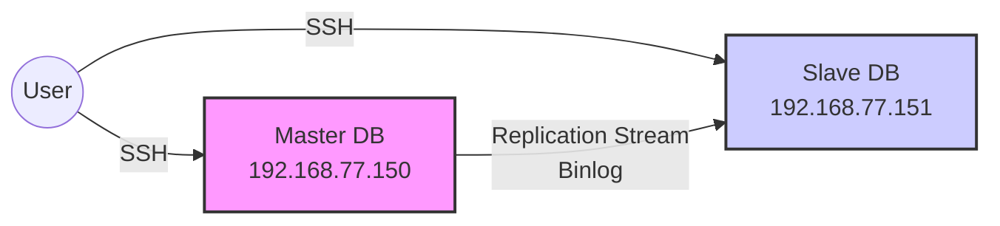

# Домашнее задание 28
## @Репликация MySQL

### Цель:
- Поработать с реаликацией MySQL.


### Описание/Пошаговая инструкция выполнения домашнего задания:
 _Для выполнения домашнего задания используйте [методичку](https://drive.google.com/file/d/139irfqsbAxNMjVcStUN49kN7MXAJr_z9/view)_

**Что нужно сделать?**

- В материалах приложены ссылки на вагрант для репликации и дамп базы bet.dmp
- Базу развернуть на мастере и настроить так, чтобы реплицировались таблицы:

```mermaid
graph TD
%% Таблицы:
Таблица -->[ bookmaker          ]
Таблица -->[ competition        ]
Таблица -->[ market             ]
Таблица -->[ odds               ]
Таблица -->[ outcome            ]

```
- Настроить GTID репликацию

### Варианты которые принимаются к сдаче:
- рабочий вагрантафайл
- скрины или логи SHOW TABLES
- конфиги*
- пример в логе изменения строки и появления строки на реплике*
 
---

### Схема взаимодействия

