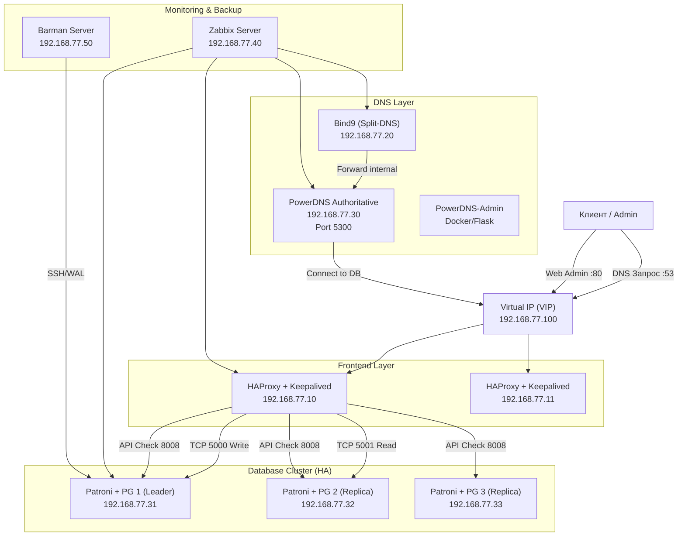

# Проект: «Построение отказоустойчивой инфраструктуры управления DNS на базе PowerDNS и Postgres HA с автоматизацией через Ansible»
## Цель:
- Закрепить и продемонстрировать полученные знания и навыки;
- Создать веб-проект;
- Подготовить портфолио для работодателя;

### Описание:
- Создание автоматизированного отказоустойчивого стенда, включающего 
в себя распределенную базу данных, веб-интерфейс управления DNS и систему глубокого мониторинга. 
Инфраструктура разворачивается «одной кнопкой» через Vagrant и Ansible.

### Веб проект с развертыванием нескольких виртуальных машин должен отвечать следующим требованиям:
- **Включен HTTPS**
- **Основная инфраструктура в DMZ зоне**
- **Файрвалл на входе**
- **Сбор метрик и настроенный алертинг**
- **Организован централизованный сбор логов**
- **Организован Backup**

---
### Пошаговое выполнение задачи
**Вводные данные:**
- Все дальнейшие действия были проверены при использовании Vagrant 2.4.9
- VirtualBox: 7.2.6 
- В качестве ОС на хостах установлена Ubuntu 22.04
- Vagrant + Ansible запускается из WSL2 в Windows 11

> В задании используются 9-ть виртуальных машины под управлением Ubuntu 22.04, развёрнутые с помощью Vagrant.

---

### Схема сети 


```mermaid
graph TD
    Client["Клиент / Администратор"]
    VIP_LB["Virtual IP (Keepalived)<br/>192.168.77.100"]

    Client -->|DNS-запросы :53| VIP_LB
    Client -->|Web Admin HTTPS :443| VIP_LB

    subgraph Frontend_Layer ["Балансировщики (HAProxy + Keepalived)"]
        LB1["lb1 (Master)<br/>192.168.77.11"]
        LB2["lb2 (Backup)<br/>192.168.77.12"]
    end

    subgraph DNS_Layer ["DNS-серверы"]
        SplitDNS["split-dns (Bind9)<br/>192.168.77.40<br/>Резолвинг внутренних зон"]
        PDNS1["pdns1<br/>192.168.77.31<br/>PowerDNS Authoritative + API :8081"]
        PDNS2["pdns2<br/>192.168.77.32<br/>PowerDNS Authoritative + API :8081"]
        PDNS_Admin["PowerDNS-Admin<br/>(Flask + Gunicorn)<br/>:9191 на pdns1/pdns2"]
    end

    subgraph DB_Cluster ["Кластер PostgreSQL (Patroni + etcd)"]
        PG1["db1<br/>192.168.77.21<br/>Реплика (standby)"]
        PG2["db2<br/>192.168.77.22<br/>Реплика (standby)"]
        PG3["db3<br/>192.168.77.23<br/>Лидер (leader)"]
    end

    subgraph Monitoring_Backup ["Мониторинг и бэкапы"]
        Zabbix["mon<br/>192.168.77.50<br/>Zabbix Server + Nginx + PHP<br/>Локальная PostgreSQL"]
        Backup["bkp<br/>192.168.77.60<br/>Barman + BorgBackup"]
    end

    %% Связи
    VIP_LB --> LB1
    VIP_LB --> LB2

    SplitDNS -->|Forward для зоны otus.local| VIP_LB
    PDNS1 -->|DNS-запросы :53| Client
    PDNS2 -->|DNS-запросы :53| Client

    LB1 -->|TCP :5000 (запись)| PG3
    LB1 -->|TCP :5001 (чтение)| PG1
    LB1 -->|TCP :5001 (чтение)| PG2

    LB1 -->|API health check :8008| PG1
    LB1 -->|API health check :8008| PG2
    LB1 -->|API health check :8008| PG3

    PDNS1 -->|Подключение к БД| VIP_LB
    PDNS2 -->|Подключение к БД| VIP_LB

    PDNS_Admin -->|Чтение API PowerDNS| PDNS1
    PDNS_Admin -->|Чтение API PowerDNS| PDNS2

    Zabbix -->|Сбор метрик| VIP_LB
    Zabbix -->|DNS-запросы| SplitDNS
    Zabbix -->|Сбор метрик| PDNS1
    Zabbix -->|Сбор метрик| PG1

    Backup -->|WAL-архивация и бэкап| VIP_LB
    Backup -->|Borg-бэкап конфигов| PDNS1
    Backup -->|Borg-бэкап конфигов| PG1
    Backup -->|Borg-бэкап конфигов| Zabbix

```
### Таблица 
> Таблица серверов архитектуры HA PowerDNS + PostgreSQL (Patroni):

---

## Таблица серверов 

| Имя сервера | IP-адрес       | Назначение / Роль                                        | Компоненты (основные)                                   |
|-------------|----------------|----------------------------------------------------------|---------------------------------------------------------|
| **VIP**     | 192.168.77.100 | Виртуальный IP (Keepalived) – единая точка входа         | HAProxy, Keepalived (на lb1/lb2)                       |
| **lb1**     | 192.168.77.11  | Балансировщик №1 (Master)                                | HAProxy, Keepalived, iptables, самоподписной SSL       |
| **lb2**     | 192.168.77.12  | Балансировщик №2 (Backup)                                | HAProxy, Keepalived                                     |
| **split-dns** | 192.168.77.40 | Внутренний DNS-резолвер (Split-DNS)                      | Bind9                                                   |
| **pdns1**   | 192.168.77.31  | Узел PowerDNS Authoritative + веб-админка                | PowerDNS (auth), Nginx, Gunicorn (PDNS-Admin)          |
| **pdns2**   | 192.168.77.32  | Узел PowerDNS Authoritative + веб-админка (резерв)       | PowerDNS (auth), Nginx, Gunicorn (PDNS-Admin)          |
| **db1**     | 192.168.77.21  | Узел PostgreSQL (реплика, etcd)                          | PostgreSQL 14, Patroni, etcd                           |
| **db2**     | 192.168.77.22  | Узел PostgreSQL (реплика, etcd)                          | PostgreSQL 14, Patroni, etcd                           |
| **db3**     | 192.168.77.23  | Узел PostgreSQL (лидер, etcd)                            | PostgreSQL 14, Patroni, etcd                           |
| **mon**     | 192.168.77.50  | Сервер мониторинга Zabbix                                | Zabbix Server, Nginx, PHP-FPM, PostgreSQL (локальная)  |
| **bkp**     | 192.168.77.60  | Сервер резервного копирования                            | Barman, BorgBackup, cron                               |

---

## Ключевые порты и протоколы

| Порт | Протокол | Назначение                                                                 | На каких узлах слушает |
|------|----------|----------------------------------------------------------------------------|------------------------|
| 53   | UDP/TCP  | DNS-запросы (внешние / внутренние)                                         | VIP (через HAProxy → pdns1/pdns2) |
| 80   | TCP      | HTTP (редирект на HTTPS) для веб-интерфейсов                               | VIP (HAProxy)          |
| 443  | TCP      | HTTPS (PowerDNS-Admin, Zabbix Web)                                         | VIP (HAProxy)          |
| 5000 | TCP      | Запись в PostgreSQL (через HAProxy на лидера)                              | VIP (HAProxy → db3)    |
| 5001 | TCP      | Чтение из PostgreSQL (через HAProxy на реплики)                            | VIP (HAProxy → db1, db2) |
| 5432 | TCP      | Прямой доступ PostgreSQL (заблокирован iptables, только localhost+HAProxy) | db1, db2, db3          |
| 8081 | TCP      | API PowerDNS (внутренний, для PDNS-Admin)                                  | pdns1, pdns2           |
| 8008 | TCP      | API Patroni (health check)                                                 | db1, db2, db3          |
| 2379 | TCP      | etcd (кластерное хранилище Patroni)                                        | db1, db2, db3          |
| 10051| TCP      | Zabbix trapper (активные агенты)                                           | mon (прямой доступ)    |
| 9191 | TCP      | Gunicorn (PowerDNS-Admin)                                                  | pdns1, pdns2 (localhost) |
| 1936 | TCP      | Статистика HAProxy (HTTPS)                                                 | VIP (через HAProxy)    |

---

## Краткое описание проекта

1. **Балансировщики** – используют VIP 192.168.77.100, на котором HAProxy слушает 443 (SSL завершается на нём) и проксирует HTTP-запросы на порт 80 внутренних нод.
2. **PowerDNS-Admin** – развёрнут на pdns1 и pdns2, но доступен только через VIP по HTTPS. Nginx на pdns1/pdns2 слушает порт 80 и 443 только на localhost (или доступ ограничен iptables до IP балансировщиков). Gunicorn слушает 127.0.0.1:9191.
3. **Зона otus.local** – создана через PowerDNS API, записи A для всех серверов (включая pdns.otus.local → VIP, zabbix.otus.local → VIP).
4. **Zabbix** – использует локальную PostgreSQL (не входит в Patroni), веб-интерфейс доступен через VIP (HAProxy), порт 10051 для агентов открыт напрямую на mon.
5. **Barman** – бэкапит кластер Patroni через VIP:5000 (запись на лидера). BorgBackup – архивирует /etc всех серверов (конфигурации) на bkp.
6. **Безопасность** – на всех нодах (pdns1, pdns2, mon) настроены iptables, разрешающие доступ к веб-портам только с IP балансировщиков и localhost. Остальные порты открыты по необходимости.

----


