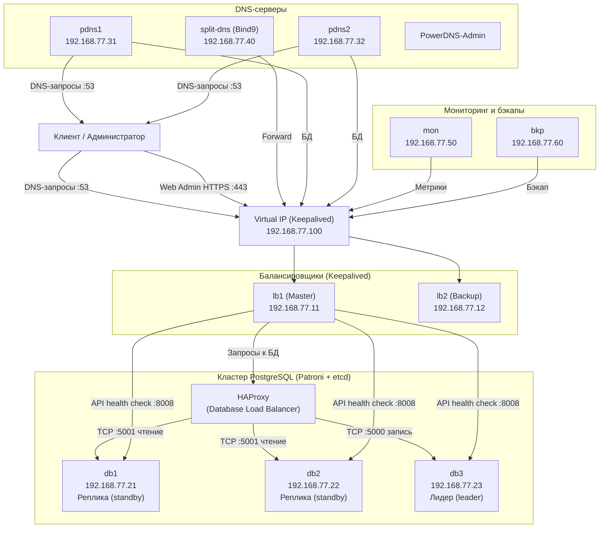
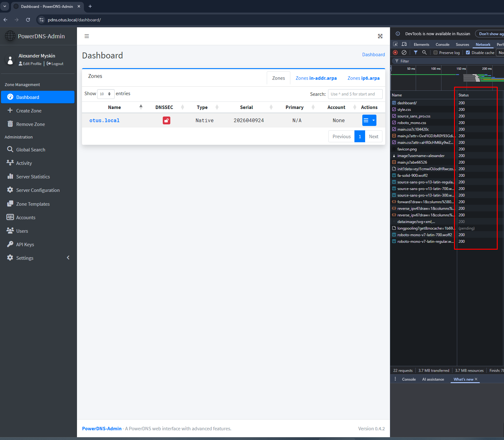
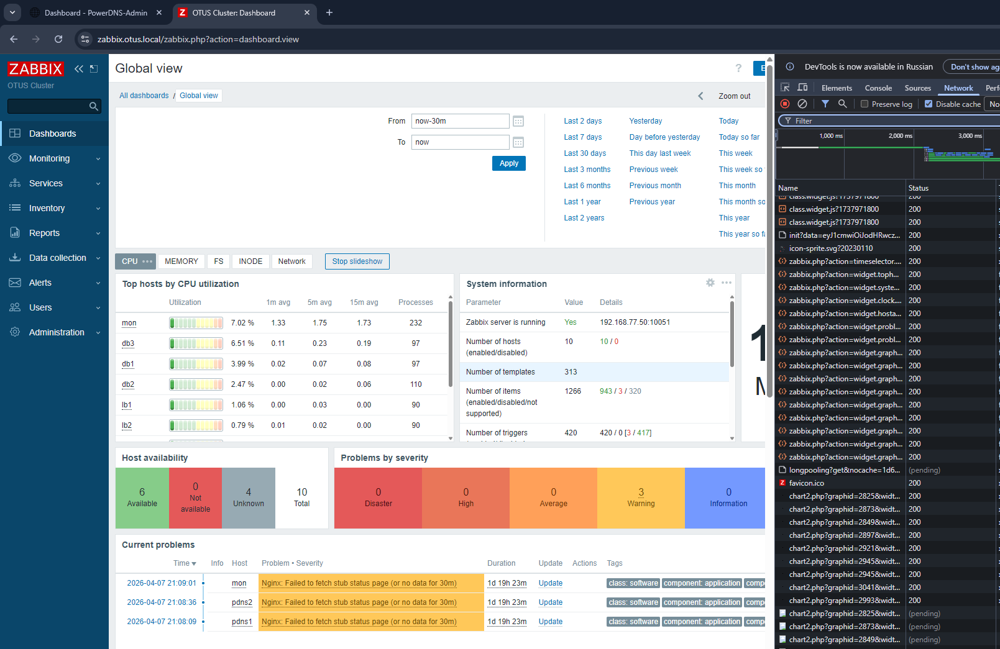

# Проект: «Построение отказоустойчивой инфраструктуры управления DNS на базе PowerDNS и Postgres HA с автоматизацией через Ansible»
## Цель:
- Закрепить и продемонстрировать полученные знания и навыки;
- Создать веб-проект;
- Подготовить портфолио для работодателя;

### Описание:
- Создание автоматизированного отказоустойчивого стенда, включающего 
в себя распределенную базу данных, веб-интерфейс управления DNS и систему глубокого мониторинга. 
Инфраструктура разворачивается «одной кнопкой» через Vagrant и Ansible.

### Веб проект с развертыванием нескольких виртуальных машин должен отвечать следующим требованиям:
- **Включен HTTPS**
- **Основная инфраструктура в DMZ зоне**
- **Файрвалл на входе**
- **Сбор метрик и настроенный алертинг**
- **Организован централизованный сбор логов**
- **Организован Backup**
---
## Используемые технологии
- **OS**: Ubuntu 22.04 LTS
- **DB**: PostgreSQL 14, Patroni, Etcd
- **Proxy**: HAProxy, Keepalived
- **DNS**: PowerDNS, PowerDNS-Admin, Bind9
- **Monitoring**: Zabbix 6.4
- **IaC**: Ansible, Vagrant
---
### High-Availability DNS Infrastructure
#### AnsibleVagrantLicense
Этот проект представляет собой отказоустойчивую инфраструктуру для управления DNS на базе PowerDNS и PostgreSQL. Полная автоматизация развертывания реализована с помощью Ansible и Vagrant.

### 🏗️ Архитектура
Система спроектирована без единой точки отказа (SPOF).

### Основные компоненты:
- **Load Balancing:** HAProxy + Keepalived (VIP 192.168.77.100).
- **Database:** PostgreSQL 14 кластер под управлением Patroni + Etcd.
- **DNS:** Authoritative PowerDNS (Master-Slave логика через БД) + PowerDNS-Admin Web UI.
- **Monitoring:** Zabbix Server + Zabbix Agents.
- **Backup:** Barman (SQL) + BorgBackup (Configs).
- **Security:** Iptables, HTTPS (SSL termination), AppArmor.

### Краткое описание проекта

1. **Балансировщики** – используют VIP 192.168.77.100, на котором HAProxy слушает 443 (SSL завершается на нём) и проксирует HTTP-запросы на порт 80 внутренних нод.
2. **PowerDNS-Admin** – развёрнут на pdns1 и pdns2, но доступен только через VIP по HTTPS. Nginx на pdns1/pdns2 слушает порт 80 и 443 только на localhost (или доступ ограничен iptables до IP балансировщиков). Gunicorn слушает 127.0.0.1:9191.
3. **Зона otus.local** – создана через PowerDNS API, записи A для всех серверов (включая pdns.otus.local → VIP, zabbix.otus.local → VIP).
4. **Zabbix** – использует локальную PostgreSQL (не входит в Patroni), веб-интерфейс доступен через VIP (HAProxy), порт 10051 для агентов открыт напрямую на mon.
5. **Barman** – бэкапит кластер Patroni через VIP:5000 (запись на лидера). BorgBackup – архивирует /etc всех серверов (конфигурации) на bkp.
6. **Безопасность** – на всех нодах (pdns1, pdns2, mon) настроены iptables, разрешающие доступ к веб-портам только с IP балансировщиков и localhost. Остальные порты открыты по необходимости.

### Схема сети 


### Таблица 
> Таблица серверов архитектуры HA PowerDNS + PostgreSQL (Patroni):

---

## Таблица серверов 

| Имя сервера | IP-адрес       | Назначение / Роль                                        | Компоненты (основные)                                   |
|-------------|----------------|----------------------------------------------------------|---------------------------------------------------------|
| **VIP**     | 192.168.77.100 | Виртуальный IP (Keepalived) – единая точка входа         | HAProxy, Keepalived (на lb1/lb2)                       |
| **lb1**     | 192.168.77.11  | Балансировщик №1 (Master)                                | HAProxy, Keepalived, iptables, самоподписной SSL       |
| **lb2**     | 192.168.77.12  | Балансировщик №2 (Backup)                                | HAProxy, Keepalived                                     |
| **split-dns** | 192.168.77.40 | Внутренний DNS-резолвер (Split-DNS)                      | Bind9                                                   |
| **pdns1**   | 192.168.77.31  | Узел PowerDNS Authoritative + веб-админка                | PowerDNS (auth), Nginx, Gunicorn (PDNS-Admin)          |
| **pdns2**   | 192.168.77.32  | Узел PowerDNS Authoritative + веб-админка (резерв)       | PowerDNS (auth), Nginx, Gunicorn (PDNS-Admin)          |
| **db1**     | 192.168.77.21  | Узел PostgreSQL (реплика, etcd)                          | PostgreSQL 14, Patroni, etcd                           |
| **db2**     | 192.168.77.22  | Узел PostgreSQL (реплика, etcd)                          | PostgreSQL 14, Patroni, etcd                           |
| **db3**     | 192.168.77.23  | Узел PostgreSQL (лидер, etcd)                            | PostgreSQL 14, Patroni, etcd                           |
| **mon**     | 192.168.77.50  | Сервер мониторинга Zabbix                                | Zabbix Server, Nginx, PHP-FPM, PostgreSQL (локальная)  |
| **bkp**     | 192.168.77.60  | Сервер резервного копирования                            | Barman, BorgBackup, cron                               |

---

## Ключевые порты и протоколы

| Порт | Протокол | Назначение                                                                 | На каких узлах слушает |
|------|----------|----------------------------------------------------------------------------|------------------------|
| 53   | UDP/TCP  | DNS-запросы (внешние / внутренние)                                         | VIP (через HAProxy → pdns1/pdns2) |
| 80   | TCP      | HTTP (редирект на HTTPS) для веб-интерфейсов                               | VIP (HAProxy)          |
| 443  | TCP      | HTTPS (PowerDNS-Admin, Zabbix Web)                                         | VIP (HAProxy)          |
| 5000 | TCP      | Запись в PostgreSQL (через HAProxy на лидера)                              | VIP (HAProxy → db3)    |
| 5001 | TCP      | Чтение из PostgreSQL (через HAProxy на реплики)                            | VIP (HAProxy → db1, db2) |
| 5432 | TCP      | Прямой доступ PostgreSQL (заблокирован iptables, только localhost+HAProxy) | db1, db2, db3          |
| 8081 | TCP      | API PowerDNS (внутренний, для PDNS-Admin)                                  | pdns1, pdns2           |
| 8008 | TCP      | API Patroni (health check)                                                 | db1, db2, db3          |
| 2379 | TCP      | etcd (кластерное хранилище Patroni)                                        | db1, db2, db3          |
| 10051| TCP      | Zabbix trapper (активные агенты)                                           | mon (прямой доступ)    |
| 9191 | TCP      | Gunicorn (PowerDNS-Admin)                                                  | pdns1, pdns2 (localhost) |
| 1936 | TCP      | Статистика HAProxy (HTTPS)                                                 | VIP (через HAProxy)    |

---

### 🚀 Быстрый старт
#### Требования
- **VirtualBox** 7.x+
- **Vagrant** 2.4+
- **Ansible** 2.15+ (на хост-машине или WSL)
Не менее 16 GB RAM и 4 CPU cores

#### Конфигурационные файлы:
- [Vagrantfile](vagrant_project/Vagrantfile)
- [Ansible playbook](vagrant_project/ansible/provision.yml)

#### Установка
1.📦 **Клонировать репозиторий:**
```shell
git clone https://github.com/mrAlexbody/otus_linux-pro-2025-08.git
cd otus_linux-pro-2025-08/30_Project
```

2.📦 **Настроить пароли ( Vault ):**
```shell
ansible-vault encrypt_string 'supersecret' --name 'vault_pdns_admin_secret_key'
# Вставь результат в ansible/group_vars/all/vault.yml
```

3.📦 **Подготовка файлов (Pre-download):**

> **Перед запуском** `vagrant up` необходимо скачать и разместить в соответствующих директориях следующие файлы, так как прямой доступ к интернету из виртуальных машин может быть ограничен (или для ускорения развёртывания).
 
> **Файл:** [zabbix-release_6.4-1+ubuntu22.04_all.deb](https://repo.zabbix.com/zabbix/6.4/ubuntu/pool/main/z/zabbix-release/zabbix-release_6.4-1+ubuntu22.04_all.deb) 

> **Куда положить:** --> `ansible/roles/zabbix_server/files/zabbix-release_6.4-1+ubuntu22.04_all.deb`

4.📦 **PowerDNS-Admin source code (локальный архив):**

> **Файл:** [`PowerDNS-Admin` (директория с исходниками)](https://github.com/ngoduykhanh/PowerDNS-Admin/archive/refs/heads/master.zip)

> **Куда положить:** --> Распаковать архив в `ansible/roles/powerdns_admin/files/PowerDNS-Admin/` (внутри должна быть папка `powerdnsadmin/`, `requirements.txt` и т.д.)

> **Примечание:** Если вы не хотите скачивать эти файлы вручную, можете закомментировать задачи `copy` в соответствующих ролях и разрешить Ansible скачивать их напрямую (при наличии интернета). Но для полного автономного развёртывания рекомендуется их предварительно загрузить.

5.📦 **Запуск инфраструктуры:**

```bash
vagrant up
```

6.🌐 **Доступ к сервисам после развёртывания:**
> Все веб-интерфейсы доступны через единый виртуальный IP (VIP) 192.168.77.100 с автоматическим редиректом HTTP → HTTPS.

## 📄 Дополнение к README.md (разделы «Доступ к сервисам» и «Структура проекта»)

Ниже приведены блоки, которые нужно добавить/заменить в вашем README.md.

---

### 📦 Подготовка файлов (перед запуском)

Некоторые компоненты устанавливаются из локальных `.deb`-пакетов или архива, чтобы не зависеть от интернета внутри виртуальных машин. Скачайте следующие файлы и разместите их в указанных директориях:

| Файл | Оригинальная ссылка | Место назначения (в проекте) |
|------|---------------------|------------------------------|
| `zabbix-release_6.4-1+ubuntu22.04_all.deb` | https://repo.zabbix.com/zabbix/6.4/ubuntu/pool/main/z/zabbix-release/zabbix-release_6.4-1+ubuntu22.04_all.deb | `ansible/roles/zabbix_server/files/` |
| `PowerDNS-Admin-master.zip` (или распакованная папка) | https://github.com/ngoduykhanh/PowerDNS-Admin/archive/refs/heads/master.zip | Распаковать в `ansible/roles/powerdns_admin/files/PowerDNS-Admin/` |

Если вы работаете в среде с доступом в интернет, эти файлы будут скачаны автоматически (роли используют `get_url` или `git`). Но для полностью автономного развёртывания рекомендуется разместить их заранее.

---

### 🌐 Доступ к сервисам после развёртывания

Все веб-интерфейсы доступны через единый виртуальный IP (VIP) `192.168.77.100` с автоматическим редиректом HTTP → HTTPS.

| Сервис                 | URL                                 | Логин   | Пароль                                   | Примечание                                                                                    |
|------------------------|-------------------------------------|---------|------------------------------------------|-----------------------------------------------------------------------------------------------|
| **PowerDNS-Admin**     | `https://pdns.otus.local`           | `admin` | `admin`                                  | Первый вход – регистрация через форму, затем автоматически назначается роль Administrator.    |
| **Zabbix**             | `https://zabbix.otus.local`         | `Admin` | `zabbix`                                 | После первого входа может потребоваться пройти мастер настройки (все поля уже предзаполнены). |

> ⚠️ Все сертификаты – самоподписанные. Браузер покажет предупреждение – примите его и продолжите.

---

### 📂 Актуальная структура проекта

```
powerdns-ha-project/
├── Vagrantfile                          # Конфигурация виртуальных машин (9 ВМ)
├── README.md
├── ansible/
│   ├── ansible.cfg
│   ├── hosts.ini                        # Инвентарь (группы: lb, db, pdns, split_dns, monitoring, backup)
│   ├── provision.yml                    # Главный плейбук (последовательность ролей)
│   ├── group_vars/                      # Переменные для групп хостов
│   │   ├── all.yml                      # Общие (ansible_user, часовые пояса, iptables_base)
│   │   ├── lb.yml                       # Порты для HAProxy, cluster_vip
│   │   ├── db.yml                       # Версия PostgreSQL, параметры Patroni
│   │   ├── pdns.yml                     # pdns_zones, pdns_records, API-ключи
│   │   └── vault.yml                    # Зашифрованные пароли (ansible-vault)
│   ├── roles/
│   │   ├── common/                      # Базовая настройка ОС, iptables, hosts, resolv.conf
│   │   ├── haproxy_keepalived/          # HAProxy + Keepalived (LB1, LB2)
│   │   ├── patroni/                     # Кластер PostgreSQL (db1, db2, db3)
│   │   ├── powerdns/                    # PowerDNS Authoritative + API (pdns1, pdns2)
│   │   ├── powerdns_admin/              # PowerDNS-Admin (Flask + Gunicorn + Nginx)
│   │   ├── zabbix_server/               # Zabbix Server + Nginx + PHP-FPM (mon)
│   │   ├── zabbix_agent/                # Zabbix Agent 2 (на всех остальных ВМ)
│   │   ├── barman/                      # Barman + BorgBackup (bkp)
│   │   └── bind9/                       # Split-DNS (split-dns) – опционально
│   └── files/                           # Локальные deb-пакеты и архивы
│       ├── zabbix-release_6.4-1+ubuntu22.04_all.deb
│       └── PowerDNS-Admin/              # Распакованный репозиторий
└── .vagrant/                            # Служебная директория (создаётся автоматически)
```

> 💡 **Примечание:** Роль `bind9` в проекте используется для внутреннего резолвинга, но в текущей реализации DNS-запросы могут идти напрямую на PowerDNS. При необходимости можно активировать.

---

## ✅ Проверка работоспособности (краткий чек-лист)


## 1. Кластер PostgreSQL
```shell
$ vagrant ssh db1 --  sudo patronictl -c /etc/patroni/patroni.yml list
+ Cluster: postgres_cluster (7626717306869384357) --+-------------+-----+------------+-----+
| Member | Host          | Role    | State     | TL | Receive LSN | Lag | Replay LSN | Lag |
+--------+---------------+---------+-----------+----+-------------+-----+------------+-----+
| db1    | 192.168.77.21 | Leader  | running   |  1 |             |     |            |     |
| db2    | 192.168.77.22 | Replica | streaming |  1 |   0/4095B10 |   0 |  0/4095B10 |   0 |
| db3    | 192.168.77.23 | Replica | streaming |  1 |   0/4095B10 |   0 |  0/4095B10 |   0 |
+--------+---------------+---------+-----------+----+-------------+-----+------------+-----+ 
```

### 2. DNS-запрос к зоне otus.local
```shell
$ dig @192.168.77.31 pdns.otus.local

; <<>> DiG 9.18.39-0ubuntu0.24.04.3-Ubuntu <<>> @192.168.77.31 pdns.otus.local
; (1 server found)
;; global options: +cmd
;; Got answer:
;; WARNING: .local is reserved for Multicast DNS
;; You are currently testing what happens when an mDNS query is leaked to DNS
;; ->>HEADER<<- opcode: QUERY, status: NOERROR, id: 64638
;; flags: qr aa rd; QUERY: 1, ANSWER: 1, AUTHORITY: 0, ADDITIONAL: 1
;; WARNING: recursion requested but not available

;; OPT PSEUDOSECTION:
; EDNS: version: 0, flags:; udp: 1232
;; QUESTION SECTION:
;pdns.otus.local.               IN      A

;; ANSWER SECTION:
pdns.otus.local.        3600    IN      A       192.168.77.100

;; Query time: 7 msec
;; SERVER: 192.168.77.31#53(192.168.77.31) (UDP)
;; WHEN: Thu Apr 09 14:38:50 MSK 2026
;; MSG SIZE  rcvd: 60
```

### 3. Доступ к PowerDNS-Admin (должен вернуть 200 OK)


### 4. Проверка доступа к Zabbix (должен вернуть 200 OK)


# 5. Бэкапы Barman
```shell
$ vagrant ssh bkp -- sudo -u barman barman check postgres_cluster
Server postgres_cluster:
        PostgreSQL: OK
        no access to backup functions: OK (privileges for PostgreSQL backup functions are required (see documentation))
        PostgreSQL streaming: OK
        wal_level: OK
        replication slot: FAILED (slot 'barman_slot' not initialised: is 'receive-wal' running?)
        directories: OK
        retention policy settings: OK
        backup maximum age: OK (interval provided: 4 days, latest backup age: 20 minutes, 18 seconds)
        backup minimum size: OK (25.4 MiB)
        wal maximum age: OK (no last_wal_maximum_age provided)
        wal size: OK (16.1 KiB)
        compression settings: OK
        failed backups: OK (there are 0 failed backups)
        minimum redundancy requirements: OK (have 1 backups, expected at least 1)
        pg_basebackup: OK
        pg_basebackup compatible: OK
        pg_basebackup supports tablespaces mapping: OK
        systemid coherence: FAILED (the system Id of the connected PostgreSQL server changed, stored in "/var/lib/barman/postgres_cluster/identity.json")
        pg_receivexlog: OK
        pg_receivexlog compatible: OK
        receive-wal running: FAILED (See the Barman log file for more details)
        archiver errors: OK

```


