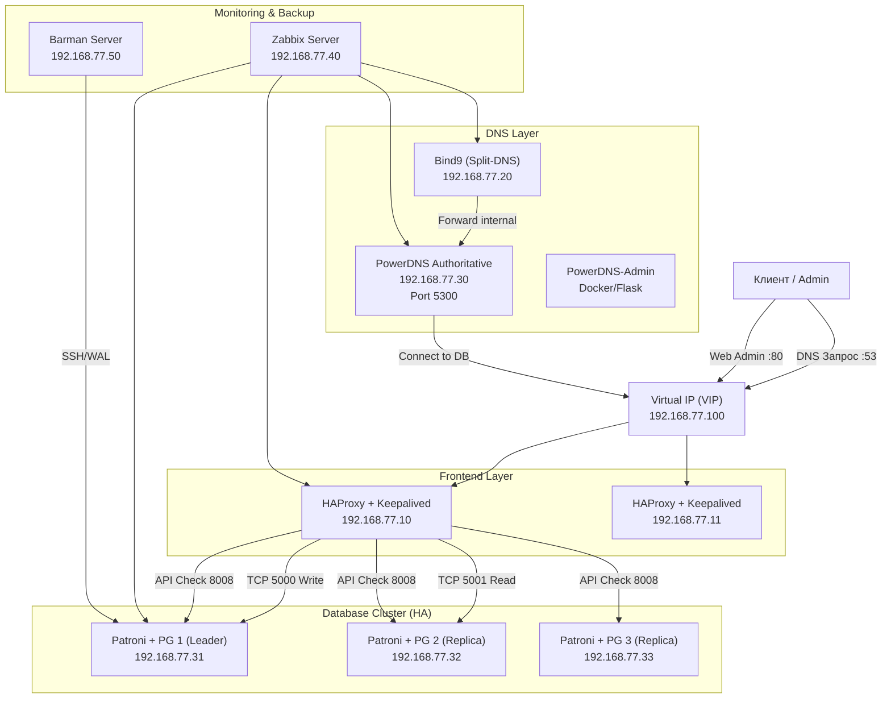

# Проект: «Построение отказоустойчивой инфраструктуры управления DNS на базе PowerDNS и Postgres HA с автоматизацией через Ansible»
## Цель:
- Закрепить и продемонстрировать полученные знания и навыки;
- Создать веб-проект;
- Подготовить портфолио для работодателя;

### Описание:
- Создание автоматизированного отказоустойчивого стенда, включающего 
в себя распределенную базу данных, веб-интерфейс управления DNS и систему глубокого мониторинга. 
Инфраструктура разворачивается «одной кнопкой» через Vagrant и Ansible.

### Веб проект с развертыванием нескольких виртуальных машин должен отвечать следующим требованиям:
- **Включен HTTPS**
- **Основная инфраструктура в DMZ зоне**
- **Файрвалл на входе**
- **Сбор метрик и настроенный алертинг**
- **Организован централизованный сбор логов**
- **Организован Backup**

---

---

### Схема сети 

### Таблица 
> Таблица серверов архитектуры HA PowerDNS + PostgreSQL (Patroni):

| Имя сервера | IP-адрес       | Назначение / Роль           | Компоненты                         |
|-------------|----------------|-----------------------------|------------------------------------|
| VIP LB      | 192.168.77.100 | Виртуальный IP (Keepalived) | Единая точка входа для DNS и БД    |
| LB1         | 192.168.77.10  | Балансировщик №1 (Master)   | HAProxy, Keepalived, iptables      |
| LB2         | 192.168.77.11  | Балансировщик №2 (Backup)   | HAProxy, Keepalived                |
| DNS-GW      | 192.168.77.20  | Шлюз DNS (Split-DNS)        | Bind9 (Frontend)                   |
| PDNS-Auth   | 192.168.77.30  | Основной DNS-сервер         | PowerDNS Authoritative, PDNS-Admin |
| PG-Node1    | 192.168.77.31  | Узел БД №1                  | PostgreSQL, Patroni, etcd          |
| PG-Node2    | 192.168.77.32  | Узел БД №2                  | PostgreSQL, Patroni, etcd          |
| PG-Node3    | 192.168.77.33  | Узел БД №3                  | PostgreSQL, Patroni, etcd          |
| Zabbix      | 192.168.77.40  | Мониторинг                  | Zabbix Server, PostgreSQL (local)  |
| Backup      | 192.168.77.50  | Резервное копирование       | Barman, SSH, Config Backup         |

## Ключевые порты для настройки:
* 53 (UDP/TCP): Входящие запросы на VIP (Bind9).
* 5300: Внутренний порт PowerDNS.
* 5000: Запись в БД (через HAProxy на Master).
* 5001: Чтение из БД (через HAProxy с реплик).
* 8008: API Patroni для проверки состояния кластера.
* 2379: Обмен данными между узлами etcd.

