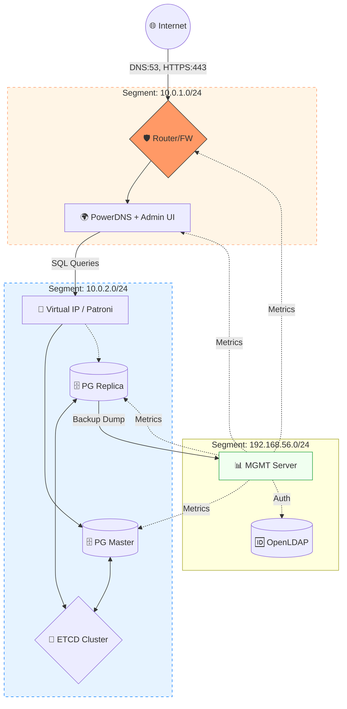

# Проект: «Построение отказоустойчивой инфраструктуры управления DNS на базе PowerDNS и Postgres HA (Patroni) с автоматизацией через Ansible»
## Цель:
- Закрепить и продемонстрировать полученные знания и навыки;
- Создать веб-проект;
- Подготовить портфолио для работодателя;

### Описание:
- Создание автоматизированного отказоустойчивого стенда, включающего 
в себя распределенную базу данных, веб-интерфейс управления DNS и систему глубокого мониторинга. 
Инфраструктура разворачивается «одной кнопкой» через Vagrant и Ansible.

### Веб проект с развертыванием нескольких виртуальных машин должен отвечать следующим требованиям:
- **Включен HTTPS**
- **Основная инфраструктура в DMZ зоне**
- **Файрвалл на входе**
- **Сбор метрик и настроенный алертинг**
- **Организован централизованный сбор логов**
- **Организован Backup**

---

---

### Схема сети 

